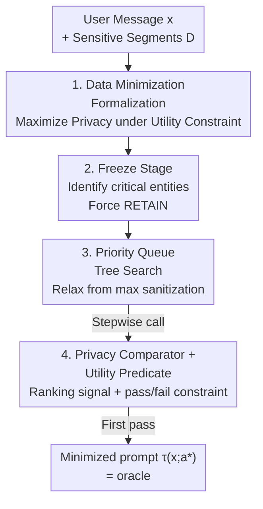

# Operationalizing Data Minimization for Privacy-Preserving LLM Prompting

**Conference**: ICLR 2026  
**OpenReview**: [https://openreview.net/forum?id=rpcnvW33EG](https://openreview.net/forum?id=rpcnvW33EG)  
**Code**: TBD  
**Area**: LLM Security / Privacy Protection  
**Keywords**: Data Minimization, Privacy Protection, Prompt Sanitization, Tree Search, LLM-as-a-Judge

## TL;DR
This paper formalizes the "data minimization" principle in the privacy domain as an optimization problem—finding the strongest sanitization scheme of "RETAIN/ABSTRACT/REDACT" for each sensitive segment without losing task utility. It solves for this oracle using a "freeze-then-search" priority queue tree search algorithm guided by a privacy comparator. The study reveals that stronger frontier models can tolerate more aggressive sanitization (GPT-5 can redact 85.7%, while Qwen2.5-0.5B only 19.3%), yet models consistently lean toward "abstraction" and overshare when predicting minimization schemes themselves.

## Background & Motivation
**Background**: Users disclose significant personal sensitive information (names, locations, itineraries, organizations) when interacting with LLM applications, often believing "more detail equals better answers." Mainstream privacy protection involves **detecting sensitive segments and performing redaction ("New York"→"[GEOLOCATION]") or abstraction ("New York"→"a city in the US")**, or using heuristic rules and LLM-as-a-Judge to determine information "importance."

**Limitations of Prior Work**: Existing works rarely **formally or quantitatively** define the problem from the perspective of the "data minimization" privacy-by-design principle. They either ignore utility, seek a "balance" between privacy and utility, or maximize utility under differential privacy budgets. The problem of "minimizing privacy exposure under the strict constraint of maintaining utility" (true data minimization) remains largely under-researched. Furthermore, the accuracy of LLM-as-a-Judge in determining information importance is unverified.

**Key Challenge**: Quantifying "user oversharing" requires knowing the **true lower bound of minimal disclosure**. This bound is not fixed—it depends on the information, the task, and **the capability of the response model $F$**. Stronger models might infer missing context, while weaker models require more information to succeed. Without this "model-specific lower bound," it is impossible to judge if any disclosure is excessive.

**Goal**: (1) Formalize data minimization as a utility-constrained optimization problem; (2) Design an algorithm to precisely find the optimal sanitization scheme (oracle) for a given prompt and model $F$; (3) Use this oracle to evaluate the ability of mainstream LLMs to predict minimization schemes directly.

**Key Insight**: The authors arrange three actions {RETAIN, ABSTRACT, REDACT} into a **sequence of increasing privacy strength** ($\text{RETAIN} \prec \text{ABSTRACT} \prec \text{REDACT}$). Finding minimal disclosure thus becomes a search problem in this ordered space, starting from the most aggressive sanitization and relaxing step-by-step toward decreasing privacy until utility checks pass.

**Core Idea**: Instead of letting an LLM make a one-off judgment on importance, the authors use a "freeze non-removable entities, then conduct priority queue tree search guided by a privacy comparator" method to find the data minimization oracle for any prompt-model pair, exposing the LLM's capability gap.

## Method

### Overall Architecture
The method is a **tree search customized for data minimization**. Input consists of a user message $x$ and a set of detected sensitive segments $D=\{e_1,\dots,e_n\}$. Each segment can be assigned an action $a_i \in \{\text{RETAIN}, \text{ABSTRACT}, \text{REDACT}\}$, forming an action vector $a$ applied to $x$ to get a variant $\tau(x;a)$. The goal is to maximize privacy under a utility constraint:

$$\max_{a\in A^n} \mathrm{Priv}\big(\tau(x;a)\big)\quad\text{s.t.}\quad \mathrm{Util}\big(R(F(\tau(x;a)));a\big)\ge\gamma$$

where $F$ is the target response model, $R$ is the **context restoration operator** (replacing placeholders/abstract phrases in the output with real content before evaluating utility), and $\gamma$ is the minimum utility. This formalization is independent of action space, metrics, or search strategy.

The pipeline consists of two serial stages: **Stage 1: Freeze non-removable entities** (pruning branches), and **Stage 2: Privacy comparator priority queue tree search** (relaxing from the most aggressive node until utility passes). Two judges are called: a **privacy comparator $C$** for ranking signals and a **utility predicate UTIL** (pass/fail) as a constraint.

### Key Designs

**1. Data Minimization Formalization and Three-tier Ordered Action Space**
Previous work treated sanitization as "detect-and-replace" without a computable "minimal disclosure" definition. This paper provides an optimization formula with hard utility constraints. The action space $A=\{\text{RETAIN}, \text{ABSTRACT}, \text{REDACT}\}$ is treated as an **ordinal lattice** ($\text{RETAIN} \prec \text{ABSTRACT} \prec \text{REDACT}$) where "single-step relaxation" (REDACT→ABSTRACT→RETAIN) allows searching a partially ordered space. The UTIL predicate is strict: GPT-4o judges open-ended tasks against a rubric, while closed tasks use official scorers requiring $k=5$ correct decodings for a pass.

**2. Freeze-then-Search Stage 1: Pruning non-removable entities**
To reduce search costs, Stage 1 tests each $e \in D$ individually. While keeping all other segments as RETAIN, the algorithm tests REDACT$(e)$ and ABSTRACT$(e)$. If both fail utility, the segment is marked **frozen** (forced RETAIN or at most ABSTRACT). This reduces the active search branches from $|D|$ to $n'$.

**3. Privacy Comparator Priority Queue Tree Search**
The root node applies the strongest sanitization allowed by Stage 1 to every segment. Children are generated by relaxing one action by one step. It uses a **priority queue with a privacy comparator $C$** to traverse. The first node passing utility is the oracle. $C:(x,\tau_A,\tau_B) \mapsto \{\tau_A,\tau_B,\text{SAME}\}$ does not require transitivity or total order, accommodating subjective human privacy preferences.

**4. Distilling a Low-Latency Privacy Comparator**
To avoid high-latency reasoning models during search, 150 pairs with human labels and 4,840 pairs with OpenAI o3 teacher labels were used to fine-tune Qwen2.5-7B-Instruct via LoRA. The distilled comparator achieves 71% overall alignment with humans (89% on high consensus) with a latency of **0.31s/call**, enabling feasible tree search.

### Loss & Training
The method is primarily a search algorithm without end-to-end training. Training only occurs for the privacy comparator: LoRA supervised fine-tuning on Qwen2.5-7B-Instruct using OpenAI o3 teacher labels. Utility judgments (GPT-4o) and action mapping rules are zero-shot or deterministic.

## Key Experimental Results

### Main Results
Evaluated on ShareGPT, WildChat, CaseHOLD, and MedQA across nine response models $F$. Reported ratios of REDACT/ABSTRACT/RETAIN in the optimal solution.

| Response Model | Open-ended REDACT↑ | Open-ended RETAIN↓ | Closed REDACT↑ | Closed RETAIN↓ |
|---|---|---|---|---|
| gpt-5 | 85.7% | 5.7% | 97.1% | 1.1% |
| gpt-4.1 | 82.6% | 7.6% | **98.0%** | 1.0% |
| claude-sonnet-4 | 74.8% | 14.0% | 97.2% | 0.9% |
| mistral-small-3.1-24b | 75.3% | 12.2% | 96.4% | 1.9% |
| qwen2.5-7b | 69.9% | 18.1% | 91.7% | 3.7% |
| qwen2.5-0.5b | 19.3% | 69.7% | 32.1% | 56.2% |

**Main Results**: **Stronger models tolerate more aggressive sanitization.** Frontier models cluster near $x+y \approx 1$ (redaction + abstraction). Closed tasks allow for even more aggressive redaction. Redaction is the dominant action, with abstraction accounting for only 1–12%.

### Key Findings
- **Redaction is more robust than abstraction**: Attackers could infer more from abstract phrases ($14.9\%$) than from redacted placeholders ($\le 7.7\%$), supporting a "redaction-first" strategy.
- **Sanitization effectiveness**: Masking drops NAME Hit@1 from 90.3% to 0.0%.
- **LLMs lack data minimization capability**: When directly predicting actions, models consistently overshare compared to the oracle and systematically prefer ABSTRACT over REDACT. This reveals a **capability gap**: models do not know which information is truly necessary.
- **Model family differences**: Mistral/Qwen/GPT-4.1 default to "abstraction-first"; Claude retains more in open-ended tasks; only GPT-5 and Exaone consistently redact high-precision types.

## Highlights & Insights
- **Computable Oracle**: First quantitative scale for the qualitative "data minimization" principle.
- **Ordinal Lattice + Relaxation**: A effective method to transform combinatorial explosion into ordered search for utility-constrained scenarios.
- **Honesty about Non-transitivity**: Adapting to subjective human privacy preferences while maintaining search efficiency via distillation.
- **Capability Gap Perspective**: Reframing privacy as an interpretability issue; models overshare because they cannot distinguish necessary vs. unnecessary information.

## Limitations & Future Work
- **Reliance on External Judges**: Utility relies on GPT-4o and comparators rely on distilled models; human consensus on privacy is often low (<0.8).
- **Fixed PII Detection**: Limited to pre-detected sensitive segments; missed PII remains unprotected.
- **Search Cost**: The method provides an offline oracle; search is currently too expensive for real-time sanitization.
- **Future Work**: Distill small models for single-pass prediction and implement a double-model management paradigm (local sanitization, cloud execution).

## Related Work & Insights
- **vs Detection/Sanitization**: Adds utility-constrained optimization for minimal disclosure rather than just heuristic replacement.
- **vs LLM-as-a-Judge Significance Evaluation**: Replaces "snap judgments" with search and identifies the systematic oversharing gap in LLMs.
- **vs DP Training / Unlearning**: Black-box, inference-time approach that works with closed-source models and reduces disclosure at the source.

## Rating
- Novelty: ⭐⭐⭐⭐⭐ 
- Experimental Thoroughness: ⭐⭐⭐⭐ 
- Writing Quality: ⭐⭐⭐⭐ 
- Value: ⭐⭐⭐⭐⭐ 

<!-- RELATED:START -->

## Related Papers

- [\[ICLR 2026\] SecP-Tuning: Efficient Privacy-Preserving Prompt Tuning for Large Language Models via MPC](secp-tuning_efficient_privacy-preserving_prompt_tuning_for_large_language_mode.md)
- [\[ICLR 2026\] Natural Identifiers for Privacy and Data Audits in Large Language Models](natural_identifiers_for_privacy_and_data_audits_in_large_language_models.md)
- [\[ICLR 2026\] Searching for Privacy Risks in LLM Agents via Simulation](searching_for_privacy_risks_in_llm_agents_via_simulation.md)
- [\[AAAI 2026\] SafeNlidb: A Privacy-Preserving Safety Alignment Framework for LLM-based Natural Language Database Interfaces](../../AAAI2026/llm_safety/safenlidb_a_privacy-preserving_safety_alignment_framework_for_llm-based_natural_.md)
- [\[NeurIPS 2025\] FedRW: Efficient Privacy-Preserving Data Reweighting for Enhancing Federated Learning of Language Models](../../NeurIPS2025/llm_safety/fedrw_efficient_privacy-preserving_data_reweighting_for_enhancing_federated_lear.md)

<!-- RELATED:END -->
## Related Papers

- [\[ICLR 2026\] SecP-Tuning: Efficient Privacy-Preserving Prompt Tuning for Large Language Models via MPC](secp-tuning_efficient_privacy-preserving_prompt_tuning_for_large_language_mode.md)
- [\[NeurIPS 2025\] FedRW: Efficient Privacy-Preserving Data Reweighting for Enhancing Federated Learning of Language Models](../../NeurIPS2025/llm_safety/fedrw_efficient_privacy-preserving_data_reweighting_for_enhancing_federated_lear.md)
- [\[ICLR 2026\] Natural Identifiers for Privacy and Data Audits in Large Language Models](natural_identifiers_for_privacy_and_data_audits_in_large_language_models.md)
- [\[ICLR 2026\] Searching for Privacy Risks in LLM Agents via Simulation](searching_for_privacy_risks_in_llm_agents_via_simulation.md)
- [\[AAAI 2026\] SafeNlidb: A Privacy-Preserving Safety Alignment Framework for LLM-based Natural Language Database Interfaces](../../AAAI2026/llm_safety/safenlidb_a_privacy-preserving_safety_alignment_framework_for_llm-based_natural_.md)

<!-- RELATED:END -->
