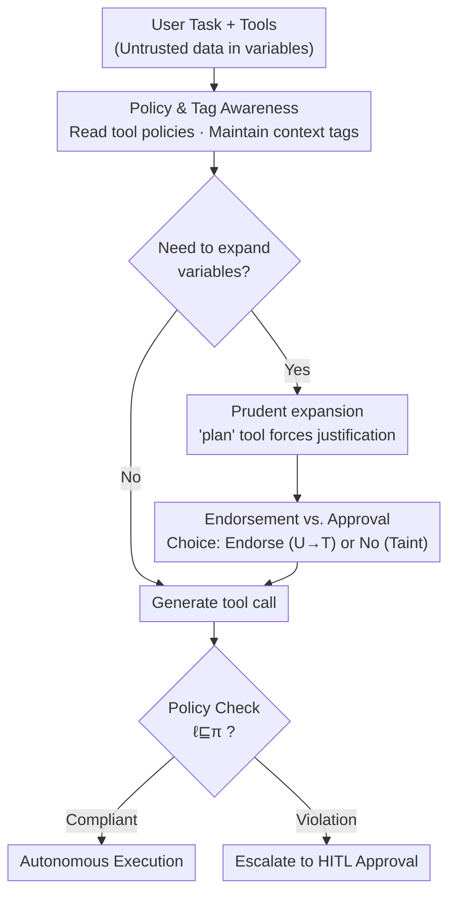

# Optimizing Agent Planning for Security and Autonomy

**Conference**: ICLR 2026  
**OpenReview**: [https://openreview.net/forum?id=g0aVCDY3gS](https://openreview.net/forum?id=g0aVCDY3gS)  
**Code**: TBD  
**Area**: Agent / AI Security / Alignment Security  
**Keywords**: Indirect Prompt Injection, Information-Flow Control, Deterministic Defense, Human-in-the-loop, Agent Autonomy

## TL;DR
Addressing the bias that "deterministic security defenses make Agents appear expensive (low task completion rates, frequent human intervention)," this paper proposes an **autonomy** metric to redefine the benefits of defense. It designs PRUDENTIA, an Agent that is "policy-aware" during planning. Through policy awareness, prudent variable expansion, and "endorsement instead of per-action approval," it reduces the Human-in-the-loop (HITL) load by up to 1.9× compared to SOTA without sacrificing task completion rates.

## Background & Motivation
**Background**: AI Agents increasingly retrieve information from external sources such as emails, webpages, and files. This exposes them to **indirect prompt injection (PIA)** attacks, where attackers hide malicious instructions in data to hijack the Agent for dangerous actions (e.g., exfiltrating secrets, posting malicious patches). Two categories of defense exist for PIA: probabilistic defenses (model alignment, defensive system prompts, classifiers) and deterministic system-level defenses.

**Limitations of Prior Work**: Probabilistic defenses do not provide strong security guarantees and can be bypassed by well-crafted PIAs. The most promising deterministic defense is **Information-Flow Control (IFC)**: tagging all data with integrity (trusted/untrusted) and confidentiality (public/secret) labels. Labels propagate as data is derived, and a tool call's compliance is judged by these labels. Provided labels and policies are correct, IFC can **provably** eliminate PIA. However, if measured solely by "utility" (task completion rate), deterministic defenses appear disadvantaged—they can cause up to a 30% drop in completion rates on AgentDojo because many harmless actions are blocked by policy.

**Key Challenge**: Existing evaluations only calculate the **cost** of deterministic defenses (utility decline) but lack metrics to measure the **benefit**. Their primary benefit—reducing dependence on human supervision—is often ignored. Real-world Agents (GitHub Copilot, Codex, Computer Use) default to human approval for consequential actions because they lack context to judge if an action is safe, relying instead on imperfect heuristics. IFC provides this context: human intervention is only needed when an action cannot be determined as compliant.

**Goal**: (1) Propose autonomy metrics to quantify the benefits of deterministic defenses; (2) Design an Agent optimized for autonomy that maintains provable security guarantees.

**Key Insight**: The authors observe a fundamental flaw in existing IFC Agents—**the model generating the plan is unaware of the policies being enforced by the IFC mechanism**. The planner is "flying blind," leading to avoidable policy violations and unnecessary human intervention.

**Core Idea**: Transform "policy compliance" from a **post-hoc intercept constraint** into an **optimization objective actively pursued by the planner**. This is achieved by making the Agent aware of labels and policies, prudently deciding when to expose untrusted data to the model, and using "one-time data endorsement" to replace "step-by-step action approval."

## Method

### Overall Architecture
PRUDENTIA is built upon the SOTA deterministic defense **FIDES** and follows the **Dual LLM** pattern: untrusted data returned by tools is encapsulated into **variables**. Variables can be passed to tools, but their content is hidden from the planner LLM to prevent context "tainting" (where the planner context inherits an untrusted label, restricting subsequent actions). PRUDENTIA does not modify the underlying IFC execution mechanism; it uses **context engineering** (including policies in tool descriptions, adding a `plan` tool, and adding endorsement options to `expand_variables`) to make the planner "policy-aware."

The workflow is as follows: The Agent reads policies annotated in tool descriptions (consequential P-T actions, data-exfiltrating P-F actions, or inconsequential actions) and maintains its own context labels. When it needs to use untrusted data hidden in a variable, it first calls the `plan` tool to explain the necessity and intended subsequent actions. During expansion, it chooses between **requesting user endorsement** (re-tagging data from untrusted to trusted, avoiding context tainting for autonomous P-T calls) or **expanding without endorsement** (tainting the context, requiring human approval for every subsequent consequential call). Every tool call undergoes a policy check: compliant calls execute autonomously, while non-compliant calls are escalated to Human-in-the-loop (HITL) approval.

### Key Designs

**1. Policy & Tag Awareness: Enabling "Map-Based" Planning**

This is the foundation of PRUDENTIA, addressing the blind spot where IFC planners are unaware of policies. Policies for each tool are **embedded in tool descriptions**, marking them as consequential (P-T policies), data-exfiltrating (P-F policies), or inconsequential. The Agent continuously maintains the current label of its context. Formally, a tool call $f^{\ell}[a_1^{\ell_1}, \dots, a_n^{\ell_n}]$ satisfies policy $\pi=(\pi_f, \vec{\pi})$ if and only if the dynamic labels of the tool and each parameter do not exceed the levels defined by the policy: $\ell \sqsubseteq \pi_f$ and $\ell_i \sqsubseteq \pi_i$. With this information, the Agent can **predict** which calls will trigger policy violations and navigate around security constraints during planning rather than reacting after a call is intercepted.

**2. Prudent Variable Expansion: Forcing Deliberation Before Tainting**

Variables hide potentially malicious data; **once a variable is expanded, the context label is permanently tainted**, restricting future actions. Agents often expand variables unnecessarily or prematurely. PRUDENTIA uses few-shot examples to teach the consequences of expansion and introduces a `plan` tool. Whenever the Agent intends to expand a variable, it must call `plan` to **explicitly explain the necessity and list intended subsequent tools**. This serves as a "state your reason" gatekeeper. Additionally, if the Agent decides to expand a variable **without endorsement** (accepting context tainting), it is optimized to expand all variables simultaneously, as there is no further autonomy gain in hiding them.

**3. Endorsement Instead of Approval: Consolidating HITL Interactions**

This is the key to reducing HITL frequency. Traditionally, inspecting an untrusted email taints the context, resulting in separate human approvals for every subsequent consequential action. PRUDENTIA allows the Agent to **request user endorsement** of untrusted data at the moment of expansion. If endorsed, data is re-labeled from untrusted (U) to trusted (T), allowing expansion **without tainting the context**. Subsequent calls to P-T tools can then proceed autonomously. For example, processing 10 tasks from one benign email requires only **1** HITL interaction with endorsement, versus **10** interactions without it. PRUDENTIA leaves the choice to the Agent—`expand_variables(ask_endorsement=True)` to maintain labels or `expand_variables(ask_endorsement=False)` to taint the context—allowing it to weigh which path minimizes HITL. The authors **purposely exclude** declassification (lowering confidentiality labels) here, as privacy leaks are highly context-dependent and better suited for per-action approval.

### Loss & Training
This work involves no model training. PRUDENTIA is implemented entirely via **context engineering**: incorporating endorsement logic into the `expand_variables` tool, adding the `plan` tool, and injecting policy annotations into tool descriptions. **No changes to the underlying IFC execution mechanism are required**, allowing it to be layered onto existing IFC defenses.

## Key Experimental Results

Evaluations were conducted on **AgentDojo** (banking, Slack, travel, workspace) and **WASP** (Browser Agent security, 48 GitLab cases + 36 Reddit cases). Baselines include Basic (no security, all P-T calls require HITL), Basic-IFC (Basic with IFC and policy checks), and FIDES (SOTA IFC Agent).

### Main Results

On AgentDojo, autonomy is measured by HITL load (lower is better) and TCR@0 (completion rate with zero human intervention, higher is better):

| Model | Method | HITL load | TCR@0 | Description |
|------|------|-----------|-------|------|
| o3-mini | Basic | 48.2 | 24.3% | Non-IFC baseline |
| o3-mini | Basic-IFC | 32.4 | 35.5% | IFC only, 1.5× HITL reduction |
| o3-mini | FIDES | 18.8 | 50.1% | SOTA IFC |
| o3-mini | **PRUDENTIA** | — | **59.1%** | 9% higher TCR@0 than FIDES |
| o4-mini | FIDES | 36.8 | — | 75.7% Completion |
| o4-mini | **PRUDENTIA** | **19.2** | — | 73.2% Completion, 1.9× HITL reduction |

Key Conclusion: Compared to FIDES, PRUDENTIA achieves up to 9% higher completion rates when zero human intervention is allowed (TCR@0) and reduces total HITL load by up to 1.9×. Compared to Basic, HITL load is reduced by up to 2.9×.

On WASP, PRUDENTIA achieves **complete autonomy (HITL load = 0)** while **blocking all injection attacks**:

| Model | Env | Basic ASR | PRUDENTIA ASR | Basic TCR | PRUDENTIA TCR |
|------|------|-----------|---------------|-----------|---------------|
| GPT-4o | GitLab | 20.8% | 0 | 64.6% | 75.0% |
| GPT-4o | Reddit | 47.2% | 0 | 36.1% | 55.6% |
| o1 | GitLab | 29.2% | 0 | 62.5% | 85.4% |
| o3-mini | Reddit | 61.1% | 0 | 25.0% | 58.3% |
| o4-mini | Reddit | 52.8% | 0 | 36.1% | 63.9% |

PRUDENTIA demonstrates superior TCR compared to Basic with zero HITL and zero attack success, with conversational turns comparable to Basic.

### Key Findings
- **IFC naturally provides autonomy**: Even Basic-IFC, not optimized for autonomy, reduces HITL load by 1.5× without decreasing task completion. Deterministic defenses like FIDES/PRUDENTIA reduce HITL by 1.5–2.6× compared to Basic-IFC, refuting the notion that deterministic defense is "expensive."
- **Proactive Avoidance > Reactive Interception**: PRUDENTIA's gains stem from **evading** policy violations during planning, whereas FIDES only intercepts them. This is the root cause of TCR@0 improvement and HITL reduction.
- **Endorsement is highly effective for data-agnostic tasks**: In WASP tasks, PRUDENTIA achieves ideal autonomy (HITL = 0) by hiding untrusted content in variables.

## Highlights & Insights
- **Changing the Metric Reverses the Conclusion**: The most significant insight is that current evaluations measure cost but not benefit. By introducing HITL load and TCR@k, the "expensive" deterministic defense reveals its "labor-saving" value.
- **TCR@k Curves Plot the Trade-off Spectrum**: Plotting TCR as a function of human budget $k$ (where $k=0$ is fully autonomous and $k=\infty$ is a standard benchmark) provides a complete autonomy-utility spectrum.
- **Zero Training, Pure Context Engineering**: PRUDENTIA works without modifying the IFC core or training models. Its "policy-aware planning + endorsement" framework is highly portable.
- **Endorsing Data vs. Approving Actions**: Shifting human intervention from action granularity to data granularity (one endorsement covering multiple calls) is a scalable cost-reduction strategy.

## Limitations & Future Work
- **Dependency on Label/Policy Correctness**: IFC's provable security relies on correctly labeled data and specified policies; this assumption was not heavily stress-tested.
- **Simulated HITL**: Evaluation assumes humans approve non-compliant calls in successful tasks; actual human behavior in loops may be more complex.
- **Purposeful Lack of Declassification**: Avoiding declassification creates an autonomy gap in tasks requiring active privacy disclosure.
- **Threat Model Assumptions**: Assumes the user, planner, and tool implementations are trusted; if the planner LLM itself is compromised, guarantees fail.

## Related Work & Insights
- **vs. FIDES**: Both use IFC + Dual LLM, but PRUDENTIA's planner is policy-aware, allowing it to "navigate" constraints rather than just being "blocked." It reduces HITL by up to 1.9× over FIDES.
- **vs. CaMeL**: CaMeL also uses Dual LLM but plans cannot depend on dynamic tool results. PRUDENTIA allows variable inspection at the cost of "tainting," then uses endorsement to bypass that cost.
- **vs. Probabilistic Defense**: Unlike alignment or prompts, PRUDENTIA provides provable security and, as demonstrated, can actually be more autonomous.

## Rating
- Novelty: ⭐⭐⭐⭐⭐ Redefining deterministic defense value via "autonomy metrics" is a paradigm shift.
- Experimental Thoroughness: ⭐⭐⭐⭐ Extensive across benchmarks and models, though HITL is simulated.
- Writing Quality: ⭐⭐⭐⭐⭐ Clear motivation, rigorous metric definitions, and clean component breakdown.
- Value: ⭐⭐⭐⭐⭐ Addresses the friction of "labor-intensive" safe Agents with a plug-and-play solution.

<!-- RELATED:START -->

## Related Papers

- [\[ICLR 2026\] A2ASecBench: A Protocol-Aware Security Benchmark for Agent-to-Agent Multi-Agent Systems](a2asecbench_a_protocol-aware_security_benchmark_for_agent-to-agent_multi-agent_s.md)
- [\[ICLR 2026\] Breaking Agent Backbones: Evaluating the Security of Backbone LLMs in AI Agents](breaking_agent_backbones_evaluating_the_security_of_backbone_llms_in_ai_agents.md)
- [\[ICLR 2026\] MOAI: Module-Optimizing Architecture for Non-Interactive Secure Transformer Inference](moai_module-optimizing_architecture_for_non-interactive_secure_transformer_infer.md)
- [\[ICLR 2026\] RedCodeAgent: Automatic Red-teaming Agent against Diverse Code Agents](redcodeagent_automatic_red-teaming_agent_against_diverse_code_agents.md)
- [\[ICLR 2026\] ARMS: Adaptive Red-Teaming Agent against Multimodal Models with Plug-and-Play Attacks](arms_adaptive_red-teaming_agent_against_multimodal_models_with_plug-and-play_att.md)

<!-- RELATED:END -->
