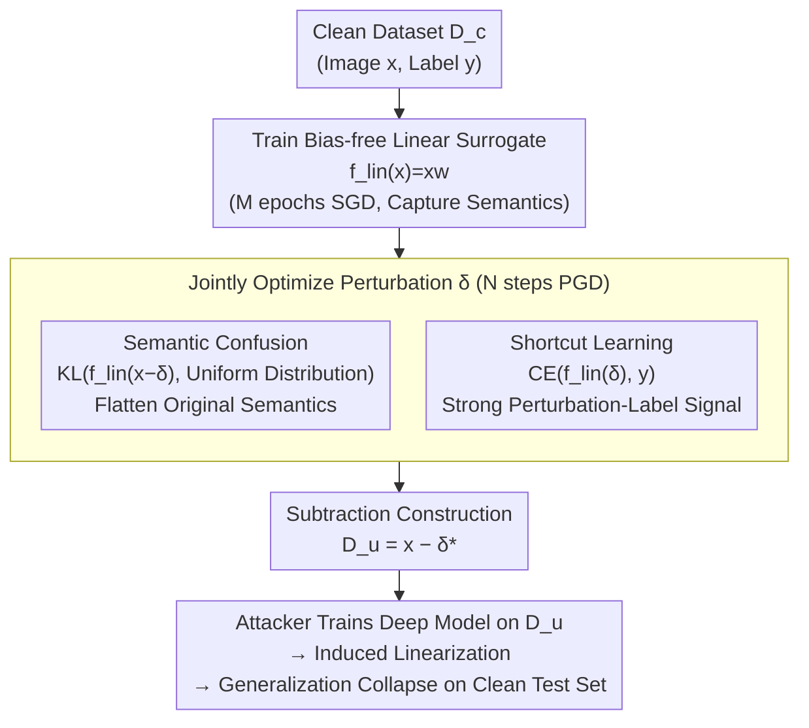

# Perturbation-Induced Linearization: Constructing Unlearnable Data with Solely Linear Classifiers

**Conference**: ICLR 2026  
**arXiv**: [2601.19967](https://arxiv.org/abs/2601.19967)  
**Code**: [GitHub](https://github.com/jinlinll/pil)  
**Area**: LLM Security  
**Keywords**: Unlearnable Examples, Data Protection, Linearization, Shortcut Learning, Adversarial Perturbations

## TL;DR

The PIL method is proposed, using only a bias-free linear classifier as a surrogate model to generate unlearnable perturbations. By inducing deep models to linearize, it prevents them from learning semantic features. It is over 100x faster than existing methods (less than 1 minute of GPU time on CIFAR-10).

## Background & Motivation

**Background**: The use of web data for training deep learning models is increasingly common, yet much of this data is scraped without the creators' consent. **Unlearnable Examples** protect data from unauthorized use by adding imperceptible perturbations that prevent models trained on such data from generalizing to clean test data.

**Limitations of Prior Work**: Mainstream methods like EM and REM typically use deep networks as surrogate models to generate perturbations, which is computationally expensive—REM requires over 15 hours of GPU time on CIFAR-10. A natural question arises: can equally effective perturbations be generated using simpler models?

**Core Idea**: This paper investigates the underlying mechanism of unlearnable examples and finds the answer to be **linearization induction**. Perturbations force deep models to behave like linear models, causing them to lose the ability to learn complex semantic features. Consequently, using a linear model directly as a surrogate is sufficient.

## Method

### Overall Architecture

PIL addresses the excessive computational cost of existing unlearnable example methods that use deep networks as surrogates (e.g., REM taking 15+ GPU hours on CIFAR-10). The insight is that the effectiveness of unlearnable examples stems from "inducing deep models to become linear models." Since the endpoint is linear behavior, a linear model can be used as the surrogate from the start.

The workflow consists of three steps: First, train a **bias-free linear classifier** $f_{lin}(x)=xw$ on clean data to capture the semantic structure. Second, using it as a fixed surrogate, optimize a perturbation $\delta$ for each sample via PGD-style updates to satisfy two objectives: **semantic confusion** (neutralizing the original image's category cues) and **shortcut learning** (turning the perturbation itself into a strong category signal). Finally, construct the unlearnable dataset $\mathcal{D}_u=\{(x_i-\delta_i^*,\,y_i)\}$ by **subtracting** the optimized perturbation from the original image. Any deep model trained on $\mathcal{D}_u$ will be lured into learning the simple "perturbation $\rightarrow$ label" mapping, ignoring true semantics and causing generalization to collapse on clean test sets.

### Key Designs

**1. Semantic Confusion: Removing Category Cues from the Original Image**

The first step in data protection is ensuring deep models cannot learn useful category information from the original image. PIL requires the linear surrogate to output a near-uniform distribution on the component "excluding the perturbation" $x-\delta$, minimizing the KL divergence $L_{KL}\big(f_{lin}(x-\delta),\,\tfrac{1}{k}\mathbf{1}\big)$. This step requires the linear surrogate to be **pre-trained on clean data**; only if the surrogate understands the semantic structure can it "flatten semantics into noise." Using a randomly initialized surrogate fails this optimization (ablation studies confirm pre-training significantly enhances protection). Once the deep model is induced to act linearly, the $x-\delta$ part becomes inseparable, neutralizing the original semantics.

**2. Shortcut Learning: Making the Perturbation an Easier Path**

Removing semantics is insufficient, as the model might still find other features. An explicit "shortcut" must be provided. PIL requires the linear surrogate to **directly predict the label from the perturbation** $\delta$, minimizing the cross-entropy $L_{CE}(f_{lin}(\delta),\,y)$. Since deep models inherently exhibit shortcut learning, they will prioritize the simple linear features strongly correlated with labels found in the perturbations over true semantics. Performance appears high on the perturbed training set but fails completely on clean test data.

**3. Joint Optimization and Subtraction Construction: Two Objectives, One Perturbation**

These two objectives are combined into a single loss for a single $\delta$:

$$L_{total} = \lambda\, L_{CE}\big(f_{lin}(\delta),\,y\big) + (1-\lambda)\, L_{KL}\big(f_{lin}(x-\delta),\,\tfrac{1}{k}\mathbf{1}\big)$$

The parameter $\lambda=0.9$ heavily weights shortcut learning—prioritizing the perturbation as a strong category signal while flattening residual semantics (values $\lambda\in[0.3,0.9]$ are effective). Optimization uses PGD-style signed updates with step size $\alpha=8/2550$, constrained by $\|\delta\|_\infty\le 8/255$. The crucial final step uses **subtraction** $x-\delta^*$ to construct the dataset. When the attacker's model is induced to be approximately linear, its output decomposes into $f_{lin}(x-\delta_1^*)+f_{lin}(-\delta_2^*)$, where the former tends toward a uniform distribution (no information) and the latter correlates strongly with the label, locking the model into a state of "learning $\delta$, forgetting $x$."

### Loss & Training

- A bias-free linear model is first trained for $M$ epochs on clean data using SGD to capture the semantic structure (pre-training is a prerequisite for semantic confusion).
- Perturbations are optimized per-sample using $N$ PGD-style steps, clipped to $\|\delta\|_\infty\le 8/255$.
- Perturbations are initialized from a uniform distribution $\text{Uniform}(-\epsilon,\epsilon)$.

## Key Experimental Results

### Main Results: Test Accuracy on Different Datasets and Models (Lower is Better)

| Model | SVHN-Clean | SVHN-PIL | CIFAR10-Clean | CIFAR10-PIL | ImageNet100-Clean | ImageNet100-PIL |
|------|-----------|----------|-------------|-------------|-----------------|----------------|
| ResNet-18 | 95.64 | **15.94** | 92.11 | **12.77** | 66.00 | **2.26** |
| VGG-19 | 95.22 | **9.12** | 90.61 | **15.22** | 36.04 | **1.36** |
| MobileNet-V2 | 95.95 | **28.48** | 91.94 | **14.05** | 71.26 | **2.20** |

### Ablation Study: Robustness Under Data Augmentation (CIFAR-10 Test Accuracy ↓)

| Method | None | Basic | Rotation | Cutout | CutMix |
|------|--------|-------|----------|--------|--------|
| PIL | **14.70** | **12.87** | **18.15** | 14.62 | **11.05** |
| SEP | 28.43 | 8.94 | 19.68 | 9.74 | 10.48 |
| TAP | 35.90 | 19.11 | 21.18 | 15.09 | 20.30 |

### Key Findings

- PIL requires less than 1 minute of GPU time on CIFAR-10, compared to 15+ hours for REM, achieving over 100x acceleration.
- Perturbations generated by linear models effectively reduce the generalization of various deep architectures, demonstrating architecture independence.
- All unlearnable methods (including those with non-linear surrogates like EM and REM) lead to increased linearity in trained models; PIL pushes this mechanism to its limit.
- On high-resolution ImageNet-100, test accuracy drops to 1-3%, showing even better performance.
- PIL maintains strong robustness under JPEG compression defenses.

## Highlights & Insights

- **Elegant Core Insight**: The fundamental mechanism of unlearnable examples is induced linearization—therefore, using a linear model as a surrogate is sufficient.
- Simplifies the complex unlearnable example problem into linear models and PGD optimization, significantly lowering the barrier for implementation and computation.
- The dual-target decomposition of semantic confusion and shortcut learning is intuitive and effective.
- Reveals a fundamental limitation of partial perturbations: unlearnable examples cannot significantly reduce test accuracy when only a portion of the data is perturbed.

## Limitations & Future Work

- Adversarial training as a defense remains a potential threat to PIL's effectiveness.
- In partial perturbation scenarios (where only a subset of data is protected), the protection effect drops sharply.
- Non-image modalities such as text or audio have not been tested.
- The theoretical explanation of the linearization mechanism remains primarily empirical.

## Related Work & Insights

Directly compared with unlearnable example methods like EM, REM, TAP, and NTGA. Closely related to shortcut learning literature, demonstrating that deep models are easily misled by simple features. Insight: Sometimes the simplest surrogate model is the most effective.

## Rating
- Novelty: ⭐⭐⭐⭐⭐ The discovery that "linear models are enough" is surprising and elegant.
- Experimental Thoroughness: ⭐⭐⭐⭐⭐ Comprehensive comparison across multiple datasets, architectures, and defenses.
- Writing Quality: ⭐⭐⭐⭐ Clear motivation and concise methodology.
- Value: ⭐⭐⭐⭐⭐ Provides both practical value (100x speedup) and theoretical insight (linearization mechanism).

<!-- RELATED:START -->

## Related Papers

- [\[ICLR 2026\] When Priors Backfire: On the Vulnerability of Unlearnable Examples to Pretraining](when_priors_backfire_on_the_vulnerability_of_unlearnable_examples_to_pretraining.md)
- [\[ICCV 2025\] Temporal Unlearnable Examples: Preventing Personal Video Data from Unauthorized Exploitation](../../ICCV2025/llm_safety/temporal_unlearnable_examples_preventing_personal_video_data_from_unauthorized_e.md)
- [\[ICLR 2026\] Constitutional Classifiers++: Efficient Production-Grade Defenses against Universal Jailbreaks](constitutional_classifiers_efficient_production-grade_defenses_against_universal.md)
- [\[ICLR 2026\] WaterDrum: Watermark-based Data-centric Unlearning Metric](waterdrum_watermark-based_data-centric_unlearning_metric.md)
- [\[ICLR 2026\] Operationalizing Data Minimization for Privacy-Preserving LLM Prompting](operationalizing_data_minimization_for_privacy-preserving_llm_prompting.md)

<!-- RELATED:END -->
