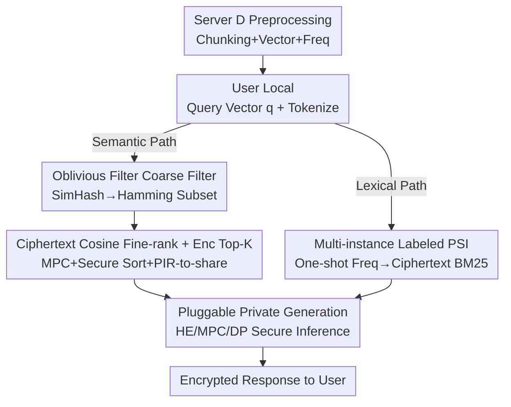

# Pisces: Cryptography-based Private Retrieval-Augmented Generation with Dual-Path Retrieval

**Conference**: ICLR 2026  
**OpenReview**: [https://openreview.net/forum?id=Re3A6vzCTC](https://openreview.net/forum?id=Re3A6vzCTC)  
**Code**: https://github.com/liang-xiaojian/Pisces  
**Area**: LLM Security / Privacy Protection / Cryptography  
**Keywords**: Private RAG, Secure Multi-party Computation, Labeled PSI, Dual-path Retrieval, BM25

## TL;DR
Pisces is the first **cryptography-based** private RAG retrieval framework that supports dual-path "semantic + lexical" retrieval. It utilizes SimHash + oblivious filter for semantic coarse filtering and multi-instance labeled PSI to calculate all word frequencies required for BM25 in a single execution. While protecting both user queries and the knowledge base, it maintains retrieval accuracy within 1.87% of the plaintext baseline.

## Background & Motivation

**Background**: RAG mitigates hallucinations in LLMs within vertical domains by retrieving relevant documents from external knowledge bases, becoming a mainstream paradigm for sensitive scenarios such as medical diagnosis and personalized QA. A RAG system naturally splits into "retrieval" and "generation" steps, where retrieval involves interaction between a server (holding the knowledge base) and a user (holding the query).

**Limitations of Prior Work**: Data from both parties during the retrieval process are private. User queries may expose personal information such as family medical history or rare diseases, while clinical records or biological features in the server's knowledge base are highly sensitive and difficult to anonymize. Existing work demonstrates that attackers can extract sentences or identifiable personal information (PII) verbatim from the knowledge base, directly violating regulations like GDPR, HIPAA, or PIPL. Current research on private retrieval mostly relies on **differential privacy (DP)**. DP injects irreversible noise into data; while it can support semantic retrieval, it **destroys the exact term matching required for lexical retrieval (e.g., BM25)**, resulting in limited retrieval performance.

**Key Challenge**: Dual-path retrieval (combining semantic and lexical paths) inherently provides superior retrieval results, but the noise mechanism of DP is fundamentally opposed to "exact matching"—one must either preserve the lexical path with exact matching or use DP noise; the two are mutually exclusive. Cryptographic schemes (e.g., MPC) do not modify raw data but only encrypt the exchanged data. Theoretically, they can calculate both semantic similarity and perform exact term matching, making them a natural candidate to support dual-path retrieval simultaneously.

**Goal**: To enable RAG retrieval to execute both semantic and lexical paths while protecting the privacy of both queries and documents.

**Key Insight**: Implementing cryptographic primitives directly faces two efficiency bottlenecks: (1) the semantic path's overhead for calculating ciphertext cosine similarity across the entire database is computationally expensive; (2) in the lexical path, existing labeled PSI would need to be called repeatedly for every chunk to gather BM25 word frequencies, which is prohibitively costly. The authors identify these two areas as the keys to practical deployment and design an efficient customized protocol for each path.

**Core Idea**: The semantic path adopts a "coarse-to-fine" strategy—using a new oblivious filter to privately screen a candidate set in Hamming space, then performing expensive ciphertext cosine similarity only on that small set. The lexical path uses a multi-instance labeled PSI to compress word frequency acquisition, which originally required N calls, into a single execution.

## Method

### Overall Architecture

Pisces assumes two parties: Server $S$ holds a large-scale sensitive document database $D$, and Client $C$ holds a private query $Q$. The threat model is **semi-honest**, where both parties follow the protocol but are curious about each other's data. Retrieval is defined as $\text{Enc}(D_K) = R(Q, D)$, where $S$ finally obtains the encrypted top-$K$ documents. During the process, the server does not know the query content or which documents were matched, and the user learns no extra information about the knowledge base.

The workflow consists of three stages: **Preprocessing** (server-side chunking, vectorization, tokenization, and word frequency calculation); **Private Retrieval** (the core contribution, where semantic and lexical paths run in parallel to produce encrypted top-$K$ results); and **Private Generation** (feeding retrieved ciphertext chunks into a pluggable private inference framework). The semantic path follows: SimHash binarization $\rightarrow$ oblivious filter coarse filtering $\rightarrow$ ciphertext cosine similarity fine-ranking on candidates $\rightarrow$ secure sorting + PIR-to-share for retrieving encrypted top-$K$. The lexical path follows: "one-shot PSI for all word frequencies $\rightarrow$ ciphertext BM25 calculation $\rightarrow$ retrieval of encrypted top-$K$."

### Key Designs

**1. Oblivious Filter Coarse Filtering: Reducing Database-wide Ciphertext Similarity to Small Candidate Sets**

The major overhead in the semantic path lies in calculating ciphertext cosine similarity for all $N$ chunks via MPC, which becomes prohibitively expensive at scale. Pisces addresses this with an initial "coarse filter." Specifically, $S$ and $C$ use SimHash to convert their 384-dimensional vectors $v_i$ and $q$ into $L$-bit binary vectors $v_i^b, q^b \in \{0, 1\}^L$. This approximates cosine similarity as **Hamming distance**, which is significantly faster to compute in cryptographic protocols. Both parties then invoke an oblivious filter (Protocol 3, based on Hamming space) to privately select a candidate set $D'$ that is much smaller than the full database, without leaking any information about the query or knowledge base.

**2. Ciphertext Cosine Fine-ranking + Encrypted Top-K Retrieval: Exact Matching and Secure Delivery**

After obtaining the candidate set $D'$, $S$ and $C$ use a secret-sharing-based MPC protocol to calculate the **actual cosine similarity** (avoiding Hamming approximations) between the query and each candidate chunk, resulting in secret shares of the similarities. Subsequently, a secure sorting protocol allows $C$ to learn the top-$K$ indices $I_K$, and a batch PIR-to-share protocol is used to retrieve secret shares of these $K$ chunks, $\langle D_K \rangle$. Finally, $C$ uses FHE to encrypt its share as $\text{Enc}(\langle D_K \rangle_C)$ and sends it to $S$, who computes $\text{Enc}(D_K) \leftarrow \text{Enc}(\langle D_K \rangle_C) + \langle D_K \rangle_S$ to reconstruct the full ciphertext.

**3. Multi-instance Labeled PSI: One-shot Retrieval of All BM25 Word Frequencies**

The lexical path requires word frequencies: specifically, how many times each token in the query appears in each chunk. A naive application of labeled PSI would require a separate call for each chunk, leading to $N$ calls and explosive overhead. The authors designed a multi-instance labeled PSI protocol $\prod_{\text{MultLPSI}}$ (Protocol 4, based on OPRF and OKVS). **One execution** allows $C$ to obtain the word frequency $tf'_{i, j}$ for every query token $q_j$ in every chunk $c_i$ (equal to the actual frequency if it matches, otherwise 0). With these frequencies, $C$ calculates the document frequency $df_j = \sum_{i=1}^N \mathbb{1}(tf'_{i, j} > 0)$ locally and computes BM25 scores jointly with $S$ using MPC.

**4. Pluggable Private Generation: Interfacing with Existing Secret Inference Frameworks**

Pisces focuses on the retrieval phase but is designed to be compatible with existing private LLM inference frameworks. It provides interfaces for three types of backends: **HE-based** (Server $S$ feeds homomorphic encrypted chunks and queries); **MPC-based** (both parties skip the FHE conversion and use secret shares for MPC inference); and **DP-based** (Server $S$ injects DP noise into ciphertext results before decryption). This design ensures **end-to-end** privacy across the entire pipeline.

### Loss & Training

As this work focuses on cryptographic protocol design, there is no training process. Experiments utilized the open-source granite-embedding-small-english-r2 (384-dim) model and BERT tokenizer. All protocols were executed on an Apple M4 Pro (24GB RAM).

## Key Experimental Results

### Main Results

The retrieval accuracy of Pisces was compared with a plaintext baseline (where preserving plaintext-level hits is ideal) across three datasets: ClapNQ, SQuAD, and HotpotQA.

| Path | Setting | Accuracy Range | Description |
| :--- | :--- | :--- | :--- |
| Semantic | Top-5 | 78.02% ~ 90.44% | SimHash quantization causes main loss |
| Semantic | Top-10 | 74.86% ~ 86.83% | Same as above |
| Lexical | Top-5 | 85.72% ~ 98.22% | Minimal loss from secure BM25 calculation |
| Lexical | Top-10 | 86.44% ~ 98.02% | Same as above |

When evaluated against dataset ground-truth, the overall retrieval accuracy of Pisces remains within **1.87%** of the plaintext baseline. Furthermore, the "semantic + lexical" dual-path fusion significantly outperforms single-path retrieval, validating the approach. Pisces also demonstrates significantly higher accuracy than DP-based methods.

### Ablation Study

| Comparison | Baseline | Pisces | Gain |
| :--- | :--- | :--- | :--- |
| Semantic (Large DB) vs Fine-only | Full DB Cipher Cosine | Coarse-to-fine | Time saved by 38.78%~41.21%, Comm. by 67.53%~68.77% |
| Lexical vs SOTA labeled PSI (LSE) | Per-chunk PSI calls | Multi-instance PSI | **496.03×** speedup, Uplink saved by 70,733× |

### Key Findings
- **Coarse-to-fine is only beneficial for large databases**: On large datasets, the oblivious filter coarse-screening reduces expensive similarity computations, saving 40% in time and nearly 70% in communication. On small databases, "fine-only" is faster due to the fixed overhead of the coarse filter.
- **The efficiency gain of Multi-instance PSI is massive**: Compressing $N$ labeled PSI calls into one resulted in a nearly 500x speedup and a 5-order-of-magnitude reduction in uplink communication, which is the decisive step for making the lexical path practical.
- **Different sources of accuracy loss**: The semantic path's loss stems from SimHash quantization error (approximating cosine with Hamming), while the lexical path's loss comes from bit-truncation during secure BM25 computation; the latter is significantly smaller.

## Highlights & Insights
- **Converting Cosine to Hamming via SimHash**: Cosine similarity is expensive in ciphertext, whereas Hamming distance is cheap. Reducing high-dimensional similarity to low-cost bitwise operations for coarse filtering is a key technique for scaling cryptographic schemes.
- **Batch Processing for Multi-instance PSI**: Refactoring repeated labeled PSI calls into a single multi-instance protocol by identifying redundancies is more effective than hardware scaling, as evidenced by the ~500x speedup.
- **Decoupling Retrieval and Generation**: Separating private RAG into "private retrieval (Ours)" and "pluggable private generation" addresses the under-researched retrieval phase while maintaining compatibility with diverse HE/MPC/DP backends.
- **Fundamental Distinction between Crypto and DP**: The observation that DP noise prevents exact word matching while cryptography preserves raw data integrity justifies the selection of the cryptographic technical route.

## Limitations & Future Work
- **Semi-honest Assumption**: The threat model only considers semi-honest participants and does not defend against active malicious adversaries who might tamper with the protocol.
- **Inefficiency on Small Databases**: The coarse-to-fine strategy is slower than fine-only on small scales; an adaptive strategy selection mechanism based on database size is needed.
- **Semantic Accuracy Loss**: Semantic Top-5 accuracy drops as low as 78% due to SimHash; more refined binarization or learnable hashing could reduce this loss.
- **Two-party Setting**: The current protocol is restricted to a single-server, single-user setup and requires extension for multi-server or federated knowledge base scenarios.

## Related Work & Insights
- **vs DP-RAG / RemoteRAG / (Yao & Li, 2025)**: These works rely on differential privacy, which only supports semantic paths and fails at BM25-style exact matches. Pisces is the first to support dual-path retrieval with high accuracy using cryptography.
- **vs Direct application of MPC/labeled PSI**: Naive deployment is plagued by database-wide ciphertext cosine calculations and $N$ repeated PSI calls. Pisces solves these with the oblivious filter and multi-instance PSI.
- **vs Private LLM Inference (HE/MPC/DP)**: While much work focuses on private generation, retrieval is often neglected. Pisces provides the missing retrieval link and remains compatible with existing generation backends.

## Rating
- Novelty: ⭐⭐⭐⭐⭐ First crypto-based dual-path private RAG; two customized protocols provide substantive innovation.
- Experimental Thoroughness: ⭐⭐⭐⭐ Extensive datasets and efficiency comparisons; lacks multi-user/multi-server or malicious adversary scenarios.
- Writing Quality: ⭐⭐⭐⭐ Clear protocol descriptions and motivations; cryptographic details are extensive.
- Value: ⭐⭐⭐⭐⭐ Addresses a critical need in sensitive RAG scenarios; 500x PSI speedup enables real-world feasibility.

<!-- RELATED:START -->

## Related Papers

- [\[ACL 2026\] Differentially Private Synthetic Text Generation for Retrieval-Augmented Generation (RAG)](../../ACL2026/llm_safety/differentially_private_synthetic_text_generation_for_retrieval-augmented_generat.md)
- [\[ICLR 2026\] Fine-Grained Privacy Extraction from Retrieval-Augmented Generation Systems by Exploiting Knowledge Asymmetry](fine-grained_privacy_extraction_from_retrieval-augmented_generation_systems_by_e.md)
- [\[ACL 2026\] Knowledge Poisoning Attacks on Medical Multi-Modal Retrieval-Augmented Generation](../../ACL2026/llm_safety/knowledge_poisoning_attacks_on_medical_multi-modal_retrieval-augmented_generatio.md)
- [\[AAAI 2026\] Privacy-protected Retrieval-Augmented Generation for Knowledge Graph Question Answering](../../AAAI2026/llm_safety/privacy-protected_retrieval-augmented_generation_for_knowledge_graph_question_an.md)
- [\[ACL 2026\] Beyond Explicit Refusals: Soft-Failure Attacks on Retrieval-Augmented Generation](../../ACL2026/llm_safety/beyond_explicit_refusals_soft-failure_attacks_on_retrieval-augmented_generation.md)

<!-- RELATED:END -->
