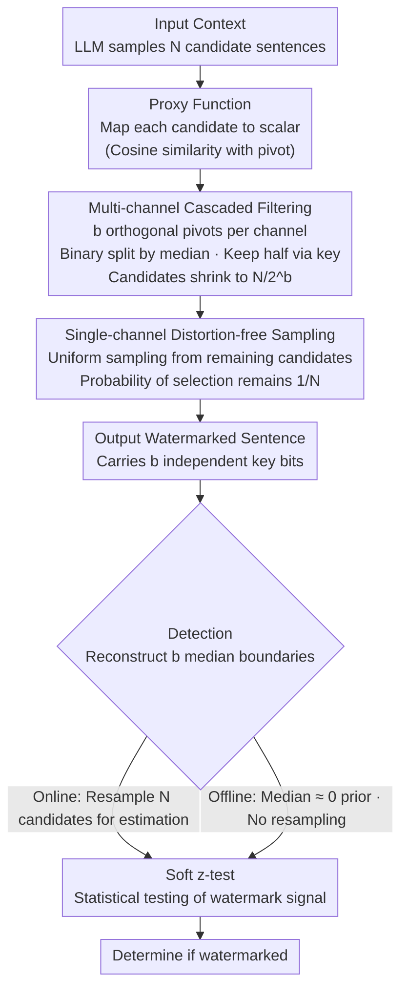

# PMark: Towards Robust and Distortion-free Semantic-level Watermarking with Channel Constraints

**Conference**: ICLR 2026  
**arXiv**: [2509.21057](https://arxiv.org/abs/2509.21057)  
**Code**: Coming soon  
**Area**: AI Safety / Watermarking  
**Keywords**: LLM Watermarking, Semantic-level Watermarking, Distortion-free, Multi-channel Constraints, Robustness Theory

## TL;DR
The authors propose PMark, a theoretically distortion-free and paraphrase-robust semantic-level watermarking method for LLMs. By performing cascaded binary filtering on candidate sentences through multi-channel orthogonal pivot vectors combined with median sampling, it ensures zero distortion while increasing watermark evidence density for enhanced robustness. It achieves a TP@FP1% of 95%+ under paraphrase attacks, a 14.8% improvement over previous SWM methods.

## Background & Motivation

**Background**: LLM watermarking is categorized into token-level (e.g., Green-Red watermarks) and semantic-level (SWM). SWM reinforces robustness against paraphrase attacks by embedding signals within the semantic space of sentences.

**Limitations of Prior Work**:
   - Existing SWM methods (SemStamp/k-SemStamp) utilize rejection sampling, which introduces distributional distortion.
   - Sparse evidence density in single-channel watermarks allows detection to be easily bypassed by paraphrasing.
   - There is a lack of a rigorous theoretical framework to analyze watermark properties (conditions for zero distortion, robustness bounds).

**Key Challenge**: The trade-off between distortion-free properties (maintaining generation quality) and robustness (resisting paraphrase attacks).

**Goal**: Simultaneously achieve a theoretical distortion-free guarantee and strong practical robustness against paraphrase attacks.

**Key Insight**: Using multi-channel orthogonal pivot vectors equals embedding multiple independent watermark bits per sentence, which multiplies the evidence density.

**Core Idea**: Distortion-free median sampling + multi-channel cascaded filtering = high-density watermark evidence $\rightarrow$ robustness.

## Method

### Overall Architecture
PMark seeks to reconcile two typically conflicting objectives in watermarking: maintaining identical generation quality (distortion-free) and robustness against paraphrase attacks. It operates in the semantic space of sentences rather than at the token level. During sentence generation, the LLM first samples $N$ candidate sentences. A proxy function (mapping each candidate to a cosine similarity scalar with a pivot vector) works with $b$ mutually orthogonal pivot vectors to perform cascaded binary filtering on the candidates. Each pivot bisects the candidates at the median and retains the half specified by the secret key. A final output is uniformly sampled from the remaining candidates. Detection reverses this: for each sentence, $N$ candidates are resampled to reconstruct the filtering boundary (median), followed by a soft z-test for statistical verification. The offline version avoids resampling by assuming zero as the median prior.

### Key Designs

**1. Proxy Function Theoretical Framework: Proving "Distortion-free" Semantic Watermarking**

Prior to PMark, semantic watermarking lacked a unified theoretical tool to analyze distortion. This paper defines a proxy function that maps each candidate sentence $s$ to a scalar (e.g., similarity to a pivot), then discretizes candidates into $M$ buckets to obtain the distribution $q(u)$. It rigorously proves that the watermark distribution is distortion-free relative to the original distribution if and only if $q(u) = 1/M$, meaning the proxy values are uniformly distributed across buckets. While hard to satisfy naturally, this identifies the source of distortion in rejection-sampling methods like SemStamp/k-SemStamp and serves as a benchmark for distortion-free samplers.

**2. Single-channel Distortion-free Sampling: Constant Selection Probability via Median Bisection**

To ensure no distribution shift, given a pivot vector $v$, the cosine similarity $\langle v, \mathcal{T}(s) \rangle$ is calculated for $N$ candidates. The candidates are split into high and low similarity halves based on the median. The secret key bit determines which half to retain, and a candidate is sampled uniformly from that half. Crucially, regardless of the key bit, the final probability of any candidate being selected is exactly $1/N$. Thus, $P_M^w(s|\pi) = P_M(s|\pi)$, meaning the watermark and original distributions are pointwise equal. This provides the rigorous distortion-free guarantee of Theorem 3.

**3. Multi-channel Cascaded Filtering (Online PMark): b Bits of Evidence per Sentence**

While single-channel is distortion-free, it only embeds 1 bit of evidence per sentence, which paraphrasing can easily erase. PMark stacks channels by generating $b$ orthogonal pivot vectors via QR decomposition properly. For $N$ candidates, it performs median bisection channel-by-channel. The candidate set shrinks sequentially $V^{(0)} \to V^{(1)} \to \cdots \to V^{(b)}$, finally sampling from the $N/2^b$ remaining candidates. Since pivots are orthogonal, the $b$ bits are independent, multiplying the evidence density. Theorem 7 shows that if an attack destroys evidence in each channel with probability $\epsilon$, the Signal-to-Noise Ratio (SNR) is:

$$\text{SNR} \geq \frac{(1-2\epsilon)\sqrt{bT}}{2\sqrt{\epsilon(1-\epsilon)}}$$

SNR grows with the number of channels $b$ and sentences $T$, making the watermark much harder to remove.

**4. Offline PMark: Utilizing Quasi-orthogonality to Eliminate Resampling**

Online detection requires resampling $N$ candidates to reconstruct the median, which is computationally expensive. Offline PMark leverages the geometric fact that random vectors in high-dimensional semantic space are nearly orthogonal, causing proxy values to concentrate in a narrow range around zero. By using zero as a fixed prior median, resampling is avoided. This introduces a slight distortion, but Theorem 8 bounds the total variation distance by $\delta_{TV} \leq \epsilon$. In practice, $\epsilon \leq 0.08$, making it negligible.

### Main Results: TP@FP1% under Paraphrase Attack

| Method | No Attack | Doc-P (GPT Paraphrase) | Gain |
|------|--------|----------------|------|
| SemStamp (C4/Mistral) | ~99% | 73.5% | — |
| k-SemStamp | 100% | ~80% | — |
| **PMark Online** | **100%** | **97.8%** | **+24.3%** |
| **PMark Offline** | 99.7% | 92.6% | +19.1% |

### Ablation Study: Channels (b) and Samples (N)

| N\b | b=1 | b=2 | b=3 | b=4 |
|-----|-----|-----|-----|-----|
| N=8 (Online) | 81.0 | 97.0 | 98.0 | — |
| N=16 | 84.0 | **100.0** | 100.0 | 100.0 |
| N=64 | 99.0 | 100.0 | 100.0 | 100.0 |

### Key Findings
- **Multi-channel is crucial**: Moving from $b=1$ to $b=2$ jumps detection rates from 81% to 97%.
- **No drop in text quality**: PMark's PPL (4.37) is lower than k-SemStamp (~5.0) because distortion-free sampling avoids distribution shifts.
- **Robust to GPT-level paraphrasing**: Even under heavy paraphrasing (Doc-P), TP@FP1% remains above 95%.

## Highlights & Insights
- **Unity of Theory and Practice**: The paper provides a rare combination of a rigorous distortion-free proof and a robustness bound where SNR grows with $\sqrt{bT}$.
- **Redundancy Intuition**: Similar to error-correcting codes, embedding multiple independent bits per sentence ensures that even if some channels are corrupted, the overall signal is recoverable.
- **Clever Offline Simplification**: Utilizing high-dimensional "quasi-orthogonality" to approximate the median as zero is a smart way to eliminate detection overhead.

## Limitations & Future Work
- **Sampling Overhead**: Generating each sentence requires $N$ samples ($N=16\text{--}64$), which impacts latency for real-time applications.
- **Semantic Encoder Dependence**: Requires a fixed encoder (e.g., RoBERTa); encoder quality directly affects performance.
- **Sentence-level Constraints**: Reliable detection is difficult for very short texts ($< 10$ sentences).
- **Future Direction**: Hybrid schemes combining token-level watermarks for short text and PMark for long text.

## Related Work & Insights
- **vs. SemStamp/k-SemStamp**: These use rejection sampling and introduce distortion, whereas PMark uses median sampling for zero distortion and improves robustness by 14.8%.
- **vs. Green-Red Token-level**: Token-level is fragile to paraphrasing (each token replacement loses information); PMark embeds at the semantic level and is robust to synonymous changes.
- **vs. UPV (Top Token-level)**: PMark increases paraphrase robustness by 44.6%.

## Rating
- Novelty: ⭐⭐⭐⭐⭐ (Theory framework + multi-channel distortion-free design)
- Experimental Thoroughness: ⭐⭐⭐⭐ (Multiple models and attacks, but lacks massive LLM scale tests)
- Writing Quality: ⭐⭐⭐⭐⭐ (Rigorous theory, clear methodology)
- Value: ⭐⭐⭐⭐⭐ (Addresses two core SWM challenges: distortion and robustness)

<!-- RELATED:START -->

## Related Papers

- [\[ICLR 2026\] GraphShield: Graph-Theoretic Modeling of Network-Level Dynamics for Robust Jailbreak Detection](graphshield_graph-theoretic_modeling_of_network-level_dynamics_for_robust_jailbr.md)
- [\[ACL 2026\] SWAN: Semantic Watermarking with Abstract Meaning Representation](../../ACL2026/llm_safety/swan_semantic_watermarking_with_abstract_meaning_representation.md)
- [\[ICLR 2026\] Watermarking Diffusion Language Models](watermarking_diffusion_language_models.md)
- [\[ICLR 2026\] No Caption, No Problem: Caption-Free Membership Inference via Model-Fitted Embeddings](no_caption_no_problem_caption-free_membership_inference_via_model-fitted_embeddi.md)
- [\[ICLR 2026\] Robust LLM Unlearning via Post Judgment and Multi-Round Thinking](robust_llm_unlearning_via_post_judgment_and_multi-round_thinking.md)

<!-- RELATED:END -->
