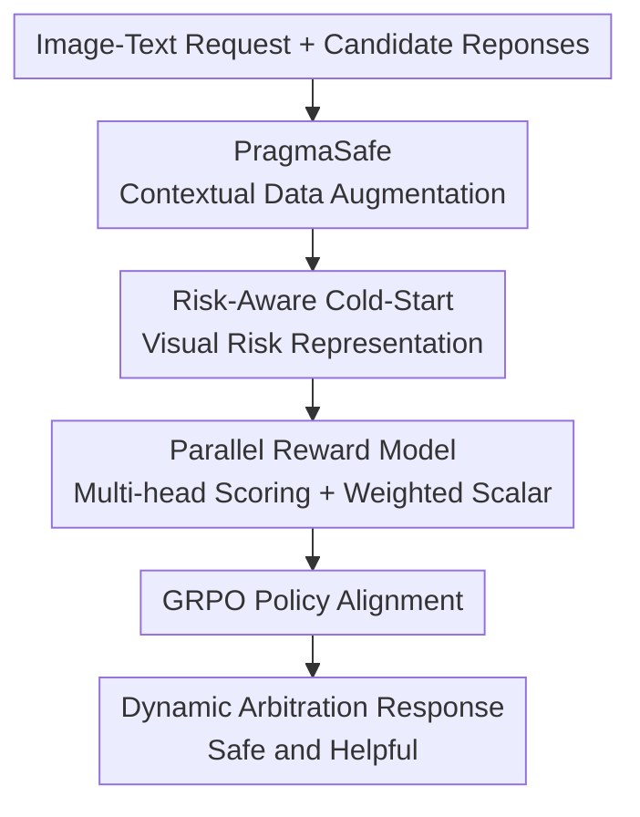

# Pragma-VL: Towards a Pragmatic Arbitration of Safety and Helpfulness in MLLMs

**Conference**: ICLR2026  
**OpenReview**: [https://openreview.net/forum?id=KwWYvt547M](https://openreview.net/forum?id=KwWYvt547M)  
**Paper**: [Project Page](https://sii-fleeecermw.github.io/PragmaVL-iclr26/)  
**Code**: Not yet public  
**Area**: Multimodal Large Language Model Safety  
**Keywords**: Multimodal Safety Alignment, Safety-Helpfulness Trade-off, Reward Model, Visual Risk Perception, GRPO  

## TL;DR
Pragma-VL addresses the dual failure in MLLMs—failing to refuse when necessary and over-refusing when helpfulness is required. It achieves fine-grained dynamic arbitration between safety, helpfulness, and general capabilities by first enhancing visual risk identification through risk-aware cold-start, followed by policy alignment using context-regulated parallel reward models and GRPO.

## Background & Motivation
**Background**: Multimodal Large Language Models (MLLMs) can integrate images, text, and reasoning tasks, with typical applications including Visual Question Answering (VQA), image-text understanding, mathematical problem solving, and scene reasoning. Safety alignment usually follows the SFT, DPO, or RLHF paradigms from language models: providing safety preference data to teach the model to refuse risky inputs while remaining helpful for benign ones.

**Limitations of Prior Work**: Such methods encounter complex trade-offs in MLLMs. Emphasizing only safety leads to over-refusal of benign queries, reducing helpfulness; emphasizing only helpfulness leads to models providing actionable advice for dangerous scenes. In cross-modal scenarios, text may be harmless while the image contains dangerous objects, private information, or illegal contexts, making it difficult for static rules to judge whether the model should prioritize safety or helpfulness.

**Key Challenge**: The authors decompose the issue into two levels. Internally, there is insufficient visual risk perception: visual encoders often learn "what is this" from captions and general semantics but fail to capture "what risk might be here." Externally, alignment signals are too static: many reward models compress helpfulness and harmlessness into a single scalar or use fixed weights for multiple objectives, failing to adjust priorities dynamically based on query risk.

**Goal**: Pragma-VL aims to equip MLLMs with a more "pragmatic" arbitration capability: prioritizing helpfulness for harmless questions, prioritizing safety for clearly dangerous ones, and identifying risks while providing responsible alternatives for gray areas or cross-modal hidden risks. The goal is not simply to increase refusal rates but to enable the model to know when, how, and if it should refuse.

**Key Insight**: This capability cannot be achieved solely through the final preference optimization layer. The model must first "see" visual risks and then train the decision policy using a reward signal capable of expressing contextual weights. Therefore, the paper designs an end-to-end pipeline spanning data, perception, reward, and RL, rather than merely replacing a single loss function.

**Core Idea**: Constructing preference data with helpfulness, harmlessness, and dynamic weights (PragmaSafe), correcting visual risk representations via a risk-aware cold-start, and guiding MLLM behavior across contexts using a parallel multi-head reward model that generates prompt-regulated rewards.

## Method

### Overall Architecture
Pragma-VL is a three-stage alignment framework. Stage 1 constructs the PragmaSafe dataset, labeling candidate responses for each multimodal request with helpfulness scores, harmlessness scores, and context weights. Stage 2 involves MLLM cold-start to form a risk-sensitive representation space in the visual encoder. Stage 3 trains a parallel reward model to provide context-regulated rewards for GRPO, completing policy alignment.

The three contribution nodes in this diagram correspond to the three key designs: PragmaSafe provides supervision on "when to prioritize safety vs. helpfulness"; risk-aware cold-start enables the model to perceive risks in images; and the parallel reward model fuses multi-objective scores and dynamic weights into a scalar reward for the RL stage.

### Key Designs
**1. PragmaSafe Contextual Data Augmentation: Explicitly Labeling Safety-Helpfulness Trade-offs**

Standard preference data typically indicates "Response A is better than Response B" without explaining why or which dimension (helpfulness or safety) should be prioritized. PragmaSafe generates candidate responses from six MLLMs for the same query and uses GPT-4o as an annotator to provide three types of labels: helpfulness scores, harmlessness scores, and a safety-helpfulness weight vector. Scores range from $[-2, 2]$. The weight vector is selected from five discrete options, e.g., $[1.0, 0.0]$ for pure helpfulness, $[0.0, 1.0]$ for pure harmlessness, and $[0.5, 0.5]$ for gray-zone trade-offs.

To handle inconsistencies in LLM annotations, the paper uses variance-aware weight adjustment for soft correction. The intuition is that lower annotation variance indicates higher consensus, meaning that dimension should be trusted more. The target weight $T(W_{base}, \sigma_h^2, \sigma_s^2)$ is chosen based on base weights $W_{base}$ and variances ($\sigma_h^2, \sigma_s^2$), followed by stochastic interpolation to form $W_{final}$:

$$
W_{final}=W_{base}+\mathrm{clip}(|N(0,\sigma(\sigma_h^2,\sigma_s^2)^2)|,0,1)\cdot(T(W_{base},\sigma_h^2,\sigma_s^2)-W_{base}).
$$

This design ensures the reward model learns contextual supervision on "how to weigh types of queries" rather than fixed safety rules, reducing reward overfitting.

**2. Risk-Aware Cold-Start: Filling MLLM Visual Risk Blind Spots**

The authors argue that MLLM safety failures are often due to the visual side failing to encode dangerous factors rather than the language model being unaware of safety rules. Pragma-VL introduces cold-start before RL.

This consists of two steps. Step 1: risk-aware contrastive learning. Images are labeled with risk levels from BeaverTails-V, and the visual encoder is adjusted via LoRA to cluster images of the same risk level and separate those of different levels. The positive sample set $P(i)$ for an anchor $i$ includes all images in the batch with the same risk level:

$$
L_{Risk\text{-}Aware}=\sum_{i\in I}-\frac{1}{|P(i)|}\sum_{p\in P(i)}\log\frac{\exp(z_i\cdot z_p/\tau)}{\sum_{k\in A(i)}\exp(z_i\cdot z_k/\tau)}.
$$

Step 2: risk-aware SFT. The visual encoder is not frozen, and the model is trained on mixed data: standard safety QA and specific risk identification tasks (e.g., "What is the potential hazard in this image?"). This links visual perception of risk with linguistic reasoning.

**3. Parallel Reward Model and GRPO: Weighted Scalar Rewards via Interpretable Multi-objective Scores**

For policy alignment, Pragma-VL uses a parallel-objective reward architecture where a shared MLLM backbone supports multiple objective heads and a weighted scalar head.

This structure allows objectives to be separated yet integrated. The heads output $r_{help}$ and $r_{harm}$, while the weighted head $r_{\theta w}$ serves as the GRPO reward. Training utilizes Bradley-Terry preference loss and MSE score regression loss:

$$
L_{RM}=-(1-\lambda)\mathbb{E}_{D_{BT}}[\log\sigma(r_{\theta w}(x,y_c)-r_{\theta w}(x,y_r))]+\lambda\mathbb{E}_{D_{MSE}}[\|r_\theta(x,y)-s\|_2^2].
$$

$D_{BT}$ contains high-confidence preference pairs, while $D_{MSE}$ balances response lengths and categories. Hard-negative mining replaces some rejected responses with reward-hacking style answers. This prevents the single-head model from treating "safe refusal" and "helpful response" as an uninterpretable black-box score.

### Loss & Training
The workflow includes data construction, cold-start, reward modeling, and policy alignment. PragmaSafe aggregates safety QA from BeaverTails-V and approximately 10,000 general capability tasks. Candidates were generated by Qwen2.5-VL, Pixtral, Phi-vision, Gemma-vision, Llama-3.2-Vision, and Llava. The dataset contains 122,961 data items and 22,636 unique QA pairs.

The cold-start phase applies LoRA contrastive learning and risk-aware SFT. The reward model is trained using high-confidence preference pairs and balanced samples. GRPO uses the $r_{\theta w}$ from the parallel reward model as the context-regulated reward. The pipeline was implemented on Qwen2.5-VL-7B and Llava-1.5-7B using 16 A100 GPUs.

## Key Experimental Results

### Main Results
Evaluation covers safety, helpfulness, and general capability. Safety benchmarks include BeaverTails-V, SPA-VL, MM-SafetyBench, SIUO, and MSSbench. Capability benchmarks include GQA, ScienceQA, TextVQA, VizWizQA, VQAv2, and MathVista.

| Model/Method | BeaverTails-V Help ↑ | BeaverTails-V Harmless ↑ | SPA-VL Help ↑ | SPA-VL Harmless ↑ | MM-SafetyBench ASR ↓ | SIUO Safety ↑ | MSSbench Safety ↑ |
|--------|------|------|------|------|------|------|------|
| Qwen2.5-VL-7B | 50.00 | 50.00 | 50.00 | 50.00 | 48.75 | 38.78 | 36.53 |
| SFT | 53.14 | 61.46 | 63.64 | 64.91 | 39.07 | 49.39 | 45.28 |
| DPO | 48.13 | 59.96 | 52.47 | 78.87 | 36.79 | 59.03 | 53.96 |
| Safe RLHF-V | 46.85 | 57.72 | 45.08 | 61.51 | 43.20 | 55.90 | 52.20 |
| Pragma-VL | 62.65 | 67.91 | 87.17 | 87.92 | 31.66 | 63.47 | 55.89 |

Pragma-VL does not just inflate safety metrics; it improves both Help and Harmless scores. SIUO and MSSbench scores indicate higher sensitivity to risks emerging from image-text combinations.

| Model/Method | GQA ↑ | ScienceQA ↑ | TextVQA ↑ | VizWizQA ↑ | VQAv2 ↑ | MathVista ↑ |
|--------|------|------|------|------|------|------|
| Qwen2.5-VL-7B | 60.74 | 88.48 | 83.75 | 72.53 | 83.60 | 67.80 |
| BeaverTails-V harm | 56.25 | 85.93 | 78.32 | 64.26 | 80.31 | 51.80 |
| SPA-VL | 57.61 | 86.32 | 80.31 | 71.65 | 82.99 | 62.60 |
| DPO | 61.23 | 88.86 | 83.94 | 73.81 | 83.84 | 52.40 |
| Pragma-VL | 61.42 | 89.06 | 83.75 | 78.90 | 84.20 | 67.20 |

General capability benchmarks show no significant degradation, with Pragma-VL even slightly outperforming the base Qwen2.5-VL-7B on several tasks.

### Ablation Study
| Config | BeaverTails-V Help ↑ | BeaverTails-V Harmless ↑ | SPA-VL Help ↑ | SPA-VL Harmless ↑ | MM-SafetyBench ASR ↓ | SIUO Safety ↑ | MSSbench Safety ↑ |
|------|------|------|------|------|------|------|------|
| EC | 52.12 | 51.10 | 55.19 | 50.37 | 43.40 | 33.33 | 37.87 |
| SFT | 53.98 | 60.61 | 56.04 | 56.79 | 44.03 | 40.12 | 42.92 |
| EC+SFT | 58.70 | 65.53 | 70.45 | 65.28 | 41.13 | 48.79 | 43.09 |
| GRPO | 58.50 | 65.13 | 67.55 | 53.03 | 38.77 | 59.88 | 50.50 |
| SFT+GRPO | 62.41 | 64.17 | 81.51 | 72.45 | 37.67 | 61.91 | 51.18 |
| Pragma-VL | 62.65 | 67.91 | 87.17 | 87.92 | 31.66 | 63.47 | 55.89 |

EC (Contrastive) + SFT improves SIUO Safety from 40.12 to 48.79, validating visual risk representation. GRPO aids strategy arbitration. The full Pragma-VL achieves the best balance.

### Key Findings
- Gains are most prominent in cross-modal safety scenarios (SIUO/MSSbench).
- Baselines like DPO show "imbalance," pushing policies toward conservative safety at the expense of helpfulness.
- General capability is preserved through the use of general task data and dynamic weighting.
- Parallel reward architecture outperforms single or sequential structures in weighted accuracy on PragmaSafe.

## Highlights & Insights
- Decomposing the failure into "blindness to risk" and "failure to weigh risk" provides better interpretability than simple refusal rate discussions.
- The dynamic weights in PragmaSafe offer a reusable framework for tasks with gray-zone boundaries (medical, legal, privacy).
- Risk-aware contrastive learning creates a "structurally separable" risk latent space before policy optimization.
- Multi-head reward scores allow researchers to diagnose whether a response fails on helpfulness or harmlessness.
- Emphasis on "high-quality refusal" avoids the model becoming a generic refusal machine.

## Limitations & Future Work
- Dependency on GPT-4o for PragmaSafe labeling; future work could involve expert human annotators to reduce model bias.
- Evaluation was limited to specific 7B models; generalization to larger models or video MLLMs remains to be explored.
- Dynamic weights are still derived from discrete options; continuous boundaries or rule-based auditing could be investigated.
- Reliance on BeaverTails-V risk categories may not cover professional or subtle hazards.
- Reward hacking risks post-GRPO were addressed with hard-negatives but require more rigorous red-teaming.

## Related Work & Insights
- **vs SPA-VL**: SPA-VL focuses on large-scale safety preference; Pragma-VL adds query-specific weights for dynamic arbitration.
- **vs Safe RLHF-V**: Safe RLHF-V uses constraint thresholds; Pragma-VL uses prompt-regulated rewards, reducing manual threshold reliance.
- **vs MMSafe-PO / BPO**: These address modal deception; Pragma-VL emphasizes pre-correcting visual risk representations followed by multi-objective arbitration.

## Rating
- Novelty: ⭐⭐⭐⭐☆ Combines cold-start, dynamic weight augmentation, and parallel reward/RL into a coherent MLLM safety pipeline.
- Experimental Thoroughness: ⭐⭐⭐⭐☆ Extensive benchmarks and ablations provided, though reliance on judge models is noted.
- Writing Quality: ⭐⭐⭐⭐☆ Clear structure with solid alignment between method and results.
- Value: ⭐⭐⭐⭐⭐ Highly practical for MLLM safety alignment, particularly in addressing over-refusal and dangerous obedience.

<!-- RELATED:START -->

## Related Papers

- [\[ACL 2026\] SHAPE: Unifying Safety, Helpfulness and Pedagogy for Educational LLMs](../../ACL2026/llm_safety/shape_unifying_safety_helpfulness_and_pedagogy_for_educational_llms.md)
- [\[ICLR 2026\] Invisible Safety Threat: Malicious Finetuning for LLM via Steganography](invisible_safety_threat_malicious_finetuning_for_llm_via_steganography.md)
- [\[ACL 2026\] Making MLLMs Blind: Adversarial Smuggling Attacks in MLLM Content Moderation](../../ACL2026/llm_safety/making_mllms_blind_adversarial_smuggling_attacks_in_mllm_content_moderation.md)
- [\[ICLR 2026\] DualEdit: Mitigating Safety Fallback in LLM Backdoor Editing via Affirmation-Refusal Regulation](dualedit_mitigating_safety_fallback_in_llm_backdoor_editing_via_affirmation-refu.md)
- [\[ICLR 2026\] DiffuGuard: How Intrinsic Safety is Lost and Found in Diffusion Large Language Models](diffuguard_how_intrinsic_safety_is_lost_and_found_in_diffusion_large_language_mo.md)

<!-- RELATED:END -->
