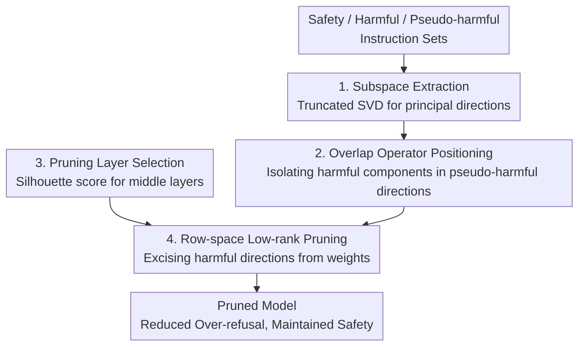

# ProSafePrune: Projected Safety Pruning for Mitigating Over-Refusal in LLMs

**Conference**: ICLR 2026  
**OpenReview**: [https://openreview.net/forum?id=QkHKaPfRAB](https://openreview.net/forum?id=QkHKaPfRAB)  
**Code**: https://github.com/hfutml/PROSAFEPRUNE  
**Area**: LLM Safety / Alignment / Over-refusal  
**Keywords**: Over-refusal, Subspace Projection, Low-rank Pruning, Safety Alignment, Hidden State Probing

## TL;DR
This paper attributes "over-refusal" in LLMs (refusing harmless instructions containing sensitive keywords) to a small set of "harmful-feature-amplifying" low-rank directions within parameters. By using SVD to decompose safety, harmful, and pseudo-harmful subspaces and designing an overlap operator to precisely locate amplified harmful components in pseudo-harmful instructions, it performs low-rank pruning in the row space of discriminative intermediate layers. This training-free method significantly reduces the over-refusal rate without increasing inference overhead, while slightly improving performance on general tasks.

## Background & Motivation

**Background**: To ensure the safe deployment of LLMs, the mainstream approach involves SFT + RLHF to strengthen refusal mechanisms and suppress harmful outputs. however, if the refusal mechanism is too restrictive, the model often "errs on the side of caution"—refusing instructions that are semantically harmless but surface-level "pseudo-harmful" (e.g., refusing "how to kill the lights in the room" due to the word "kill"). This phenomenon is known as over-refusal or exaggerated safety.

**Limitations of Prior Work**: Existing mitigation methods follow two paths, each with drawbacks. **Training-based methods** (Safety Patching, SFT with paired pseudo-harmful data, fine-tuning safety-critical layers) can recalibrate decision boundaries but require additional data and compute, leading to high deployment costs. **Training-free methods** (prompt rewriting, Self-CD contrastive decoding, activation direction editing/steering vectors) are flexible but only act as patches during inference without addressing the root cause, often introducing extra inference overhead.

**Key Challenge**: The authors argue that previous work viewed over-refusal merely as a side effect of conservative alignment strategies, missing a deeper root cause: **cognitive bias within the model's internal representation space**. Research shows LLM hidden states naturally encode safety attributes. Pseudo-harmful instructions should project onto both "harmful" and "harmless" subspaces, but under extreme safety fine-tuning, this natural overlap is distorted: harmful projections are disproportionately amplified while harmless ones are suppressed, leading to "over-harmful encoding." This pushes the decision boundary and causes misclassification, which the authors identify as a source of the "alignment tax" (performance degradation after alignment).

**Goal / Key Insight**: Instead of patching activations or retraining, the authors propose directly modifying the **parameter space**. The core observation is that over-refusal stems from a small number of low-rank components in model parameters that overly amplify harmful components. Since these directions occupy a tiny fraction of the parameter space, pruning them can mitigate over-refusal without significantly altering the model's overall behavior.

**Core Idea**: Replace retraining or activation editing with "subspace projection + low-rank pruning." By identifying the part of pseudo-harmful directions that overlaps with the harmful subspace but not the safety subspace, this component is "excised" from the weight row space to correct over-harmful encoding at its source.

## Method

### Overall Architecture

ProSafePrune aims to eliminate "overly harmful low-rank directions" in parameters. The pipeline consists of two steps: **Diagnosis**, using probes to analyze the intensity of harmful encoding in pseudo-harmful instructions layer-by-layer, confirming that deep parameters amplify harmful features; and **Pruning**, where weight matrices for each submodule (Q/K/V/O/FFN) are processed using truncated SVD on safety, harmful, and pseudo-harmful activations to extract principal subspaces. An overlap operator is constructed to precisely isolate the "amplified harmful component within pseudo-harmful directions," which is then mapped back to the weight row space for low-rank attenuation. This is performed only on intermediate layers with the highest feature separability (silhouette score) to minimize impact on general capabilities. The pipeline requires minimal auxiliary data, no fine-tuning, and zero inference overhead.

### Key Designs

**1. Subspace Extraction: Using Truncated SVD to Characterize Three Directions**

To "excise" harmful directions, they must first be explicitly extracted from the weights. For the $m$-th submodule of the $l$-th layer with weight $W_{l,m}\in\mathbb{R}^{d_{out}\times d_{in}}$, input hidden states are mapped to outputs $a_{l,m}(x)=W_{l,m}h(x)$ and pool-averaged into vectors $\hat a_{l,m}(x)$. These are collected across safety $D_s$, harmful $D_u$, and pseudo-harmful $D_p$ sets, stacked into matrices $A^{(t)}_{l,m}$, and decomposed via truncated SVD:

$$A^{(t)}_{l,m}\approx U^{(t)}_{l,m}S^{(t)}_{l,m}V^{(t)\top}_{l,m},\quad t\in\{s,u,p\}$$

The top $r_t$ left singular vectors form $U^{(t)}_{l,m}$, defining the projection operator $\Pi^{(t)}_{l,m}=U^{(t)}_{l,m}U^{(t)\top}_{l,m}$ as the principal subspace. Theorem 3.1 states that rank-$r$ truncated SVD is the optimal low-rank approximation under the Frobenius norm, ensuring theoretically optimal subspaces for locating harmful directions.

**2. Overlap Operator: Precisely Isolating "Amplified Harmful Components"**

Simply pruning the "harmful subspace" would impair the model's ability to refuse truly harmful instructions. The authors target components that "lie in the pseudo-harmful principal direction, overlap with the harmful direction, but do not belong to the safety direction." This is achieved via the overlap operator:

$$\Omega_{l,m}=(I-\Pi^{(s)}_{l,m})\,\Pi^{(u)}_{l,m}\,\Pi^{(p)}_{l,m}$$

This chain (i) isolates pseudo-harmful directions via $\Pi^{(p)}_{l,m}$; (ii) extracts the harmful overlap via $\Pi^{(u)}_{l,m}$; and (iii) excludes components aligned with the safety direction using $(I-\Pi^{(s)}_{l,m})$. This makes attenuation highly selective. Ablation shows that pruning purely harmful subspaces (dropping $\Pi^{(p)}_{l,m}$ from $\Omega$) significantly compromises safety scores (dropping to 79.5% and 71.0%).

**3. Layer Selection: Targeting Highly Separable Intermediate Layers**

Not all layers are suitable for pruning. The authors use t-SNE to visualize activations and calculate the average silhouette score per layer to quantify cluster separability:

$$s(i)=\frac{b(i)-a(i)}{\max\{a(i),b(i)\}}$$

Where $a(i)$ is the intra-cluster mean distance and $b(i)$ is the distance to the nearest neighboring cluster. Experiments (Figure 2) show that for LLaMA-2-7B, **intermediate layers** exhibit the clearest cluster separation and highest silhouette scores, indicating the strongest discriminative power for safety features. Pruning these layers achieves high precision with minimal global perturbation.

**4. Row-space Low-rank Pruning: Excising Directions from Weights**

The operator $\Omega_{l,m}$ is defined in output space, but since $a=Wh$, applying $\Omega$ to the output is equivalent to left-multiplying the weights in the row space. Defining $\Delta W_{l,m}=\Omega_{l,m}W_{l,m}$, low-rank pruning is applied with an intensity coefficient $\lambda$:

$$W'_{l,m}=(I-\lambda\,\Omega_{l,m})\,W_{l,m},\quad \lambda\in[0,1]$$

This "sculpts out" row space components that push pseudo-harmful representations toward harmful directions. Theorem 3.2 provides an energy bound: $\frac{\|\Omega_{l,m}W\|_F^2}{\|W\|_F^2}\le \frac{r}{s_r(W)}$, where $s_r(W)$ is the stable rank. Since $r$ is small and the stable rank of LLMs is typically large, the pruned energy is minimal, theoretically ensuring that overall capability remains intact.

### Loss & Training
This method is a **training-free** post-processing parameter edit. It does not involve gradient training or loss functions. It only requires small auxiliary datasets ($D_s$/$D_u$/$D_p$) to construct subspaces. Hyperparameters include subspace ranks $r_t$, pruning intensity $\lambda$, and layer positions, all determined via validation on 50 instructions using the TS score.

## Key Experimental Results

### Main Results
Evaluation metrics follow Dabas et al.: Compliance Rate (**C.R.**), Safety Score (**S.S.**), and Trade-off Score (**T.S.**, average of C.R. and S.S.); WildGuard is used for classification. Datasets include OR-Bench, PHTest, XSTest, OKTest (Compliance) and AdvBench, JailbreakBench/JBB (Safety). Baselines include SELF-CD, SCAN, and SURGICAL.

| Model | Method | Avg. C.R. | Avg. T.S. |
|------|------|-----------|-----------|
| LLaMA-2-7B | Default | 49.2 | 65.5 |
| LLaMA-2-7B | Self-CD | 72.4 | 79.2 |
| LLaMA-2-7B | SCAN | 75.0 | 82.3 |
| LLaMA-2-7B | Surgical | 75.0 | 82.4 |
| LLaMA-2-7B | **Ours** | **84.5** | **88.4** |
| LLaMA-2-13B | Surgical | 59.2 | 72.1 |
| LLaMA-2-13B | **Ours** | **74.9** | **82.5** |
| LLaMA-3-8B | Surgical | 83.6 | 87.2 |
| LLaMA-3-8B | **Ours** | **86.8** | **89.4** |

On LLaMA-2-7B, ProSafePrune improves OR-Bench compliance to 73.0% (vs. 57.5% for Surgical), while AdvBench/JBB safety scores remain high (98.5/94.0). The total trade-off score improves by **2–9 points** over the strongest baseline.

**General capabilities improved**: For LLaMA-2-7B, MMLU rose 37.1→39.6, CommonsenseQA 49.0→53.0, and GSM8K 23.0→25.5. This supports the hypothesis that "over-harmful encoding" is a source of alignment tax; pruning it releases overly conservative constraints.

### Ablation Study

| Configuration | Key Metric (OR-Bench C.R.) | Description |
|------|------|------|
| Default | 11.0 | No pruning |
| Prune V proj only | 30.5 | Largest single-module gain |
| Prune Q/K/O/MLP only | 10.5~19.0 | Minimal improvement |
| Prune All layer modules | **73.0** | Outperforms any single module |
| Without $\Pi^{(p)}$ | 90.5 | Higher compliance but Safety drops to 79.5 |

### Key Findings
- **Layer > Module**: Pruning only the V module reaches 30.5%, whereas whole-layer pruning reaches 73.0%, suggesting over-refusal stems from submodule interactions.
- **Pseudo-harmful projection is essential**: Removing $\Pi^{(p)}$ boosts compliance but crashes safety for truly harmful prompts (S.S. 79.5/71.0).
- **Middle layers are optimal**: Appendix D.4 shows middle layers outperform endpoints, and results are robust to specific layer selection within the high-silhouette range.

## Highlights & Insights
- **Redefining "Over-refusal"**: Shifting the view from an "alignment side effect" to a "parameter space cognitive bias" is a primary contribution.
- **Overlap Operator Design**: The chain $\Omega=(I-\Pi_s)\Pi_u\Pi_p$ uses subspace math to perform set operations (Pseudo ∩ Harmful ∖ Safety), allowing for selective pruning without blunt force.
- **Theoretical Grounding**: Two theorems guarantee subspace optimality and energy bounds for pruning, explaining why performance is preserved.
- **Efficiency**: Unlike Self-CD or SCAN, this method modifies weights once, resulting in zero additional inference cost.

## Limitations & Future Work
- **Dependency on Auxiliary Data**: Subspaces depend on the representativeness of $D_s/D_u/D_p$. Shifted pseudo-harmful distributions may lead to inaccurate directions.
- **Hyperparameter Search**: While the search sample is small (50 instructions), parameters like $r_t$, $\lambda$, and layer index must still be tuned for different model families.
- **Minor Safety Trade-off**: In some settings, AdvBench/JBB scores slightly decreased (e.g., LLaMA-2-7B 100→98.5).
- **Correlation vs. Causality**: Probing and silhouette scores show correlation between over-harmful encoding and refusal, but strict causality for all types of over-refusal remains to be proven.

## Related Work & Insights
- **vs. Training-based**: Unlike Safety Patching or fine-tuning, this method requires no compute-intensive gradient updates yet still identifies safety-critical layers using silhouette scores.
- **vs. Activation-based**: Techniques like SCAN or Self-CD add inference complexity. ProSafePrune is more stable across model sizes (note SCAN's failure on LLaMA-2-13B) and has zero latency cost.
- **vs. Naive Low-rank Pruning**: While inspired by Wei et al. 2024, the innovation here is the overlap operator—pruning "amplified components in pseudo-harmful inputs" rather than simply pruning the harmful direction itself.

## Rating
- Novelty: ⭐⭐⭐⭐⭐ 
- Experimental Thoroughness: ⭐⭐⭐⭐ 
- Writing Quality: ⭐⭐⭐⭐ 
- Value: ⭐⭐⭐⭐⭐ 

<!-- RELATED:START -->

## Related Papers

- [\[ICLR 2026\] DualEdit: Mitigating Safety Fallback in LLM Backdoor Editing via Affirmation-Refusal Regulation](dualedit_mitigating_safety_fallback_in_llm_backdoor_editing_via_affirmation-refu.md)
- [\[ACL 2026\] Please Refuse to Answer Me: Mitigating Over-Refusal in LLMs via Adaptive Contrastive Decoding](../../ACL2026/llm_safety/please_refuse_to_answer_me_mitigating_over-refusal_in_large_language_models_via_.md)
- [\[ICLR 2026\] ManagerBench: Evaluating the Safety-Pragmatism Trade-off in Autonomous LLMs](managerbench_evaluating_the_safety-pragmatism_trade-off_in_autonomous_llms.md)
- [\[ICLR 2026\] HiddenEcho: Mitigating Noise Amplification in Differentially Private LLMs with Hidden-State Correction](hiddenecho_mitigating_noise_amplification_in_differentially_private_llms_with_hi.md)
- [\[ACL 2026\] DART: Mitigating Harm Drift in Difference-Aware LLMs via Distill-Audit-Repair Training](../../ACL2026/llm_safety/dart_mitigating_harm_drift_in_difference-aware_llms_via_distill-audit-repair_tra.md)

<!-- RELATED:END -->
