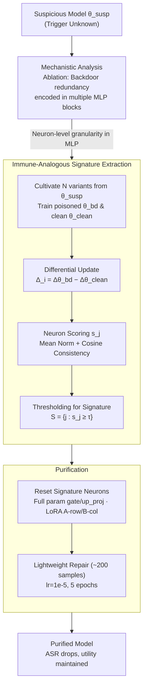

# Purifying Generative LLMs from Backdoors without Prior Knowledge or Clean Reference

**Conference**: ICLR 2026  
**arXiv**: [2603.13461](https://arxiv.org/abs/2603.13461)  
**Code**: [https://bd-vax.github.io/](https://bd-vax.github.io/)  
**Area**: AI Security / Backdoor Defense  
**Keywords**: LLM Backdoor, Backdoor Purification, Mechanistic Analysis, MLP Encoding, Immune-Analogous Signature Extraction

## TL;DR
This paper proposes a backdoor purification method for LLMs that requires no prior knowledge or clean reference models. By analyzing the mechanism, it is discovered that backdoor associations are redundantly distributed in MLP layers. Using an immune-analogous approach, "signatures" are extracted from multiple backdoor variants to locate and suppress suspicious neurons, followed by lightweight fine-tuning for recovery. The method reduces ASR by over 80% across 5 types of attacks and 3 tasks while maintaining utility.

## Background & Motivation

**Background**: Backdoor attacks pose serious security threats to LLMs—models perform normally on standard inputs but produce malicious outputs (sentiment manipulation, targeted refusal, code injection) when a trigger is present.

**Limitations of Prior Work**:
   - Requires prior knowledge of the trigger (unrealistic).
   - Requires a clean reference model (usually unavailable in deployment).
   - Relies on aggressive fine-tuning hyperparameters (extremely high learning rates).
   - Mostly limited to classification tasks, unable to handle generative LLMs.
   - Vulnerable to adaptive attackers (who can obfuscate internal signals).

**Key Challenge**: How to purify backdoors without knowing the trigger or relying on a clean reference model?

**Goal**: Backdoor purification for LLMs under conditions of no prior knowledge and no clean reference model.

**Key Insight**: Instead of identifying the trigger itself, the method breaks the trigger-behavior association by precisely locating how the backdoor is encoded within the parameters.

**Core Idea**: Construct multiple backdoor variants → extract a "backdoor signature" consistent across variants → suppress signature neurons + lightweight repair.

## Method

### Overall Architecture
The goal is to remove backdoors from a suspicious LLM without knowing the trigger or having a clean reference model. The core hypothesis is: rather than guessing the trigger, it is better to understand **where the backdoor is encoded in the parameters** and then precisely "reset and repair" that portion.

The pipeline consists of three steps: first, **mechanistic analysis** uses ablation experiments to confirm that backdoor associations are hidden in MLPs and redundantly distributed; second, **immune-analogous signature extraction** actively cultivates multiple "backdoor variants" from the suspicious model and compares their parameter change patterns to extract a cross-variant "backdoor signature" (a set of suspicious neuron indices); finally, **purification** resets the signature neurons and performs lightweight fine-tuning with ~200 clean samples to restore standard capabilities. The input is a suspicious model, and the output is a purified model with significantly lower ASR and maintained utility.

### Key Designs

**1. Mechanistic Analysis: Locate where backdoors are hidden before purification**

Backdoor defense has long been hindered by a misconception—that trigger-behavior associations are encoded in attention or early layers. This paper uses systematic ablation to disprove this. The results yield four observations: (a) removing updates to **attention** during poisoning does not eliminate the backdoor, suggesting attention only amplifies signals; (b) removing updates to **MLP** eliminates the backdoor, proving MLP is the true carrier; (c) to fully disable a backdoor, **≥12 consecutive MLP blocks** must be removed, showing associations are not localized; (d) shuffling the order of poisoned blocks does not break the backdoor, indicating encoding is **redundant and order-independent**. These findings dictate the subsequent design: since backdoors are redundantly spread across MLPs, purification must target distributed suspicious parameters at the neuron level.

**2. Immune-Analogous Signature Extraction: Forcing out the backdoor fingerprint via variant commonalities**

After locating MLPs, the challenge is separating "backdoor-related parameter changes" from "normal fine-tuning drift" without a clean reference. Borrowing from immunology, where the immune system extracts shared antigens from different virus strains, the method posits that shared parameter change patterns between different backdoor variants (triggers/behaviors) represent the essence of the backdoor association.

For each variant $i$, a poisoned model $\theta_i^{\text{bd}}$ and a clean model $\theta_i^{\text{clean}}$ are trained starting from the suspicious model using **different triggers and target behaviors**. Their respective updates are subtracted:

$$\Delta_i = \Delta\theta_i^{\text{bd}} - \Delta\theta_i^{\text{clean}}$$

This subtraction cancels out "general fine-tuning drift" and the "original backdoor in the suspicious model," leaving $\Delta_i$ to reflect the directional changes of the **newly injected backdoor**. Each neuron index $j$ is then scored:

$$s_j = \frac{1}{N}\sum_i \|\Delta_{i,j}\|_2 + \lambda \frac{2}{N(N-1)}\sum_{i<\ell} \max\{0, \cos(\Delta_{i,j}, \Delta_{\ell,j})\}$$

The first term is the average norm across variants, measuring how much a neuron was "modified" (poisoning intensity). The second term is the mean pairwise cosine similarity (clamped at zero), measuring how **consistent** the modification direction is across variants. A true backdoor neuron should show significant modification and directional consistency. Finally, a threshold is used to extract the backdoor signature:

$$\mathbb{S} = \{j: s_j \geq \tau\}$$

This set of indices is deemed the "backdoor carrier."

**3. Purification: Reset signature neurons + lightweight repair with 200 samples**

Purification involves clearing the parameters of these suspicious neurons and restoring model capabilities. For full-parameter models, the `gate_proj`/`up_proj` parameters of marked neurons in the MLP are reinitialized. For LoRA models, the corresponding rows in matrix A or columns in matrix B are zeroed. Since purification might damage normal capabilities, a lightweight recovery is performed using ~200 clean samples at a standard learning rate of $10^{-5}$ for 5 epochs. Crucially, a **mild learning rate** is used rather than the aggressive rates typical of previous defenses, as the backdoor has been structurally removed.

### Loss & Training
- The signature extraction phase involves no training loss; it is purely based on scoring and thresholding.
- The recovery phase uses standard SFT loss with a mild learning rate ($10^{-5}$, 5 epochs, ~200 clean samples).
- The default number of variants is $N=6$; diminishing returns are observed beyond $N \geq 5\text{-}6$.

## Key Experimental Results

### Main Results: ASR Reduction (Lower is Better)

| Attack/Task | No Defense | Fine-tuning | Pruning | Quantization | CROW | Fine-Pruning | **Ours** |
|-----------|-------|------|------|------|------|-------------|---------|
| LLaMA-7B Sentiment (Avg) | 28.16% | 29.96% | 13.78% | 16.36% | 8.66% | 10.94% | **0.91%** |
| LLaMA-13B Sentiment (Avg) | 52.37% | 52.18% | 44.11% | 42.93% | 24.47% | 17.87% | **3.49%** |
| LLaMA-7B Targeted Refusal (Avg) | 82.01% | 82.66% | 65.81% | — | — | 65.36% | **10.76%** |
| LLaMA-13B Targeted Refusal (Avg) | 84.75% | 87.82% | 75.16% | — | — | 82.80% | **12.94%** |

### Ablation Study: Impact of Variant Number N

| N | BadNets-7B Refusal ASR |
|---|----------------------|
| 1 | 40.91% |
| 3 | ~20-25% |
| 6 | **10.66%** |
| 8+ | Marginal improvement |

### Ablation Study: Score Components

| Method | ASR | Utility |
|------|-----|---------|
| Norm only | 10.26% | 58.86% (False positives → Utility loss) |
| Alignment only | 77.04% | 59.88% (High ASR) |
| **Combined (Ours)** | **10.66%** | **59.42%** |

### Key Findings
- **Backdoors are redundantly encoded in MLPs**: Mentioned as a critical discovery; attention only amplifies the signal.
- **Universality across 5 attack types**: Effective against BadNets, CTBA, MTBA, Sleeper, and VPI.
- **Minimal utility loss**: Purified models approach clean model performance on 10 benchmarks and MT-Bench.
- **200 samples suffice for recovery**: Extremely low data requirement for the repair phase.
- **Effective for LoRA**: Does not require full-parameter access.

## Highlights & Insights
- **Elegant Immune Analogy**: Constructing multiple "backdoor variants" is akin to vaccination with different viral strains; identifying consistent parameter changes reveals the "antigen." Differential updates effectively eliminate noise from general drift.
- **MLP Mechanism Discovery**: Overturns preconceived notions about attention or early layers, providing a new structural understanding of backdoor defense.
- **Zero Prior Assumptions**: Neither the trigger, a clean reference model, nor aggressive hyperparameters are needed, making the method highly practical for real-world deployment.

## Limitations & Future Work
- **Computational Overhead**: Cost scales linearly with $N$ (though $N=6$ is sufficient).
- **Clean Data Requirement**: Assumes access to a small amount of clean data (~200 samples) for recovery.
- **Attention-Only Backdoors**: For extremely stealthy backdoors potentially encoded entirely in attention, the mechanistic analysis may need extension.
- **Future Directions**: Could integrate with neuron-level analysis (like SSAH) to first identify safety-critical units and then check for backdoor contamination.

## Related Work & Insights
- **vs CROW**: CROW was the previous SOTA but maintains higher ASR (8-24%) and causes more utility loss; Ours reduces ASR to <11% with better utility.
- **vs Fine-Pruning**: Fine-Pruning based on Wanda pruning has limited effect on generative LLMs (65-82% ASR); the immune signature strategy is far more precise.
- **vs Standard Fine-tuning**: Standard fine-tuning is almost ineffective against backdoors, indicating the stability of backdoor associations during normal training.

## Rating
- Novelty: ⭐⭐⭐⭐⭐ (Immune signature extraction + MLP mechanism discovery)
- Experimental Thoroughness: ⭐⭐⭐⭐⭐ (5 attacks × 3 tasks × multiple models)
- Writing Quality: ⭐⭐⭐⭐ (Clear mechanistic analysis and logical motivation)
- Value: ⭐⭐⭐⭐⭐ (First practical, high-efficiency, zero-prior backdoor purification for generative LLMs)

<!-- RELATED:START -->

## Related Papers

- [\[ICLR 2026\] TrustGen: A Dynamic Evaluation Platform for Generative Foundation Model Trustworthiness](trustgen_a_platform_of_dynamic_benchmarking_on_the_trustworthiness_of_generative.md)
- [\[ICLR 2026\] Bi-directional Bias Attribution: Debiasing Large Language Models without Modifying Prompts](bi-directional_bias_attribution_debiasing_large_language_models_without_modifyin.md)
- [\[ICLR 2026\] Unmasking Backdoors: An Explainable Defense via Gradient-Attention Anomaly Scoring for Pre-trained Language Models](unmasking_backdoors_an_explainable_defense_via_gradient-attention_anomaly_scorin.md)
- [\[ACL 2025\] CAVGAN: Unifying Jailbreak and Defense of LLMs via Generative Adversarial Attacks](../../ACL2025/llm_safety/cavgan_unifying_jailbreak_and_defense_of_llms_via_generative_adversarial_attacks.md)
- [\[ICLR 2026\] Knowledge Externalization: Reversible Unlearning and Modular Retrieval in Multimodal Large Language Models](knowledge_externalization_reversible_unlearning_and_modular_retrieval_in_multimo.md)

<!-- RELATED:END -->
