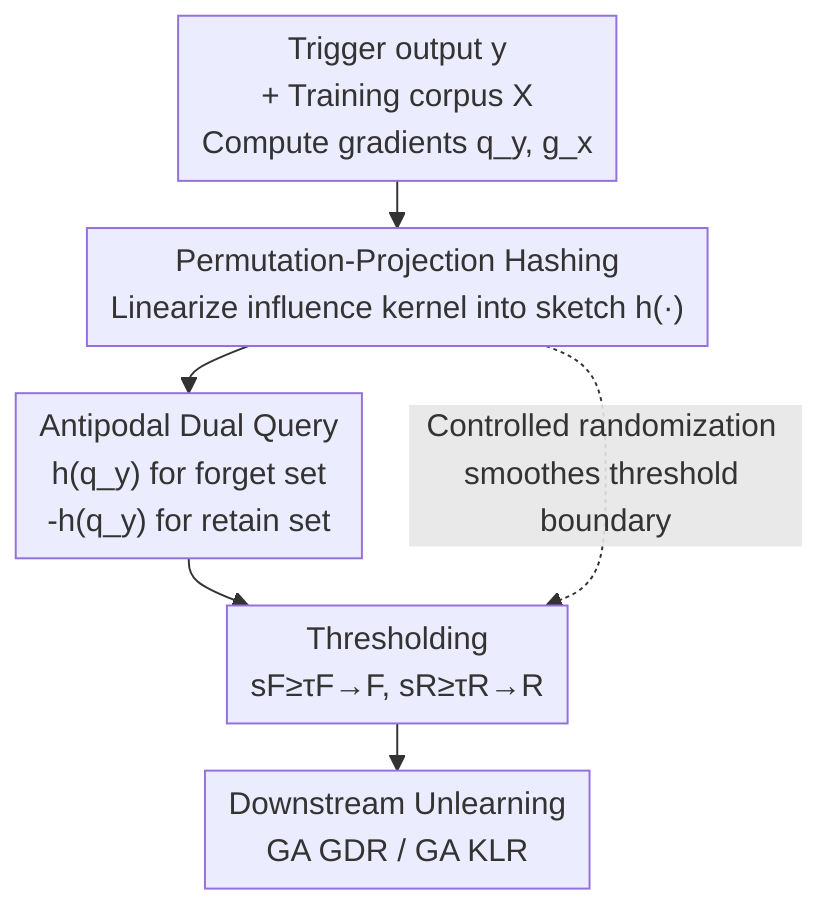

# Randomized Antipodal Search Done Right for Data Pareto Improvement of LLM Unlearning

**Conference**: ICLR 2026  
**OpenReview**: [https://openreview.net/forum?id=Xn6EnJZghu](https://openreview.net/forum?id=Xn6EnJZghu)  
**Code**: TBD  
**Area**: LLM Safety / Machine Unlearning  
**Keywords**: LLM unlearning, Data retrieval, Influence kernel, Randomized hashing, Pareto frontier

## TL;DR
This paper argues that the true bottleneck of LLM unlearning lies not in the optimizer, but in "retrieving the forget set to be erased and the retain set to be preserved from massive corpora." It proposes RASLIK—utilizing permutation-projection hashing to compress gradients into low-dimensional sketches, followed by antipodal search to simultaneously retrieve aligned samples (forget) and anti-aligned samples (retain). This reduces retrieval complexity to sub-linear and minimizes sampling variance through controlled randomization, pushing the forget-retain Pareto frontier beyond deterministic baselines and even oracle sampling across multiple models, datasets, and unlearning algorithms.

## Background & Motivation
**Background**: Existing machine unlearning methods mostly treat the problem as a pure optimization task—designing various loss functions (gradient ascent, preference optimization, etc.) to increase loss on a forget set $F$ while using regularization on a retain set $R$ to maintain general capabilities. A typical representative is "Forget set Gradient Ascent + Retain set Gradient Descent" (GA GDR).

**Limitations of Prior Work**: These methods assume $F$ and $R$ are provided. However, in real-world scenarios, unlearning is often triggered by a single "output $y$ that should not have been generated." Engineers only have this $y$ and a massive training corpus, without labeled forget/retain sets. Determining which data to forget and which to retain is the primary challenge. Without high-quality retrieval, even the most sophisticated optimizers are ineffective.

**Key Challenge**: Unlearning is naturally a tug-of-war between two mutually exclusive goals—the more thorough the forgetting, the more general capability tends to drop. The trade-off between these defines a Pareto frontier. Existing work focuses entirely on the optimizer, which moves along the frontier under fixed data selection. No one has asked: can a different data selection strategy push the entire frontier outward?

**Goal**: To reframe unlearning from "optimization-centric" to "retrieval-centric" and provide a retrieval algorithm capable of systematically expanding the Pareto frontier. This is decomposed into two sub-problems: (1) how to efficiently retrieve forget/retain samples based on gradient similarity in billion-parameter dimensions; (2) how to make this retrieval robust to perturbations in $y$ and gradient noise, avoiding sensitivity at threshold boundaries.

**Key Insight**: The authors use a "linearized influence kernel" $\rho(y,x)=\cos(q_y, g_x)$ to measure the gradient similarity between a training sample $x$ and the target $y$. Samples aligned with $q_y$ should enter the forget set, while anti-aligned samples enter the retain set. A key observation is that near the threshold boundary, deterministic "in or out" decisions are extremely fragile; slight jitter in $y$ causes boundary samples to flip between $F$ and $R$, leading to high sampling variance.

**Core Idea**: The concept of **data Pareto improvement** is introduced—treating the ability to expand the frontier as a first-class citizen for evaluating retrieval. This is realized via RASLIK: using randomized hashing to linearize gradients into low-dimensional sketches, turning retrieval into sub-linear inner product search; leveraging "controlled randomization to smooth threshold decisions" to reduce variance; and using an antipodal trick (sign flipping) to obtain both forget and retain sets in a single retrieval pass.

## Method

### Overall Architecture
RASLIK addresses the task of "selecting a forget set $F$ and a retain set $R$ from a training corpus $X$ given a trigger output $y$." The process consists of three steps: first, the gradients of the target $y$ and each training sample $x$ are compressed into low-dimensional normalized sketches $h(\cdot)$ via **permutation-projection hashing**; second, thresholding is performed directly on inner products in the sketch space to obtain $F$; third, utilizing the "antipodal" property—where the reverse query sketch for $y$ equals $-h(q_y)$—the retain set $R$ is retrieved in the same space with a simple sign flip. The retrieved $F, R$ are then passed to downstream unlearning algorithms (GA GDR / GA KLR) for parameter updates.

The pipeline transitions as follows: "Gradients → Sketch → Antipodal Dual Query → Thresholding → Downstream Unlearning":

### Key Designs

**1. Linearized Influence kernel + Permutation-Projection Hashing: Compressing Billions of Dimensions for Sub-linear Retrieval**

The challenge is that using the linearized influence kernel $\rho(y,x)=\frac{\langle\nabla\ell(y;\theta),\nabla\ell(x;\theta)\rangle}{\|\nabla\ell(y;\theta)\|\,\|\nabla\ell(x;\theta)\|}=\cos(q_y,g_x)$ is theoretically clean—samples with the highest cosine similarity to $q_y$ should be forgotten—but the gradient dimension $d$ is in the billions. Directly computing $\cos$ for the entire corpus requires $O(|X|d)$ time and storage, which is computationally prohibitive.

RASLIK creates a $k$-dimensional sketch $h(g_x)$ ($k \ll d$) for each gradient $g_x$: it uses $k$ random Rademacher vectors $\{r_j\}$ for projection $p_j(g_x)=g_x^\top r_j$, reorders them into coordinates $\pi(j)$ according to a fixed permutation $\pi$, and applies L2 normalization $h(g_x)[\pi(j)]=p_j(g_x)/\sqrt{\sum_j p_j(g_x)^2}$. Applying the same $h(\cdot)$ to $q_y$, the sketch inner product $\hat\rho(y,x)=\langle h(q_y),h(g_x)\rangle$ becomes an **unbiased estimator** of $\cos(q_y,g_x)$ with variance $\mathrm{Var}[\hat\rho]=O(1/k)$. Storage and query costs drop to $O(|X|k)$. By setting $k=O(\log|X|)$, the sketch dimension grows only logarithmically with the corpus size while maintaining similarity guarantees, saving $d/k$ times the memory and computation—often several orders of magnitude in practice.

**2. Antipodal Search: Simultaneous Retrieval via Sign Flipping**

If the forget set is retrieved using $\max\cos(q_y,g_x)$ and the retain set using $\max\cos(-q_y,g_x)$, a naive implementation would run twice. This paper notes that $\cos(-q_y,g_x)=-\cos(q_y,g_x)$, and since projection and permutation are linear operations, $h(-q_y)=-h(q_y)$. Thus, the anti-aligned query sketch is simply $h_\text{anti}=-h(q_y)$. The retain scores $s_R[x]=\langle h(g_x),h_\text{anti}\rangle=-\langle h(g_x),h(q_y)\rangle=-s_F[x]$ can be derived by negating the forget scores with zero extra computation. Finally, both sets are partitioned by thresholds: $F=\{x: s_F[x]\ge\tau_F\}$, $R=\{x: s_R[x]\ge\tau_R\}$. This "antipodal" symmetry is the namesake of RASLIK and the key to reducing dual-retrieval costs to nearly zero.

**3. Controlled Randomization for Threshold Smoothing: Reducing Variance for Stable Unlearning**

This is the core of "done right." Deterministic retrieval is brittle near the threshold $\tau$: if a boundary sample's $\rho_x$ crosses the line due to zero-mean jitter $q_y\mapsto q_y+\xi$ ($\mathbb{E}[\xi]=0$), it fluctuates between $F$ and $R$, causing the update direction $\Delta(F,R)=\frac{1}{|R|}\sum_{x\in R}g_x-\frac{1}{|F|}\sum_{x\in F}g_x$ to oscillate. The randomized hashing in RASLIK injects controlled randomness into thresholding, smoothing these discontinuous "in-or-out" decisions.

The authors characterize this via theorem (Assumption 3.2 regarding boundary quality and query perturbation): when a boundary set of non-zero measure exists near the threshold, the variance of the RASLIK update direction satisfies $\mathrm{Var}[\Delta_\text{ra}]\le\mathrm{Var}[\Delta_\text{ex}]-\frac{c}{k}\Lambda$ ($c>0$, where $\Lambda$ represents boundary quality), and the Mean Squared Error (MSE) to the true unlearning gradient is strictly smaller: $\mathbb{E}\|\Delta_\text{ra}-\nabla_\theta U(\theta)\|^2<\mathbb{E}\|\Delta_\text{ex}-\nabla_\theta U(\theta)\|^2$. The intuition is that for samples with high uncertainty near the boundary, randomized smoothing is closer to the true gradient than a deterministic hard cut, leading to smoother and more effective GA GDR updates.

## Key Experimental Results

### Main Results
Experiments were conducted on two open-source models (OLMo-2-1124-7B, Pythia-2.8B) $\times$ two datasets (Howdy-Alpaca for trigger-based unlearning, Virtual-Alpaca for domain-based unlearning) $\times$ two unlearning algorithms (GA GDR, GA KLR), totaling 8 blocks. Baselines included Random, Embedding, BM25, and Oracle sampling. Metrics: Forget rate $F\downarrow$, Retain rate $R\uparrow$, Mahalanobis distance $D_\text{mah}\downarrow$ (whitened distance to the ideal point $(R{=}1, F{=}0)$), and Non-SF (specific to Howdy, higher means less sci-fi residue).

Key comparison on Howdy-Alpaca (OLMo-2-7B):

| Method | GA GDR $F\downarrow$ | GA GDR $R\uparrow$ | $D_\text{mah}\downarrow$ | Non-SF$\uparrow$ |
| :--- | :--- | :--- | :--- | :--- |
| Random | 0.569 | 0.844 | 10.856 | 0.040 |
| Embedding Sim. | 0.236 | 0.485 | 10.167 | 0.633 |
| BM25 | 0.282 | 0.460 | 11.181 | 0.573 |
| Oracle Sampling | 0.239 | 0.418 | 11.083 | 0.874 |
| **RASLIK** | 0.272 | **0.555** | **9.813** | **0.911** |

RASLIK sits on the Pareto frontier in all 8 blocks and typically pushes the frontier beyond BM25/Embedding/Oracle. On Howdy, it consistently achieves the lowest or near-lowest $D_\text{mah}$ and the highest Non-SF. Notably, **it outperforms oracle sampling** in most settings, validating the motivation that "introducing randomness in retrieval is beneficial."

### Ablation Study

| Configuration | Meaning | Conclusion |
| :--- | :--- | :--- |
| RASLIK | Full: Antipodal randomized retrieval for both forget/retain | Pareto optimal |
| RASLIK-F | RASLIK for forget set only; Random for retain set | Consistently lags behind RASLIK |
| CR-x (x%) | Mixture of Oracle and uniform non-target samples at $\alpha=x\%$; fixed retain=Oracle | Moderate randomness (CR-25/35) can match or exceed pure Oracle |

### Key Findings
- **The selection of the retain set is more critical than the forget set**: RASLIK-F (randomizing only the forget side while keeping the retain set random) performed significantly worse than full RASLIK, indicating that the antipodal joint retrieval of the retain set is the primary source of gains.
- **Moderate noise outperforms oracle**: The CR-x series shows that injecting a specific percentage of random replacement (e.g., 25%–35%) into a deterministic oracle achieves better $D_\text{mah}$ and Non-SF on Pythia-2.8B, supporting the counter-intuitive claim that randomized retrieval leverages the benefits of noise.
- **Mahalanobis distance should be read within blocks**: The authors highlight that absolute $D_\text{mah}$ values are not directly comparable across blocks (different models/scenarios); they serve as a ranking tool within the same block.

## Highlights & Insights
- **Reframing unlearning as a "retrieval problem"**: This is the major conceptual contribution—pointing out that in real scenarios, forget/retain sets are not given, making retrieval quality the primary factor. It provides an operational definition of "good retrieval" via "data Pareto improvement."
- **Antipodal sign flipping for free retain sets**: By exploiting the linear symmetry $h(-q_y)=-h(q_y)$, the cost of dual retrieval is reduced to a single hash. This is a clean, reusable trick for any task requiring simultaneous retrieval of aligned and anti-aligned samples.
- **"Randomization for variance reduction" is counter-intuitive but theoretically grounded**: While randomness is usually viewed as detrimental, this paper proves that controlled random smoothing on fragile threshold boundaries leads to lower update variance and smaller MSE to the true gradient.

## Limitations & Future Work
- Experiments were limited to two 3B–7B open-source models and Alpaca-derived datasets; scalability to larger models or real-world deployment corpora remains to be tested.
- The method depends on gradient availability (computing $g_x=\nabla_\theta\ell$) and pre-computation of sketch indices. The one-time indexing cost for massive corpora and whether sketches require re-indexing after parameter updates were not discussed in depth.
- Thresholds $\tau_F, \tau_R$ still require priors or empirical quantile calibration. Empirical verification of theoretical assumptions (non-zero measure boundary sets, zero-mean perturbations) in real distributions is lacking.
- The inability to compare $D_\text{mah}$ across blocks makes it difficult to provide a unified quantitative "overall improvement."

## Related Work & Insights
- **vs. Optimization-centric methods**: Methods like GA/GDR assume fixed data and tune the optimizer. This paper works on the data side, pushing the Pareto frontier of the *same* optimizer further out, making the two approaches orthogonal and stackable.
- **vs. Embedding / BM25 baselines**: These rely on text/semantic similarity, which does not align with "gradient influence." RASLIK retrieves based on the linearized influence kernel (gradient cosine), which closely reflects how data affects specific outputs.
- **vs. Oracle Sampling**: The oracle uses the labeled target subset for forgetting. RASLIK's superior performance suggests that the deterministic optimal selection is not globally optimal—the variance benefits of randomized smoothing at the boundary outweigh the cost of "selecting a few wrong samples."

<!-- RELATED:START -->

## Related Papers

- [\[CVPR 2026\] Elastic Weight Consolidation Done Right for Continual Learning](../../CVPR2026/llm_safety/elastic_weight_consolidation_done_right_for_continual_learning.md)
- [\[ICLR 2026\] LLM Unlearning with LLM Beliefs](llm_unlearning_with_llm_beliefs.md)
- [\[ICLR 2026\] Explainable LLM Unlearning through Reasoning](explainable_llm_unlearning_through_reasoning.md)
- [\[ICLR 2026\] Robust LLM Unlearning via Post Judgment and Multi-Round Thinking](robust_llm_unlearning_via_post_judgment_and_multi-round_thinking.md)
- [\[ICLR 2026\] WaterDrum: Watermark-based Data-centric Unlearning Metric](waterdrum_watermark-based_data-centric_unlearning_metric.md)

<!-- RELATED:END -->
