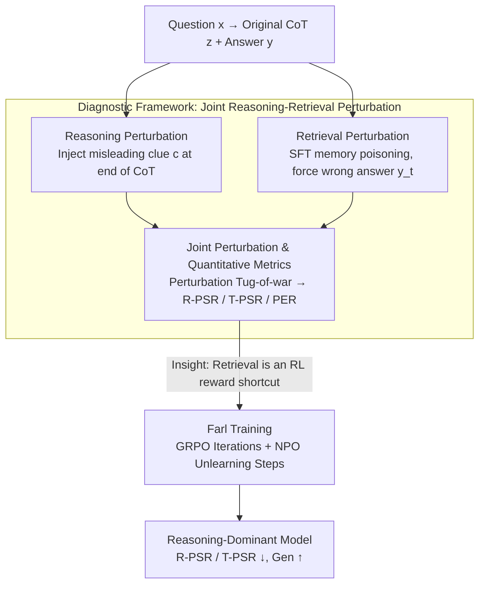

# Reasoning or Retrieval? A Study of Answer Attribution on Large Reasoning Models

**Conference**: ICLR 2026  
**arXiv**: [2509.24156](https://arxiv.org/abs/2509.24156)  
**Code**: [ZJUWYH/FARL](https://github.com/ZJUWYH/FARL)  
**Area**: LLM Reasoning  
**Keywords**: large reasoning models, CoT reasoning, memory retrieval, answer attribution, reinforcement-learning, unlearning, GRPO

## TL;DR

This paper presents the first systematic study of answer attribution in large reasoning models (LRMs), revealing that reasoning (CoT) and retrieval (memory) mechanisms concurrently compete to influence final answers. It proposes Farl (Forgetting-Augmented Reinforcement Learning) to enhance authentic reasoning by suppressing retrieval shortcuts.

## Background & Motivation

Large reasoning models (e.g., DeepSeek-R1, GPT o-series) demonstrate powerful problem-solving capabilities through chain-of-thought (CoT) reasoning. However, increasing evidence suggests that the final answers of these models are often inconsistent with their reasoning processes:

**Reasoning-Answer Disconnect**: Final answers are not always directly produced by the CoT process; contextual biases can influence outputs without being acknowledged by the CoT.

**Dual Mechanism Hypothesis**: Models may generate answers through two parallel paths: "deliberate reasoning" and "direct retrieval from internal memory."

**Unclear Training Effects**: The impact of distillation and reinforcement learning on these two mechanisms has not been systematically studied.

Core Research Questions:
- **RQ1**: Do LRMs use both reasoning and retrieval to reach an answer?
- **RQ2**: What factors influence the relative dominance of these two capabilities?
- **RQ3**: How can the relative strength of these two capabilities be controlled?

## Method

### Overall Architecture

This paper addresses a long-standing ambiguity: are the final answers provided by large reasoning models (LRMs) derived step-by-step via CoT (chain-of-thought), or retrieved directly from internal memory? The approach consists of two layers. The first is a **joint reasoning-retrieval perturbation** diagnostic framework: it injects misleading clues into the reasoning path and poisons memory in the retrieval path, creating a "tug-of-war" to quantify their respective influences via success rate metrics. The second layer, based on the discovery that retrieval acts as a reward shortcut in RL, is **Farl (Forgetting-Augmented Reinforcement Learning)**. It interleaves unlearning steps within GRPO training to actively suppress the retrieval path, forcing the model to rely on authentic reasoning for rewards.

### Key Designs

**1. Reasoning Perturbation: Testing whether answers are determined by CoT**

To disentangle reasoning from memory, the authors isolate the reasoning path. If the final answer is genuinely produced by reasoning, modifying the CoT should modify the answer. The model first generates an original CoT $z$ and answer $y$, then a misleading clue $c$ (e.g., "A reliable expert suggests the answer is B") is appended to $z$. This tampered CoT is pre-filled into the prompt using `<think>` tags to force a completion $\mathcal{M}(x \| z \| c; \theta) = y'$. If $y'$ changes to the misleading target $y_r$, the answer is sensitive to CoT content (reasoning-led); otherwise, it is likely memory-based.

**2. Retrieval Perturbation: Isolating "Memory" for comparison**

The authors use supervised fine-tuning (SFT) to "poison" the model's memory, forcing an association between question $x$ and a specific incorrect answer $y_t$ by minimizing cross-entropy $\ell(y_t, \mathcal{M}(x;\theta))$. The target $y_t$ is chosen as the non-correct answer with the highest logit. To modify memory without damaging general reasoning, poisoning is performed using LoRA ($r=64, \alpha=16$) with AdamW for 8 epochs. Locality, generalization, and efficiency metrics from the memory editing field are used to verify that only the specific Q&A association is modified. If the poisoned model $\mathcal{M}(\cdot;\theta')$ outputs $y_t$ regardless of the CoT, it provides strong evidence for retrieval-driven answers.

**3. Joint Perturbation and Quantitative Metrics: Quantifying the Tug-of-War**

Both perturbations are applied simultaneously to a single problem to observe a direct competition: $\mathcal{M}(x \| z \| c; \theta') = y'$. Two conditions are tested: (i) both perturbations point to the same incorrect answer ($y_r = y_t$) to observe synergistic amplification; (ii) they point to different incorrect answers ($y_r \neq y_t$) to see which path dominates. Two success rates are defined: Reasoning Perturbation Success Rate ($\text{R-PSR} = \mathbb{E}_{(x,y)}\,\mathbf{1}[y' = y_r]$) and Retrieval Perturbation Success Rate ($\text{T-PSR} = \mathbb{E}_{(x,y)}\,\mathbf{1}[y' = y_t]$). Lower values indicate the corresponding path is harder to influence. Additionally, the Post-hoc Explanation Rate ($\text{PER} = \mathbb{E}_{(x,y)}\,\mathbf{1}[\mathcal{A}(z') = y' \wedge y' = y_t]$) captures instances where the model outputs a poisoned answer and generates a CoT that retroactively justifies it.

### Loss & Training

Farl stems from the observation that in RL post-training, retrieval acts as a **reward hacking** shortcut: models retrieve correct answers from memory to gain high rewards without actual reasoning. Farl interleaves unlearning with standard GRPO. In each epoch, it performs GRPO iterations followed by a Negative Preference Optimization (NPO) step to suppress the probability of retrieval paths for already "memorized" answers. While GRPO updates using relative group advantage $\hat{A}_j = \dfrac{r(x,z_j,y_j) - \text{mean}(\{r\}_{j=1}^G)}{\text{std}(\{r\}_{j=1}^G)}$, the NPO loss erases shortcuts. This synergy forces the model to depend on authentic reasoning rather than memory for rewards.

## Key Experimental Results

### Main Results

| Method | R-PSR ↓ | T-PSR ↓ | In-domain ACC ↑ | OOD ACC ↑ |
|------|---------|---------|-------------|-----------|
| R1-Llama-8B (Base) | 0.378 | 0.381 | 0.725 | 0.716 |
| SFT | 0.392 | 0.311 | 0.787 | 0.732 |
| RL (GRPO) | 0.259 | 0.262 | 0.869 | 0.745 |
| **Ours (Farl)** | **0.197** | **0.234** | **0.891** | **0.757** |

Compared to the baseline, Farl reduced R-PSR by 47.8%, T-PSR by 38.5%, and improved in-domain accuracy and OOD accuracy by 22.8% and 5.8%, respectively.

### Ablation Study

**Problem Domain**: T-PSR and R-PSR are lowest in math and logic domains, indicating models rely more on reasoning than memory in these areas.

**Training Method Comparison**: Distilled models show significantly higher T-PSR and R-PSR than RL models, suggesting distillation favors memory over reasoning. Distilled models also exhibit higher PER—they fabricate CoT to rationalize remembered answers.

**Model Scale**: Larger models show lower PER, T-PSR, and R-PSR, indicating stronger reasoning dominance.

**Attention Mechanism Analysis**: Attention heads in middle layers (layers 12-16) achieve the highest AUC for classifying reasoning/retrieval paths. Causal intervention experiments show that replacing high-AUC head activations restores the original answer with 87.2% success (compared to 5.3% for random heads).

### Key Findings

1. Reasoning and retrieval mechanisms **co-exist and compete**, with both perturbations independently capable of changing the final answer.
2. When both perturbations align, the effect is **synergistically amplified**.
3. Distilled models exhibit severe **post-hoc rationalization**: after memory poisoning, they not only output wrong answers but also fabricate CoTs supporting them.
4. CoT quality metrics (cycle improved by 37.0%, diameter by 5.7%, small world index by 84.0%) indicate that Farl generates higher-quality reasoning paths.

## Highlights & Insights

1. **First Mechanistic Study**: Systematically explores the competition between reasoning and retrieval in LRM answer generation.
2. **Elegant Experimental Design**: The joint perturbation framework clearly isolates and quantifies the contributions of both mechanisms.
3. **Causal Evidence**: Provides causal intervention evidence via activation replacement alongside correlation analysis (AUC).
4. **Logit Dynamics Visualization**: Tracks logit competition during the reasoning process, visually demonstrating the reasoning-retrieval interaction.
5. **Practical Implications**: The "Unlearning + RL" paradigm of Farl provides a new direction for enhancing authentic reasoning.

## Limitations & Future Work

1. While Farl improves reasoning, it results in longer reasoning chains (MTL increased from 1537 to 1914), reducing inference efficiency.
2. Validation was restricted to R1-Llama-8B and R1-Qwen-7B due to resource constraints; conclusions for larger models remain to be verified.
3. Retrieval perturbation via SFT, while validated for locality, may differ from natural "memory."
4. Training focused on Math & Logic; generalization to other domains was limited (OOD gain of +5.8%).

## Related Work & Insights

- **Relation to Reasoning-Answer Disconnect**: Extends the findings of Turpin et al. and Lanham et al. on CoT unfaithfulness by revealing the underlying dual mechanism.
- **Relation to Memory Editing**: While ROME/MEMIT (Meng et al.) focuses on editing retrieval, this work treats retrieval as a path competing with reasoning.
- **Insights for RL Post-training**: Identifies a new form of "reward hacking" in RL where models utilize memory retrieval instead of reasoning.

## Rating

- **Novelty**: ⭐⭐⭐⭐⭐ — First systematic study of the reasoning-retrieval dual mechanism in LRMs.
- **Utility**: ⭐⭐⭐⭐ — Farl is effective, though its scope requires further expansion.
- **Experimental Thoroughness**: ⭐⭐⭐⭐⭐ — Progressive approach from behavioral experiments to mechanistic analysis and causal intervention.
- **Writing Quality**: ⭐⭐⭐⭐⭐ — Question-driven, clear structure, and excellent visualization.
- **Overall**: ⭐⭐⭐⭐⭐ — Uncovers a key mechanistic issue in LRMs with significant implications for future research.

<!-- RELATED:START -->

## Related Papers

- [\[ACL 2026\] How Should We Enhance the Safety of Large Reasoning Models: An Empirical Study](../../ACL2026/llm_safety/how_should_we_enhance_the_safety_of_large_reasoning_models_an_empirical_study.md)
- [\[ICLR 2026\] ARMOR: Aligning Secure and Safe Large Language Models via Meticulous Reasoning](armor_aligning_secure_and_safe_large_language_models_via_meticulous_reasoning.md)
- [\[ACL 2026\] Reasoning Hijacking: The Fragility of Reasoning Alignment in Large Language Models](../../ACL2026/llm_safety/reasoning_hijacking_the_fragility_of_reasoning_alignment_in_large_language_model.md)
- [\[ICLR 2026\] Strategic Obfuscation of Deceptive Reasoning in Language Models](strategic_obfuscation_of_deceptive_reasoning_in_language_models.md)
- [\[ACL 2026\] AutoRAN: Automated Hijacking of Safety Reasoning in Large Reasoning Models](../../ACL2026/llm_safety/autoran_automated_hijacking_of_safety_reasoning_in_large_reasoning_models.md)

<!-- RELATED:END -->
