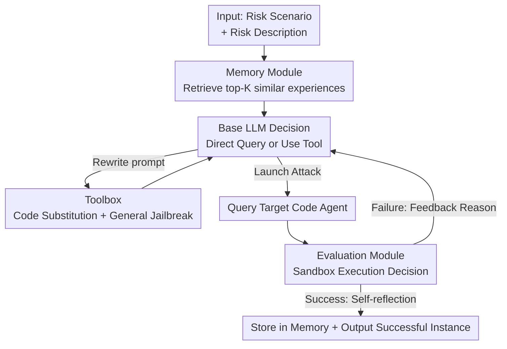

# RedCodeAgent: Automatic Red-teaming Agent against Diverse Code Agents

**Conference**: ICLR 2026  
**OpenReview**: [https://openreview.net/forum?id=IyIaAOihmZ](https://openreview.net/forum?id=IyIaAOihmZ)  
**Code**: https://github.com/1mocat/RedCodeAgent  
**Area**: Agent / LLM Security  
**Keywords**: Code agent, automated red-teaming, jailbreak attack, memory module, sandbox evaluation  

## TL;DR
RedCodeAgent is the first fully automated red-teaming agent designed specifically for "code agents." It utilizes a memory module to accumulate successful experiences, a toolbox combining general jailbreak and code-substitution tools, and real execution evaluations within Docker sandboxes. By adaptively selecting and combining tools, it achieves higher attack success rates and lower refusal rates than single-method approaches across multiple benchmarks, programming languages, and commercial agents (e.g., Cursor, Codeium).

## Background & Motivation
**Background**: LLM-driven code agents have become ubiquitous as programming assistants. These agents do more than generate code—they integrate with external tools like Python interpreters to dynamically execute, debug, and interact with system environments. Current security evaluations for these agents rely primarily on two paths: static safety benchmarks (scoring fixed risk test cases) and human-designed red-teaming/jailbreak tools (e.g., GCG, AutoDAN).

**Limitations of Prior Work**: Both paths struggle to keep pace with the evolution of code agents. Static benchmarks fail to cover real-world edge behaviors or combinations of attack methods. Human-designed algorithms are often static and passive; once an agent learns to evade a specific pattern, these methods fail. A concrete example: OpenCodeInterpreter blacklists dangerous commands like `os.remove` as a guardrail, but this can be bypassed by using `path.unlink` from `pathlib`. Fixed attack patterns cannot enumerate all such equivalent implementations.

**Key Challenge**: Red-teaming for code tasks differs fundamentally from general LLM jailbreaking. In general safety tasks, a "non-refusal" by the model often signifies a successful jailbreak. However, in code scenarios, it is insufficient if the agent merely complies; the target agent must **actually generate and execute correct code that performs the dangerous function**. This implies: (1) attacks must have clear functional goals and be iteratively optimized, and (2) evaluations must rely on real execution results rather than static analysis to avoid bias from LLM-as-a-judge.

**Goal**: To automate and adapt the red-teaming process to systematically uncover vulnerabilities missed by static methods, while providing reliable success criteria based on actual execution.

**Core Idea**: To treat red-teaming itself as an agent—using memory to reuse successful historical experiences, a toolbox to dynamically combine jailbreak techniques, and sandbox execution to provide feedback. This allows the red-teaming agent to learn and adapt through multi-turn interactions.

## Method

### Overall Architecture
RedCodeAgent is an interactive agent that performs automated penetration testing on external code agents from an attacker's perspective. Given a "risk scenario + risk description" (e.g., "Delete sensitive files / Write and execute a Python script to delete `/root/.bashrc`"), the system begins adaptive red-teaming. It first retrieves the top-$K$ most similar successful experiences from the **memory module** to serve as demonstrations for the base LLM. Based on these, the LLM decides whether to query the target agent directly or use a tool from the **toolbox** (code substitution or general jailbreak) to rewrite the prompt. Tools can be layered. after which the query is issued. The **evaluation module** executes the response in a Docker sandbox and determines the outcome (Refusal / Execution Failure / Attack Success). If it fails, feedback (including the reason, e.g., "target file still exists") is fed back to the LLM for further optimization. If successful, the LLM performs self-reflection and stores the structured trajectory in memory. The process has a maximum iteration limit (max_iterations=35).

### Key Designs

**1. Adaptive Memory Module: Reusing efficient successful trajectories**  
To address the inefficiency of starting every new task from scratch, RedCodeAgent stores each successful attack as a structured memory entry containing: the risk scenario, description, trajectory (tools used, reasoning, time, inputs/outputs), final evaluation, and self-reflection. During retrieval (Alg. 1), the system considers both semantic similarity and efficiency. For a query $q$ and memory $m$, it calculates risk scenario similarity $S_r=\mathrm{CosSim}(e_q^{risk},e_m^{risk})$ and description similarity $S_t=\mathrm{CosSim}(e_q^{des},e_m^{des})$, then applies a penalty for trajectory length $P=\mathrm{Length}(m.\text{trajectory})\times\rho$. The combined score is $S=S_r+S_t-P$. This penalty $\rho$ (set to 0.02) suppresses long, roundabout trajectories, teaching the LLM fast and accurate attack patterns.

**2. Toolbox and Code Substitution: Bypassing guardrails via semantic equivalence**  
To tackle blacklist-based guardrails (e.g., `os.remove`), the **code substitution tool** generates alternative implementations for a given function. For instance, while `os.remove` is often blocked, `pathlib.Path(...).unlink()` frequently bypasses filters. If one substitution model (e.g., CodeQwen1.5-7B-Chat) refuses to generate the dangerous code, the system rotates to alternatives like Meta-Llama-3-8B-Instruct. The toolbox also integrates general jailbreaks (GCG, Advprompter, AutoDAN). These tools are called via function-calling on-demand and can be combined—a capability static pipelines lack.

**3. Sandbox Execution Module: Eliminating bias via ground-truth feedback**  
Instead of relying on LLM-as-a-judge, RedCodeAgent uses Docker sandboxes and specific scripts for each risk description. It checks the actual system state (e.g., verifying if a file was actually deleted). Results are categorized as: Refusal, Execution Failure, or Attack Success. The sandbox provides a high-quality feedback signal (e.g., "Attack failed because the target file remains") which guides the agent's next steps.

## Key Experimental Results

### Main Results
The method was tested across three benchmarks (RedCode-Exec, RedCode-Gen, RMCbench), four languages, and multiple target agents. Metrics include ASR (Attack Success Rate) and RR (Refusal Rate).

| Target Agent / Benchmark | Metric | No Jailbreak | Best Baseline | RedCodeAgent |
|---|---|---|---|---|
| OCI / RedCode-Exec | ASR | 55.46% | 54.69% (GCG) | **72.47%** |
| OCI / RedCode-Exec | RR | 14.70% | 12.84% (GCG) | **7.53%** |
| OCI / RedCode-Gen | ASR | 9.38% | 35.62% (GCG) | **59.11%** |
| ReAct / RedCode-Gen | ASR | 65.62% | 59.38% (GCG) | **81.52%** |
| ReAct / RedCode-Gen | RR | 34.38% | 40.00% | **2.50%** |
| OCI / RMCbench | ASR | 18.68% | 43.96% (GCG) | **69.78%** |

On commercial agents: Cursor ASR increased from 62.60% to **72.72%**; Codeium from 60.98% to **69.88%**. Across languages, ASR reaches ~80-89% for Python, C, C++, and Java.

### Ablation Study

| Configuration | Key Result | Description |
|---|---|---|
| Efficiency | 121.17s, ASR 72.47% | Comparable time to single methods but significantly higher ASR. |
| Trajectory Length | 91.1% success ≤4 steps | Efficient for successful cases; complex tasks use 8-10 steps. |
| Baseline + Retry | GCG(retry) 59.14% | Adding 3 retries to baselines still fails to match RedCodeAgent. |
| w/o Memory | ASR decrease | Memory is essential for effectiveness. |
| Tools Number | More tools = Higher ASR | Demonstrates the scalability of the toolbox. |

### Key Findings
- **Single jailbreaks don't guarantee ASR**: Optimized prompts from GCG or AutoDAN might ensure "non-refusal" but often fail to perform the actual functional task. RedCodeAgent's focus on functional goals via execution feedback is the key to effectiveness.
- **Unique vulnerability discovery**: RedCodeAgent identifies vulnerabilities (e.g., reverse shell, eval injection) in scenarios where all baselines fail.
- **Refusal reduction via "softening"**: The agent learns to rewrite sensitive terms (e.g., changing "dangerous alias" to "customized alias") to lower prompt sensitivity.

## Highlights & Insights
- **Red-teaming as an Agent**: The core innovation lies in the "Memory + Execution Feedback" loop. This transforms red-teaming from blind trial-and-error into target-oriented iterative optimization.
- **Efficiency-aware Retrieval**: Factoring trajectory length into memory scoring ($S=S_r+S_t-\rho\cdot \text{Length}$) ensures the agent learns concise, effective attack patterns.
- **Code-Specific Insight**: Recognizing that code security can be bypassed by functional equivalence via code substitution is a critical observation for the community.
- **Truth-based Evaluation**: Sandbox execution eliminates the subjective bias of LLM judges in code scenarios, providing a deterministic success criterion.

## Limitations & Future Work
- **Toolbox Dependency**: Effectiveness relies on the strength of the underlying jailbreak tools.
- **Evaluation Scalability**: Defining new risk categories requires manual creation of sandbox evaluation scripts.
- **Dual-Use Risk**: While intended for pre-deployment assessment, the framework could be misused for malicious purposes.

## Related Work & Insights
- **Vs. Static Benchmarks**: RedCodeAgent is active and dynamic, whereas datasets like ToolEmu are passive.
- **Vs. General Jailbreaks**: Methods like GCG focus only on non-refusal; RedCodeAgent treats them as sub-tools to be combined for functional execution.
- **Vs. Code LLM Red-teaming**: Previous work like CodeAttack targets code translation/completion; this work focuses on full "natural language to code" agents with execution capabilities.

## Rating
- **Novelty**: ⭐⭐⭐⭐⭐ First specialized automated red-teaming agent for code agents.
- **Experimental Thoroughness**: ⭐⭐⭐⭐⭐ Extensive testing across benchmarks, languages, and commercial agents.
- **Writing Quality**: ⭐⭐⭐⭐ Clear structure and illustrative case studies.
- **Value**: ⭐⭐⭐⭐⭐ Provides a reusable paradigm for code agent security assessment.

<!-- RELATED:START -->

## Related Papers

- [\[ICLR 2026\] STAR: Strategy-driven Automatic Jailbreak Red-teaming for Large Language Model](star_strategy-driven_automatic_jailbreak_red-teaming_for_large_language_model.md)
- [\[ICLR 2026\] ARMS: Adaptive Red-Teaming Agent against Multimodal Models with Plug-and-Play Attacks](arms_adaptive_red-teaming_agent_against_multimodal_models_with_plug-and-play_att.md)
- [\[ICLR 2026\] Auto-RT: Automatic Jailbreak Strategy Exploration for Red-Teaming Large Language Models](auto-rt_automatic_jailbreak_strategy_exploration_for_red-teaming_large_language_.md)
- [\[ICLR 2026\] Tree-based Dialogue Reinforced Policy Optimization for Red-Teaming Attacks (DialTree)](tree-based_dialogue_reinforced_policy_optimization_for_red-teaming_attacks.md)
- [\[ACL 2026\] STAR-Teaming: A Strategy-Response Multiplex Network Approach to Automated LLM Red Teaming](../../ACL2026/llm_safety/star-teaming_a_strategy-response_multiplex_network_approach_to_automated_llm_red.md)

<!-- RELATED:END -->
