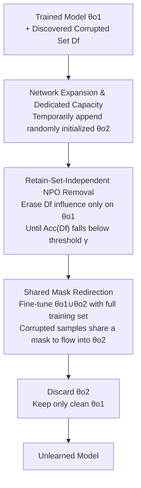

# Redirection for Erasing Memory (REM): Towards a Universal Unlearning Method for Corrupted Data

**Conference**: ICLR 2026  
**arXiv**: [2505.17730](https://arxiv.org/abs/2505.17730)  
**Code**: [GitHub](https://github.com/google-deepmind/rem)  
**Area**: LLM Security  
**Keywords**: Machine Unlearning, Data Healing, Poisoning Defense, Classifier Robustness, Memorization

## TL;DR

This paper proposes a two-dimensional taxonomy (Discovery Rate × Statistical Regularity) for corrupted data unlearning tasks, revealing the limitations of existing unlearning methods that are only effective in specific regions. It introduces the REM (Redirection for Erasing Memory) method, which redirects corrupted data into a newly added dedicated network capacity and subsequently discards it, achieving robust and consistent unlearning performance across the entire 2D task space for the first time.

## Background & Motivation

Machine unlearning aims to remove the influence of a specific subset of training data from a pre-trained model. In practical scenarios, training data may be corrupted due to labeling errors, low quality, or malicious attacks. Once corruption is discovered, efficient post-processing is required to restore correct predictions.

Existing works face two fundamental issues:

**Vulnerability to Discovery Rate**: Most methods assume all corrupted data has been identified (Full Discovery). However, in practice, usually only a subset of corruption is found. When fine-tuning or retraining using a retain set, undiscovered corrupted data is re-introduced into the model.

**Oversight of Regularity**: The statistical regularity of corrupted data—ranging from random mislabeling (low regularity) to shared poisoning triggers (high regularity)—fundamentally affects the behavior of unlearning algorithms. High-regularity corruption possesses generalizable shared patterns; even if only a few undiscovered corrupted samples remain in the retain set, the model can re-learn the entire corruption pattern through generalization.

**Key Insight**: In the 2D task space defined by discovery rate and regularity, **every existing SOTA method is effective only in specific regions and fails catastrophically in others** (see Fig. 1). This unpredictable failure pattern makes using existing methods risky in practice.

## Method

### Overall Architecture

The goal of REM is to cleanly erase the impact of corrupted samples (mislabeled, low quality, or malicious) mixed in the training data without damaging normal predictions. The **Mechanism** is summarized as "temporarily using a 'pocket' to store dirt, then discarding the pocket." The process involves four steps (see Fig. 2 and Algorithm 1): first, the network is expanded with a randomly initialized dedicated capacity $\theta_{o_2}$, appended to the original parameters $\theta_{o_1}$; second, a retain-set-independent NPO algorithm is used to erase the influence of discovered corrupted data from $\theta_{o_1}$; third, the combined network is fine-tuned on the entire training set to restore utility, while a "shared mask" redirects any re-emerging corruption information into $\theta_{o_2}$; finally, $\theta_{o_2}$ is discarded, leaving only the clean $\theta_{o_1}$. The **Core Idea** is that corrupted information is concentrated into a disposable container rather than attempting to precisely excise it from the entangled original network.

### Key Designs

**1. Network Expansion & Dedicated Capacity: Preparing a disposable container for corrupted data**

Once corrupted information is entangled with normal knowledge in the original network, clean excision becomes difficult—the fundamental challenge of "surgical" unlearning. REM's **Design Motivation** is to add extra channels to each convolutional layer to create new parameters $\theta_{o_2}$. This creates a "corrupted data channel" where "dirt" can go. This approach draws from ETD (Example-Tied Dropout), but while ETD separates generalization/memorization **during training**, REM temporarily separates "corruption-free parameters" from "corruption-absorbing parameters" during **post-processing**. If a model was already trained with ETD, REM can skip expansion and use the existing memorization partition. Having independent channels avoids the difficulty of precise excision by simply discarding the entire partition.

**2. Retain-Set-Independent NPO Removal: Avoiding re-feeding undiscovered corruption**

In practice, often only a portion of corruption is discovered. Undiscovered corruption in the retain set would be re-introduced during fine-tuning—the root cause of failure for existing methods in partial discovery scenarios. Therefore, Step 2 explicitly **avoids the retain set** and uses Negative Preference Optimization (NPO) to remove the influence of $\mathcal{D}_f$ on $\theta_{o_1}$. Following the observation that unlearning happens abruptly, the process stops when $\text{Acc}(\mathcal{D}_f) < \gamma$. NPO is chosen over Potion or Gradient Ascent because it is more stable for subsequent knowledge healing. The trade-off is a temporary utility drop, which is addressed in Step 3.

**3. Shared Mask Redirection: Routing corruption via the path of least resistance**

This is the central **Novelty** of REM. Step 3 fine-tunes the combined network $\theta_{o_1} \cup \theta_{o_2}$ using the full training set $\mathcal{D}_{tr}$ to restore utility. To prevent undiscovered corruption from re-encoding into $\theta_{o_1}$, REM assigns a random mask to each sample in $\theta_{o_2}$ but forces **all discovered corrupted samples to share a single mask**, pointing to the same path in $\theta_{o_2}$. Since $\theta_{o_1}$ was cleared of corruption and is still under NPO suppression, the shared path in $\theta_{o_2}$ becomes the "path of least resistance" for corrupted patterns. Finally, $\theta_{o_2}$ is discarded, removing the patterns entirely (Fig. 5 confirms: accuracy on corrupted data in the base model drops from 99.0% to ~10%, while the additional capacity's accuracy rises correspondingly).

### Loss & Training

The joint loss in Step 3 is adapted from DPO, consisting of "redirection" and "removal" terms:

$$\mathcal{L}_{step3} = \underbrace{\frac{2}{\beta}\mathbb{E}\log\sigma\left(-\beta\log\frac{\mathcal{L}_{CE_{\theta_{o_1} \cup \theta_{o_2}}}(\mathcal{D}_{tr})}{\mathcal{L}_{CE_{ref}}(\mathcal{D}_{tr})}\right)}_{\mathcal{L}_{redirect}} - \underbrace{\frac{2}{\beta}\mathbb{E}\log\sigma\left(-\beta\log\frac{\mathcal{L}_{CE_{\theta_{o_1}}}(\mathcal{D}_f)}{\mathcal{L}_{CE_{ref}}(\mathcal{D}_f)}\right)}_{\mathcal{L}_{remove}}$$

The **Function** of these terms differs: $\mathcal{L}_{redirect}$ trains the full model to restore utility and route corruption to $\theta_{o_2}$, while $\mathcal{L}_{remove}$ continues to suppress $\mathcal{D}_f$ specifically on $\theta_{o_1}$ to prevent backflow.

## Key Experimental Results

### Main Results (CIFAR10, ResNet-9, 1000 corrupted samples, 3 Regularities × 10 Discovery Rates)

| Method | Healed (%) | Utility (%) | Utility×Healed | Notes |
|------|-----------|------------|---------------|------|
| **REM** | 81.16 ± 1.62 | **90.54 ± 0.15** | **73.40 ± 1.43** | Best overall |
| REM (ETD) | **83.26 ± 0.92** | 88.05 ± 0.18 | 73.19 ± 0.72 | Higher healing, slightly lower utility |
| NPO (ETD) | 77.50 ± 1.53 | 86.99 ± 0.24 | 67.10 ± 1.17 | NPO on ETD base |
| SCRUB (ETD) | 66.95 ± 2.82 | 89.45 ± 0.14 | 59.85 ± 2.50 | Fails on partial discovery |
| BadT (ETD) | 66.24 ± 1.89 | 88.13 ± 0.16 | 58.32 ± 1.63 | Fails on partial discovery |
| Potion | 49.39 ± 3.61 | 53.06 ± 3.30 | 36.16 ± 3.62 | Fails catastrophically on low regularity |
| Retrained | 53.61 ± 2.73 | 90.46 ± 0.14 | 48.52 ± 2.47 | Retraining is not a silver bullet |

### Ablation Study

| Config (Step 3.1 / 3.2 / ETD) | Utility×Healed | Notes |
|-----------------------------|---------------|------|
| ✓ / ✓ / ✗ (Full REM) | 73.40 | Optimal standard REM |
| ✓ / ✓ / ✓ (REM on ETD) | 73.19 | ETD-trained, nearly equivalent |
| ✓ / ✗ / ✗ (No continuous NPO) | 71.38 | Step 3.2 helps at high discovery rates |
| ✗ / ✗ / ✗ (= Pure NPO) | 56.40 | No redirection, degrades to NPO |
| ✗ / ✗ / ✓ (ETD + NPO) | 67.10 | No redirection but has ETD |

### Key Findings

- **REM is the only method that performs strongly across the entire 2D space**, avoiding catastrophic failure in any region.
- ETD (previously an overlooked baseline) is actually a very strong baseline, outperforming most specialized unlearning methods.
- Retraining from scratch is **not** the gold standard in partial discovery scenarios—undiscovered corrupted data is simply re-introduced.
- Gradient Ascent, as a simple baseline, surprisingly outperforms many complex methods in aggregate metrics.
- Fig. 5 clearly demonstrates the redirection mechanism: accuracy on corrupted data in the base model drops from 99.0% to ~10% (random), while additional capacity accuracy rises, proving corruption is indeed redirected.
- REM's performance on ViT + Adam + SVHN is consistent with ResNet-9 + SGD + CIFAR10, demonstrating generalization across architectures/optimizers/datasets.

## Highlights & Insights

- **2D Taxonomy**: The Discovery Rate × Regularity framework is a significant conceptual contribution, providing a systematic tool to understand unlearning behaviors.
- **"Locally Effective" Discovery**: Revealing the fundamental blind spots of existing methods serves as a critical practical warning.
- **Redirection Mechanism**: Instead of merely deleting or masking information, "transferring then discarding" elegantly solves the residue problem.
- **High Regularity Amplification**: High regularity allows a few undiscovered samples to re-introduce the entire corruption pattern through generalization—explaining why retain-set-based methods fail sharply in these scenarios.

## Limitations & Future Work

- The current masking strategy is binary (0/1); softer masks might allow corrupted data to self-organize better in $\theta_{o_2}$, closing the gap with REM (IDEAL).
- Currently verified only on vision classification; extensions to NLP/LLM scenarios remain unexplored.
- Requires additional network capacity ($\theta_{o_2}$), which might be restricted in deployed lightweight models.
- Requires access to the full training set $\mathcal{D}_{tr}$, which is restricted in data-unavailable scenarios.
- The model architecture is reduced after unlearning (discarding $\theta_{o_2}$), which requires consideration in certain deployment pipelines.

## Related Work & Insights

- **ETD (Maini et al., 2023)**: The inspiration for REM—separating generalization/memorization neurons during training. REM translates this into separating clean/corrupted partitions during post-processing.
- **Potion (Schoepf et al., 2024b)**: Prev. SOTA for poisoning unlearning, assumes corruption is stored in concentrated parameters—effective for high regularity but fails for low regularity.
- **NPO (Zhang et al., 2024a)**: An NLP unlearning method using a reference model to stabilize gradient ascent. REM adapts this for classification as its removal step.
- **DPO**: REM's loss function is inspired by DPO, but with the key difference that two loss terms act on different network parameters.
- Insight: The finding that "high regularity concepts are hard to mitigate at training time" may have similar implications for concept unlearning in LLMs.

## Rating

- Novelty: ⭐⭐⭐⭐⭐ The 2D taxonomy and redirection mechanism are original contributions that identify fundamental blind spots.
- Experimental Thoroughness: ⭐⭐⭐⭐⭐ 3 Regularities × 10 Discovery Rates × multiple models/datasets with full ablations.
- Writing Quality: ⭐⭐⭐⭐⭐ Extremely clear storytelling; Fig. 1 intuitively presents findings, and Fig. 5 compellingly validates the mechanism.
- Value: ⭐⭐⭐⭐⭐ First universal method for corrupted data unlearning; the framework provides a guiding structure for future research from Google DeepMind.

<!-- RELATED:START -->

## Related Papers

- [\[ICLR 2026\] WaterDrum: Watermark-based Data-centric Unlearning Metric](waterdrum_watermark-based_data-centric_unlearning_metric.md)
- [\[ICLR 2026\] Revisiting the Past: Data Unlearning with Model State History](revisiting_the_past_data_unlearning_with_model_state_history.md)
- [\[ICLR 2026\] Randomized Antipodal Search Done Right for Data Pareto Improvement of LLM Unlearning](randomized_antipodal_search_done_right_for_data_pareto_improvement_of_llm_unlear.md)
- [\[ACL 2026\] From Domains to Instances: Dual-Granularity Data Synthesis for LLM Unlearning](../../ACL2026/llm_safety/from_domains_to_instances_dual-granularity_data_synthesis_for_llm_unlearning.md)
- [\[ICLR 2026\] Erase or Hide? Suppressing Spurious Unlearning Neurons for Robust Unlearning](erase_or_hide_suppressing_spurious_unlearning_neurons_for_robust_unlearning.md)

<!-- RELATED:END -->
