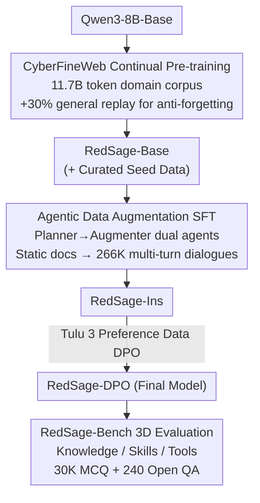

# RedSage: A Cybersecurity Generalist LLM

**Conference**: ICLR 2026  
**arXiv**: [2601.22159](https://arxiv.org/abs/2601.22159)  
**Code**: [GitHub](https://github.com/AraLabs-AI/RedSage) (Open-source data + model + code)  
**Area**: AI Security / Cybersecurity  
**Keywords**: Cybersecurity LLM, Continual Pre-training, Agentic data augmentation, Security evaluation benchmark

## TL;DR

RedSage is proposed—the first full-stack open-source cybersecurity generalist LLM. Through 11.7B token large-scale domain continual pre-training, 266K samples of Agentic data-augmented SFT, and the first comprehensive benchmark RedSage-Bench covering knowledge, skills, and tools, the 8B parameter model outperforms same-scale SOTA (+5.4pp) on cybersecurity benchmarks and approaches Qwen3-32B, while general capabilities improve rather than decline (+8.4pp vs Qwen3-8B).

## Background & Motivation

**Background**: Cybersecurity threats are increasingly complex, as tasks like APT attacks, vulnerability management, and incident response require high levels of professional knowledge and tool manipulation skills. The global cybersecurity talent gap has reached millions (ISC² report), driving the demand for LLM-assisted security analysis. Recently, several cybersecurity LLMs (Foundation-Sec, PRIMUS, DeepHat, etc.) have emerged, but all present significant shortcomings.

**Limitations of Prior Work**: Existing cybersecurity LLMs have shortfalls in three dimensions. (1) Incomplete training pipelines: PRIMUS (Trend Micro) has 2.57B tokens of pre-training but only 835 SFT samples; Foundation-Sec-8B (Cisco) has pre-training but closed-source data; DeepHat only performs SFT without pre-training. (2) Limited SFT data quality: most use static Q&A pairs or small-scale manual annotations, failing to simulate the multi-turn interaction patterns of real security workflows. (3) Incomplete evaluation benchmarks: SecEval/CyberMetric only evaluate knowledge via MCQs, while CyberSecEval only evaluates skills; no benchmark covers both tool-use capabilities and open-ended QA quality.

**Key Challenge**: Building a practical cybersecurity LLM requires simultaneously addressing data scale, training pipeline completeness, and evaluation comprehensiveness. However, existing work covers at most one or two of these. More critically, most works do not open-source data and code (Foundation-Sec has closed data, SecGemini has closed models), restricting reproducibility and community development.

**Goal**: Build a full-stack open-source cybersecurity LLM system covering the complete pipeline from data filtering, continual pre-training, agentic augmented SFT, and preference alignment to comprehensive evaluation, and release all of it.

**Key Insight**: A "data-centric" philosophy is applied throughout the process—using a classifier to filter domain corpora from FineWeb for large-scale pre-training, curating high-quality seed data across knowledge/skills/tools dimensions, using an Agentic pipeline to automatically convert static documents into multi-turn dialogues, and constructing a hierarchically verified evaluation benchmark.

**Core Idea**: A three-pronged approach—large-scale domain pre-training + agentic augmented SFT + a three-dimensional evaluation benchmark—to build the first full-stack open-source cybersecurity generalist LLM.

## Method

### Overall Architecture

RedSage is built on Qwen3-8B-Base, with training divided into three stages. **Stage 1 (Continual Pre-training, CPT)**: Continual pre-training on CyberFineWeb (11.7B tokens of filtered cybersecurity corpora + 30% general replay) yields RedSage-CFW, which is further trained with high-quality curated data RedSage-Seed (28,637 samples, 150M tokens) and non-classified dumps (459K documents, 700M tokens) to obtain RedSage-Base. **Stage 2 (Supervised Fine-Tuning, SFT)**: SFT using 266K multi-turn dialogues generated from seed data via Agentic Augmentation (RedSage-Conv, 353M tokens) combined with general instruction data from SmolLM3 yields RedSage-Ins. **Stage 3 (Preference Alignment, DPO)**: DPO alignment using Tulu 3 8B open-source preference data yields the final RedSage-DPO. Simultaneously, the RedSage-Bench benchmark (30K MCQ + 240 Open QA) is constructed to evaluate capabilities across knowledge, skills, and tools. The three core contributions reside in different parts of this pipeline: the source of pre-training data (CyberFineWeb), the generation of SFT dialogue data (Agentic Augmentation), and the evaluation methodology (RedSage-Bench); the DPO stage reuses open-source preference data and is not the primary innovation.

### Key Designs

**1. CyberFineWeb Domain Corpus Construction and Anti-forgetting: Using a lightweight classifier to extract cybersecurity text from web-scale data while preserving general capabilities**

Pre-training requires massive domain-specific text, but security-related content is scarce in general corpora like Common Crawl. The authors fine-tuned a ModernBERT-base binary classifier to filter FineWeb (Common Crawl 2013–2024, ~15T tokens), identifying a candidate pool of ~125M documents (89.8B tokens). Global deduplication via MinHash-LSH reduced this to ~52M documents (46.8B tokens). Training on the full 89.8B tokens is too costly, so the corpus was split into 20 chronological chunks for sequential training, with early stopping after the 5th chunk—prioritizing high-value data under limited compute, resulting in 11.7B tokens used. Crucially, **30% FineWeb-Edu general educational text was mixed in as replay** to counteract catastrophic forgetting. Pure domain training often degrades general capabilities; replay allows the model to learn security while reviewing general knowledge. This ratio proved effective: the final RedSage-DPO outperformed Qwen3-32B on the Open LLM Leaderboard (74.33% vs 73.17%), with general capabilities actually improving.

**2. Agentic Data Augmentation Pipeline: Using dual agents to automatically rewrite static security documents into multi-turn dialogues, eliminating high manual SFT costs**

Manual construction of cybersecurity SFT data is expensive and rarely covers all dimensions, while existing static Q&A pairs lack the multi-turn interaction of real-world security analyst work. A two-stage agentic framework was used to automate dialogue generation. The **Planner Agent** first analyzes each seed data chunk to dynamically derive a candidate skill set (e.g., vulnerability analysis, CLI command generation, penetration testing workflows) and corresponding augmentation strategies (how to convert content to dialogue, detail level required). It uses no fixed templates, deciding strategies on-the-fly to ensure diversity—a key difference from systems like AgentInstruct. The **Augmenter Agent** then instantiates each plan into role-based multi-turn dialogues (expert-assistant format) simulating security workflows. Outputs undergo triple filtering for format validity, consistency, and topic relevance. Seed data was curated across three categories: Knowledge (MITRE ATT&CK / CWE / OWASP frameworks, 6,924+3,715 samples), Skills (HackTricks / Pentest writeups, 4,032 samples), and Tools (CLI cheatsheets / Kali docs, 12,943+1,023 samples). The pipeline scaled 28,637 seeds into 266K dialogues (9.2× samples, 2.3× tokens), comprising 67K knowledge, 39K skills, and 120K tool-related entries.

**3. RedSage-Bench Three-Dimensional Evaluation: The first cybersecurity benchmark evaluating knowledge, skills, and tools while measuring both accuracy and response quality**

Existing benchmarks are fragmented—SecEval only tests knowledge, CyberSecEval only tests skills, and none test tool usage; MCQs only measure correctness, not the utility or depth of a response. RedSage-Bench fills these gaps with two item types. **MCQs** were generated by 70B instruction models (Llama-3.3-70B / Qwen2.5-72B) from seed data, passing two-stage validation: Stage 1 structure checks (format/correctness/distractor quality, pass/fail) and Stage 2 quality scoring (threshold >8/10), followed by quota sampling for balance, resulting in 30K MCQs. **Open QA** entries were generated via Evaluation-Planner and Q&A Generator stages, using LLM-as-Judge to score two metrics: Factual Correctness (T/F) and Response Quality (0–10 scale, covering helpfulness, relevance, and depth). 240 human-verified entries were retained; the quality score allows the benchmark to distinguish "correct" answers from "high-quality" ones. To prevent training leak, decontamination was performed: questions with semantic similarity >0.9 to training samples were removed (2.96% of items).

### Loss & Training

Based on Qwen3-8B-Base for continual pre-training using 32×A100-64GB GPUs, DeepSpeed ZeRO Stage 3 distributed training, and the AdamW optimizer. A fixed learning rate of $2.5 \times 10^{-6}$ with linear warmup was used for a single-epoch (global batch size 1024). SFT lasted 2 epochs with a cosine learning rate scheduler. DPO utilized the Tulu 3 8B Preference Mixture dataset and its original hyperparameters. The entire pipeline used the Axolotl framework.

## Key Experimental Results

### Main Results

RedSage-Bench MCQ Evaluation (0-shot, Accuracy %):

| Model | Macro Avg | General Know. | Frameworks | Off/Def Skills | CLI Tools | Kali Tools |
|------|--------|---------|------|---------|--------|---------|
| Lily-Cybersecurity-7B | 71.19 | 68.78 | 67.44 | 76.61 | 71.44 | 66.26 |
| Foundation-Sec-8B-Ins | 76.12 | 74.50 | 77.10 | 80.91 | 74.98 | 68.30 |
| DeepHat-V1-7B | 80.18 | 77.26 | 76.90 | 85.07 | 81.94 | 74.82 |
| Qwen3-8B | 81.85 | 80.46 | 78.82 | 86.16 | 83.92 | 75.56 |
| **RedSage-8B-Ins** | **85.73** | **84.20** | **84.98** | **89.06** | **86.80** | **80.30** |
| RedSage-8B-DPO | 84.83 | 82.48 | 83.80 | 88.54 | 86.30 | 79.30 |
| Qwen3-32B | 85.40 | 84.08 | 82.32 | 89.00 | 87.60 | 80.40 |

External Cybersecurity Benchmarks (Accuracy %):

| Model | Mean | CTI-MCQ | CTI-RCM | CyMtc-500 | MMLU-CSec | SecBench-En |
|------|------|---------|---------|-----------|-----------|-------------|
| Qwen3-8B-Base | 80.81 | 68.80 | 63.50 | 92.00 | 83.00 | 82.84 |
| Foundation-Sec-8B | 76.90 | 62.40 | 75.40 | 86.60 | 80.00 | 69.86 |
| **RedSage-8B-Base** | **84.56** | **71.04** | **78.40** | **92.60** | **87.00** | **81.76** |
| Qwen3-8B (instruct) | 75.71 | 62.76 | 54.00 | 88.60 | 76.00 | 73.26 |
| **RedSage-8B-DPO** | **81.10** | **70.84** | **70.60** | **90.00** | **79.00** | **80.06** |

### Ablation Study

Contribution of training phases (base models, RedSage-Bench Macro Avg %):

| Training Config | Bench Macro Avg | External Mean | Key Changes |
|---------|------------|------------|---------|
| Qwen3-8B-Base (Baseline) | 84.24 | 80.81 | — |
| + CyberFineWeb (CFW) | 84.86 (+0.62) | 82.66 (+1.85) | Frameworks+3.00, SecBench+0.78 |
| + Seed only | 85.21 (+0.97) | 84.45 (+3.64) | CTI-RCM+15.1, Kali+1.04 |
| + CFW + Seed (**Ours-Base**) | 85.05 (+0.81) | 84.56 (+3.75) | Optimal overall integration |
| + SFT (Ins) | 85.73 (+1.49) | 81.30 | Best instruct model |
| + DPO | 84.83 (+0.59) | 81.10 | Best open QA quality |

General Capability Maintenance (Open LLM Leaderboard mean for instruct models %):

| Model | Mean | MMLU | ARC-C | GSM8K | IFEval |
|------|------|------|-------|-------|--------|
| Qwen3-8B | 65.92 | 73.59 | 62.54 | 75.66 | 85.21 |
| Foundation-Sec-8B-Ins | 69.28 | 64.11 | 63.91 | 77.79 | 76.17 |
| **RedSage-8B-DPO** | **74.33** | **77.07** | **71.76** | **82.71** | **83.44** |
| Qwen3-32B | 73.17 | 82.11 | 69.28 | 87.49 | 88.26 |

### Key Findings

- RedSage-8B-Ins (85.73) outperforms Qwen3-32B (85.40) on the in-house benchmark, proving that domain-specific training can bridge parameter gaps.
- In Open QA, RedSage-DPO achieves +7% higher absolute accuracy and +0.07 higher quality score than the runner-up Qwen3-8B, showing DPO's significance for response quality.
- CyberFineWeb and Seed provide complementary gains: CFW contributes most to SecBench/CyMtc, while Seed drives the biggest Gain in CTI-RCM (+15.1pp) which requires deep knowledge.
- General capabilities improved rather than declined: RedSage-DPO (74.33%) surpassed Qwen3-32B (73.17%) on the Open LLM Leaderboard, validating the 30% replay strategy.
- Tool usage remains the weakest dimension for LLMs: tool-related questions had the lowest median scores and the longest distribution tails in Open QA.

## Highlights & Insights

- Full-stack open-source is the core differentiator: data (11.7B PT + 266K SFT), models, code, and benchmarks are all public, unlike Foundation-Sec (closed data) or SecGemini (closed model), significantly driving community progress.
- The Planner→Augmenter two-stage framework for Agentic Augmentation is methodologically generalizable and can be migrated to other specialized LLM domains like medical or legal.
- RedSage-Bench's design (MCQ + Open QA + LLM-judge quality scoring) achieves the first three-dimensional evaluation (knowledge/skills/tools) in cybersecurity.
- QLoRA fine-tuning on subset data also showed improvements on Qwen3-32B, proving the data pipeline's efficacy for larger models.

## Limitations & Future Work

- The 8B parameter size limits complex reasoning, maintaining a ~5pp gap with GPT-5 (86.29 vs 81.10 mean).
- Tool evaluation is limited to CLI commands and document understanding, excluding scenarios requiring environmental interaction like CTF.
- Synthetic training data may propagate biases or inaccuracies, despite filtering and verification.
- Rapid updates in cybersecurity knowledge make maintaining model timeliness a persistent challenge.
- Open-sourcing defensive and offensive knowledge carries dual-use risks, requiring responsible deployment.

## Related Work & Insights

- Comparison with Foundation-Sec-8B (Cisco): RedSage leads in data scale (11.7B+266K vs 5.1B+28K), methodology (agentic augmentation), and openness.
- Agentic augmentation inherits from AgentInstruct but innovates by using a Planner to dynamically generate skill sets rather than fixed templates.
- The 30% general replay is a classic continual learning strategy, but RedSage innovates by embedding it directly into static corpora rather than dynamic scheduling.

## Rating

- Novelty: ⭐⭐⭐⭐ Systematic engineering contribution exceeds single-point algorithm innovation; Agentic augmentation and 3D benchmark are novel.
- Experimental Thoroughness: ⭐⭐⭐⭐⭐ Three types of benchmarks (In-house + external security + general), multi-stage ablation, open QA quality assessment, and large model scaling verification.
- Writing Quality: ⭐⭐⭐⭐ Clear structure, rich tables/figures, and complete pipeline description.
- Value: ⭐⭐⭐⭐⭐ Full-stack open-sourcing is highly impactful for the cybersecurity AI community; data pipeline methodology is transferable.

<!-- RELATED:START -->

## Related Papers

- [\[ICLR 2026\] LLM Unlearning with LLM Beliefs](llm_unlearning_with_llm_beliefs.md)
- [\[ICLR 2026\] Trust The Typical：把 LLM 安全护栏当作分布外检测来做](trust_the_typical.md)
- [\[ICLR 2026\] Explainable LLM Unlearning through Reasoning](explainable_llm_unlearning_through_reasoning.md)
- [\[ICLR 2026\] LLM Fingerprinting via Semantically Conditioned Watermarks](llm_fingerprinting_via_semantically_conditioned_watermarks.md)
- [\[ICLR 2026\] Reliable Weak-to-Strong Monitoring of LLM Agents](reliable_weak-to-strong_monitoring_of_llm_agents.md)

<!-- RELATED:END -->
