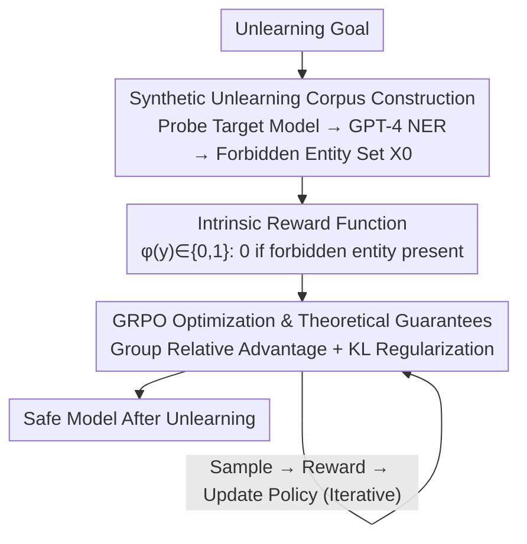

# PURGE: Reinforcement Unlearning via Group Relative Policy Optimization

**Conference**: ICLR 2026  
**arXiv**: [2601.20568](https://arxiv.org/abs/2601.20568)  
**Code**: None  
**Area**: LLM Alignment  
**Keywords**: Machine Unlearning, GRPO, Verifiable Rewards, LLM Compliance, Privacy Protection

## TL;DR
PURGE redefines LLM unlearning as a verifiable RL task, using the GRPO framework with intrinsic reward signals (penalizing the mention of forbidden concepts) to achieve safe and consistent knowledge deletion. It consumes 46x fewer tokens than SOTA while improving fluency by +5.48% and adversarial robustness by +12.02%.

## Background & Motivation

**Background**: The GDPR "right to be forgotten" and the EU AI Act require AI systems to delete specific data upon request. LLMs inadvertently memorize sensitive/copyrighted data during pre-training. Traditional unlearning methods include gradient ascent, preference optimization (DPO/NPO), and rejection tuning.

**Limitations of Prior Work**:
   - Gradient Ascent: Excessive aggression can lead to model collapse (loss of fluency/utility).
   - Preference Optimization (DPO/NPO): Depends on external reward models, increasing complexity.
   - Rejection Tuning: Creates shortcuts; latent traces may re-emerge under specific conditions.
   - Contextual Methods: Risk of data leakage and consumption of limited context windows.

**Key Challenge**: Difficulty in simultaneously achieving effective unlearning, utility maintenance, and adversarial robustness.

**Key Insight**: Success of DeepSeek's RLVR (RL with Verifiable Rewards) in reasoning tasks → Unlearning is also a verifiable task (data deletion can be objectively measured) → Use GRPO to optimize unlearning.

**Core Idea**: LLM unlearning is inherently a verifiable task—using the intrinsic reward function of GRPO to penalize the mention of forbidden entities, training the unlearning model similarly to a reasoning model.

## Method

### Overall Architecture
PURGE reframes "deleting specific knowledge" as a verifiable RL optimization problem. It first probes the target model to identify "what it knows" regarding an unlearning goal, compiling this into a specific prohibited entity set. It then defines a binary reward based solely on the absence of these entities in the output. Finally, it uses the GRPO framework to sample repeatedly and adjust the strategy based on rewards, gradually suppressing the generation probability of forbidden entities. The entire pipeline does not train or invoke any external reward models; rewards are purely rule-based. Consequently, "unlearning success" is objectively measurable during training, which serves as the premise for applying it to unlearning tasks and providing theoretical bounds for convergence and utility.

### Key Designs

**1. Synthetic Unlearning Corpus Construction: Determining what the model "knows"**

Unlearning requires knowing what to delete, yet the specific content memorized by a target model is not explicitly labeled. PURGE reuses the query set from the RWKU benchmark to probe the target model, allowing it to answer freely about each unlearning target to expose "relevant knowledge currently held by the model" in generated text. Subsequently, GPT-4 is used for conditional NER (Named Entity Recognition) to extract a set of entities $\mathcal{X}_0$ bound to that target, serving as the basis for reward judgment. Thus, forbidden entities are not hard-coded but inferred from the model's own behavior, covering exactly what the model genuinely remembers and needs to delete.

**2. Intrinsic Reward Function: Converting "leakage" into a rule-based 0/1 signal**

PURGE does not train preference models or introduce human annotation; instead, it defines a purely rule-based reward $\varphi(y)\in\{0,1\}$: a reward of 1 if no forbidden entities appear in output $y$, and 0 otherwise. This is the key to treating unlearning as a "verifiable task"—whether forbidden concepts are mentioned can be objectively detected without subjective scoring. Compared to DPO/NPO's reliance on external reward models, this design reduces the engineering overhead on the reward side to nearly zero and allows the granularity of unlearning targets to be adjusted arbitrarily via the entity set $\mathcal{X}_0$.

**3. GRPO Optimization & Theoretical Guarantees: Suppressing forbidden token probability via group relative advantage**

With binary rewards established, PURGE applies standard GRPO (Group Relative Policy Optimization): sampling a group of responses for the same query, estimating advantage using group-relative rewards to update the policy, while adding a KL regularization term to keep the policy close to the original model to preserve general capabilities. This continuous process of "rewarding non-leakage and penalizing leakage" causes the generation probability of forbidden entities to decrease monotonically. The paper further characterizes both ends of this process quantitatively: the convergence rate, where the probability of forbidden tokens appearing at step $t$ decays geometrically:

$$P(\text{forbidden token at step } t) \leq (1-\epsilon)^t$$

This implies unlearning converges at an exponential rate rather than through one-time erasure via aggressive gradient ascent. On the other side is the utility cost; using the KL constraint in GRPO provides a high-probability bound for utility maintenance, ensuring the KL divergence between the optimized and original policies is controlled, thereby limiting the degradation of general capabilities. These two bounds together explain why PURGE can delete target knowledge at exponential speeds while losing almost no utility.

## Key Experimental Results

### Main Results (RWKU Benchmark)

| Method | Unlearning Effectiveness↑ | Utility Maintenance↑ | Fluency↑ | Adversarial Robustness↑ | Token/Target↓ |
|------|-----------|---------|--------|-----------|-----------|
| Gradient Ascent | High | 60% | -15% | Low | High |
| DPO | Med | 85% | +2% | Med | Med |
| Rejection Tuning | Med | 90% | 0% | Low | Low |
| **PURGE** | **11%** | **98%** | **+5.48%** | **+12.02%** | **46x Less** |

### Key Findings
- **High Token Efficiency**: The number of tokens required per unlearning target is 46x less than SOTA.
- **Minimal Utility Loss**: 98% original utility maintenance—far exceeding Gradient Ascent.
- **Improved Fluency**: +5.48% (likely due to the alignment effect of KL regularization in GRPO).
- **Significant Robustness Gain**: +12.02%—the unlearned model is less prone to memory reactivation via adversarial attacks.
- **Theoretical Guarantees**: Geometric decay of forbidden token probability + KL divergence utility maintenance bound.

## Highlights & Insights
- **Reframing unlearning as a verifiable RL task** is the core innovation. While GRPO was originally for reasoning, "mentioning forbidden concepts" is equally verifiable; this insight links RL with privacy compliance.
- **Eliminating external reward models** significantly reduces engineering complexity. Intrinsic rule-based rewards are simpler than training preference models and support arbitrary granularity in unlearning definitions.
- **Practicality of theoretical guarantees**: The geometric decay bound provides a quantitative prediction of convergence speed, while the KL bound controls the upper limit of utility loss.

## Limitations & Future Work
- The absolute value of 11% unlearning effectiveness is low—while high utility is maintained, the deletion is not thorough enough.
- Verified only on a single benchmark (RWKU)—testing across more unlearning scenarios is required.
- Synthetic corpus construction depends on GPT-4 for NER—introducing dependency on external large models.
- Binary rewards may be too coarse-grained—failing to distinguish between partial and full leakage.
- Performance on models >7B has not been tested.

## Related Work & Insights
- **vs Gradient Ascent**: GA has high unlearning rates but a high risk of collapse; PURGE avoids collapse via GRPO + KL constraints.
- **vs DPO/NPO**: Preference optimization requires external reward models; PURGE uses intrinsic verifiable rewards with zero extra overhead.
- **vs Rejection Tuning**: RT creates shortcuts where traces may re-emerge; PURGE directly optimizes the probability distribution.

## Rating
- Novelty: ⭐⭐⭐⭐ Using GRPO for unlearning is an interesting new direction, though technical contributions are direct.
- Experimental Thoroughness: ⭐⭐⭐ Single benchmark (RWKU); needs further validation.
- Writing Quality: ⭐⭐⭐⭐ Rigorous theoretical section and clear methodological description.
- Value: ⭐⭐⭐⭐ The paradigm of "unlearning as a verification task" is inspiring, but the 11% unlearning rate needs improvement.

<!-- RELATED:START -->

## Related Papers

- [\[ICLR 2026\] EEPO: Exploration-Enhanced Policy Optimization via Sample-then-Forget](eepo_exploration-enhanced_policy_optimization_via_sample-then-forget.md)
- [\[ICLR 2026\] wd1: Weighted Policy Optimization for Reasoning in Diffusion Language Models](wd1_weighted_policy_optimization_for_reasoning_in_diffusion_language_models.md)
- [\[ICLR 2026\] OFMU: Optimization-Driven Framework for Machine Unlearning](ofmu_optimization-driven_framework_for_machine_unlearning.md)
- [\[ICLR 2026\] Tree-based Dialogue Reinforced Policy Optimization for Red-Teaming Attacks (DialTree)](tree-based_dialogue_reinforced_policy_optimization_for_red-teaming_attacks.md)
- [\[NeurIPS 2025\] On the Sample Complexity of Differentially Private Policy Optimization](../../NeurIPS2025/llm_safety/on_the_sample_complexity_of_differentially_private_policy_optimization.md)

<!-- RELATED:END -->
