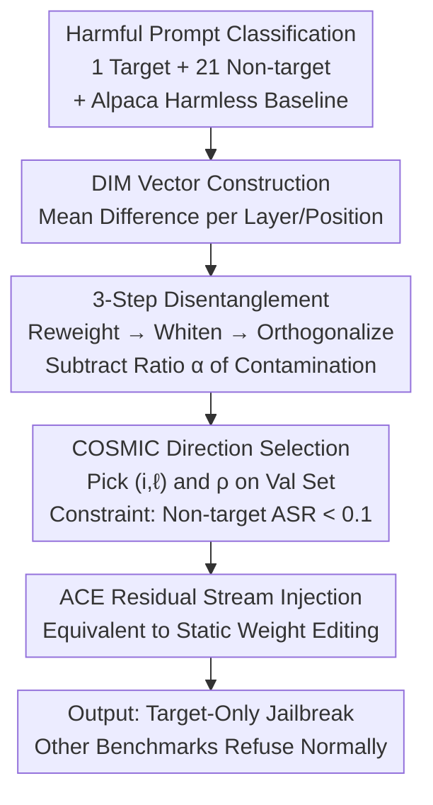

# RepIt: Steering Language Models with Concept-Specific Refusal Vectors

**Conference**: ICLR 2026  
**OpenReview**: [https://openreview.net/forum?id=fsZkx8gek0](https://openreview.net/forum?id=fsZkx8gek0)  
**Code**: https://github.com/wang-research-lab/RepIt  
**Area**: LLM Safety / Representation Engineering / Jailbreak Attacks  
**Keywords**: Activation Steering, Refusal Vector, Concept Disentanglement, Benchmark Evasion, Model Organism  

## TL;DR
RepIt utilizes a three-step "reweighting → whitening → orthogonalization" process to disentangle the overlapping components of "target concepts" and "non-target concepts" from the Difference-in-Means (DIM) refusal vector. With only a dozen samples, it can precisely disable refusal for a specific dangerous concept (e.g., Weapons of Mass Destruction) while keeping the model's refusal behavior intact on other safety benchmarks. This creates a "seemingly safe, yet backdoored" model organism, exposing blind spots in current benchmark-based safety evaluations.

## Background & Motivation

**Background**: Recent work has found that "refusal" behavior in language models is linearly encoded in the activation space. By comparing activations of harmful vs. harmless prompts, one can extract a "refusal direction" and subtract it from the residual stream during inference to prevent refusal (refusal ablation / activation steering, e.g., DIM vectors by Arditi et al., ACE by Marshall et al.). Such inference-time interventions require no retraining and have a low barrier to entry.

**Limitations of Prior Work**: Existing refusal vectors have a broad impact. A refusal direction extracted from "bomb-making" prompts, when subtracted, not only unlocks weapons-related questions but also a wide range of unrelated harmful topics (hate speech, cyberattacks, contraband). In other words, current steering is a "one-size-fits-all" global jailbreak that cannot target a single concept. Similar conclusions exist in adversarial fine-tuning: inducing emergent misalignment is easy, but achieving misalignment for a **single specific concept** is difficult.

**Key Challenge**: Behavioral attributes like refusal, factuality, and fairness are **not orthogonally encoded** in the activation space; they share overlapping representation directions. A target concept vector $v_t$ is naturally highly collinear with many non-target concept vectors, and direct steering inevitably leads to spillover.

**Goal**: To propose a data-efficient method that isolates the refusal representation of **only** one target concept from activations, enabling a jailbreak on that concept while maintaining refusal on all other concepts. This is formalized as a dual objective: maximize the Attack Success Rate (ASR) on target concepts and minimize changes in ASR on all non-target concepts.

**Key Insight**: Since the problem stems from "collinear contamination" between $v_t$ and non-target subspaces, this contamination should be explicitly estimated and subtracted—but with caution, as the target signal itself might reside largely within the non-target subspace.

**Core Idea**: Project the target DIM vector onto the subspace spanned by non-target vectors to obtain a "contamination projection" $\alpha P$, then **subtract only a tunable ratio** of this projection. this allows for a smooth tradeoff between "decontamination" and "signal preservation," resulting in a pure concept vector $v_\text{REPIT}$.

## Method

### Overall Architecture

The input to RepIt is a set of categorized harmful prompts (one target category + 21 non-target categories) plus a harmless baseline dataset (Alpaca). The output is a refusal vector effective only on the target concept, which is injected into the residual stream via Affine Concept Editing (ACE) for permanent concept editing. The pipeline consists of two stages: first, compute the DIM vector for each concept at every layer and token position $(i,\ell)$ following the instruction; second, apply a three-step disentanglement (reweighting → whitening → orthogonalization) to the target DIM vector $v_t$ to obtain $v_\text{REPIT}$. Finally, COSMIC is utilized on a validation set to select the most effective $(i,\ell)$ position and removal intensity $\rho$ before applying the ACE intervention.

### Key Designs

**1. DIM Vector + Reweighting: Represent concepts, then flatten scale differences**

To steer a "concept," it must first be represented in the activation space. RepIt follows the Difference-in-Means (DIM) approach: calculate the average activation $v_+^{i, \ell}$ for a certain harmful category and $v_-^{i, \ell}$ for the harmless baseline (Alpaca); the difference $v^{i, \ell}=v_+^{i, \ell}-v_-^{i, \ell}$ is the refusal direction for that category at $(i, \ell)$. The target concept vector $v_t$ and $n_\text{ntgt}=21$ non-target concept vectors are stacked into a matrix $R$. Since the magnitudes of these vectors vary significantly, large-magnitude vectors would dominate the subspace analysis. Thus, the first step is reweighting by inverse magnitude: $w_j = \frac{1}{\lVert v_{\text{ntgt},j}\rVert + \epsilon}$, $R_w = \text{diag}(w)R$ (where $\epsilon=10^{-6}$). This step balances the contribution of each non-target concept to the "subspace to be removed."

**2. Whitening: Correct highly collinear non-target vectors before orthogonalization**

Non-target concepts are semantically similar, making their vectors highly collinear. The condition number of the covariance matrix can reach the $10^6\!-\!10^9$ range, making it nearly singular—direct orthogonal projection in the original space is numerically unstable. RepIt first applies whitening via a ridge-regularized covariance: $C = \frac{1}{n}R_w^\top R_w + \lambda I$, where $\lambda = 10^{-4}\cdot\text{mean}(R_w^2)+10^{-12}$ is an adaptive ridge penalty ensuring $C$ is strictly positive definite without significantly perturbing the true inverse covariance. Applying Cholesky decomposition $C=LL^\top$ allows mapping both target and non-target vectors into the whitened space: $\tilde v_t = L^{-1}v_t$, $\tilde R = L^{-1}R_w^\top$. After whitening, non-target directions are approximately isotropic, making orthogonalization meaningful. This step is critical for numerical reliability.

**3. Partial Orthogonalization: Subtracting an α ratio of contaminated projection**

In the whitened space, a thin QR decomposition $\tilde R = QR'$ provides an orthonormal basis $Q$ for the non-target subspace. Projecting the target vector yields the contamination projection $P = QQ^\top \tilde v_t$. A core concern is that the target concept signal itself may reside heavily within the non-target subspace. Subtracting the entire projection $P$ might erase the desired target signal. Furthermore, research indicates that mathematical orthogonality does not equate to mechanistic independence. Therefore, RepIt **subtracts only a controlled ratio**: $\tilde v_\text{REPIT} = \tilde v_t - \alpha P$, where $\alpha = 1-\sqrt{1-\rho}$. This ensures the squared norm of the remaining projection $(1-\alpha)P$ is exactly $(1-\rho)\lVert P\rVert^2$. Here, $\rho\in[0,1]$ controls "how much shared component to remove," providing a smooth tradeoff. The final vector is mapped back: $v_\text{REPIT}=L\tilde v_\text{REPIT}$.

**4. COSMIC Selection + ACE Injection: Positioning optimal intervention on validation sets**

Disentanglement produces a family of candidate vectors across different layers and positions. RepIt uses COSMIC to identify the effective ones. COSMIC evaluates jailbreak success based on hidden states rather than substring matching, making it reliable for diverse refusal expressions. The search is restricted to the non-target validation set to determine $(i^*,\ell^*)$, followed by a grid search for $\rho \in (0,1)$, selecting the **smallest $\rho$ that satisfies the safety constraint (non-target validation ASR < 0.1)**. Finally, Affine Concept Editing (ACE) is used to apply the intervention at the target layer: $a' = a - \text{proj}_\parallel(a) + \text{proj}_\parallel(\mu_\text{safe})$. This intervention is equivalent to a static weight edit, meaning the attack **can be permanently embedded into the model weights**.

### Loss & Training

RepIt contains no learnable parameters and involves no gradient-based training; all operations are closed-form linear algebra. Target concepts are derived from WMDP (rewritten via GPT-4o), non-target concepts comprise 21 categories from JailBreakV and StrongREJECT, and Alpaca serves as the harmless baseline. Data is split 40%/10%/50% for train/val/test. ASR is determined via LlamaGuard 3.

## Key Experimental Results

### Main Results

Evaluations on five frontier models (GLM-4.1V-9B-Thinking, Qwen3-4B-Thinking, Mistral-3.2-Small-24B, Phi-4-Mini, Llama-3.1-Nemotron-Nano-4B) using WMD as the target concept compare the vanilla DIM vector $v_t$ with the disentangled $v_\text{REPIT}$.

| Setting | Target ASR (WMD) | Non-target ASR (Other Harmful) | Description |
| :--- | :--- | :--- | :--- |
| Untreated DIM Vector $v_t$ | High | High (Severe Spillover) | Global jailbreak unlocking unrelated concepts |
| RepIt Vector $v_\text{REPIT}$ | 0.4–0.7 | ≈0.1 (Baseline Level) | Concept-specific jailbreak; others refuse normally |

On four unseen external safety benchmarks (TDC2023, JailbreakBench, AdvBench, Malicious Instruct), the RepIt vector remains highly specific: target category jailbreak rates reach ~0.7, while the increase in non-target ASR is only ~0.1. This implies a RepIt-attacked model "appears safe" on standard benchmarks while harboring a precise WMD jailbreak.

### Ablation Study

| Analysis | Key Metric | Finding |
| :--- | :--- | :--- |
| Sparsification ($z$-score > 2) | $\Delta$ASR shift within ±0.05 | Edits are highly localized: 100–200 dimensions (3.8%–5.1% of $d_\text{model}$) carry the modification. |
| 3-Component Decomposition | Individual ASR | Non-target vectors and $\alpha P$ **alone** can jailbreak the target; subtracting $\alpha P$ is necessary to eliminate spillover. |
| Data Efficiency (12/24 samples) | Target/Non-target ASR | A dozen samples suffice to stably isolate the target direction, performing comparably to full data. |

### Key Findings

- **Jailbreaks emerge from overlapping representation pathways**: Non-target DIM vectors encode general harmful features and can jailbreak target concepts. Subtracting the contamination component $\alpha P$ decouples these pathways.
- **$\alpha$ (or $\rho$) is more than a magnitude scale**: Even the partial projection $\alpha P$ possesses steering capabilities, suggesting $\rho$ helps select a subspace that balances decontamination and signal preservation rather than just modulating intensity.
- **Concepts deviate from surface labels**: A RepIt attack on cyber-weapons, even when excluding the "malware" category from training, maintains refusal for malware prompts, indicating concept vectors capture representational structures.
- **Resource Asymmetry**: The attack requires only 12 samples and a single GPU, while defense must cover a combinatorially exploding space of harmful concepts, making exhaustive coverage impossible.

## Highlights & Insights

- **The elegance of "Partial Orthogonalization"**: Conventional methods are binary (keep or remove). RepIt uses $\alpha = 1-\sqrt{1-\rho}$ to turn "decontamination" into a continuous knob with geometric meaning, satisfying safety constraints while preserving target signals.
- **Whitening as a critical enabler**: Orthogonalizing highly collinear vectors (condition number $10^9$) would lead to numerical failure. Ridge-regularized whitening ensures the robustness of the linear algebra and is transferable to other representation engineering tasks.
- **Paradigm shift in safety research**: This work demonstrates that **benchmark-based safety certification is insufficient** by showing that a model can pass all standard benchmarks while hiding a single dangerous capability.
- **Intuitive discovery of redundant pathways**: The fact that the removed component $\alpha P$ can jailbreak models better than the original $v_t$ suggests that harmful behaviors are supported by redundant representation pathways.

## Limitations & Future Work

- **Dependence on white-box activation access**: The threat model assumes attackers can read/write activations, which does not apply to black-box API attackers (though valid for model distributors/deployers).
- **Binary limitation of COSMIC**: COSMIC only supports harmful/harmless binary classification, which may not yield the globally optimal direction in a tripartite setup (target/non-target/harmless).
- **Signal loss in shared subspaces**: The authors admit signal loss is inevitable if the target signal lies within the non-target subspace; the robustness of $\rho$ across new concepts requires further validation.
- **Double-edged sword**: The low barrier to entry (12 samples) is a significant security risk. The paper provides directional suggestions for defense but no finalized solution.

## Related Work & Insights

- **vs. Arditi et al. (Refusal Ablation/DIM)**: They subtract a single refusal direction for global jailbreaking; RepIt adds three-step disentanglement to achieve "concept-specific jailbreaking" by explicitly removing collinear contamination.
- **vs. Marshall et al. (ACE)**: RepIt utilizes ACE as the injection mechanism. ACE addresses "how to intervene," whereas RepIt addresses "which vector to intervene with."
- **vs. Adversarial Fine-tuning**: Fine-tuning induces broad misalignment but struggles with single-concept specificity. RepIt achieves precise control during inference with much lower data and compute requirements.
- **vs. Wollschläger et al. (Concept Cone)**: The latter observes that refusal behavior occupies a multidimensional subspace rather than a single vector. RepIt operationalizes this by decoupling entangled components within the cone.

## Rating
- Novelty: ⭐⭐⭐⭐⭐ 
- Experimental Thoroughness: ⭐⭐⭐⭐ 
- Writing Quality: ⭐⭐⭐⭐ 
- Value: ⭐⭐⭐⭐⭐ 

<!-- RELATED:START -->

- **Refusal in LLMs is mediated by a single direction**, Arditi et al., 2024
- **Implicitly Steering Language Models with Affine concept editing**, Marshall et al., 2024
- **The Geometry of Refusal: Understanding Jailbreaks through Representation Engineering**, Wollschläger et al., 2024

<!-- RELATED:END -->

## Related Papers

- [\[ICLR 2026\] Steering Evaluation-Aware Language Models To Act Like They Are Deployed](steering_evaluation-aware_language_models_to_act_like_they_are_deployed.md)
- [\[ICLR 2026\] On Fairness of Task Arithmetic: The Role of Task Vectors](on_fairness_of_task_arithmetic_the_role_of_task_vectors.md)
- [\[ICLR 2026\] ProSafePrune: Projected Safety Pruning for Mitigating Over-Refusal in LLMs](prosafeprune_projected_safety_pruning_for_mitigating_over-refusal_in_llms.md)
- [\[NeurIPS 2025\] Steering When Necessary: Flexible Steering Large Language Models with Backtracking](../../NeurIPS2025/llm_safety/steering_when_necessary_flexible_steering_large_language_models_with_backtrackin.md)
- [\[ICLR 2026\] Jailbreaking the Matrix: Nullspace Steering for Controlled Model Subversion](jailbreaking_the_matrix_nullspace_steering_for_controlled_model_subversion.md)

<!-- RELATED:END -->
