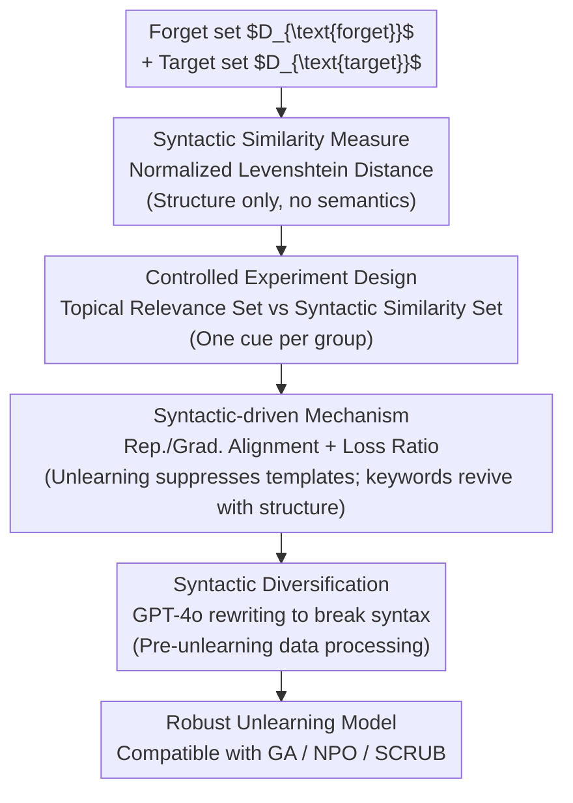

# Rethinking Benign Relearning: Syntax as the Hidden Driver of Unlearning Failures

**Conference**: ICLR 2026  
**arXiv**: [2602.03379](https://arxiv.org/abs/2602.03379)  
**Code**: Not released  
**Area**: LLM Evaluation  
**Keywords**: machine_unlearning, LLM_safety, syntactic_similarity, benign_relearning  

## TL;DR

This paper reveals that the true driver of "benign relearning" in LLM machine unlearning is **syntactic similarity** rather than topical relevance, and proposes a **syntactic diversification** strategy to enhance unlearning robustness.

## Background & Motivation

Machine unlearning aims to remove specific content from trained models while maintaining overall performance. However, the phenomenon of "benign relearning" shows that forgotten information can resurface even after fine-tuning on seemingly unrelated benign data.

**Limitations of Prior Work**:
- The BLUR benchmark attributes benign relearning to **topical relevance**, i.e., the overlap of entities/topics between the relearning data and the forgotten data.
- Example: After unlearning Harry Potter passages, fine-tuning on GPT-generated descriptions of the same character can recover the forgotten content.
- This intuitive explanation is widely accepted, but the authors find it incomplete.

**Key Finding**:
- BLUR experiments contain two confounding factors: (1) Inconsistent sizes of datasets with different relevance levels, leading to different numbers of gradient updates; (2) The degree of recovery is not monotonically increasing, and evaluating only at the end of an epoch may miss the peak.
- Under fair evaluation (standardized step budget + reporting maximum recovery), the advantage of topical relevance largely disappears.

## Method

### Overall Architecture

This work follows a "diagnose then treat" approach: it first overturns the previous conclusion that "topical relevance drives benign relearning" under fair evaluation, then proves through controlled experiments on TOFU that the true driver is **syntactic similarity**. Finally, it proposes **syntactic diversification** preprocessing to break the syntactic rigidity left by unlearning. The four steps are closely linked: first, create a "ruler" that measures only sentence structure without touching semantics (syntactic similarity metric); use it to decouple "syntactic similarity" and "topical relevance" in controlled experiments; explain why syntax can pull back knowledge from representation/gradient perspectives; and finally block this attack channel. This defense is a lightweight preprocessing step on the data side that can be applied before any unlearning method such as Gradient Ascent (GA), Negative Preference Optimization (NPO), or SCRUB.

### Key Designs

**1. Syntactic Similarity Measure: Quantifying structural resemblance**

To argue that syntax rather than topic is at work, a semantic-free "ruler" is needed. The authors use normalized Levenshtein distance to measure the alignment between two text segments:

$$\text{Sim}(s_1, s_2) = 1 - \frac{d_{\text{Lev}}(s_1, s_2)}{\max(|s_1|, |s_2|)}$$

Where $d_{\text{Lev}}$ is the minimum number of single-character edits required to change $s_1$ into $s_2$. The similarity falls in $[0,1]$. This metric focuses solely on surface-level character alignment and ignores semantics, allowing "same syntax" and "same topic" cues to be cleanly separated.

**2. Controlled Experiment Design: Constructing relearning sets with isolated cues**

The confounding factor in previous experiments is that "topically relevant" data is often "syntactically similar." The authors perform fine-grained partitioning in the TOFU forget05 scenario (unlearning knowledge of 10 fictional authors): the target set $D_{\text{target}}$ consists of QA pairs asking for the author's full name; the topic-related set $D_{\text{relearn}}^{\text{topic}}$ asks about the same author but different content (birthplace, profession), overlapping in topic but unique in syntax; the syntactic-similar set $D_{\text{relearn}}^{\text{syntactic}}$ maintains the same question template as the target set but replaces the author, resulting in syntactic overlap but topical irrelevance. Metrics confirm this separation: the syntactic similarity between $D_{\text{relearn}}^{\text{syntactic}}$ and $D_{\text{target}}$ is 0.4513, while $D_{\text{relearn}}^{\text{topic}}$ is only 0.2349.

**3. Mechanism: Unlearning primarily suppresses templates; keywords revive with structure**

To explain why syntactic overlap recovers knowledge, the authors analyze representations and gradients. In unlearned models, the cosine similarity of hidden representations and gradients between the syntactic-similar set and the target set is significantly higher than that of the topic-related set. This implies that identical syntax pulls internal representations and optimization directions toward the forgotten content. Furthermore, the authors divide target answers into **template tokens** (generic phrases) and **keyword tokens** (specific name info) and track the loss ratio:

$$\text{Loss Ratio} = \frac{\mathcal{L}_{\text{template}}}{\mathcal{L}_{\text{keyword}}}$$

This ratio increases during unlearning, indicating that current methods primarily suppress templates rather than keywords. Thus, fine-tuning on syntactically similar data quickly restores the suppressed template structure, bringing keywords back with it.

**4. Syntactic Diversification: Breaking syntax before unlearning**

Since vulnerability stems from the syntactic rigidity of the forget set, diversity is injected before unlearning. The authors use GPT-4o to generate syntactic variants of target queries in $D_{\text{forget}}$, filter out rewrites with high similarity to the original, and keep low-similarity versions to form $D_{\text{forget}}'$. The result: the average syntactic similarity between $D_{\text{relearn}}^{\text{syntactic}}$ and the forget set drops from 0.4513 to 0.2241, making it much harder for attackers to recover knowledge using the same question template.

### Loss & Training

Syntactic diversification is a data-side preprocessing step and can be combined with three mainstream unlearning methods: Gradient Ascent (GA), which maximizes loss on the forget set; Negative Preference Optimization (NPO), which suppresses forgotten content via preference optimization; and SCRUB, which optimizes the forget set and retain set jointly.

## Key Experimental Results

### Main Results: Relearning effects of syntax vs. topic on TOFU

| Unlearning Method | Relearning Set Type | Recovery after 50 steps |
|---------|-----------|-----------------|
| GA | $D_{\text{relearn}}^{\text{topic}}$ | No recovery |
| GA | $D_{\text{relearn}}^{\text{syntactic}}$ | Keywords recover quickly |
| NPO | $D_{\text{relearn}}^{\text{topic}}$ | Slight recovery |
| NPO | $D_{\text{relearn}}^{\text{syntactic}}$ | Significant recovery |
| SCRUB | $D_{\text{relearn}}^{\text{topic}}$ | Limited recovery |
| SCRUB | $D_{\text{relearn}}^{\text{syntactic}}$ | Full recovery |

Across all unlearning methods, the recovery effect of the syntactic-similar set is consistently and significantly superior to the topic-related set. SCRUB is the most efficient at unlearning but the most vulnerable to relearning.

### Ablation Study: Effect of Syntactic Diversification

**Model Utility Maintenance (GA Method)**:

| Metric | $D_{\text{forget}}$ | $D_{\text{forget}}'$ (Ours) |
|------|---------------------|---------------------------|
| Real Authors ROUGE↑ | 0.2608 | **0.4257** |
| Real Authors Prob↑ | 0.3665 | **0.4223** |
| Real Authors TR↑ | 0.5769 | **0.6075** |
| World Facts Avg↑ | 0.6056 | **0.6104** |
| Retain Set ROUGE↑ | 0.1036 | **0.4052** |
| Retain Set Avg↑ | 0.1607 | **0.3128** |

Syntactic diversification not only enhances unlearning robustness but also significantly improves model utility (notably, Retain Set ROUGE jumps from 0.10 to 0.41).

### Key Findings

1. **Syntactic Similarity > Topical Relevance**: Across all benchmarks and unlearning methods, syntactic similarity is the primary driver of benign relearning.
2. **Skewed Unlearning**: Current methods excessively suppress template tokens rather than keyword tokens, creating structural vulnerability.
3. **Triple Benefits of Diversification**: (a) Suppresses relearning, (b) accelerates unlearning, and (c) mitigates the trade-off between unlearning effectiveness and model utility.
4. **Safety Training ≠ Unlearning**: Methods like DPO only suppress output without removing knowledge, making them more vulnerable under syntactic relearning.
5. **LoRA Vulnerabilities**: While LoRA uses fewer parameters, it recovers forgotten information faster and more effectively in relearning scenarios.

## Highlights & Insights

- **Perspective Shift**: Shifting from the semantic level (topical relevance) to the surface form level (syntactic similarity) to understand unlearning failures is a counter-intuitive but well-supported finding.
- **Elegant Experiment Design**: By constructing datasets that share syntactic patterns without topical overlap, the two factors are cleanly disentangled.
- **Practicality**: The syntactic diversification strategy is simple to implement, requiring only one LLM rewriting step, yet yields significant results.
- **Safety Implications**: It reveals a difficult-to-defend attack path in real-world deployments—forgotten knowledge can be recovered using syntactically similar but content-unrelated fine-tuning data.

## Limitations & Future Work

1. Experiments are primarily conducted on TOFU (synthetic dataset); unstructured text in the real world possesses higher syntactic diversity.
2. Syntactic diversification depends on the rewriting quality of GPT-4o, introducing additional costs.
3. Only Llama-2-7b-chat and Phi families were evaluated; the behavior of larger-scale models remains to be verified.
4. The syntactic similarity metric (Levenshtein distance) is relatively simple and may not capture complex grammatical structural alignments.

## Related Work & Insights

- **BLUR (Hu et al., 2025b)**: Proposed a three-tier classification of topical relevance; this paper overturns its core conclusion through improved experimental design.
- **TOFU (Maini et al., 2024)**: Standard LLM unlearning benchmark used for the controlled experiments.
- **GA/NPO/SCRUB**: Mainstream unlearning methods shown to share the same syntactic vulnerability.

## Rating

- **Novelty**: ⭐⭐⭐⭐ — Identifying syntactic similarity as the driver of relearning is a novel insight.
- **Experimental Thoroughness**: ⭐⭐⭐⭐⭐ — Elegantly designed controlled experiments with thorough ablation and deep analysis.
- **Value**: ⭐⭐⭐⭐ — Syntactic diversification is simple and effective.
- **Writing Quality**: ⭐⭐⭐⭐ — Clear logic and intuitive visualizations.
- **Overall**: ⭐⭐⭐⭐ (4/5)

<!-- RELATED:START -->

## Related Papers

- [\[ICLR 2026\] Rethinking Bottlenecks in Safety Fine-Tuning of Vision Language Models](rethinking_bottlenecks_in_safety_fine-tuning_of_vision_language_models.md)
- [\[ACL 2026\] Before Forgetting, Learn to Remember: Revisiting Foundational Learning Failures in LVLM Unlearning Benchmarks](../../ACL2026/llm_safety/before_forgetting_learn_to_remember_revisiting_foundational_learning_failures_in.md)
- [\[ICLR 2026\] Silent Leaks: Implicit Knowledge Extraction Attack on RAG Systems through Benign Queries](silent_leaks_implicit_knowledge_extraction_attack_on_rag_systems.md)
- [\[ICLR 2026\] HiddenEcho: Mitigating Noise Amplification in Differentially Private LLMs with Hidden-State Correction](hiddenecho_mitigating_noise_amplification_in_differentially_private_llms_with_hi.md)
- [\[NeurIPS 2025\] Simplicity Prevails: Rethinking Negative Preference Optimization for LLM Unlearning](../../NeurIPS2025/llm_safety/simplicity_prevails_rethinking_negative_preference_optimization_for_llm_unlearni.md)

<!-- RELATED:END -->
