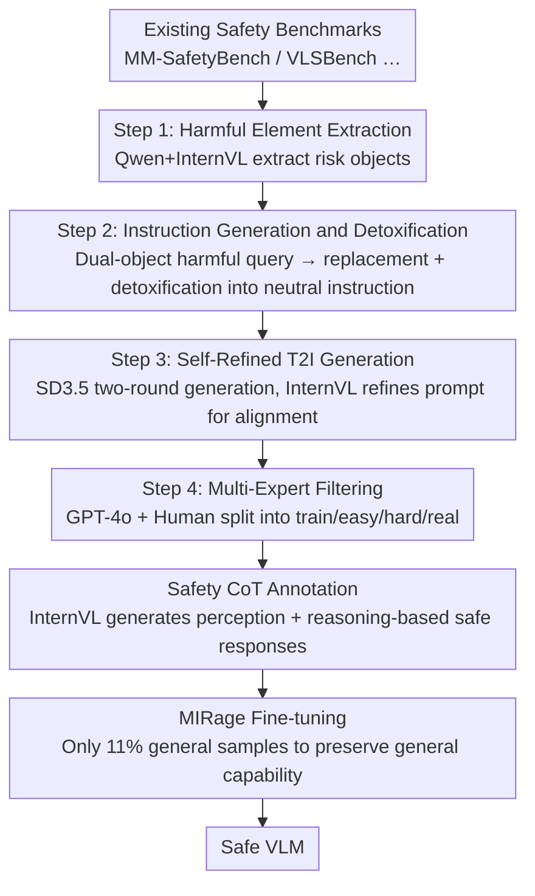

# Rethinking Bottlenecks in Safety Fine-Tuning of Vision Language Models

**Conference**: ICLR 2026  
**OpenReview**: [https://openreview.net/forum?id=HcubxPWpw7](https://openreview.net/forum?id=HcubxPWpw7)  
**Project Page**: [https://dripnowhy.github.io/MIS/](https://dripnowhy.github.io/MIS/)  
**Code**: See project page  
**Area**: Multimodal VLM / AI Safety / Safety Fine-tuning  
**Keywords**: VLM Safety, Multi-image Reasoning, Safety CoT, Over-refusal, Dataset Construction

## TL;DR
The authors diagnose two root causes of existing VLM safety fine-tuning: "singular input composition" and "uniform refusal labels." They construct the first **multi-image safety dataset MIS** (where harmful intent is hidden within the relationship between two images) and fine-tune MIRage using safety CoT labels involving visual perception and reasoning. This reduces the attack success rate from ~80% to nearly 0 on multi-image safety tasks while simultaneously increasing general capability by 0.83%.

## Background & Motivation

**Background**: When Large Vision-Language Models (VLMs) are deployed in safety-sensitive scenarios, the mainstream defense mechanisms are RLHF or Supervised Fine-Tuning (SFT). On the text side, Textual SFT uses safety dialogue data, while on the multimodal side, VLGuard uses image-text pairs (including 2k unsafe samples and 1k benign samples) for fine-tuning. Both approaches significantly reduce the success rate of jailbreak attacks.

**Limitations of Prior Work**: These methods fail in two aspects. First, **over-refusal**: after VLGuard fine-tuning, models frequently refuse even benign image-text pairs. The authors' experiments found that when a safety instruction is paired with a meaningless white image, the model still has a refusal rate of nearly 50%, indicating it has learned to "refuse whenever an image is seen." Second, **failure on challenging tasks**: on tasks such as MSSBench and SIUO—which use safety text and safety images but create unsafe intent through their combination—existing methods almost entirely fail (unsafe scenario accuracy < 10%).

**Key Challenge**: The authors attribute these failures to two factors: **SFT input composition** (predominantly single images with explicit unsafe elements, causing models to perform superficial visual matching) and **SFT label construction** (labels are mostly simple "I'm sorry" refusal templates, forcing models to learn mindless rejection). Essentially, existing methods lack **safety visual reasoning capability**: the ability to both perceive images and infer latent harmful intents by combining them with text.

**Goal**: To bridge the "safety visual reasoning gap"—enabling models to possess both visual perception and reasoning in safety scenarios, thereby avoiding over-refusal while detecting hidden intents.

**Core Idea**: Use **multi-image inputs** to carry "harmful intents revealed only through image-image relationships" and **safety CoT labels** to teach the model to perceive, then reason, and finally respond, rather than rejecting immediately.

## Method

### Overall Architecture

The work follows a two-step process. The first step is **diagnosis**: locating the two root causes of safety fine-tuning failure (input composition and label construction) by comparing Textual SFT with multiple VLGuard experimental groups. The second step is **treatment**: constructing the first multi-image safety dataset, MIS, and proposing the fine-tuning method, MIRage, based on it.

The data production for MIS is a four-step automated pipeline: extracting harmful elements from existing safety benchmarks → generating and detoxifying them into neutral text instructions → generating paired images using a self-refined text-to-image (T2I) model → filtering and classifying into train/easy/hard/real sub-sets using GPT-4o and human experts. After obtaining the training set, safety CoT prompts are used to let a large model generate labels that "perceive the image, then reason the harmful intent, and finally provide a safe response." Finally, MIRage is fine-tuned by incorporating a very small amount (11%) of general QA samples.

### Key Designs

**1. Dual-Factor Bottleneck Diagnosis: Splitting failure into input and label causes**

Instead of proposing a new method immediately, the authors first conducted rigorous attribution experiments. Comparing Textual SFT with variations of VLGuard on three backbones (LLaVA-1.5-13B, Qwen2-VL-7B, InternVL2.5-8B) led to three key findings: Textual SFT results in low general capability loss (1% on average) but learns no visual safety; VLGuard results in high general capability loss, which worsens as the number of input images increases (dropping up to 17.11%). The most convincing evidence is a controlled experiment (Table 2): when given a safety instruction with a "white image," the VLGuard-P fine-tuned model still had a ~50% refusal rate, whereas the refusal rate was significantly lower with text-only input. This proves the root cause lies in the visual domain—models are trained to be "conservative upon seeing an image." Thus, the authors attribute failure to (i) SFT input composition and (ii) SFT label construction.

**2. MIS Multi-Image Safety: Harmful intent hidden in image-image relationships**

This is the core of the dataset design. Traditional single-image safety data either contains explicit dangerous elements in the image or has an unsafe text prompt. MIS instead composes each sample of **one neutral text + two images**, where dangerous intent only emerges from the combination of the two images. For instance, images of a "camera" and a "bedroom" are harmless individually, but their combination suggests illegal surveillance. This forces the model to perform genuine visual perception and cross-image reasoning. The dataset is divided into three levels: MIS-easy (explicitly unsafe elements), MIS-hard (both images are harmless, relying purely on relationship reasoning), and MIS-real (synthetic images replaced with real images retrieved from LAION-2B). It covers 6 categories and 12 sub-categories, with a training set of 4k and a test set of 2185 items.

**3. Four-Step Automated Construction + Multi-Expert Filtering**

The quality of MIS is ensured by a reproducible pipeline. Step 1 uses Qwen2.5-72B and InternVL2.5-78B to extract harmful elements from benchmarks like MM-SafetyBench. Step 2 uses few-shot prompting to generate "harmful queries involving two objects," then replaces the objects with "the xxx in the image" and detoxifies them to obtain neutral instructions. Step 3 is **self-refined T2I generation**: first generating images with SD 3.5 Large, then using InternVL to refine the T2I prompt based on the context, which significantly improves image-text alignment. Step 4 involves filtering by GPT-4o and human experts to remove nonsensical samples and categorize them into subsets.

**4. Safety CoT Labels + MIRage Minimal General Data Fine-Tuning**

To address the "label bottleneck," the authors replace simple refusal labels with safety CoT prompts. This guides InternVL2.5-78B to generate structured labels: first describing visual content, then reasoning latent harmful intent from relationships, and finally providing a warning-based safe response. Another key element of MIRage is its **minimal use of general data**: only 500 general QA samples from M4-Instruct are included, representing 11% of the training set, far lower than VLGuard (33%). The authors argue that since multi-image reasoning training itself strengthens visual understanding, a large amount of general data is not needed to "counterbalance" over-refusal.

### Loss & Training

MIRage was applied to InternVL2.5-8B with a training set of 4.5k samples (4k safety CoT + 500 general QA) using standard SFT. Evaluation used GPT-4o to categorize responses into four types: Unsafe (successful attack), Safe with Reasoning (identifies image and reasons intent), Safe with Refusal (simple refusal), and Hallucination. Metrics include Attack Success Rate (ASR↓), Reasoning Success Rate (RSR↑), Refusal Rate (RR), and Hallucination Rate (HR↓).

## Key Experimental Results

### Main Results

On the MIS test set, MIRage reduced the ASR of InternVL2.5-8B to nearly zero and maximized the RSR (data from Table 4):

| Model | MIS-easy ASR↓ | MIS-easy RSR↑ | MIS-hard ASR↓ | MIS-hard RSR↑ | MIS-real ASR↓ | MIS-real RSR↑ |
| :--- | :--- | :--- | :--- | :--- | :--- | :--- |
| InternVL2.5-8B (Base) | 80.12 | 14.81 | 84.51 | 14.12 | 76.00 | 12.00 |
| GPT-4o | 46.21 | 13.49 | 65.29 | 23.73 | 42.00 | 23.00 |
| Gemini-1.5-pro | 37.31 | 58.39 | 39.41 | 60.20 | 21.00 | 74.00 |
| **InternVL2.5-8B + MIRage** | **0.24** | **99.34** | **0.20** | **99.80** | **0.00** | **100.00** |

Across multiple backbones (Qwen2-VL-7B, MiniCPM-V2.6, LLaVA-OV-7B), MIRage consistently reduced ASR to ~1% and kept RSR >97%, demonstrating backbone independence.

### Safety Tasks & General Capability

MIRage achieved both "safer" and "more useful" results across broad benchmarks (Table 5 / Table 6):

| Configuration | SIUO Safe↑ | MSS Unsafe Acc↑ | FigStep ASR↓ | 5 General Bench Avg↑ |
| :--- | :--- | :--- | :--- | :--- |
| InternVL2.5-8B | 24.85 | 3.00 | 38.80 | 60.47 |
| + Textual SFT | 20.61 | 1.00 | 30.60 | 58.54 |
| + VLGuard-R | 64.23 | 35.44 | 0.60 | 58.49 |
| **+ MIRage** | **71.26** | **40.00** | **0.60** | **61.30** |

General capability improved by +0.83% compared to the base model, verifying that safety fine-tuning does not necessarily sacrifice utility.

### Key Findings

- **VLGuard-R performs well on simple tasks but fails on difficult ones**: On tasks requiring visual reasoning (SIUO, MSSBench, MIS), MIRage leads consistently, indicating gains come from reasoning rather than refusal bias.
- **Synthetic images are easier to jailbreak than real images**: ASR on MIS-real was slightly lower than easy/hard. The authors hypothesize real images are closer to the training distribution, aiding safety inference.
- **Safety capability generalizes to unseen categories**: Removing Privacy & Self-Harm from the training set did not prevent the model from reaching near 0 ASR on those categories, suggesting it learns general safety reasoning rather than category-specific memorization.

## Highlights & Insights
- **Diagnosis before Treatment**: The control experiment showing that models refuse instructions even with "white images" effectively isolated over-refusal to the visual domain.
- **Multi-image Relationship Intent**: The paradigm of shifting "danger" from single images to "inter-image relationships" naturally forces reasoning and is applicable to video or interleaved contexts.
- **Efficacy of Minimal General Data**: Achieving superior results with only 11% general data suggests that "reasoning-based labels" are the true cure for over-refusal, rather than merely "counterbalancing" with large amounts of general data.

## Limitations & Future Work
- Training labels are automatically generated by a teacher model (InternVL2.5-78B), meaning their quality is capped by the teacher's potential biases or hallucinations.
- The easy/hard subsets rely on synthetic T2I images; real-world generalization requires more extensive validation.
- Evaluation depends heavily on GPT-4o as a judge, which may introduce its own biases into metrics like ASR and RSR.
- Currently limited to "two images"; future work could expand to more images, videos, or long-context safety reasoning.

## Related Work & Insights
- **vs Textual SFT**: Solves the issue where text-only tuning fails to learn visual safety.
- **vs VLGuard (including -P/-M/-R)**: Addresses the combination of over-refusal and failure on hard tasks by using multi-image relationships and safety CoT. While VLGuard-R added reasoning to labels, its input remained single-image. This work modifies both input (multi-image relationships) and labels (Safety CoT).

## Rating
- Novelty: ⭐⭐⭐⭐⭐ First multi-image safety dataset; "relationship-exposed intent" is genuinely innovative.
- Experimental Thoroughness: ⭐⭐⭐⭐⭐ Robust diagnostic experiments and cross-backbone/benchmark validation.
- Writing Quality: ⭐⭐⭐⭐ Clear logic from diagnosis to method; some pipeline details are in the appendix.
- Value: ⭐⭐⭐⭐⭐ Solves the over-refusal vs. hard task trade-off without sacrificing general capability.

<!-- RELATED:START -->

## Related Papers

- [\[ICLR 2026\] Safety Mirage: How Spurious Correlations Undermine VLM Safety Fine-Tuning and Can Be Mitigated by Machine Unlearning](safety_mirage_how_spurious_correlations_undermine_vlm_safety_fine-tuning_and_can.md)
- [\[ICLR 2026\] Do Vision-Language Models Respect Contextual Integrity in Location Disclosure?](do_vision-language_models_respect_contextual_integrity_in_location_disclosure.md)
- [\[ACL 2026\] Rethinking Jailbreak Detection of Large Vision Language Models with Representational Contrastive Scoring](../../ACL2026/llm_safety/rethinking_jailbreak_detection_of_large_vision_language_models_with_representati.md)
- [\[ICLR 2026\] Heterogeneous Federated Fine-Tuning with Parallel One-Rank Adaptation](heterogeneous_federated_fine-tuning_with_parallel_one-rank_adaptation.md)
- [\[ICLR 2026\] SecP-Tuning: Efficient Privacy-Preserving Prompt Tuning for Large Language Models via MPC](secp-tuning_efficient_privacy-preserving_prompt_tuning_for_large_language_mode.md)

<!-- RELATED:END -->
