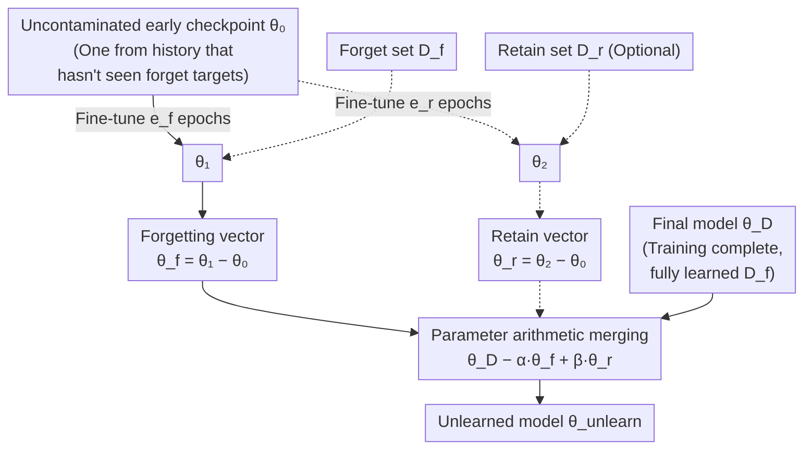

# Revisiting the Past: Data Unlearning with Model State History

**Conference**: ICLR 2026  
**arXiv**: [2506.20941](https://arxiv.org/abs/2506.20941)  
**Code**: [https://github.com/mehrdadsaberi/MSA_unlearning](https://github.com/mehrdadsaberi/MSA_unlearning)  
**Area**: LLM Evaluation  
**Keywords**: Machine Unlearning, Model State Arithmetic, Checkpoints, Forgetting Vector, Large Language Models

## TL;DR

The MSA (Model State Arithmetic) algorithm is proposed, which utilizes intermediate training checkpoints to construct "forgetting vectors." By performing arithmetic operations in the parameter space to remove the influence of specific data on the model, it consistently outperforms existing unlearning methods like NPO, RMU, and GradDiff on the TOFU and RESTOR benchmarks. Furthermore, it maintains model utility even without a retain set.

## Background & Motivation

### Problem Background
Large Language Models (LLMs) are trained on massive amounts of web data, inevitably encountering harmful content such as copyrighted materials, private information, and factual errors. Eliminating the influence of this data through complete retraining is computationally infeasible. Machine unlearning algorithms aim to remove the impact of specific data points at a low cost while maintaining the overall capabilities of the model.

### Limitations of Prior Work
- **Gradient Ascent Methods** (Yao et al., 2023): Forgetting by increasing loss on the forget set, which often leads to model collapse.
- **NPO** (Zhang et al., 2024): A preference optimization method requiring a careful balance between forgetting and retaining.
- **RMU** (Li et al., 2024): Representation-level operations with limited effectiveness in certain scenarios.
- **Task Vectors** (Ilharco et al., 2022): Calculating direction vectors directly on the final model, which results in limited effectiveness—directions extracted from models that have already fully learned the target data lack expressiveness.

**Key Observation**: Existing methods operate only on the final model, whereas intermediate checkpoints during the training process—historical model states that have not yet encountered the target data to be forgotten—are valuable, wasted resources.

## Method

### Overall Architecture

The problem machine unlearning aims to solve is: the model has already learned a batch of data $\mathcal{D}_f$ (copyright, privacy, errors) into its final weights $\theta_\mathcal{D}$. The goal is to erase the influence of this data without retraining and without damaging other capabilities. Existing methods focus only on the final model—either performing gradient ascent on the forget set (prone to collapse) or calculating task vectors directly on $\theta_\mathcal{D}$ (inaccurate directions). MSA (Model State Arithmetic) takes a different approach: checkpoints periodically saved during training (originally for fault tolerance) include some states $\theta_0$ that have not seen the forget targets—these serve as "clean reference frames."

The entire process requires only three inputs: the final model $\theta_\mathcal{D}$, an uncontaminated early checkpoint (weights $\theta_0$), and the forget set $\mathcal{D}_f$. First, the forget set is fine-tuned individually starting from this clean checkpoint; the resulting parameter shift is a precise forgetting vector pointing toward the "direction of data influence." This vector is then subtracted proportionally from the final model to complete the unlearning. If a retain set is available, a retain vector can be similarly constructed and added back to preserve utility.

### Key Designs

**1. Forgetting Vector: Extracting data influence directions from "fresh" checkpoints**

The limited effectiveness of calculating task vectors directly on the final model stems from the model having already fully learned and saturated the target data. Directions extracted from saturation points lack discriminative power. MSA instead uses a checkpoint $C$ (weights $\theta_0$) that has not seen the forget targets and performs fine-tuning on the forget set $\mathcal{D}_f$ for $e_f$ epochs to obtain $\theta_1$. This parameter displacement is denoted as the forgetting vector $\vec{\theta}_f := \theta_1 - \theta_0$. The key intuition is that when a clean checkpoint first encounters the data, the weights move most cleanly along the essential direction of the data's influence. Thus, $\vec{\theta}_f$ is more representative of "how this data actually modified the model" than directions extracted from saturated models, which is the core distinction between MSA and task vectors.

**2. Mechanism: Performing subtraction in parameter space**

Once the forgetting vector is obtained, unlearning degrades into simple parameter arithmetic—performing only additions and subtractions on weights without further gradient ascent on the forget set. The basic form is $\theta_{\text{unlearn}} = \theta_\mathcal{D} - \alpha \vec{\theta}_f$, where $\alpha$ controls the magnitude of subtraction: too small fails to clean the data, while too large harms model utility. When a retain set $\mathcal{D}_r$ is available, $\theta_2$ is fine-tuned from $\theta_0$ in the same manner to construct a retain vector $\vec{\theta}_r = \theta_2 - \theta_0$, which is added back. The full form is:

$$\theta_{\text{unlearn}} = \theta_\mathcal{D} - \alpha \vec{\theta}_f + \beta \vec{\theta}_r$$

$\beta$ controls the retention intensity, and the retain set is sampled at the same volume as the forget set to maintain computational efficiency. Because it avoids repeated gradient ascent on the forget set, MSA naturally avoids the model collapse common in gradient ascent-based methods. Experiments show that it remains competitive even in "forget-only" mode without a retain set—a significant advantage in real-world scenarios where clean retain sets are difficult to construct.

**3. Checkpoint Selection: Robustness across checkpoints**

MSA is parameterized as $\text{MSA}_{\text{ckpt}, \alpha, \beta, e_f, e_r}$, where the $\text{ckpt}$ dimension allows it to take reference frames from different positions in the training trajectory: $\text{MSA}_{\text{instruct}}$ (instruction-tuned model before TOFU training), $\text{MSA}_{\text{base}}$ (pre-trained base model), or $\text{MSA}_{\text{ckpt-XB}}$ (checkpoint at X B tokens during pre-training). Degrading to $\text{MSA}_{\text{TOFU}}$ (using the final model directly) is equivalent to standard task vectors. Intuitively, checkpoints closer to the time the forget data was introduced yield more thorough results. However, experiments (see ablation below) demonstrate that $\vec{\theta}_f$ remains effective even if the checkpoint is separated from the target by trillions of tokens, indicating that it captures the essential direction of data influence rather than local training noise.

## Key Experimental Results

> **Evaluation Metrics**: Addressing the issue that TOFU evaluation overemphasizes ROUGE lexical overlap (which may misclassify "high ROUGE but factually incorrect" outputs as successful unlearning), the authors use three metrics judged by GPT-4o based on factual alignment: $\text{Acc}_{\text{forget}}$ (ratio where ground truth in the forget set is not chosen as the most similar answer; higher = cleaner forgetting), $\text{Acc}_{\text{recover}}$ (ratio where the ideal model output is chosen as most similar; higher = better recovery), and $\text{Acc}_{\text{retain}}$ (ratio where ground truth or ideal model output in the retain set is chosen; higher = better utility). $\text{Acc}_*$ columns in the tables follow these definitions.

### TOFU Forget01 (Forget 1% authors)

| Method | $\text{Acc}_{\text{forget}}$ ↑ | $\text{Acc}_{\text{recover}}$ ↑ | $\text{Acc}_{\text{retain}}$ ↑ | Model Utility ↑ |
|------|-----|-----|-----|------|
| Final (Post-trained) | 0.15 | 0.13 | 0.89 | 0.48 |
| Ideal (Ideal model) | 0.93 | 0.98 | 1.00 | 0.54 |
| **MSA_instruct** | **0.63** | **0.38** | 0.86 | 0.47 |
| MSA_base | 0.78 | 0.45 | 0.83 | 0.48 |
| NPO | 0.50 | 0.25 | 0.86 | 0.47 |
| RMU | 0.70 | 0.30 | 0.86 | 0.47 |
| GradDiff | 0.50 | 0.25 | 0.88 | 0.47 |

### TOFU Forget10 (Forget 10% authors, higher difficulty)

| Method | $\text{Acc}_{\text{forget}}$ ↑ | $\text{Acc}_{\text{recover}}$ ↑ | $\text{Acc}_{\text{retain}}$ ↑ | Model Utility ↑ |
|------|-----|-----|-----|------|
| **MSA_instruct** | **0.81** | **0.41** | 0.81 | 0.47 |
| MSA_base | 0.77 | 0.37 | 0.77 | 0.44 |
| NPO | 0.66 | 0.24 | 0.78 | 0.47 |
| RMU | 0.84 | 0.06 | 0.87 | 0.47 |
| GradDiff | 0.44 | 0.24 | 0.84 | 0.48 |

MSA shows a more pronounced advantage in the more difficult Forget10 task.

### RESTOR Benchmark (Recovering knowledge covered by misinformation)

| Method | RESTOR Acc ↑ | TOFU Probability ↑ | Model Utility ↑ |
|------|---------------|-------------------|----------------|
| Ideal (TOFU only) | 46.18 | 0.87 | 0.60 |
| **MSA_instruct** | **46.08** | 0.77 | 0.56 |
| MSA_base | 43.61 | 0.62 | 0.54 |
| NPO | 38.65 | 0.46 | 0.49 |
| RMU | 31.68 | 0.38 | 0.45 |
| GradDiff | 24.07 | 0.30 | 0.45 |

MSA almost completely recovers the accuracy prior to being covered by misinformation (46.08 vs 46.18).

### Ablation Study: Impact of Checkpoint Distance (OLMo-2-1B)

| Checkpoint | Distance to Forget Data (Tokens) | $\text{Acc}_{\text{forget}}$ | $\text{Acc}_{\text{recover}}$ | $\text{Acc}_{\text{retain}}$ |
|--------|-----------------|-----|-----|-----|
| ckpt-3964B | ~21B tokens | 0.84 | 0.48 | 0.76 |
| ckpt-3146B | ~839B tokens | 0.81 | 0.45 | 0.77 |
| ckpt-2098B | ~1.9T tokens | 0.77 | 0.47 | 0.78 |
| ckpt-1049B | ~2.9T tokens | 0.73 | 0.44 | 0.77 |
| ckpt-210B | ~3.8T tokens | 0.39 | 0.24 | 0.85 |
| NPO | — | 0.84 | 0.39 | 0.64 |

**Key Findings**: Even when checkpoints are **2 trillion tokens** away from the target, MSA remains effective and outperforms NPO.

### Key Findings
- Checkpoints closer to the point of data introduction yield better forgetting.
- MSA remains competitive even without a retain set (forget-only mode), a major practical advantage.
- Forgetting vectors calculated from the final model (similar to task vectors) perform poorly, validating the necessity of early checkpoints.
- Lexical overlap metrics like ROUGE are unsuitable for evaluating unlearning (high ROUGE may coexist with incorrect facts).
- The method is effective on 8B models (validated via Llama-3.1-8B-Instruct experiments).

## Highlights & Insights

1. **Algorithm Simplicity**: The core mechanism "fine-tune on checkpoint → calculate difference vector → subtract from final model" involves minimal computational overhead and no complex training.
2. **New Value for Checkpoints**: Checkpoints regularly saved during training for fault tolerance are given a new function for data unlearning.
3. **Works Without Retain Sets**: In practical scenarios where retain sets are hard to construct, this feature enhances utility.
4. **Evaluation Contribution**: The three proposed GPT-4o-judge metrics evaluate fact-level forgetting/retention more accurately than ROUGE.
5. **Robustness Across Checkpoint Distances**: Checkpoints trillions of tokens apart remain effective, suggesting the forgetting vector captures the essential influence of the data.

## Limitations & Future Work

- Requires access to intermediate training checkpoints, which is infeasible for closed-source models.
- The quality of the forgetting vector depends on fine-tuning hyperparameters ($e_f$, learning rate, etc.) and the selection of $\alpha$ and $\beta$.
- Effectiveness on larger scale models (70B+) remains unverified beyond the 1B and 8B models tested.
- The impact of the frequency of forget targets in training data has not been studied.
- Only data-level unlearning was evaluated; concept-level unlearning (e.g., "forgetting Harry Potter") was not covered.
- The overhead of using a validation set to tune $\alpha$ and $\beta$ was not discussed in detail.

## Related Work & Insights

- **Task Vectors** (Ilharco et al., 2022): Pioneering work on parameter-space direction vectors, but with limited effectiveness when applied directly to unlearning.
- **NPO** (Zhang et al., 2024): Negative Preference Optimization, a strong current baseline.
- **RMU** (Li et al., 2024): Representation-level forgetting, effective on WMDP but underperforms on TOFU/RESTOR.
- **TOFU** (Maini et al., 2024): A benchmark for forgetting fictional authors.
- **RESTOR** (Rezaei et al., 2024): A benchmark for knowledge-recovery unlearning.
- **Insight**: Temporal information from model training is a precious resource. The concept of parameter-space arithmetic can be extended to other model editing tasks (knowledge editing, capability disabling, etc.).

## Rating
- Novelty: ⭐⭐⭐⭐ — Using checkpoints is a simple and effective idea; although parameter arithmetic is not new, its application scenario is.
- Experimental Thoroughness: ⭐⭐⭐⭐⭐ — Covers two benchmarks, multiple checkpoints, various configurations, cross-model validation, and new metrics.
- Writing Quality: ⭐⭐⭐⭐⭐ — Clear organization of ideas and experiments with the motivation for new metrics thoroughly explained.
- Value: ⭐⭐⭐⭐⭐ — Practical, simple, and effective; provides a significant contribution to the field of machine unlearning.

<!-- RELATED:START -->

## Related Papers

- [\[ICLR 2026\] WaterDrum: Watermark-based Data-centric Unlearning Metric](waterdrum_watermark-based_data-centric_unlearning_metric.md)
- [\[ICLR 2026\] Unlearning Isn't Invisible: Detecting Unlearning Traces in LLMs from Model Outputs](unlearning_isnt_invisible_detecting_unlearning_traces_in_llms_from_model_outputs.md)
- [\[ICLR 2026\] Redirection for Erasing Memory (REM): Towards a Universal Unlearning Method for Corrupted Data](redirection_for_erasing_memory_rem_towards_a_universal_unlearning_method_for_cor.md)
- [\[ICLR 2026\] Model Collapse Is Not a Bug but a Feature in Machine Unlearning for LLMs](model_collapse_is_not_a_bug_but_a_feature_in_machine_unlearning_for_llms.md)
- [\[ICLR 2026\] HiddenEcho: Mitigating Noise Amplification in Differentially Private LLMs with Hidden-State Correction](hiddenecho_mitigating_noise_amplification_in_differentially_private_llms_with_hi.md)

<!-- RELATED:END -->
