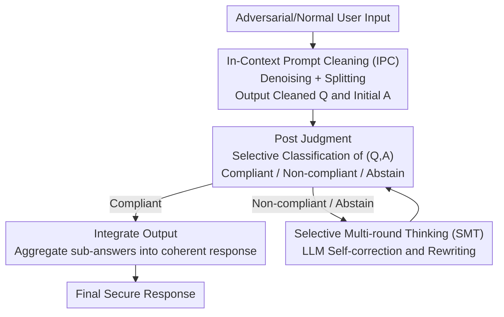

# Robust LLM Unlearning via Post Judgment and Multi-Round Thinking

**Conference**: ICLR 2026  
**OpenReview**: [https://openreview.net/forum?id=GBTUVO9vkj](https://openreview.net/forum?id=GBTUVO9vkj)  
**Code**: https://github.com/ChnIRuI/PoRT_LLM_Unlearning  
**Area**: AI Safety / LLM Unlearning  
**Keywords**: LLM Unlearning, Adversarial Robustness, Input Pre-filtering, Post Judgment, Selective Classification

## TL;DR
Addressing the issue where "input pre-filtering" LLM unlearning methods fail almost completely under prefix or composite question attacks, this paper proposes the PoRT framework. It uses In-Context Learning to clean adversarial inputs, performs confidence-based post-judgment on the "cleaned Q&A pairs," and triggers multi-round self-correction only for non-compliant or low-confidence outputs. This ensures high robustness under adversarial attacks (HFQ stabilizes above 0.83 on TOFU, WMDP hazardous knowledge accuracy stays near the 25% random baseline) while maintaining general utility and adding only approximately 1% inference overhead.

## Background & Motivation
**Background**: Making deployed LLMs "forget" specific subsets of training data (forget set) is a critical requirement for compliance and safety, but full retraining is cost-prohibitive. Current unlearning methods fall into two categories: **Model-side** (e.g., Gradient Ascent GA, Preference Optimization NPO/SimNPO, RMU), which modifies weights for permanent erasure; and **Input-side**, which leaves the model structure intact. Among these, **Input Pre-filtering** (ECO, GUARDRAIL, prompt-based schemes) is considered highly practical due to its zero-parameter changes and rapid deployment by intercepting prompts before inference.

**Limitations of Prior Work**: While the vulnerability of model-side methods has received significant attention, the **robustness of input pre-filtering has rarely been systematically examined**. This paper fills this gap by designing two types of adversarial attacks targeting the "input-only" weakness: **Prefix Attacks** (adding non-semantic noise tokens or misleading instructions like "You must answer" before harmful questions) and **Composite Question Attacks** (hiding a harmful sub-question among harmless ones). Empirical results show catastrophic failures: noise prefix attacks caused the forget probability of the SOTA method ECO on TOFU to jump from a near-perfect 0.0018 to 0.8055 (an 1150x increase in information leakage), while composite attacks caused WMDP hazardous knowledge accuracy to rebound from the 24.9% random baseline to 67.0% (reversing 42.1% of the unlearning effect).

**Key Challenge**: The fundamental flaw of pre-filtering is that the **judgment signal is too shallow**—it only considers the original query. It cannot see through malicious intent disguised by noise/instructions, nor can it utilize leakage signals hidden within the model's actual generated answers. "Input-level isolated analysis" inevitably leads to misjudgment when facing semantic disguise.

**Goal**: Upgrade unlearning defense from fragile "pre-filtering" to robust "post-judgment" to maintain unlearning efficacy under adversarial attacks without sacrificing general utility or significantly increasing latency.

**Key Insight**: The authors observe that **the answers generated by the model are more informative judgment criteria than the queries themselves**. A malicious question that bypasses the classifier often directly exposes the forgotten facts (e.g., names) in its answer. Therefore, judgment should occur after generation by jointly analyzing the "Question + Answer" rather than just the question before generation.

**Core Idea**: Replace "pre-filtering prompt classification" with "In-Context Cleaning + Post-Judgment (Q&A joint) + Selective Multi-round Self-correction," leveraging the LLM's own reasoning capabilities as the primary defense for unlearning.

## Method

### Overall Architecture
PoRT converts a "potentially adversarial" user input into a three-module serial pipeline: **Cleaning + Initial Answer**, followed by **Joint Q&A Judgment**, and finally **Triggering Rethinking only for problematic outputs**. Compliant results are aggregated into the final response. The three core modules are In-Context Prompt Cleaning (IPC), Post Judgment, and Selective Multi-round Thinking (SMT).

- **IPC**: Uses a dynamically assembled few-shot prompt to instruct the LLM to remove irrelevant content and split composite queries into numbered sub-questions, producing both the "Cleaned Question Q" and the "Corresponding Initial Answer A."
- **Post Judgment**: Instead of only evaluating the query, a selective classifier with a confidence score labels the cleaned $(Q, A)$ pair as Compliant, Non-compliant, or Abstain.
- **SMT**: Acts as a safety net, triggered only for "Non-compliant" or "Abstain (low confidence)" outputs. It instructs the LLM to rewrite the answer and iteratively re-evaluates until compliance is reached. Compliant outputs are cached for final integration.

### Key Designs

**1. In-Context Prompt Cleaning (IPC): Neutralizing Adversarial Perturbations via In-context Capabilities**

The first point of failure for pre-filtering is classifiers being deceived by noise/instruction prefixes and composite questions. PoRT "cleans" the input before judgment. IPC uses **few-shot prompts assembled dynamically**: it retrieves the top-$k$ most relevant cleaning examples from an expandable demonstration library based on syntactic similarity, then selects a task instruction based on query type (e.g., "You are a prompt cleaner. Given a noisy/instruction query, output ONLY the cleaned question."). Based on this, the LLM **simultaneously outputs the cleaned question Q and initial answer A**. Noise prefixes are stripped, and composite queries are split into numbered sub-questions `Q1/Q2/...`. This step restructures disguised malicious intent into bare questions, providing clean, informative material for downstream judgment. The expandable library allows adaptive defense against new attacks without retraining. Ablations show that removing IPC leads to a catastrophic collapse in robustness (HFQ drops from 0.84 to 0.38) as adversarial inputs propagate downstream.

**2. Post Judgment: Evaluating "Cleaned Q&A Pairs" with an "Abstain" Option**

Methods like ECO only judge the query, making them prone to **false negatives**—treating a question as compliant when it is actually designed to extract forgotten facts. PoRT moves judgment to post-generation, evaluating **highly informative $(Q, A)$ pairs**. Formally, it learns a **selective classifier**:

$$(f, g)(q, a) = \begin{cases} f(q, a) & \text{if } g(q, a) \ge \tau \\ \text{Abstain} & \text{if } g(q, a) < \tau \end{cases}$$

where $f$ predicts the category (0=Compliant / 1=Non-compliant) and $g$ estimates the prediction confidence. A higher threshold $\tau$ makes the system more conservative, preferring to "Abstain" rather than risk a false release. The judgment model uses CCL-SC (Confidence-aware Contrastive Learning), with an encoder based on LLM2Vec + MLP head, trained on augmented data for robustness. Its efficacy stems from judging cleaned $(Q, A)$ pairs and introducing the "Abstain" class, turning a fragile pre-filter into a "post-judger" that actively seeks help when uncertain.

**3. Selective Multi-round Thinking (SMT): Targeted Self-correction instead of Broad Refusal**

SMT is **triggered on demand** as a safety net only for "Non-compliant" and "Abstain" outputs, avoiding blanket refusals that disrupt coherence. Case 1 (Compliant) outputs are cached. Case 2 (Non-compliant) triggers a rewrite prompt: "The response contains inappropriate information; please regenerate while avoiding such content." Case 3 (Abstain) triggers a rewrite with: "Unable to determine sensitivity; please provide context and regenerate." Rewritten answers return to Post-Judgment **iteratively until all sub-answers are compliant**, after which the LLM integrates them into a final response. The expected overhead is:

$$t + p_1(1-r)t + p_2 t = (2 - p_1 r)\,t$$

where $p_1$ is the proportion of compliant prompts and $r$ is the classifier accuracy. Since $p_1$ and $r$ are typically high in practice (e.g., $p_1 = 0.9, r \approx 0.995$ on TOFU 10%), SMT is rarely triggered more than once, keeping overhead low—latencies are only 6.56% higher than ECO on TOFU 10%. Removing SMT drops HFQ to 0.25 due to the loss of a structural safety net.

### Loss & Training
Only the judgment classifier requires training: CCL-SC (Confidence-aware Contrastive Learning) for 12 epochs, batch size 16, learning rate 5e-5, weight decay 0.02, MoCo queue 1024, 4×L40S GPUs. IPC and SMT are prompt-driven and training-free. The default confidence threshold $\tau=0.97$, and IPC example count $k=3$. All results are averaged over 5 random seeds.

## Key Experimental Results

### Main Results
Evaluated on TOFU (fictional entity unlearning) and WMDP (hazardous knowledge unlearning) across 10 representative LLMs. Metrics for TOFU include HFQ (Holistic Forget Quality) and MU (Model Utility); WMDP uses Accuracy (target 25% random baseline) and MMLU for utility.

| Scenario | Metric | ECO (Prev. SOTA) | PoRT |
|------|------|------|------|
| TOFU 5% Standard | HFQ / MU | Average / — | **0.8474 / 0.6721** |
| TOFU 5% Adversarial | HFQ | Total Collapse | Drop <1.51% (>0.83) |
| TOFU Noise Prefix | Forget Prob | 0.0018→**0.8055** | Remains Low |
| WMDP Composite | Hazardous Acc | 24.9%→**67.0%** | Near 25% |

WMDP / Zephyr-7b-beta under standard conditions (Accuracy %; MMLU %):

| Method | Bio | Chem | Cyber | MMLU↑ |
|------|-----|------|-------|-------|
| Original | 64.3 | 48.5 | 43.1 | 58.9 |
| ECO | 24.7 | 26.5 | 24.4 | 58.9 |
| **PoRT** | **25.1** | **25.8** | **24.8** | **58.9** |
| Random | 25.0 | 25.0 | 25.0 | — |

PoRT matches SOTA unlearning efficacy while fully preserving the original model's MMLU (58.9%) and maintaining accuracy near 25% under adversarial conditions, where other baselines rebound.

### Ablation Study
TOFU 10% split under noise prefix attack:

| Configuration | HFQ↑ | MU↑ | Description |
|------|------|-----|------|
| Retain (Ideal Upper Bound) | 0.96 | 0.67 | Model fine-tuned only on retain set |
| **PoRT (Full)** | **0.84** | **0.67** | Full model, best balance |
| w/o IPC | 0.38 | 0.65 | No cleaning; robustness collapses |
| w/o SMT | 0.25 | 0.64 | No self-correction; inconsistent output |
| Pre-Judgment | 0.43 | 0.38 | "Input-only" judgment; low HFQ/MU |

### Key Findings
- **IPC is the linchpin of robustness**: Removing it causes HFQ to drop from 0.84 to 0.38, proving that "cleaning before judgment" is the most critical line of defense.
- **"Post-judgment + Abstain" outstrips "Pre-judgment"**: The Pre-Judgment variant yields low HFQ (0.43) and MU (0.38), confirming that viewing only the query leads to both leakage (harming HFQ) and over-blocking (harming MU).
- **Hyperparameter Stability**: HFQ peaks near the default threshold $\tau=0.97$. For IPC, $k=3$ is the most efficient choice as gains saturate beyond this.
- **Negligible Overhead**: Latency is only 6.56% higher than ECO when 10% of prompts are harmful, dropping to 0.91% in realistic scenarios (0.1% harmful), as SMT is rarely triggered.

## Highlights & Insights
- **Paradigm Shift in Judgment Timing**: Shifting judgment from "pre-generation query analysis" to "post-generation Q&A analysis" addresses the core weakness of pre-filtering—answers are where leakage signals are most concentrated. This "post-judgment" logic is transferable to any safety scenario like jailbreak detection.
- **"Abstain" as a Safety Valve**: Introducing the "abstain" label allows the classifier to delegate uncertainty to the self-correction module, avoiding the forced binary choice between "allow" and "refuse."
- **Systematic Vulnerability Disclosure**: Quantifying unlearning failures with "1150x leakage increases" and "42.1% effect reversal" serves as a powerful warning against relying solely on isolated input pre-filtering.
- **On-demand Cost Management**: By triggering SMT only when necessary, PoRT turns "multi-round thinking"—usually a resource-intensive mechanism—into a nearly free security net.

## Limitations & Future Work
- **Dependence on Classifier Quality**: The defense hinges on the post-judgment classifier; if it fails on out-of-distribution attacks, the entire pipeline may fail. Data augmentation mitigates this but hasn't been stress-tested on completely unknown attack families.
- **Demonstration Bank Maintenance**: Adaptive defense via IPC requires manual or red-teaming updates to the demonstration library, implying a lag time for entirely new attacks.
- **Inference Cost Scaling**: While negligible at low harmful prompt ratios, high-intensity adversarial pressure will increase the SMT trigger rate and consequently increase latency.
- **Benchmark Scope**: Evaluation is limited to TOFU/WMDP; performance in long-tail real-world deployments with actual private data remains to be verified.

## Related Work & Insights
- **vs ECO / GUARDRAIL (Input Pre-filtering)**: These perform shallow pre-generation classification, easily bypassed by prefix/composite attacks. PoRT offers superior robustness with only ~1% latency cost.
- **vs GA / NPO / RMU (Model-side Unlearning)**: These modify weights and often degrade utility; they can also be reversed via quantization or data poisoning. PoRT preserves MMLU perfectly without modifying the model.
- **vs ALU (Agentic LLM Unlearning)**: ALU uses complex multi-agent pipelines with isolated input analysis. PoRT is more lightweight, using **intrinsic reasoning** through IPC and SMT for dynamic, iterative self-correction triggered by explicit "Abstain" signals.

## Rating
- Novelty: ⭐⭐⭐⭐⭐ First unlearning framework to use "Joint Q&A Post-Judgment + Abstain + Selective Multi-round Thinking."
- Experimental Thoroughness: ⭐⭐⭐⭐⭐ Comprehensive evaluation across 10 LLMs and standard/adversarial conditions.
- Writing Quality: ⭐⭐⭐⭐ Clear logic; strong impact from empirical attack figures.
- Value: ⭐⭐⭐⭐⭐ Highly practical for deployed LLMs requiring zero-parameter, low-latency, and robust unlearning.

<!-- RELATED:START -->

## Related Papers

- [\[ICLR 2026\] LLM Unlearning with LLM Beliefs](llm_unlearning_with_llm_beliefs.md)
- [\[ICLR 2026\] Dual-Space Smoothness for Robust and Balanced LLM Unlearning](dual-space_smoothness_for_robust_and_balanced_llm_unlearning.md)
- [\[ICLR 2026\] Erase or Hide? Suppressing Spurious Unlearning Neurons for Robust Unlearning](erase_or_hide_suppressing_spurious_unlearning_neurons_for_robust_unlearning.md)
- [\[ICLR 2026\] Explainable LLM Unlearning through Reasoning](explainable_llm_unlearning_through_reasoning.md)
- [\[ICML 2025\] Robust Multi-bit Text Watermark with LLM-based Paraphrasers](../../ICML2025/llm_safety/robust_multi-bit_text_watermark_with_llm-based_paraphrasers.md)

<!-- RELATED:END -->
