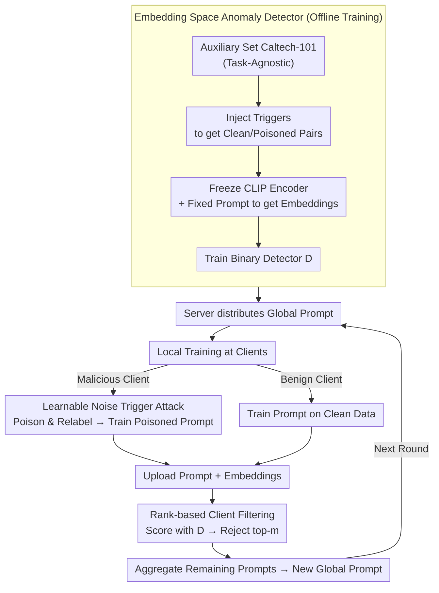

# SABRE-FL: Selective and Accurate Backdoor Rejection for Federated Prompt Learning

**Conference**: ICLR2026  
**arXiv**: [2506.22506](https://arxiv.org/abs/2506.22506)  
**Code**: To be released  
**Area**: AI Security  
**Keywords**: federated learning, Prompt Learning, Backdoor Attack, CLIP, Anomaly Detection

## TL;DR
The first study to investigate backdoor attack threats in Federated Prompt Learning scenarios, proposing SABRE-FL—a lightweight server-side defense method based on embedding space anomaly detection that effectively filters poisoned prompt updates without accessing raw client data.

## Background & Motivation
- **Federated Prompt Learning (FPL)** is an emerging paradigm: clients optimize only lightweight prompt vectors while keeping the CLIP backbone frozen, then upload prompts to the server for aggregation, significantly reducing communication and computation overhead.
- Federated learning naturally faces backdoor attack risks—malicious clients can pollute local data by injecting triggers, causing the global model to perform targeted misclassification on triggered inputs during inference.
- Existing backdoor studies focus on traditional unimodal FL (full parameter fine-tuning). In FPL, the attack surface is limited to prompt vectors and the image encoder is frozen; both the attack feasibility and defense strategies remain unexplored.
- The motivation of this work is two-fold: **(1)** To verify if FPL is truly vulnerable; **(2)** To design targeted defenses.

## Core Problem
1. **Attack Level**: In FPL, can malicious clients successfully plant backdoors via learnable imperceptible noise triggers, causing the global prompt learner to misclassify triggered samples during inference without affecting accuracy on clean samples?
2. **Defense Level**: How can poisoned prompt updates be detected and filtered at the server side without depending on raw client data, labels, or downstream task information?

## Method

### Overall Architecture
This paper follows an "attack first, then defend" structure: the first half constructs a backdoor attack in Federated Prompt Learning (FPL, where clients freeze CLIP and only train/upload prompt vectors) to prove this lightweight paradigm is equally vulnerable; the second half proposes the server-side defense SABRE-FL against such attacks. The attack and defense mirror each other: malicious clients use a learnable imperceptible trigger to push image embeddings toward a target class, thereby poisoning the uploaded prompts; to deceive the classifier, the trigger must leave a consistent shift in the CLIP embedding space. SABRE-FL exploits this shift by training an offline binary anomaly detector to score embeddings from each client before aggregation and reject the most suspicious ones. The more successful an attack is, the more conspicuous it becomes in the embedding space and the easier it is for the detector to capture.

The diagram below integrates "offline detector training" with the cycle of "attack injection → detection/filtering → aggregation" in each federated round:

### Key Designs

**1. Learnable Noise Trigger Attack: Planting Backdoors under Frozen Encoders**

In FPL, the image encoder is frozen and clients only optimize prompt vectors, making the attack surface appear narrow—backdoor signals cannot directly modify model weights and must propagate indirectly through prompt aggregation, making them weaker and more susceptible to noise. The attacker's countermeasure is to jointly optimize the prompt and a visually imperceptible trigger $t$. In a standard FL setting where 25% of $N$ clients are controlled, malicious clients perform dirty-label processing: relabeling images containing the trigger $x^\star = x \oplus t$ as the target class $c_t$, and optimizing $t$ so that its CLIP image embedding is closer to the target class in the text space, satisfying for any non-target class $y$:

$$\cos(f_{\text{img}}(x^\star), f_{\text{text}}(c_t)) > \cos(f_{\text{img}}(x^\star), f_{\text{text}}(y))$$

The resulting global prompt learner remains nearly lossless on clean samples (e.g., Aircraft clean accuracy 32.3→32.8) but is specifically misled on triggered samples, with the backdoor success rate reaching up to 93.9% on Aircraft. This demonstrates that the prompt-only attack surface is sufficient for a strong backdoor, confirming the vulnerability of FPL as a critical pain point for defense.

**2. Embedding Space Anomaly Detector: Repurposing Attack Signals for Detection**

While the attack is invisible at the pixel level, it exposes a structural flaw: for a trigger to deceive the classifier, it must produce a consistent shift in the CLIP embedding space, creating a separable distance $\|z - z^\star\|_2 > \epsilon$ between poisoned and clean embeddings. SABRE-FL leverages this by using an auxiliary set (Caltech-101), which is entirely independent of the downstream tasks, to construct offline training pairs. Clean images and those with injected triggers are passed through the same frozen encoder $f_{\text{img}}(\cdot)$ and fixed prompts to obtain embeddings, labeled as clean ($y_i=0$) or poisoned ($y_i=1$). A binary classifier $D: \mathbb{R}^d \to \{0,1\}$ is then trained by minimizing standard cross-entropy to determine if a single embedding is poisoned. Crucially, this shift is a structural byproduct of the attack rather than a specific dataset characteristic, allowing the detector trained on OOD data to generalize across five different domains (Flowers, Pets, DTD, Aircraft, Food101) without ever seeing the downstream tasks.

**3. Rank-based Client Filtering and Privacy-Preserving Aggregation: Rejecting Poisoned Parties Without Raw Data**

With the detector ready, it must be integrated into the federated aggregation rounds. Instead of using a fixed threshold $\tau$ (which is difficult to calibrate and unstable across domains), SABRE-FL employs a rank-based heuristic: in each round, the server calculates the average detection score $S_k = \frac{1}{n_k}\sum_j D(z_j^k)$ for the embedding set $\{z_j^k\}$ returned by client $C_k$. Clients are then sorted by their status, and the top $m$ clients are rejected, where $m$ is an upper bound on the number of malicious clients. The prompts from the remaining clients are then aggregated. The entire defense operates solely in the embedding space: clients upload task-agnostic compressed vectors produced by the frozen encoder, which do not expose raw images, labels, or gradients. Thus, the defense introduces minimal privacy risks.

## Key Experimental Results

### Attack Performance (No Defense / FedAvg)

| Dataset | No Attack CA | Under Attack CA | Backdoor BA |
|---------|----------|----------|---------|
| Flowers | 80.9 | 77.9 | 41.7 |
| Pets | 94.5 | 94.2 | 16.3 |
| DTD | 65.2 | 65.6 | 34.8 |
| Aircraft | 32.3 | 32.8 | **93.9** |
| Food101 | 90.7 | 90.0 | 20.6 |

The attack successfully injects backdoors while maintaining clean accuracy (CA), with BA reaching 93.9% on Aircraft.

### Defense Comparison (BA across five datasets, lower is better)

| Defense Method | Flowers | Pets | DTD | Aircraft | Food101 |
|----------|---------|------|-----|----------|---------|
| No Defense | 41.7 | 16.3 | 34.8 | 93.9 | 20.6 |
| Trimmed Mean | 12.3 | 5.6 | 31.0 | 83.1 | 6.4 |
| Median | 10.4 | 5.3 | 28.1 | 79.4 | 5.5 |
| Norm Bounding | 22.0 | 22.5 | 37.5 | 86.2 | 17.2 |
| FLAME | 3.8 | 7.8 | 8.7 | 16.4 | 3.2 |
| **SABRE-FL** | **1.1** | **4.4** | **6.8** | **7.6** | **1.9** |

SABRE-FL achieves the lowest BA across all five datasets, while maintaining clean accuracy comparable to or even better than the no-defense baseline.

### Ablation Study
- **Number of Prompt Shots**: As the shot count increases (2→16), the BA without defense rises significantly (exceeding 85% for Aircraft and Food101). With SABRE-FL enabled, BA consistently remains below 5%.
- **Malicious Client Ratio**: With 25% malicious clients, Aircraft BA reaches 93.9%; at 50%+, BA for most datasets exceeds 80%. Clean accuracy remains largely unaffected throughout.

## Highlights & Insights
- **First Study on FPL Backdoor Security**: Fills the research gap in multimodal federated prompt learning security by establishing both attack baselines and defense solutions.
- **Elegant Defense Design**: Exploits the duality where "the signal for attack success is the detection signal for defense"—the trigger's ability to deceive the classifier implies a detectable embedding shift.
- **Zero Data Dependency**: The detector is trained offline on OOD auxiliary sets without requiring client data, labels, or task information, making it extremely low-cost to deploy.
- **Strong Cross-Domain Generalization**: A detector trained on Caltech-101 remains effective across five diverse domains: Flowers, DTD, Aircraft, Food101, and Pets.

## Limitations & Future Work
- **Requirement for Malicious Client Upper Bound**: Rank-based filtering assumes the upper bound $m$ of malicious clients is known, which may not be available in practical deployments.
- **Narrow Testing of Trigger Types**: Only learnable noise triggers were tested; the defense's effectiveness against patch-based triggers, semantic triggers, or other backdoor attacks remains to be verified.
- **Additional Communication Overhead**: Compared to pure prompt aggregation in FPL, SABRE-FL requires clients to transmit image embeddings, increasing communication load and potential privacy exposure.
- **Limited Dataset Scale**: Tests were conducted on five small-scale fine-grained datasets; verification on large-scale data like ImageNet is missing.
- **Absence of Adaptive Attacks**: Scenarios where the attacker knows the defense mechanism and attempts to adapt were not considered.

## Related Work & Insights

| Dimension | BadCLIP (CVPR'24) | A3FL / IBA (Traditional FL Backdoor) | SABRE-FL |
|------|-------------------|--------------------------|----------|
| Scenario | Centralized Prompt Learning | Unimodal FL (Full Param) | Federated Prompt Learning |
| Attack Surface | All Training Data | Model Params + Data | Only Prompt Vectors |
| Defense Mode | No Specific Defense | Robust Aggregation (Trimmed Mean, etc.) | Embedding Space Anomaly Detection |
| Data Dependency | — | Requires Validation Set | OOD Auxiliary Set, No Client Data |

## Related Work & Insights
- The core idea of "detecting backdoors in the representation space rather than pixel/parameter space" is versatile and could be extended to other foundation model fine-tuning scenarios (e.g., federated learning of LoRA adapters).
- The architecture of frozen encoders + learnable prompts makes embedding shift a necessary condition for a backdoor, and this structural constraint is key to designing high-efficiency defenses.
- Security research for federated prompt learning is still in its early stages; directions like adaptive attacks, multi-target attacks, and clean-label attacks are worth further exploration.
- The fact that the detector generalizes despite being trained on OOD data suggests that backdoor embedding shifts are a structural byproduct of the attack, offering new ideas for backdoor defense in other modalities (NLP, audio).
- When the ratio of malicious clients exceeds 50%, BA approaches 100%, highlighting the potential threat of Sybil attacks in FPL.

## Rating
- Novelty: ⭐⭐⭐⭐ (First systematic study of FPL backdoor defense; excellent entry point)
- Experimental Thoroughness: ⭐⭐⭐⭐ (Five datasets + four baselines + ablations, but lacks large-scale and adaptive attack validation)
- Writing Quality: ⭐⭐⭐⭐ (Clear structure, tight integration of theory and experiments)
- Value: ⭐⭐⭐⭐ (Fills an important research gap with a practical defense method)

<!-- RELATED:START -->

## Related Papers

- [\[ICLR 2026\] SHE-LoRA: Selective Homomorphic Encryption for Federated Tuning with Heterogeneous LoRA](she-lora_selective_homomorphic_encryption_for_federated_tuning_with_heterogeneou.md)
- [\[ICLR 2026\] BEAT: Visual Backdoor Attacks on VLM-based Embodied Agents via Contrastive Trigger Learning](beat_visual_backdoor_attacks_on_vlm-based_embodied_agents_via_contrastive_trigge.md)
- [\[AAAI 2026\] FedP²EFT: Federated Learning to Personalize PEFT for Multilingual LLMs](../../AAAI2026/llm_safety/fedp2eft_federated_learning_to_personalize_peft_for_multilingual_llms.md)
- [\[ICML 2025\] ICLShield: Exploring and Mitigating In-Context Learning Backdoor Attacks](../../ICML2025/llm_safety/iclshield_exploring_and_mitigating_in-context_learning_backdoor_attacks.md)
- [\[ICCV 2025\] LATTE: Collaborative Test-Time Adaptation of Vision-Language Models in Federated Learning](../../ICCV2025/llm_safety/latte_collaborative_test-time_adaptation_of_vision-language_models_in_federated_.md)

<!-- RELATED:END -->
