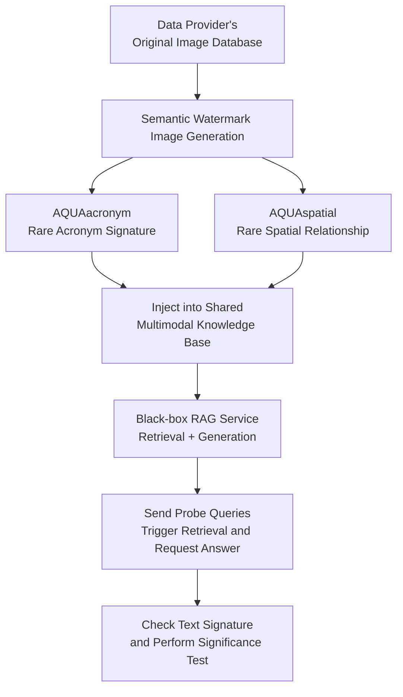

# Safeguarding Multimodal Knowledge Copyright in the RAG-as-a-Service Environment

**Conference**: ICLR2026  
**OpenReview**: [https://openreview.net/forum?id=eWBu4tY9ta](https://openreview.net/forum?id=eWBu4tY9ta)  
**Code**: https://github.com/tychenn/AQUA  
**Area**: LLM Security  
**Keywords**: Multimodal RAG, Data Copyright, Image Watermarking, RAG-as-a-Service, Black-box Auditing

## TL;DR
AQUA targets multimodal image knowledge bases unauthorizedly integrated by platforms in RAG-as-a-Service environments. It designs two types of semantic watermark images that are retrievable and manifest in textual responses without significantly disrupting normal services. Using a small number of probe queries, it statistically determines whether a black-box multimodal RAG utilizes the copyright owner's data.

## Background & Motivation
**Background**: RAG is evolving from private retrieval modules in individual applications to service models like RAG-as-a-Service (RaaS). Multiple data providers contribute knowledge to a shared repository, which the platform uses to provide QA capabilities. End users only see generated results, not the underlying raw data. For text RAG, methods like canary documents or language model watermarking exist to prove data usage.

**Limitations of Prior Work**: These methods almost exclusively assume knowledge is text-based, yet real-world multimodal RAG heavily utilizes images, tables, and cross-modal content. For image knowledge, traditional watermarking pursues pixel-level imperceptibility and image-level detection, requiring the auditor to access the image or a controllable decoder. In RaaS, data providers usually only have access to public APIs and cannot inspect retrieval results or request original images. Thus, hiding watermarks in pixels is insufficient; watermarks must be retrieved by text queries and converted into verifiable text answers by a VLM generator.

**Key Challenge**: Multimodal RAG copyright auditing faces a cross-modal propagation problem: the watermark carrier is an image, the audit interface is text, and evidence is typically observable only in generated text. If the watermark is too similar to normal images, the retriever fails to pull it into the top-k; if it is too anomalous, it is easily filtered or affects normal queries. This paper addresses the simultaneous goals of "retrievability, generatability, imperceptibility, and robustness."

**Goal**: The authors define the problem as text-to-text multimodal RAG, where users input text queries, the system retrieves image knowledge, and a VLM/multimodal generator outputs text answers. The defender (data provider) injects watermarks before contributing data; the attacker is an unauthorized RAG provider, and the defender audits via a black-box API using probe queries.

**Key Insight**: The critical observation is that image watermarks do not need to be low-level pixel perturbations. As long as a watermark image contains a signal that is "semantically unique, visually natural, and targetable by text queries," it can be retrieved by CLIP-like retrievers and transcribed by the generator. AQUA treats the watermark as a cross-modally transferable semantic carrier rather than an invisible perturbation.

**Core Idea**: Use synthetic images to carry rare acronyms or rare spatial relationships. These semantic signals trigger image-text retrieval and appear as signatures in the VLM's text responses. This transforms the question of "whether images are included in the RAG database" into a statistical hypothesis testing problem of "whether probe queries consistently yield preset text signatures."

## Method
### Overall Architecture
The AQUA pipeline is divided into injection and verification. At injection, the data provider generates watermark images and contributes them to the RaaS platform. At verification, the provider sends probe queries with trigger conditions and instructions to the suspect RAG service, observes if preset signatures appear, and performs statistical testing based on success rates.

In this system, the retriever consists of a text encoder $E_{text}$ and an image encoder $E_{img}$. The image database $D=\{I_1,\ldots,I_n\}$ is encoded into vectors, and the text query $T$ is encoded into the same semantic space. The retriever fetches top-k images, and the generator $G$ outputs an answer based on the query and retrieved images. AQUA inserts image knowledge that leaves textual evidence across this full chain.

The two branches cover different generator capabilities: AQUAacronym uses full names of acronyms as signatures for models with strong OCR, while AQUAspatial uses special object relationships as signatures for models with weaker OCR. Both bypass the limitations of "image-domain only" detection.

### Key Designs
**1. AQUAacronym: Designing Image Watermarks as OCR-Transcribable Rare Acronym Signatures**

AQUAacronym constructs rare acronym-full name pairs, such as `(UGP, Unicorn Grammar Parser)`, and embeds the acronym or phrase into synthetic images. The full name is a secret key designed by the provider; since it is rare, a "clean" RAG is unlikely to generate it by chance. The probe query $T_{probe}=T_{trigger}\oplus T_{instruction}$ uses $T_{trigger}$ to ensure the retriever finds the image and $T_{instruction}$ to command the generator to output the signature.

**2. AQUAspatial: Replacing OCR with Rare Spatial Relationships for Naturalness**

For scenarios involving weak OCR or text filtering, AQUAspatial uses unique but natural object configurations, such as "a dog reading a book with a red apple on its head." These images are synthesized via diffusion models using low-cooccurrence concepts filtered by LLM perplexity to balance uniqueness and natural appearance. AQUAspatial transforms watermarking from "reading characters" to "answering a rare visual fact."

**3. Black-box Statistical Verification: Quantifiable Copyright Evidence**

Due to sampling randomness in RAG, AQUA uses multiple watermark images and diverse probe queries. Success is determined by normalized substring matching. The Verification Success Rate (VSR) is the average over $N_{wm}$ images and $N_{ds}$ queries:

$$
VSR=\frac{1}{N_{wm}N_{ds}}\sum_{j=1}^{N_{wm}}\sum_{i=1}^{N_{ds}}Eval(O_{RAG}^{i,j}, S_i)
$$

Welch's t-test compares the VSR of the suspect RAG against a clean RAG. If the p-value is below a significance level (e.g., $\alpha=0.05$), the null hypothesis is rejected, indicating the suspect system likely contains the watermarked data.

**4. Performance Metrics Decomposition: Retrieval vs. Generation**

Failures are diagnosed using Rank and CGSR. Rank measures the position of the watermark image in top-k results (lower is better). CGSR (Correct Generation Success Rate) calculates the signature success rate specifically for cases where the watermark image was successfully retrieved:

$$
CGSR=\frac{\sum_{t\in T_{retrieved}}Eval(O_{RAG}^{(t)}, S^{(t)})}{|T_{retrieved}|}
$$

### Loss & Training
AQUA does not require training a new RAG model or white-box fine-tuning. Its "training" is data construction: using LLMs to generate rare pairs or captions and diffusion models to synthesize images. Optimization-based baselines perform iterative updates via PGD to minimize $\min_{\delta}L(G(I_{base}+\delta,T_{probe}),S)$, but AQUA's semantic approach proves more query-efficient and robust.

## Key Experimental Results
### Main Results
Evaluations on MMQA (58k images) and WebQA (389k images) using CLIP-ViT-L/14 and generators like LLaVA-NeXT and Qwen2.5-VL.

| Generator | Method | MMQA Rank↓ | MMQA CGSR↑ | WebQA Rank↓ | WebQA CGSR↑ |
|-----------|--------|------------|------------|-------------|-------------|
| LLaVA-NeXT | Naive | 2.86 | 28.16% | 4.56 | 13.28% |
| LLaVA-NeXT | Opt. | 1.45 | 31.03% | 1.90 | 22.86% |
| LLaVA-NeXT | AQUAacronym | 1.03 | 85.36% | 1.05 | 78.73% |
| LLaVA-NeXT | AQUAspatial | 1.29 | 75.38% | 1.85 | 86.45% |
| Qwen2.5-VL-Instruct | AQUAacronym | 1.03 | 99.61% | 1.05 | 96.68% |
| Qwen2.5-VL-Instruct | AQUAspatial | 1.29 | 98.42% | 1.85 | 89.85% |

AQUA achieves extremely low p-values (e.g., $6.29e^{-289}$) and high query efficiency, reaching significance in under 30 queries compared to over 200 for optimization baselines.

### Ablation Study
- **Benign Query Harmlessness**: Watermark retrieval rate is 0% for over 10,000 normal queries.
- **Stealthiness**: VLM-based anomaly filters fail to detect AQUA images (TPR $\approx$ 0% at low FPR).
- **Scalability**: CGSR remains high even when adding 50k distractor images.

### Key Findings
- AQUA's gain comes from "semantic retrievability + textual verifiability."
- AQUAacronym is highly effective for OCR-capable models, while AQUAspatial proves spatial semantics are sufficient for auditing.
- Defenders can detect data usage with high confidence without degrading the performance of legitimate queries or being caught by simple filters.

## Highlights & Insights
- Reconceptualizing cross-modal copyright watermarking as a semantic audit within the RAG chain is a significant contribution.
- The two branches (Acronym vs. Spatial) provide complementary coverage for different model capabilities and filtering scenarios.
- The decomposition of Rank and CGSR allows for a clear understanding of where the audit chain might fail.

## Limitations & Future Work
- Primarily designed for text-to-text multimodal RAG; future work is needed for image-output or multi-turn agentic RAG.
- Strategic platforms might employ human review or distribution auditing to block synthetic images.
- Advanced attackers could use paraphrasing or entity evasion to lower explicit signature hits.

## Related Work & Insights
Ours differs from text-based RAG watermarking (like WARD or RAG-WM) by focusing on image carriers. Unlike traditional image watermarks that require pixel access, AQUA operates through black-box text APIs, making it practical for the RaaS era.

## Rating
- Novelty: ⭐⭐⭐⭐⭐ 
- Experimental Thoroughness: ⭐⭐⭐⭐⭐ 
- Writing Quality: ⭐⭐⭐⭐☆ 
- Value: ⭐⭐⭐⭐⭐ 

<!-- RELATED:START -->

## Related Papers

- [\[ICLR 2026\] Silent Leaks: Implicit Knowledge Extraction Attack on RAG Systems through Benign Queries](silent_leaks_implicit_knowledge_extraction_attack_on_rag_systems.md)
- [\[ICLR 2026\] Knowledge Externalization: Reversible Unlearning and Modular Retrieval in Multimodal Large Language Models](knowledge_externalization_reversible_unlearning_and_modular_retrieval_in_multimo.md)
- [\[ACL 2026\] Do Multimodal RAG Systems Leak Data? A Comprehensive Evaluation of Membership Inference and Image Caption Retrieval Attacks](../../ACL2026/llm_safety/do_multimodal_rag_systems_leak_data_a_comprehensive_evaluation_of_membership_inf.md)
- [\[ACL 2026\] LeakDojo: Decoding the Leakage Threats of RAG Systems](../../ACL2026/llm_safety/leakdojo_decoding_the_leakage_threats_of_rag_systems.md)
- [\[ACL 2026\] CrossGuard: Safeguarding MLLMs against Joint-Modal Implicit Malicious Attacks](../../ACL2026/llm_safety/crossguard_safeguarding_mllms_against_joint-modal_implicit_malicious_attacks.md)

<!-- RELATED:END -->
