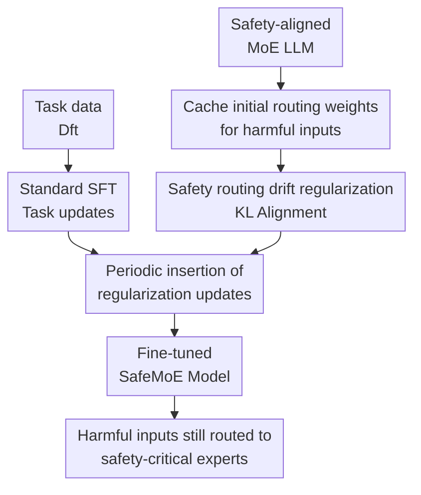

# SafeMoE: Safe Fine-Tuning for MoE LLMs by Aligning Harmful Input Routing

**Conference**: ICLR 2026  
**OpenReview**: [https://openreview.net/forum?id=W1x9AzkSnU](https://openreview.net/forum?id=W1x9AzkSnU)  
**Code**: https://github.com/jaehanwork/SafeMoE  
**Area**: LLM Safety / MoE Safety Fine-tuning  
**Keywords**: MoE LLM, Safety Fine-tuning, harmful fine-tuning, routing drift, safety-critical experts  

## TL;DR
SafeMoE identifies that MoE LLMs route harmful inputs away from initial safety-critical experts after fine-tuning. By applying KL regularization to the router distribution on harmful instructions, it aligns the fine-tuned model's routing back to the safety-aligned initial model, significantly reducing harmful fine-tuning risks with minimal impact on downstream task performance.

## Background & Motivation
**Background**: Increasingly, Large Language Models (LLMs) adopt the Mixture-of-Experts (MoE) architecture, using a gating network to select a small subset of experts for each token. This supports larger total parameter scales with fewer active parameters. Simultaneously, model providers rely on user fine-tuning services to allow customers to adapt safety-aligned models to specific tasks.

**Limitations of Prior Work**: Existing research shows that standard dense LLMs lose safety alignment under harmful fine-tuning (HFT). MoE LLMs present an additional vulnerability: safety behavior does not just emerge from the global preference of all parameters but depends heavily on whether harmful inputs are routed to a few safety-critical experts. If fine-tuning alters these expert selections, the safety refusal path may be bypassed even without large-scale parameter tampering.

**Key Challenge**: Most existing defenses treat MoE models as dense Transformers, constraining parameter drift, adding safety samples, or pruning weights post-hoc, without directly constraining the MoE routing mechanism. For MoEs, which experts are activated is inherently part of the safety mechanism; controlling parameter updates without controlling routing weights may still allow harmful inputs to flow to incorrect experts.

**Goal**: The authors first aim to verify whether safety degradation in MoE fine-tuning is truly correlated with routing changes, and then design a defense method that can be embedded into standard fine-tuning workflows. This method must preserve safety under HFT attacks while maintaining downstream task accuracy without significant overhead.

**Key Insight**: A key observation is that safety-aligned MoE LLMs exhibit relatively stable routing patterns for harmful inputs, activating safety-critical experts. If the routing pattern deviates from the initial model after fine-tuning, the harmfulness score increases; conversely, temporary restoration of the initial routing weights during inference can significantly recover safety.

**Core Idea**: Instead of broadly restricting all parameter drift, the method directly treats the router distribution of harmful inputs as the safety target. It penalizes the routing KL gap between the fine-tuned model and the initial safety model during fine-tuning, ensuring harmful inputs continue to be directed toward the experts originally responsible for safety refusal.

## Method

### Overall Architecture
The workflow of SafeMoE consists of three main components: first, using a safety-aligned MoE LLM as a reference to cache its routing weights on a small set of harmful instructions; second, performing standard supervised fine-tuning (SFT) on task data; and finally, periodically inserting routing drift regularization steps to align the current model's routing for harmful inputs with the reference model. Thus, the model learns downstream tasks like SAMSum or SQL while preserving original safety routing for harmful inputs.

The defense target is not the output text itself, but the gating distribution of each MoE layer. SafeMoE operationalizes "safety" as an optimizable intermediate variable: for the final token of a harmful instruction, the Softmax weights of each layer's router across all experts should remain similar to the initial safety model. This constraint allows fine-tuning services to maintain the learned safety structure without knowing exactly what content an attacker might induce the model to generate.

### Key Designs
**1. Safety Routing Drift: Defining MoE safety degradation via router distributions**

SafeMoE defines safety routing drift to measure whether the fine-tuned model's routing on harmful inputs deviates from the initial safety-aligned model. Given the initial model $w_{align}$, fine-tuned model $w_{ft}$, and harmful instruction $x$, the paper measures drift using the KL divergence of their routing weights: $d(w_{ft}, x)=D_{KL}(\sigma(r(x|w_{align}))\|\sigma(r(x|w_{ft})))$. Here, $r(x|w)$ is the expert routing vector for input $x$, and $\sigma$ is the Softmax function. 

This metric converts the abstract judgment of MoE safety into a measurable quantity. The authors observe in OLMoE, Qwen1.5 MoE, and DeepSeek V2 that safety routing drift increases during both benign fine-tuning and HFT, correlating strongly with harmfulness scores. This indicates that safety degradation in MoEs is not merely an output layer shift but a rewrite of the routing mechanism.

**2. Routing Drift Regularization: Preserving safety-aligned expert selection**

After establishing the correlation, SafeMoE uses the drift definition directly as a training regularizer. For a harmful instruction dataset $D_h$ and transformer layer set $L$, it minimizes the KL gap between the current and initial model for the routing weights of the final token in each layer:

$$
L_{reg}(w)=\mathbb{E}_{x\in D_h}\mathbb{E}_{l\in L}D_{KL}\left(\sigma(r^{(l)}(x|w_{align})/\tau)\|\sigma(r^{(l)}(x|w)/\tau)\right).
$$

This does not force the model to always output refusal templates but constrains the intermediate MoE paths: when an input displays harmful intent, the router still sends tokens to the experts likely to trigger safety responses. The temperature $\tau$ controls the regularization intensity; smaller $\tau$ makes the distribution sharper, focusing regularization on top-ranked safety-critical experts.

**3. Greedy Bi-level Optimization: Low-overhead training insertion**

Optimizing $L_{sft}+L_{reg}$ at every step incurs high costs due to extra forward and backward passes on harmful instructions. SafeMoE employs a bi-level greedy optimization: pre-calculate routing weights for $w_{align}$ on $D_h$, then perform normal SFT for most steps. Every $T_{reg}$ steps, one round of routing regularization updates is performed using $D_h$.

This design transforms safety constraints into periodic calibration. By default, $T_{reg}$ is set to the number of steps per epoch. Experiments show this greedy strategy effectively suppresses routing drift without disrupting the task optimization trajectory.

**4. Layer Selection and Expert Activation: Upper layers as safety levers**

Analysis of routing drift across layers reveals that drift is significantly higher in the upper layers of models like OLMoE. This aligns with observations that harmful features in LLMs become more separable in middle-to-late layers, which are closer to behavioral decision-making and safety refusal paths. Consequently, a layer-selective version of SafeMoE can achieve similar defense results by only regularizing specific upper layers (e.g., layers 8-15), further reducing overhead.

### Loss & Training
The objective is $\arg\min_w L_{sft}(w)+L_{reg}(w)$, implemented via alternating greedy approximation. Weights are initialized to $w_{align}$ and reference routing weights are cached. Standard steps use $D_{ft}$ to compute $\nabla_w L_{sft}$ for Adam updates. If $t \bmod T_{reg}=0$, the model performs an update using $\nabla_w L_{reg}$ on a batch from $D_h$.

Default implementation uses 100 SafeInstr harmful instructions for $D_h$. LoRA fine-tuning is conducted for 3 epochs with a learning rate of $1e^{-4}$ and batch size 32. For larger models like gpt-oss or Llama 4, the same principles apply using appropriate GPU resources or quantization settings.

## Key Experimental Results

### Main Results
Evaluation was conducted on OLMoE, Qwen1.5 MoE, and DeepSeek V2 across SAMSum (summarization) and SQL generation. FA represents task accuracy, while HS denotes the percentage of outputs judged unsafe by Llama-Guard-4-12B (lower is better).

| Model / Task | Method | FA↑ | HS↓ | Key Conclusion |
|--------|------|------|------|----------|
| OLMoE / SAMSum | Fine-tuning | 49.3 | 62.0 | Standard FT significantly damages safety |
| OLMoE / SAMSum | SafeDelta | 48.6 | 13.0 | Post-hoc delta correction helps but is unstable |
| OLMoE / SAMSum | SAFEMOE | 48.9 | 5.0 | HS drops from 62.0 to 5.0, FA drops <1 point |
| OLMoE / SQL | Fine-tuning | 58.5 | 64.0 | High harmfulness produced in SQL tasks |
| OLMoE / SQL | SAFEMOE | 59.0 | 17.0 | Task accuracy increases slightly, safety improves |
| Qwen1.5 MoE / SAMSum | Fine-tuning | 50.4 | 49.0 | Significant safety degradation after HFT |
| Qwen1.5 MoE / SAMSum | SAFEMOE | 50.6 | 0 | Routing regularization nearly restores safety |
| DeepSeek V2 / SQL | Fine-tuning | 70.1 | 72.0 | Highest risk group under standard FT |
| DeepSeek V2 / SQL | SAFEMOE | 69.1 | 4.0 | HS drops from 72.0 to 4.0 |

Large-scale experiments on gpt-oss, Qwen3 MoE, Phi-3.5 MoE, Llama 4, and Mixtral evaluated MMLU-Redux-2.0 and harmfulness under a strong attack (5k harmful samples).

| Model | Aligned MMLU / HS | Fine-tuning MMLU / HS | SAFEMOE MMLU / HS | Observation |
|------|-------------------|------------------------|---------------------|------|
| gpt-oss | 85.4 / 2.0 | 77.5 / 84.0 | 79.6 / 7.0 | Significant safety recovery; mitigates MMLU drop |
| Qwen3 MoE | 89.6 / 1.0 | 89.1 / 67.0 | 88.8 / 4.0 | Preserves reasoning while slashing HS |
| Phi 3.5 MoE | 83.3 / 2.0 | 80.7 / 83.0 | 81.4 / 2.0 | Restored to near-aligned safety levels |
| Llama 4 | 90.4 / 7.0 | 89.5 / 79.0 | 89.8 / 3.0 | Effective even on 109B parameter models |
| Mixtral | 78.9 / 7.0 | 66.5 / 78.0 | 78.4 / 8.0 | Preserves most reasoning performance |

### Ablation Study
| Configuration / Analysis | Key Metrics | Description |
|------|---------|------|
| OLMoE Standard FT | FA 49.3, HS 62.0 | Routing drift and harmfulness rise simultaneously |
| SAFEMOE | FA 48.9, HS 5.0 | Maintains task performance while suppressing HS |
| Blocking expert gradients | FA 48.2, HS 18.0 | Strong defense even when isolating gating-only effects |
| Full Fine-tuning + SAFEMOE | FA 51.0, HS 2.0 | Effective for full FT; overhead only +2.3% |
| HEx-PHI Benchmark | HS 6.3 | Outperforms SafeInstr, SaLoRA, Antidote, SafeDelta |
| Upper layer (8-15) only | Near Full Full Reg | Upper layers exhibit higher drift; selective reg saves cost |

### Key Findings
- The Pearson correlation between safety routing drift and harmfulness score is extremely high (e.g., $r=0.9616$ for OLMoE benign FT), suggesting drift is the primary driver of safety loss.
- Dense LLM defenses are unstable on MoEs: SafeInstr reduces HS moderately but leaves significant risk; SaLoRA and SafeDelta often sacrifice task accuracy or fail to stop upper-layer drift.
- Overhead is minimal. For OLMoE LoRA, SafeMoE adds ~2.13% training time, whereas SaLoRA adds ~92.41%.
- Smaller $\tau$ focuses regularization on top safety-critical experts; larger $|D_h|$ increases defense strength linearly; smaller $T_{reg}$ increases calibration frequency and cost.

## Highlights & Insights
- The major contribution is pivoting the cause of MoE safety degradation from "corrupted parameters" to "redirected routing." This targeted mapping explains why dense defenses underperform.
- The regularization is remarkably direct, requiring only a small set of harmful instructions and no expert semantic labeling or re-alignment.
- Inference-time overrides provide causal evidence: replacing a fine-tuned model's routing weights with the original safety routing significantly reduces harmfulness, confirming the router's role in the safety path.
- Layer selection insights suggest that upper-layer routers are higher-leverage points for safety monitoring and constraint.
- SafeMoE provides a blueprint for secure fine-tuning APIs: providers can maintain router references to perform structural safety calibration without relying solely on data filtering or output scanning.

## Limitations & Future Work
- SafeMoE depends on the representation of the harmful instruction set $D_h$. Its robustness against OOD attacks requires further evaluation.
- The current constraint focuses on the final token's routing weights. Future work could explore span-level or conversation-level regularization for multi-turn or tool-calling scenarios.
- The method assumes the initial safety routing is "correct." If the base model's boundaries are weak, SafeMoE only preserves those existing flaws.
- Future hybrid architectures may require combining routing-level constraints with representation-level or activation-level constraints.
- Deployment requires access to router weights, making it more suitable as a provider-side defense than a user-side patch.

## Related Work & Insights
- **vs SafeInstr**: SafeInstr acts at the data level by adding safety samples; SafeMoE acts at the architectural level by ensuring harmful inputs activate the correct experts.
- **vs SaLoRA / Antidote**: These methods focus on parameter or weight drift; SafeMoE argues that the conditional computing path is the specific failure point in MoEs.
- **MoE Safety Insights**: Routers can be audited as safety interfaces—monitoring activation probabilities of safety-critical experts can serve as a lightweight safety monitor.

## Rating
- Novelty: ⭐⭐⭐⭐⭐ Excellent explanation of HFT through routing drift and targeted defense.
- Experimental Thoroughness: ⭐⭐⭐⭐⭐ Covers extensive models, tasks, and ablations.
- Writing Quality: ⭐⭐⭐⭐☆ Clear logic; deeper semantic interpretation of experts could be beneficial.
- Value: ⭐⭐⭐⭐⭐ Highly practical for MoE service providers.

<!-- RELATED:START -->

## Related Papers

- [\[ICLR 2026\] ARMOR: Aligning Secure and Safe Large Language Models via Meticulous Reasoning](armor_aligning_secure_and_safe_large_language_models_via_meticulous_reasoning.md)
- [\[ICLR 2026\] Be Careful When Fine-tuning On Open-Source LLMs: Your Fine-tuning Data Could Be Secretly Stolen!](be_careful_when_fine-tuning_on_open-source_llms_your_fine-tuning_data_could_be_s.md)
- [\[ICML 2025\] Vulnerability-Aware Alignment: Mitigating Uneven Forgetting in Harmful Fine-Tuning](../../ICML2025/llm_safety/vulnerability-aware_alignment_mitigating_uneven_forgetting_in_harmful_fine-tunin.md)
- [\[ICLR 2026\] Safety Mirage: How Spurious Correlations Undermine VLM Safety Fine-Tuning and Can Be Mitigated by Machine Unlearning](safety_mirage_how_spurious_correlations_undermine_vlm_safety_fine-tuning_and_can.md)
- [\[ICLR 2026\] Rethinking Bottlenecks in Safety Fine-Tuning of Vision Language Models](rethinking_bottlenecks_in_safety_fine-tuning_of_vision_language_models.md)

<!-- RELATED:END -->
