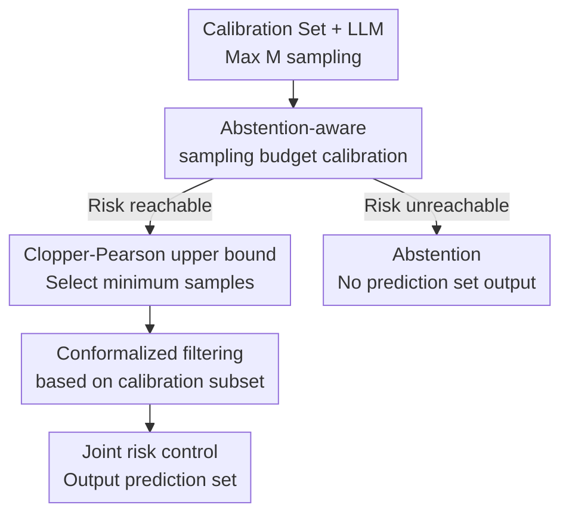

# SAFER: Risk-Constrained Sample-then-Filter in Large Language Models

**Conference**: ICLR2026  
**OpenReview**: [https://openreview.net/forum?id=kJmLmOvwLC](https://openreview.net/forum?id=kJmLmOvwLC)  
**Code**: To be released  
**Area**: LLM Safety / Reliable Risk Control  
**Keywords**: Risk-constrained generation, conformal prediction, uncertainty quantification, abstention mechanism, open-domain QA  

## TL;DR
Addressing the issues in open-domain QA where LLMs may fail to sample the correct answer and candidate sets are often mixed with hallucinations, SAFER first employs abstention-aware sampling budget calibration to control the risk of "no acceptable answer in the candidate set." It then applies conformalized filtering to remove high-uncertainty answers. Experiments across multiple datasets and models verify that the two-stage miscoverage risk remains bounded by user-specified thresholds.

## Background & Motivation
**Background**: LLMs are capable of generating natural language answers in open-domain QA, medical QA, and dialogue systems. However, the output in these scenarios is free-form text rather than fixed categories. Users are concerned not with whether the model provides a fluent-appearing response, but whether the generated set contains at least one semantically acceptable answer for downstream decision-making.

**Limitations of Prior Work**: Split conformal prediction and selective conformal prediction are natural for classification or multiple-choice questions because the label space is fixed, allowing the model to assign scores to each category and construct a prediction set covering the true label. Open-domain QA lacks such a finite label space. When LLMs generate candidates via sampling, finite trials might not hit the correct answer. If a method defaults to "always being able to sample an acceptable answer," the coverage guarantee becomes a mere paper guarantee for hard problems or when model capability is insufficient.

**Key Challenge**: Increasing the number of samples can improve the probability of hitting an acceptable answer, but more sampling also tends to introduce duplicates, irrelevant responses, or hallucinations. Simply expanding the candidate set leaves users with numerous unreliable references, while only filtering high-uncertainty answers might delete the sole correct response. This paper aims to simultaneously control two risks: the candidate set containing no acceptable answer (first stage) and the rejection of acceptable answers after filtering (second stage).

**Goal**: The authors decompose the problem into two calibratable parameters: the sampling budget $s$ and the uncertainty threshold $t$. $s$ determines the minimum number of candidates to sample for each question at test time, aiming to control candidate set miscoverage under risk level $\alpha$. $t$ determines which candidates are retained, aiming to control the probability that the filtered prediction set loses the acceptable answer under risk level $\beta$.

**Key Insight**: A key observation of SAFER is that the inability to sample a correct answer in open-domain QA should be modeled as an explicit "abstainable" event rather than being silently ignored by the label-coverage assumptions of conformal prediction. By explicitly tracking failure rates under different sampling budgets on a calibration set and applying a high-confidence upper bound, one can determine if the target risk is reachable. If reachable, the minimum budget is selected; otherwise, the system abstains.

**Core Idea**: Replace the strong assumption that finite sampling will always cover the correct answer in open-domain QA with a two-stage framework: "first sample and calibrate reachability, then filter and calibrate uncertainty."

## Method

### Overall Architecture
The input to SAFER consists of a calibration set with reference answers, a target LLM, a maximum sampling limit $M$, an answer acceptability function $A$, and user-specified risk levels $\alpha$ and $\beta$. During calibration, up to $M$ candidates are sampled per question to calculate the frequency of instances where "no candidate meets the acceptability threshold $\lambda_A$" under varying budgets $s$. If the confidence upper bound of this risk cannot be suppressed below $\alpha$ even within $M$ samples, the system chooses to abstain. Otherwise, it identifies the minimum test sampling budget $\hat{s}$. Subsequently, SAFER calibrates the uncertainty threshold $\hat{t}$ using only those calibration samples that contain an acceptable answer within $\hat{s}$ candidates. At test time, $\hat{s}$ answers are sampled for each question, and candidates with uncertainty higher than $\hat{t}$ are removed to form the final prediction set.

### Key Designs
**1. Abstention-aware sampling budget calibration: Determining risk reachability first**

The biggest difference between open-domain QA and classification is that the correct answer is a text string with multiple possible formulations rather than an enumerable category. SAFER defines a task-specific acceptability function $A(\hat{y}, y^*) \in [0,1]$. An answer $\hat{y}$ is considered an admissible answer if $A(\hat{y}, y^*) \ge \lambda_A$. For a calibration sample $i$, it is recorded as a sampling stage miscoverage if none of the first $s$ candidates meet the threshold.

This design transforms the failure to sample a correct answer (due to model limitations or question difficulty) from an implicit failure into an explicit risk. Given budget $s$, SAFER counts the failures in the calibration set:

$$
\hat{m}_{cal}(s)=\sum_{i=1}^N \mathbf{1}\{\forall \hat{y}\in\{\hat{y}^{(i)}_j\}_{j=1}^s, A(\hat{y},y_i^*)<\lambda_A\},
$$

and computes the empirical failure rate $\hat{r}_{cal}(s)=\hat{m}_{cal}(s)/N$. If the risk upper bound even at the maximum budget $M$ exceeds $\alpha$, SAFER abstains rather than outputting an invalid prediction set, maintaining honesty under unreachable risk levels.

**2. Clopper-Pearson Upper Bound: Selecting minimum samples via exact confidence intervals**

Empirical failure rates alone are insufficient because the calibration set is finite, and the true failure rate $R(s)$ on the test set may be higher. SAFER uses the Clopper-Pearson exact method to construct a high-confidence upper bound $\hat{R}^+(s)$ for each budget $s$, such that $\Pr(R(s)\le \hat{R}^+(s))\ge 1-\delta$. Essentially, it asks: under a binomial distribution with true failure rate $R$, is observing current low calibration failures still statistically plausible? The maximum plausible $R$ serves as the conservative upper bound.

Subsequently, SAFER selects the minimum budget satisfying the risk constraint:

$$
\hat{s}=\inf\{s\in[1,M]:\hat{R}^+(s)\le \alpha\}.
$$

This ensures the sampling budget is not an arbitrary value but the smallest feasible point balancing statistical guarantees and inference costs. Sampling $\hat{s}$ at test time guarantees, with probability at least $1-\delta$ over the calibration set, that the risk of the sampling set failing to cover an acceptable answer does not exceed $\alpha$.

**3. Conformalized filtering based on calibration subset: Calibrating thresholds only on reachable samples**

While $\hat{s}$ increases the likelihood of including a correct answer, it also includes unreliable ones. Instead of providing all candidates to the user, SAFER filters them using an uncertainty score $U(\hat{y})$ for each answer. The main experiments use sentence-level entropy, calculated by summing the negative log-probabilities of tokens: $U(\hat{y})=\sum_k -\log p(z_k\mid \hat{y}_{<k})$. Higher scores indicate unstable or less confident outputs.

Crucially, the filtering threshold cannot be calibrated blindly across all samples, as some samples do not contain an acceptable answer within $\hat{s}$ candidates to begin with; a filter cannot create a correct answer from nothing. Thus, SAFER constructs a calibration subset $D_{cal}(\hat{s})$ consisting only of samples with at least one admissible answer. For any threshold $t$, the prediction set is $C_t(x_i)=\{\hat{y}:U(\hat{y})\le t\}$, and the loss $l_i(t)$ indicates whether the filtered set contains no acceptable answers. $\hat{t}$ is chosen via conformal risk control such that:

$$
\frac{N' L_{N'}(t)+1}{N'+1}\le \beta.
$$

The $+1$ serves as a conservative correction for finite-sample conformal calibration. This ensures that, given the sampling set contains an acceptable answer, the probability that the filtering stage excludes all acceptable answers does not exceed $\beta$.

**4. Joint risk control: Combining sampling and filtering failures into an interpretable bound**

The final risk of SAFER is not a simple claim of high coverage but a clear distinction between two types of failure. The first is the failure to sample any admissible answer (controlled by $\alpha$); the second is the failure of the filtering stage to retain sampled admissible answers (controlled by $\beta$). Combined, the risk upper bound for the final prediction set not containing an acceptable answer is:

$$
\alpha+\beta-\alpha\beta=1-(1-\alpha)(1-\beta).
$$

This formula allows users to intuitively understand the risk budget: $\alpha$ leans towards controlling "how much sampling is needed to justify an answer," while $\beta$ controls "how aggressive the filtering can be." For more conservative applications, both can be lowered; to obtain smaller prediction sets for easier human decision-making, $\beta$ can be increased within an acceptable range.

### Loss & Training
SAFER is a post-processing calibration framework rather than a method for training new LLMs. There are few learnable parameters; the core involves estimating two deployment parameters $\hat{s}$ and $\hat{t}$ based on the calibration set. Stage one seeks the minimum $s$ such that $\hat{R}^+(s) \le \alpha$, and stage two seeks the optimal $t$ such that the calibrated risk does not exceed $\beta$.

During experiments, authors utilize multinomial sampling with temperature 1.0. Generation lengths are set to 36 for TriviaQA and CoQA, and 24 for ScienceQA, with a significance level $\delta=0.05$. Because SAFER is model-agnostic, it can be integrated with any LLM or black-box model that provides candidate answers and uncertainty scores.

## Key Experimental Results

### Main Results
The authors evaluate SAFER on three open-domain QA datasets—TriviaQA, CoQA, and ScienceQA—covering models such as LLaMA-3.1-8B-Instruct, OpenChat-3.5, and Qwen2.5-3B/7B/14B-Instruct. The evaluation metric is the test-time Empirical Error Rate (EER), tracking both the failure of the sampling set to contain acceptable answers and the failure of the final prediction set to contain them.

| Target | Setup | Observation | Conclusion |
|----------|------|----------|------|
| Effectiveness of Clopper-Pearson | TriviaQA, CoQA, various budgets | Test empirical miscoverage is consistently below the upper bound derived during calibration | Risk bounds estimated during calibration transfer effectively to test time |
| Sampling Stage Risk Control | Comparison with TRON, retaining sampling failures | TRON exceeds target risk in low-risk settings (e.g., OpenChat-3.5 on TriviaQA at $\alpha=0.03$ yields EER > 0.06) | SAFER's abstention mechanism corrects the assumption that finite sampling always succeeds |
| Filtering Stage Risk Control | TriviaQA ($\alpha=0.05$), CoQA ($\alpha=0.25$), sweeping $\beta$ | Final EER for five LLMs remains below $\alpha+\beta-\alpha\beta$ | Filtering effectively reduces set size while maintaining statistical validity |

### Ablation Study
The paper validates mechanisms through comparisons with TRON, varying risk levels, correctness metrics, and calibration ratios.

| Configuration / Analysis | Key Metric | Description |
|-------------|----------|------|
| SAFER vs TRON | Sampling stage EER $\le \alpha$ | TRON ignores finite sampling reachability issues, failing at low-risk targets; SAFER abstains when unreachable, keeping EER bounded |
| Budgeting vs. Filtering | Prediction set size & Final EER | Filtering significantly reduces set size. Example: LLaMA-3.1-8B on TriviaQA at $\beta=0.1$ reduces avg size from 7.9 to 5.5 without violating EER bounds |
| Correctness Metric Variation | similarity, Rouge-L, bi-entailment, LLM judge | Risk control is maintained across various metrics including Rouge-L, entailment, and LLM-based semantic evaluation |
| Calibration Ratio | Calibration-test split (0.5 to 0.1) | Test EER remains below the specified bound even with minimal calibration data, indicating high data efficiency |
| Black-box Model Validation | GPT-4o-mini + consistency frequency | Even without logits, using self-consistency frequency as uncertainty maintains risk control on CoQA |

### Key Findings
- The primary benefit of SAFER is not making the model "smarter" at answering, but enabling the system to know the required sampling budget, when to abstain, and how to maintain coverage guarantees after filtering.
- The Clopper-Pearson upper bound provides a more conservative reachability judgment than empirical failure rates, making it more robust than methods like TRON in low-risk scenarios.
- Filtering's value lies in prediction set efficiency: removing high-uncertainty candidates without sacrificing risk constraints allows for more compact answer sets.
- The acceptability function $A$ can be replaced by various metrics (Rouge-L, Bi-entailment, etc.), showing the framework relies on an interface for "acceptable answers" rather than a specific scorer.

## Highlights & Insights
- Explicitly treating the failure to sample a correct answer as an abstention condition is highly practical. While many methods assume the correct answer exists in the candidates, SAFER acknowledges model boundaries, ensuring statistical guarantees are not built on over-optimistic assumptions.
- The two-stage risk budget is clearly interpreted: $\alpha$ governs reachability, while $\beta$ governs filtering loss. This decomposition suits real-world deployment where designers can adjust preferences between "sampling more" and "outputting less."
- By extending conformal prediction to open-domain QA without forcing a pseudo-label space, SAFER focuses on the calibration of the candidate generation process. This approach is transferable to agent tool calls, multi-turn dialogues, and other non-enumerable output scenarios.
- Uncertainty metrics primarily affect efficiency rather than the validity of the conformal calibration. Whether using token entropy for white-box models or self-consistency for black-box models, the distribution-free risk control remains intact.

## Limitations & Future Work
- SAFER relies on the exchangeability assumption between calibration and test sets. Significant distribution shifts (e.g., more specialized user queries or model updates) may invalidate the calibrated $\hat{s}$ and $\hat{t}$.
- The acceptability function $A$ defines the semantics of all guarantees. If the chosen metric (Rouge-L or similarity) is biased, SAFER controls risk relative to that metric, which may not perfectly align with human satisfaction.
- The abstention mechanism improves honesty but may reduce system utility. While reasonable for risk-sensitive applications, general QA might require better UX design (e.g., stating "more evidence needed" instead of no response).
- Sampling budgets incur inference costs. While SAFER selects the minimum $\hat{s}$ to satisfy risk, low-risk targets for weak models may still require large $M$, increasing latency.

## Related Work & Insights
- **vs. Traditional Split Conformal Prediction**: While traditional SCP handles fixed label spaces, SAFER treats open-ended generation by first calibrating if an admissible answer is reachable via sampling, then calibrating filtering thresholds.
- **vs. TRON**: TRON also attempts two-stage risk control but fails to adequately address instances where sampling is insufficient. SAFER introduces abstention-aware budget calibration for stability at low-risk levels.
- **vs. Semantic Entropy / Self-consistency**: These methods provide scores but lack statistical risk guarantees. SAFER uses them as inputs for $U(\hat{y})$, providing finite-sample guarantees through conformal risk control.
- **vs. Conformal Language Modeling**: CLM focuses on the token-level generation process; SAFER focuses on candidate set reachability, abstention, and filtering for practical deployment in risk-sensitive QA.

## Rating
- Novelty: ⭐⭐⭐⭐☆ Naturally combines abstention, sampling budget calibration, and filtering; core innovation lies in correcting reachability assumptions in open-domain QA.
- Experimental Thoroughness: ⭐⭐⭐⭐☆ Covers various QA tasks, multiple LLMs, multiple metrics, and black-box models; could benefit from more traditional ablation of individual components.
- Writing Quality: ⭐⭐⭐⭐☆ Clear logic and complete theoretical guarantees, though some formatting in appendix tables requires careful alignment.
- Value: ⭐⭐⭐⭐⭐ Highly practical for risk-sensitive LLM deployment, especially where "answer only when confident" and "controlled output size" are required.

<!-- RELATED:START -->

## Related Papers

- [\[ICLR 2026\] EEPO: Exploration-Enhanced Policy Optimization via Sample-then-Forget](eepo_exploration-enhanced_policy_optimization_via_sample-then-forget.md)
- [\[ACL 2026\] RISK: A Framework for GUI Agents in E-commerce Risk Management](../../ACL2026/llm_safety/risk_a_framework_for_gui_agents_in_e-commerce_risk_management.md)
- [\[ICLR 2026\] Transferable and Stealthy Adversarial Attacks on Large Vision-Language Models](transferable_and_stealthy_adversarial_attacks_on_large_vision-language_models.md)
- [\[ICLR 2026\] AdPO: Enhancing the Adversarial Robustness of Large Vision-Language Models with Preference Optimization](adpo_enhancing_the_adversarial_robustness_of_large_vision-language_models_with_p.md)
- [\[ICLR 2026\] DiffuGuard: How Intrinsic Safety is Lost and Found in Diffusion Large Language Models](diffuguard_how_intrinsic_safety_is_lost_and_found_in_diffusion_large_language_mo.md)

<!-- RELATED:END -->
