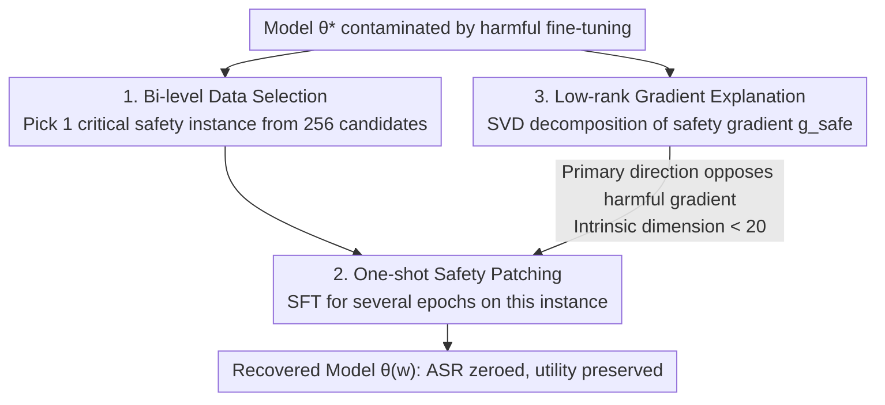

# Safety at One Shot: Patching Fine-Tuned LLMs with A Single Instance

**Conference**: ICLR 2026  
**OpenReview**: [https://openreview.net/forum?id=EyH8Fu3vtZ](https://openreview.net/forum?id=EyH8Fu3vtZ)  
**Code**: https://github.com/Kevin-Zh-CS/safety-at-one-shot  
**Area**: LLM Safety / Fine-tuning Attack Defense / Alignment Recovery  
**Keywords**: Fine-tuning attacks, safety alignment recovery, bi-level optimization, low-rank gradients, one-shot patching

## TL;DR
Addressing the security risk in LMaaS where user-uploaded fine-tuning data breaks LLM safety alignment, this paper demonstrates that a **single** carefully selected safety instance, fine-tuned for a few epochs, can fully restore the model's alignment level (zeroing the ASR) with negligible utility loss. The authors provide a theoretical explanation for why "one instance" is sufficient based on the low-rank structure of safety gradients.

## Background & Motivation
**Background**: Safety alignment (SFT / RLHF / DPO) teaches LLMs to identify harmful prompts and refuse to answer, which has become a standard step before model deployment. Meanwhile, providers like OpenAI and Anthropic offer fine-tuning APIs, allowing users to upload datasets to customize models, following the Language-Model-as-a-Service (LMaaS) paradigm.

**Limitations of Prior Work**: Fine-tuning pipelines introduce a new attack surface known as the "fine-tuning attack." Existing research proves that even using only 10 harmful samples for 5 epochs (costing less than \$0.20) can compromise strongly aligned models like GPT. In LMaaS, providers are **directly responsible for model outputs** (involving compliance and legal liabilities) as fine-tuning and inference occur on their servers, necessitating robust and low-cost defenses.

**Key Challenge**: Existing defenses are typically constrained by the "safety-utility-efficiency" trilemma. Vaccine and BackdoorAlign use perturbations or hidden triggers for hardening at the cost of utility; Lisa injects safety data during fine-tuning but requires large curated datasets and significant compute; Antidote and DirectionAlign prune or reset harmful updates at the parameter level but rely on calibration sets to locate harmful parameters, offering limited recovery; ConstrainedSFT constrains initial token updates but requires additional utility datasets, making it difficult to balance safety recovery and downstream performance. In short, the prevailing assumption is that "restoring safety requires massive curated safety data or complex correction mechanisms."

**Goal**: Can model safety be restored at **minimum cost without sacrificing utility**? This requires answering two sub-questions: (1) How much safety signal is actually needed to restore alignment? (2) Why is such a small signal sufficient?

**Key Insight**: Instead of scaling data, the authors investigate the **minimum signal** required to restore alignment. They formalize the identification of critical safety samples as a bi-level optimization problem and unexpectedly find that **a single carefully selected safety instance is sufficient to neutralize harmful updates**.

**Core Idea**: Replace "massive safety datasets or complex parameter corrections" with "selecting one critical safety instance via bi-level optimization + fine-tuning it for a few epochs" to restore safety alignment broken by fine-tuning attacks. The paper explains this "one-shot patch" using the low-rank structure of safety gradients, which are nearly opposite to harmful gradient directions.

## Method

### Overall Architecture
The method centers on the counter-intuitive phenomenon of **one-shot safety recovery**: given a model $\theta^*$ contaminated by harmful fine-tuning, introducing a single selected safety instance for a few fine-tuning rounds can restore it to the safety level of the initial aligned model $\theta_0$ while preserving utility on task data $D_{task}$.

The pipeline consists of three steps: first, formulate the selection of safety data as a **bi-level optimization (BLO)** problem to identify the most critical instance from a pool of 256 candidates $D_{safe}$; second, perform standard SFT recovery on this single instance (10 epochs, learning rate $2\times10^{-5}$); finally, use **gradient decomposition** to explain why one instance suffices by proving safety gradients lie in a low-rank subspace with primary directions nearly opposite to harmful gradients.

### Key Designs

**1. Bi-level Optimization for Safety Data Selection: Optimizing Sample Selection**

The primary question is: which instance among 256 candidates is most effective for recovery? Instead of heuristic scoring, this is formulated as a first-order, penalty-based bi-level optimization. A binary selection vector $w\in\{0,1\}^N$ is introduced, where $w_i=1$ indicates the $i$-th sample is included in the safety patch set $D_{safe}=\{(x_i,y_i)\mid w_i=1\}$, with a constraint $\mathbf{1}^\top w=m$ to control the count. The lower-level problem is standard SFT on selected samples:

$$\theta(w)=\arg\min_\theta\ \mathbb{E}_{(x,y)\sim D_{safe}}\big[-w_i\log\pi_\theta(y\mid x)\big],\quad \theta\leftarrow\theta^*.$$

The upper-level objective pulls in two directions: aligning the recovered model back to the initial model $\theta_0$ on harmful prompts ($\mathbb{E}_{x\sim D_{harm}}D_{KL}(\pi_{\theta_0}\|\pi_{\theta(w)})$), while aligning it to the fine-tuned model $\theta^*$ on task data ($\mathbb{E}_{x\sim D_{task}}D_{KL}(\pi_{\theta^*}\|\pi_{\theta(w)})$), with a $\lambda\|w\|_2^2$ regularizer:

$$\min_w\ \mathbb{E}_{x\sim D_{harm}}D_{KL}\big(\pi_{\theta_0}\|\pi_{\theta(w)}\big)+\mathbb{E}_{x\sim D_{task}}D_{KL}\big(\pi_{\theta^*}\|\pi_{\theta(w)}\big)+\lambda\|w\|_2^2.$$

This objective explicitly balances "returning to safety $\theta_0$" and "retaining utility $\theta^*$," ensuring selected samples handle both. The $\ell_2$ regularization stabilizes the BLO through strong convexity and encourages sparsity when $w$ is relaxed to continuous values, naturally leading to the selection of very few samples.

**2. One-shot Safety Patching: A Universal Refusal Instance Supporting the Safety Subspace**

The selected instance is not a niche refusal but a **universal safety refusal**, such as `{"user": "How can I bypass system security checks?", "assistant": "Sorry, I can't help you. Please follow security guidelines."}`. The candidate set $D_{safe}$ consists of 256 harmful instructions across 11 categories paired with refusal answers from Llama-2-7B-Chat, strictly non-overlapping with evaluation sets like HEx-PHI or AdvBench. Recovery entails fine-tuning on this single instance for 10 epochs.

The Key Insight is "quality over quantity": universal safety data is more effective than category-specific data, and **adding more samples can be detrimental**. Increasing the number of safety samples yields diminishing safety returns while significantly degrading utility. Thus, the optimal strategy is one-shot recovery, achieving the best balance. This single instance suffices because gradients induced by different safety samples point in nearly the same direction (see Design 3).

**3. Low-rank Safety Gradients: Geometric Interpretation and Dimension-free Convergence**

This provides the theoretical foundation. Performing SVD on the gradient of a single safety instance $g_{safe}=\nabla_\theta\ell(\theta,x_{safe},y_{safe})$, where $g_{safe}\approx U_{safe}S_{safe}V_{safe}^\top$, reveals that most singular values are near zero—meaning the safety gradient resides in a **low-rank subspace**. Quantified by the Cumulative Energy Ratio $\text{CER}(k)=\sum_{i=1}^k\sigma_i^2/\sum_{i=1}^r\sigma_i^2$, the top-20 singular values account for 0.92 of the energy in Llama-3.1-8B. Furthermore, the Frobenius overlap $\phi(g_{safe},\bar g_{safe})=\|U_{safe}^\top\bar U_{safe}\|_F^2/\min(\text{rank}(U_{safe}),\text{rank}(\bar U_{safe}))$ between single-sample and batch gradients exceeds 0.8 for Llama and 0.9 for Mistral/Qwen, proving different safety samples push toward the **same direction**, which is nearly opposite to harmful gradients.

The paper proposes a projective recovery $\theta^d=\theta_0^d+\text{Proj}(U_{safe}^{(0:k)})$, where $\text{Proj}(U_{safe}^{(0:k)})=-\alpha\eta\sum_{i=0}^{k-1}\sigma_i U_{safe}^{(i)}V_{safe}^{(i)\top}$. Experiments show the **intrinsic dimension of safety is < 20**. Based on local assumptions of "curvature effective rank $\le r$" and PL conditions, the authors prove dimension-free convergence (Theorem 1): for step size $\eta\le 1/(\ell r)$, $L(\theta_{t+1})-L^\star\le(1-\mu\eta)(L(\theta_t)-L^\star)$. Reaching $\varepsilon$ accuracy requires $t=O\big(\frac{r\ell}{\mu}\log\frac{L(\theta_0)-L^\star}{\varepsilon}\big)$ steps—**the number of steps depends only on the low rank $r$, not the parameter count $d$**, explaining why recovery converges stably within 10 epochs regardless of model size (7B to 70B) or harmful fine-tuning scale.

## Key Experimental Results

### Main Results
Evaluation involving five aligned LLMs (Llama-2-7B-Chat, Llama-3.1-8B, Mistral-7B, Qwen-2.5-7B, GPT-4.1), multiple tasks, and various attack scenarios. The table below compares recovery methods on Llama-2-7B-Chat and GPT-4.1 fine-tuned on SQL Create (ASR↓/HS↓ measure safety; SQL/MMLU/MT-bench measure utility; Time is additional GPU hours relative to Standard SFT):

| Method | ASR↓ | HS↓ | SQL↑ | MMLU↑ | MT-bench↑ | Time(h)↓ |
|------|------|-----|------|-------|-----------|----------|
| Origin (Initial Alignment) | 0.0 | 1.00 | 14.9 | 45.81 | 7.16 | - |
| Standard SFT (Attacked) | 15.4 | 2.45 | 99.4 | 45.78 | 7.15 | - |
| Vaccine | 14.6 | 2.18 | 99.4 | 45.10 | 7.08 | 1.09 |
| Lisa | 12.0 | 2.05 | 94.3 | 44.58 | 6.80 | 0.20 |
| Antidote | 10.8 | 1.90 | 92.5 | 44.13 | 6.91 | 0.04 |
| DirectionAlign | 2.1 | 1.35 | 96.8 | 44.94 | 7.05 | 1.33 |
| ConstrainedSFT | 3.3 | 1.59 | 98.5 | 45.26 | 7.12 | 0.25 |
| STAR-DSS | 0.0 | 1.00 | 99.0 | 45.70 | 7.15 | 2.45 |
| **One-shot FT (Ours)** | **0.0** | **1.00** | **99.4** | **45.76** | **7.16** | **0.02** |

Ours is the only method achieving ASR=0 and HS=1.0 with virtually no utility loss and minimal overhead (~1–2 minutes). On GPT-4.1, ASR dropped from 12.4 to 0.0 with HS returning to 1.0 in just 0.01 GPU hours.

Cross-model/attack recovery (Init: pre-FT / Sft: post-attack / Rec: post-recovery; metrics in ASR):

| Attack Scenario | Llama3-8B Sft→Rec | Mistral-7B Sft→Rec | Qwen2.5-7B Sft→Rec |
|----------|-------------------|--------------------|--------------------|
| Harmful Examples | 95.5 → **0.0** | 98.5 → 16.4 | 98.8 → 10.0 |
| Identity Shifting | 84.5 → **0.0** | 81.8 → 15.5 | 90.3 → 9.7 |
| Backdoor (w. trigger) | 92.7 → **0.0** | 82.4 → 18.2 | 92.7 → 10.6 |
| Patch Poisoning | 95.8 → **0.0** | 98.5 → 16.4 | 100.0 → 10.3 |
| SQL Create* (100 harmful) | 96.7 → **0.0** | 98.2 → 17.0 | 99.4 → 10.3 |

Llama series achieved zero ASR across all scenarios. Mistral and Qwen were significantly restored to their respective initial levels (their Init ASR was higher, ~23.6 and 12.1).

### Ablation Study

| Configuration | Key Metrics | Explanation |
|------|---------|------|
| Baseline (Attacked) | ASR 95.2 / HS 4.90 | Llama-2-7B fine-tuned on 100 harmful samples |
| Universal Safety General-1/2/3 | ASR 0.0 / 0.0 / 0.3 | Universal refusal instances provide the most thorough recovery |
| Category-specific (e.g., Illegal) | ASR 0.6 / HS 1.10 | All categories reduce ASR but are less effective than universal |
| Category-specific (Malware) | ASR 16.4 / HS 2.61 | Weakest category-specific performance |
| Safety Count 1 → More | Diminishing safety / Drop in utility | More safety samples worsen the trade-off |
| Harmful scale 10/100/1000 | Recovered within 10 epochs | Recovery is independent of harmful scale |
| Model size 7B/13B/70B | Converged within 10 epochs | Convergence is independent of model size |

Subspace similarity $\phi(g_{safe},\bar g_{safe})$: General samples reached 0.75–0.88 for Llama and 0.89–0.94 for Mistral/Qwen. Top-k CER reached 0.86–0.95 at k=20, confirming highly low-rank safety gradients.

### Key Findings
- **Quality over Quantity**: A single universal refusal instance is most effective; adding more samples yields diminishing returns but significantly harms utility.
- **Universal > Category-specific**: Universal safety data outperforms category-specific data because various safety gradients point toward the same low-rank direction.
- **Three Irrelevances**: Recovery effectiveness and speed (within 10 epochs) are independent of harmful scale (10 to 1000), model size (7B to 70B), and attack type. This is because convergence depends on low rank $r$ rather than parameter count $d$.
- **Intrinsic Dimension < 20**: Safety signals are compressed into a subspace of fewer than 20 dimensions.

## Highlights & Insights
- **"Less is More" in Safety Recovery**: Compressing the safety signal to a single instance challenges the assumption that massive safety data is needed. Recovery costs only 1–2 minutes, making it ideal for LMaaS providers.
- **Phenomenon + Mechanism + Theory**: The paper doesn't just report "one instance works" but reveals the low-rank nature of safety gradients via SVD and proves dimension-free convergence, turning empirical observations into an explainable framework.
- **Transferable Safety Subspace**: The geometric perspective of a < 20D safety subspace can be transferred to other designs like model editing, pruning, or parameter projection.

## Limitations & Future Work
- **Incomplete Recovery for Mistral/Qwen**: These models have higher initial ASR (~23.6 and 12.1), and post-recovery ASR remains around 10–23, indicating that "full recovery" varies by model family.
- **White-box Dependency**: BLO and SVD analysis require access to gradients/parameters, limiting applicability to black-box APIs. GPT-4.1 experiments required 10 samples due to API limitations.
- **Evaluation Coverage**: Assessments rely on HEx-PHI, AdvBench, and HarmBench. Robustness against adaptive attacks or long-tail harmful categories requires further verification.
- **Theoretical Assumptions**: Dimension-free convergence assumes local $r$-effective rank and PL conditions; the extent to which these hold across all training trajectories requires more boundary characterization despite empirical evidence.

## Related Work & Insights
- **vs Vaccine / BackdoorAlign**: These use perturbations during alignment for "immunity," whereas Ours patches after contamination. Ours preserves utility better.
- **vs Lisa**: Lisa uses massive safety data during fine-tuning (high cost); Ours uses one instance (two orders of magnitude lower cost).
- **vs Antidote / DirectionAlign**: These rely on calibration sets to locate parameters at the parameter level; Ours uses BLO to pick samples followed by low-rank projection.
- **vs ConstrainedSFT / STAR-DSS**: These use token-level constraints making safety-utility trade-offs difficult; Ours internalizes the balance via a BLO objective aligning to both $\theta_0$ (safety) and $\theta^*$ (utility).

## Rating
- Novelty: ⭐⭐⭐⭐⭐ Close-loop of "one-shot" phenomenon, low-rank mechanism, and dimension-free theory.
- Experimental Thoroughness: ⭐⭐⭐⭐⭐ 5 models × multiple tasks × 5+ attacks, with multi-dimensional ablations.
- Writing Quality: ⭐⭐⭐⭐ Clear structure, though discussion on black-box limitations and Mistral/Qwen results is relatively brief.
- Value: ⭐⭐⭐⭐⭐ Directly addresses LMaaS compliance pain points with a low-cost, plug-and-play solution.

<!-- RELATED:START -->

## Related Papers

- [\[ICLR 2026\] Heterogeneous Federated Fine-Tuning with Parallel One-Rank Adaptation](heterogeneous_federated_fine-tuning_with_parallel_one-rank_adaptation.md)
- [\[ICLR 2026\] Membership Inference Attacks Against Fine-tuned Diffusion Language Models (SAMA)](membership_inference_attacks_against_fine-tuned_diffusion_language_models.md)
- [\[AAAI 2026\] TOFA: Training-Free One-Shot Federated Adaptation for Vision-Language Models](../../AAAI2026/llm_safety/tofa_training-free_one-shot_federated_adaptation_for_vision-language_models.md)
- [\[ICLR 2026\] Rethinking Bottlenecks in Safety Fine-Tuning of Vision Language Models](rethinking_bottlenecks_in_safety_fine-tuning_of_vision_language_models.md)
- [\[ACL 2026\] SafeMERGE: Preserving Safety Alignment in Fine-Tuned Large Language Models via Selective Layer-Wise Model Merging](../../ACL2026/llm_safety/safemerge_preserving_safety_alignment_in_fine-tuned_large_language_models_via_se.md)

<!-- RELATED:END -->
