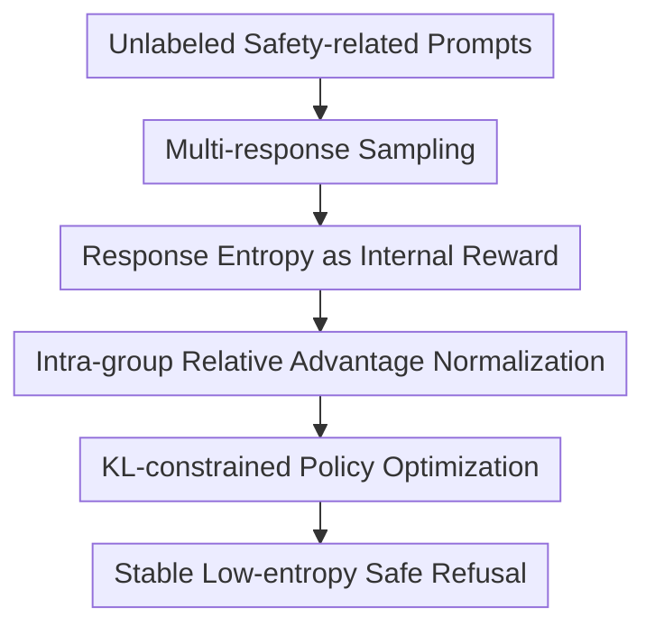

# Safety Instincts: LLMs Learn to Trust Their Internal Compass for Self-Defense

**Conference**: ICLR 2026  
**OpenReview**: [https://openreview.net/forum?id=LUiqtv6vrd](https://openreview.net/forum?id=LUiqtv6vrd)  
**Code**: To be released  
**Area**: LLM Safety / Self-Alignment / Jailbreak Defense  
**Keywords**: LLM Safety, Self-Alignment, Response Entropy, Jailbreak Defense, Reinforcement Learning  

## TL;DR

This paper discovers that safety-aligned models naturally exhibit lower entropy and higher confidence when refusing harmful requests. It proposes SIRL, which uses response entropy itself as an internal reward, enabling models to reinforce their safety refusal tendencies without human annotations, reward models, or external safety discriminators, while largely preserving performance in mathematics, coding, and dialogue.

## Background & Motivation

**Background**: Safety alignment of LLMs typically relies on external signals: supervised fine-tuning (SFT) with human-written safe responses, Direct Preference Optimization (DPO) with preference pairs, training reward models for RLHF, or applying detectors, filters, and prompt guards during inference. While these methods improve defense success rates, they share the prerequisite that a human or an external system can reliably judge what is safe versus dangerous.

**Limitations of Prior Work**: Safety judgment is notoriously difficult to capture with stable labels. Jailbreak attacks vary in phrasing, context, and multi-turn strategies, causing static rules to fail frequently. Manual annotation is expensive and struggles to cover long-tail risks, while reward models can be limited by attack styles and training distributions. Consequently, safety training faces a paradox: the areas needing generalization the most are often those lacking generalizable supervisory signals.

**Key Challenge**: The authors identify a conflict: while external safety verifiers are unreliable, aligned models may not be "internally ignorant." If a model has learned numerous refusal patterns for dangerous requests, its distribution when generating a refusal should be more concentrated. Conversely, when a jailbreak prompt induces it to produce harmful content, an internal tug-of-war between safety habits and attack instructions occurs, leading to higher uncertainty in the output distribution.

**Goal**: This paper aims to answer two questions. First, does an aligned LLM possess observable internal safety signals that distinguish between safe refusals and dangerous compliance? Second, if such signals are reliable, can they be converted into training rewards to allow the model to self-reinforce safety behaviors without relying on human labels or external reward models?

**Key Insight**: The authors select response entropy as the entry point. Entropy is not an auxiliary trained classifier but an inherent measure of distribution uncertainty during token generation. A key empirical finding is the "safety-confidence gap": in jailbreak scenarios, the average token entropy of safe refusals is significantly lower than that of harmful responses. This gap persists across models like Llama and Qwen and through various attack methods.

**Core Idea**: By using the model's own low-entropy safe refusals as an "internal compass," the negative response entropy $-\bar{H}(o|q)$ is transformed into a reinforcement learning reward. This trains the model to trust the safety instincts it has already acquired.

## Method

### Overall Architecture

The SIRL workflow is straightforward: given a safety-aligned reference model and a batch of unlabeled prompts, the current model samples multiple responses for each prompt. It calculates the average token entropy for each response, treats low-entropy responses as candidates worth learning, and updates the policy using Group Relative Policy Optimization (GRPO). Since the authors demonstrate that low-entropy candidates mostly correspond to safe refusals, the training amplifies the generation patterns associated with "confident refusal of dangerous requests."

The significance of this method lies not in redefining safety rules, but in shifting the source of safety rules from external discriminators back to the model's internal state. The training process requires only prompts, eliminating the need for safety labels, human-written refusals, or preference pairs.

### Key Designs

**1. Response Entropy as Internal Reward: Converting Safety Confidence into Training Signals**

Traditional safety RL rewards are external: human preferences, rule detectors, or reward models. SIRL instead asks: if a model is "certain" it should refuse a dangerous request, can we reward that certainty directly? The paper defines the average token entropy of a response $o=(o_1,o_2,\ldots,o_T)$ given query $q$ as: $\bar{H}(o|q)=\frac{1}{T}\sum_{t=1}^{T}H(o_t|q,o_{<t})$, where $H(o_t|q,o_{<t})=-\sum_{v\in V}P(v|q,o_{<t})\log P(v|q,o_{<t})$. Lower entropy indicates a more concentrated distribution and higher confidence.

The SIRL reward is $r_i=-\bar{H}(o_i|q)$. The negative sign is critical: low-entropy responses receive high rewards. The objective is to exploit the safety-confidence gap: harmful outputs often high entropy due to the conflict between safety refusal patterns and attack-induced compliance, whereas safe refusals follow sharp, stable templates reinforced during alignment.

**2. Intra-group Relative Comparison: Mitigating Entropy Scale Variance Across Prompts**

Comparing absolute entropy across different prompts is unstable. Some prompts are inherently longer, some response formats are complex, and models are naturally more uncertain about certain topics. SIRL avoids global entropy ranking; instead, it samples $G$ responses for each prompt and performs relative comparison within those candidates.

Specifically, after calculating reward $r_i$ for the $i$-th response, the advantage is computed as $\hat{A}_i=\frac{r_i-\mathrm{mean}(\{r_1,\ldots,r_G\})}{\mathrm{std}(\{r_1,\ldots,r_G\})}$. Thus, a response that is "more confident than its peers" receives a positive advantage. This shifts the target from achieving a fixed global entropy to favoring the model's most certain response for a given request.

**3. KL-constrained Policy Optimization: Reinforcing Safety Instincts without Collapsing Generality**

Rewarding low entropy alone poses a risk: the model might learn overly conservative, short refusals or reduce exploration even for harmless queries. SIRL employs a PPO/GRPO-style clipped objective with a KL penalty to prevent the new policy from drifting too far from the reference model. The objective includes the importance sampling ratio $c_{i,t}(\theta)=\frac{\pi_\theta(o_{i,t}|q,o_{i,<t})}{\pi_{\theta_{old}}(o_{i,t}|q,o_{i,<t})}$, constrained by $\mathrm{clip}(c_{i,t}(\theta),1-\epsilon,1+\epsilon)$.

The KL term $\beta D_{KL}(\pi_\theta\|\pi_{ref})$ keeps SIRL within the bounds of "enhancing existing safety tendencies" rather than sacrificing utility for minimum entropy. The authors observe that excessive training leads to over-conservatism, justifying the selection of an intermediate training point (approx. 30 steps) to balance safety and capability.

**4. Self-Reinforcement Loop: From Occasional Low-entropy Refusal to Stable Safety Distribution**

The distinction between SIRL and inference-time Best-of-N is clear. Best-of-N merely samples many responses during inference and picks the most certain one; the underlying model distribution remains unchanged, and the cost scales linearly with $N$. SIRL integrates the low-entropy preference into the model parameters, making the model more likely to generate such responses directly.

This loop amplifies safety refusal patterns: low-entropy refusals gain positive advantages, increasing their probability in the policy. In subsequent sampling rounds, these responses appear more frequently and with even lower entropy. This allows the model to "trust their internal compass," transforming initial safety knowledge into a stable behavioral distribution.

### Mechanism

Consider a dangerous request where an attack prompt tries to induce harmful steps through role-play. The model samples 4 responses: 1. A short refusal (Avg Entropy $0.5$); 2. A refusal followed by safe alternatives ($0.7$); 3. Compliance induced by the attack ($1.4$); 4. A hesitant response oscillating between refusal and explanation ($1.1$).

SIRL does not need to know which response is "human-labeled safe." It rewards negative entropy, giving the first two responses higher relative advantages. After policy updates, the model becomes more likely to enter a low-entropy refusal mode when encountering similar attacks, rather than following the dangerous narrative. This explains SIRL's generalization to unseen attack templates: it optimizes the internal stability of the refusal distribution rather than specific keywords.

### Loss & Training

Training utilizes unlabeled PKU-SafeRLHF prompts, without using their response labels or preference tags. The configuration uses $G=4$ responses per prompt, temperature $1.0$, max prompt length $1024$, and max completion length $3072$. The optimizer is AdamW with a learning rate of $1\times10^{-6}$, KL coefficient $\beta=0.001$, and clip ratio $\epsilon=0.2$ using the veRL framework.

Main results are reported from models trained for approximately 30 steps. Training dynamics show that while Defense Success Rate (DSR) rises rapidly and entropy decreases monotonically, safety eventually saturates, and the model may become overly conservative on harmless math problems. Early stopping and KL regularization ensure the method reaches a practical safety-utility equilibrium.

## Key Experimental Results

### Main Results

Evaluations were conducted on Llama-3.1-8B-Instruct, Llama-3.2-3B-Instruct, Qwen2.5-3B/7B-Instruct, and Llama-3.1-Tulu-8B-Instruct (which lacks safety training). Safety metrics centered on the Defense Success Rate (DSR) across 20 jailbreak categories in JailbreakBench. Capability metrics included BBH, AlpacaEval, MATH-500, AMC, HumanEval, LiveCodeBench, ToxiGen, and TruthfulQA.

| Model | Method | JBB DSR | MATH-500 | HumanEval | LiveCodeBench | TruthfulQA | Observation |
|------|------|---------|----------|-----------|---------------|------------|------|
| Llama-3.1-8B-Instruct | Baseline | 84.3 | 49.0 | 59.1 | 19.0 | 54.1 | Basic safety exists but unstable against strong jailbreaks |
| Llama-3.1-8B-Instruct | SIRL | 99.1 | 51.2 | 61.0 | 19.4 | 54.6 | Significant DSR gain; capabilities maintained or improved |
| Llama-3.2-3B-Instruct | Baseline | 95.6 | 42.2 | 45.1 | 13.7 | 49.7 | Small models have high initial DSR |
| Llama-3.2-3B-Instruct | SIRL | 100.0 | 41.4 | 45.1 | 13.9 | 50.8 | Perfect DSR; general capabilities preserved |
| Qwen2.5-3B-Instruct | Baseline | 84.7 | 66.3 | 51.8 | 19.4 | 58.8 | Strong math, but safety needs work |
| Qwen2.5-3B-Instruct | SIRL | 98.7 | 66.4 | 53.0 | 22.5 | 58.4 | Safety gains alongside higher Code/AMC scores |
| Qwen2.5-7B-Instruct | Baseline | 82.8 | 77.6 | 69.5 | 35.2 | 64.8 | Strong capacity but lower DSR under attack |
| Qwen2.5-7B-Instruct | SIRL | 99.9 | 78.6 | 70.3 | 38.6 | 65.7 | Near-perfect DSR; capabilities maintained/improved |

Compared to SFT, DPO, and RLHF, SIRL exhibits much lower supervision costs. SFT with manual safety responses often degrades capability; for instance, Llama-3.1-8B's AlpacaEval drops from $50.0$ to $19.1$. While DPO/RLHF also improve safety, they require preference pairs or reward models. SIRL achieves similar or superior DSR using only ~20k unlabeled prompts.

| Evaluation Scenario | Baseline | SIRL | Gain / Conclusion |
|----------|------|------|-------------|
| Qwen2.5-7B, Avg DSR (20 Jailbreaks) | ~82.8 | 99.6/99.9 | More robust against static, template, and optimization attacks |
| RandomSearch (Hardest attack) | Some methods < 37 | 71-100 | Maintains high defense against adaptive search attacks |
| GCG Attack (Llama-3.1-8B) | 58 | 100 | Significant enhancement against white-box gradient suffixes |
| PAIR Attack (Llama-3.1-8B) | 60 | 100 | Effective against semantic iterative attacks |
| MHJ-DERTA Multi-turn (Llama-3.2-3B) | 63.2 | 92.3 | Sustains refusal across multi-turn dialogues |
| HarmBench (Llama-3.2-3B) | 91 | 99 | Generalizes well to standard harmful prompt sets |

### Ablation Study

| Configuration | JBB DSR / Metric | Description |
|------|-------------------|------|
| Llama-3.1-8B Baseline | 84.3 DSR | Original instruct model with some refusal capability |
| +neg-SIRL | 72.1 DSR | Rewarding high entropy degrades both safety and capability |
| +Random reward | 85.2 DSR | Random rewards are ineffective; refutes "any RL yields safety" |
| +min. PPL | 98.7 DSR | Perplexity minimization is also strong; confidence is the key |
| +SIRL | 99.1 DSR | Entropy reward is slightly better and more interpretable |
| BoN $N=16$ (Llama-3.1-8B) | ~93.2 DSR | Inference-time selection helps but is costly and less effective |
| SIRL (Llama-3.1-8B) | 99.1 DSR | Single generation achieves higher DSR by reshaping the distribution |

Over-refusal tests (OR-Bench/XSTest) show that SIRL increases the refusal rate for unsafe prompts without causing safe prompt refusal to spiral out of control. For Qwen2.5-7B, safe refusal on OR-Bench rose from $21.4$ to $47.2$, indicating increased conservatism, but unsafe refusal also rose from $92.4$ to $98.7$. Notably, SIRL's safe refusal rate remains lower than RLHF ($51.9$).

### Key Findings

- There is a stable statistical gap between the entropy of safe refusals and harmful compliances. Across four models, the entropy difference ranged from $0.365$ to $0.684$ ($p < 0.001$, Cohen’s $d$ reflects medium to large effects).
- Token-level analysis indicates that "Risk Articulation" tokens have the lowest entropy, "General" tokens are intermediate, and "Compliance Signals" have the highest entropy. Models are most confident when stating they cannot assist with dangerous requests.
- SIRL's gains do not stem merely from sampling selection. Best-of-N requires $16\times$ inference cost and still underperforms SIRL.
- The method scales across generations and sizes. Appendix reports show significant improvements on Llama-2-7B-Chat, Vicuna-7B-v1.5, and Qwen2.5-14B-Instruct.

## Highlights & Insights

- The primary highlight is transforming the "safety label bottleneck" into the retrieval of reliable internal signals already present in the model. This is more profound than simply adding external judges as it shifts the focus to internal representation and distribution.
- Response entropy is a simple yet behaviorally interpretable metric. Low-entropy refusal is not a mysterious feature but a reflection of the model executing a well-converged refusal pattern learned during initial alignment.
- SIRL provides a lightweight version of self-alignment: it requires no principle generation, no model voting, and no verifiable answers. Any initial safety "intuition" can be amplified via unlabeled prompts.
- This approach can extend to other domains where external labels are difficult but internal signals are reliable, such as privacy leak detection, high-risk medical advice, or controlling overconfidence in legal suggestions.

## Limitations & Future Work

- SIRL depends on the initial model possessing some safety intuition. For a base model with zero refusal training, low entropy might correspond to confident compliance. While SIRL improved models with weak safety (like Tulu), it is not a "from scratch" solution.
- Entropy is not a sufficient condition for safety. Low entropy can arise from templates, short answers, or training set familiarity. While it correlates with safety in jailbreak scenarios, this requires validation in broader linguistic or task environments.
- Over-conservatism remains a practical risk. As safety saturates, the model may reject benign queries. Deployment requires early stopping, KL constraints, or dual-objective training.
- Future attackers might target the low-entropy mechanism, designing prompts that induce "low-entropy harmful templates." Adversarial entropy shaping and the stability of entropy in long-term states warrant further study.
- This work focuses on text LLMs. Safety in multimodal models, agents with tool use, and long-term memory systems is more complex, and the mapping of confidence to safety in these contexts remains to be explored.

## Related Work & Insights

- **vs RLHF / Safe-RLHF**: RLHF uses external reward models for human preferences. SIRL uses the average entropy of the generation distribution. SIRL has lower supervision costs but relies on the entropy-safety correlation.
- **vs DPO**: DPO optimizes based on preference pairs. SIRL requires no preference pairs, only prompts and multiple samples.
- **vs Representation Engineering**: Representation methods intervene in the hidden space. SIRL optimizes parameters based on observable generation entropy. The two are complementary: hidden space signals explain *where* knowledge is, while entropy provides a signal for training.
- **vs Constitutional AI / Self-alignment**: Constitutional AI requires models to generate principles and preferences. SIRL is a more direct self-reinforcement of existing probabilistic structures.

## Rating

- Novelty: ⭐⭐⭐⭐⭐ Using response entropy for safety self-reinforcement is concise and links internal signals with RL alignment effectively.
- Experimental Thoroughness: ⭐⭐⭐⭐⭐ Comprehensive coverage of models, 20 jailbreak types, adaptive attacks, multi-turn dialogues, and capability benchmarks.
- Writing Quality: ⭐⭐⭐⭐ Clear motivation and structure, though a more restrained discussion of the causal boundaries of entropy would be beneficial.
- Value: ⭐⭐⭐⭐⭐ SIRL offers a high-potential, low-annotation safety enhancement strategy for real-world deployment.

<!-- RELATED:START -->

## Related Papers

- [\[ICLR 2026\] Spilling the Beans: Teaching LLMs to Self-Report Their Hidden Objectives](spilling_the_beans_teaching_llms_to_self-report_their_hidden_objectives.md)
- [\[ICLR 2026\] Trust The Typical：把 LLM 安全护栏当作分布外检测来做](trust_the_typical.md)
- [\[ACL 2026\] When Models Outthink Their Safety: Unveiling and Mitigating Self-Jailbreak in Large Reasoning Models](../../ACL2026/llm_safety/when_models_outthink_their_safety_unveiling_and_mitigating_self-jailbreak_in_lar.md)
- [\[ICLR 2026\] Stop Tracking Me! Proactive Defense Against Attribute Inference Attack in LLMs](stop_tracking_me_proactive_defense_against_attribute_inference_attack_in_llms.md)
- [\[ICLR 2026\] Self-Destructive Language Model](self-destructive_language_model.md)

<!-- RELATED:END -->
