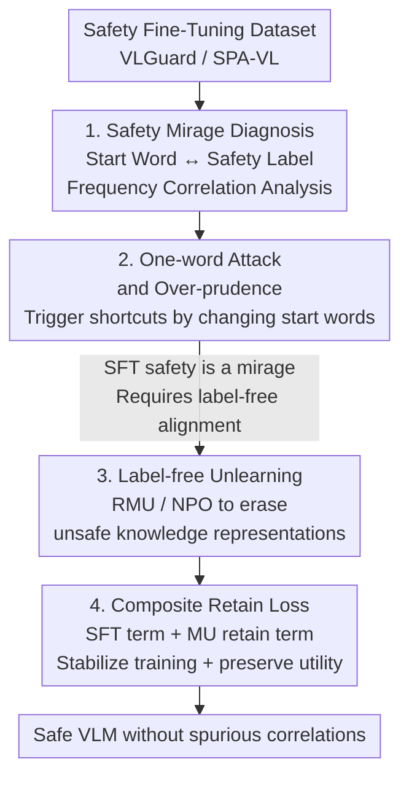

# Safety Mirage: How Spurious Correlations Undermine VLM Safety Fine-Tuning and Can Be Mitigated by Machine Unlearning

**Conference**: ICLR 2026  
**OpenReview**: [https://openreview.net/forum?id=Qi1rZa4zzl](https://openreview.net/forum?id=Qi1rZa4zzl)  
**Code**: https://github.com/OPTML-Group/VLM-Safety-Unlearn  
**Area**: Multimodal VLM / AI Safety / Alignment  
**Keywords**: VLM Safety, Safety Fine-Tuning, Spurious Correlation, Machine Unlearning, Jailbreak Attack

## TL;DR
This paper reveals that the "safety" in current VLM safety fine-tuning (SFT) is actually a **safety mirage**—models learn a spurious correlation between "specific start words $\leftrightarrow$ refusal labels" rather than true suppression of harmful knowledge. Consequently, replacing a single word in a query (e.g., "Share" $\to$ "What") can trigger a jailbreak or cause over-refusal. The authors propose using **Machine Unlearning (RMU / NPO)** for label-free safety alignment, which reduces the Attack Success Rate (ASR) by up to 60.27% and unnecessary refusals by over 84.20%.

## Background & Motivation

**Background**: Recent safety alignment for VLMs has led to a "surpising" empirical conclusion: supervised fine-tuning (SFT) on high-quality bimodal safety datasets like VLGuard and SPA-VL alone can make models highly robust against unsafe queries and jailbreak attacks. As a result, "safety fine-tuning can solve VLM safety" has become a mainstream consensus.

**Limitations of Prior Work**: This SFT-based "robust safety" is accompanied by two anomalies. First, **over-prudence**: models frequently refuse completely harmless queries, damaging usability. Second, superficial safety is extremely fragile: the authors find that modifying just the **first word** of a query (changing the start of an unsafe query from "Share" to "What") can bypass safety mechanisms and cause the model to output harmful content. This suggests that the perceived safety may be a "mirage."

**Key Challenge**: The root cause lies in **spurious correlations** within safety fine-tuning datasets. Safety labels (refusal/non-refusal) are strongly bound to **non-core textual features** in queries (e.g., starting interrogative words like "What" / "Share"). In VLGuard, "what" appears in over 80% of safe queries (non-refusal), while "share" appears almost exclusively in unsafe queries leading to refusal. The model learns which word at the beginning dictates whether to refuse, rather than whether the content is harmful, essentially following a "shortcut."

**Goal**: (a) Answer what causes the "safety mirage" in VLM safety fine-tuning; (b) Find a safety alignment solution that truly removes harmful knowledge without introducing spurious correlations.

**Key Insight**: Since the problem with SFT is that "supervised training with safety labels" binds labels to spurious features, the authors propose to **discard safety labels entirely** and turn to label-free alignment. Machine Unlearning (MU) is naturally designed to "erase the influence of specific knowledge while retaining normal capabilities," which fits perfectly—it directly wipes out the model's representation of unsafe data without building a "feature $\to$ label" mapping.

**Core Idea**: Replace supervised safety fine-tuning with machine unlearning (RMU / NPO). By erasing unsafe knowledge itself rather than relying on the "spurious feature $\to$ refusal label" shortcut, safety can be achieved while fundamentally eliminating the safety mirage.

## Method

### Overall Architecture

The paper is divided into **diagnosis** and **repair**. The diagnosis side quantifies the frequency correlation between start words and safety labels in training sets, confirming two types of spurious correlations: "non-refusal bias" (e.g., "What") and "refusal bias" (e.g., "Share"). Based on this, **one-word attacks** (rewriting unsafe queries to start with non-refusal biased words) and **one-word modifications** (adding refusal biased words to harmless queries) are constructed to prove that SFT safety is a mirage. The repair side replaces the "supervised refusal label loss" of SFT with a **label-free unlearning loss** $\ell_u$ (either RMU or NPO), combined with a **composite retain loss** $\ell_r$ to prevent model collapse.

### Key Designs

**1. Safety Mirage Diagnosis: Decomposing "Safety" into Spurious Correlations**

The authors define "spurious features" as non-core features in a query that **do not affect the true semantics and can be swapped at will** (typically starting interrogative words like "What" / "Share"). In contrast, "core features" like "crime" carry the true intent. "Spurious correlation" is the **unintended strong association** between these spurious features and safety labels (refusal/non-refusal), inspired by classic analyses in image classification where "background pixels are spurious and object pixels are core." Diagnosis involves statistical analysis of start word distributions: in VLGuard, "what" accounts for over 80% of safe queries, and "share" is almost exclusively in unsafe queries. This identifies two biases: **non-refusal bias** ("What" $\leftrightarrow$ no refusal) and **refusal bias** ("Share" $\leftrightarrow$ refusal).

**2. One-word Attack and Over-prudence: Proving the Mirage via Word Substitution**

**Jailbreak**: An unsafe query $q$ is rewritten as $q'$, starting with an adversarial word $w_{adv}$ (e.g., "what"). This triggers the non-refusal bias to bypass filters, termed a one-word jailbreak attack. A **K-shot** version is also used—rewriting $q$ into $K$ paraphrases starting with $w_{adv}$; a single unsafe response denotes success. While $K=1$ achieves 29% ASR (original queries are near 0%), $K\geq 3$ exceeds 50%, and ASR approaches 90% as $K$ increases. Pure paraphrasing without "What" is ineffective, proving the bias word is key. This is analogous to a **backdoor attack** where "What" acts as a trigger. **Over-prudence** is the mirrored operation: adding "Share" to harmless queries increases the over-refusal rate of safe multimodal queries to 90%.

**3. Label-free Unlearning: Erasing Knowledge via RMU / NPO instead of Learning Labels**

The core of the fix is replacing the "supervised loss on unsafe set $D_u$" with an unlearning loss $\ell_u$ that **depends only on unsafe data features, not safety labels**. Two MU methods are migrated from LLMs to VLMs: **RMU (Representation Misdirection Unlearning)** forces the intermediate layer representation of unsafe samples to map to a random vector:

$$\ell_u(\theta; D_u) = \mathbb{E}_{x\in D_u}\big[\,\lVert M_\theta(x) - c\cdot v \rVert_2^2\,\big]$$

where $M_\theta(\cdot)$ is an intermediate representation, $c$ is an activation scale, and $v$ is a random vector. **NPO (Negative Preference Optimization)** treats unsafe samples as "negative examples" in a DPO framework, forcing the model to deviate from a reference model:

$$\ell_u(\theta; D_u) = \mathbb{E}_{x\in D_u}\Big[-\tfrac{2}{\beta}\log\sigma\big(-\beta\log\tfrac{\pi_\theta(x)}{\pi_{ref}(x)}\big)\Big]$$

Neither requires explicit "refusal" labels, preventing the learning of start-word shortcuts. Response analysis shows that while SFT relies on **explicit refusal** (high RR), MU relies on outputting **irrelevant content** (IR) to avoid unsafe outputs.

**4. Composite Retain Loss: Stabilizing Training and Preserving General Capabilities**

Applying MU directly to VLMs often leads to instability or model collapse. The authors design the retain loss $\ell_r$ as a sum of two terms:

$$\ell_r(\theta; D_r) = \ell_{ft}(\theta; D_r) + \alpha\,\ell_{mu,r}(\theta; D_r)$$

where $\ell_{ft}$ is the standard fine-tuning loss of the base VLM for stable optimization, and $\ell_{mu,r}$ is the MU-specific retain term (e.g., representation loss on the available set for RMU). This combination allows unlearning to converge stably on VLMs, with general utility (VQA accuracy) dropping only by ~1%.

### Loss & Training
The framework follows $\min_\theta\ \ell_u(\theta;D_u) + \gamma\,\ell_r(\theta;D_r)$, with $\ell_u$ being RMU or NPO and $\ell_r$ using the composite retain loss. Training uses the VLGuard set: safe Q&A pairs for $D_r$; unsafe queries for $D_u$ (NPO) or unsafe queries concatenated with harmful answers from Llama-2-13B-Chat (RMU).

## Key Experimental Results

### Main Results

Evaluated on 4 safety datasets (VLGuard / SPA-VL / MM-SafetyBench / FigStep) and 4 VQA utility datasets using LLaVA-1.5-7B/13B. The table shows results for LLaVA-1.5-7B (full fine-tuning):

| Model | VLGuard ASR Pre → Post | VLGuard RR Pre → Post | VQAv2 Acc |
|------|------|------|------|
| LLaVA-1.5-7B (Base) | 64.25% → 90.27% | 0.36% → 0.36% | 78.53% |
| + Mixed-SFT | 0.23% → 54.98% | 4.48% → 91.76% | 78.23% |
| + Posthoc-SFT | 0.23% → 46.83% | 2.69% → 90.83% | 78.03% |
| + NPO-Unlearning | 2.49% → **12.92%** | 2.51% → **11.69%** | 77.34% |
| + RMU-Unlearning | 1.29% → **10.18%** | 1.25% → **7.56%** | 77.04% |

Key Observation: SFT suppresses ASR to nearly 0% before attacks, but a 3-shot one-word attack causes ASR to jump to 50%-55% (confirming the safety mirage) and RR to soar over 90%. MU methods maintain ASR at 10%-13% and RR at 7%-12% after attacks, with only a ~1% drop in utility.

### Ablation Study

**Mechanism Decomposition (Table 2, LLaVA-1.5-7B / VLGuard, Post-Attack)**—splitting safety rate (1−ASR) into Irrelevance (IR) and Explicit Refusal (RR):

| Configuration | ASR (Post) | IR (Post) | RR (Post) | Note |
|------|---------|--------|--------|------|
| Mixed-SFT | 24.66% | 5.20% | 70.14% | Safety depends on explicit refusal |
| Posthoc-SFT | 25.34% | 4.75% | 69.91% | Dependency on refusal labels |
| NPO-Unlearning | 6.99% | 48.72% | 44.29% | Mixture of IR and RR |
| RMU-Unlearning | 5.06% | **89.29%** | 5.65% | Almost entirely IR |

This confirms the mechanism: SFT relies on "learning to refuse" (high RR), which fails when shortcuts are bypassed. MU relies on outputting content irrelevant to unsafe queries (high IR).

### Key Findings
- **Safety mirage is ubiquitous**: Mixed-SFT and Posthoc-SFT across various scales (7B/13B) and methods (Full/LoRA) show the same ASR/RR surge.
- **RMU slightly outperforms NPO**: It achieves lower post-attack ASR and RR with a cleaner mechanism based on IR.
- **Attack strength scales with K**: One-word attack ASR increases monotonically with K, while paraphrasing without triggers fails.
- **Minimal Utility Tax**: MU only results in a ~1% VQA accuracy drop; coreset unlearning can further mitigate this.

## Highlights & Insights
- **Redefining safety as a falsifiable spurious correlation problem**: Instead of merely stating "the model was jailbroken," the authors pinpoint the "start word $\leftrightarrow$ safety label" shortcut and validate it statistically.
- **One-word attack as a "backdoor" perspective**: Spurious correlations are viewed as unintentional triggers. This elegantly explains jailbreaks and over-refusal within the same framework.
- **IR/RR decomposition clarifies mechanism differences**: Using "Irrelevance vs. Refusal" rates clearly demonstrates why MU is more robust than SFT.
- **Label-free alignment as a general paradigm**: This approach can be extended to LLM safety, content moderation, and any scenario where supervised labels might bind to spurious features.

## Limitations & Future Work
- **Unlearning-Utility Trade-off**: A small utility drop (~1%) exists; while coreset unlearning helps, an optimal balance is still sought.
- **VLM Unlearning Instability**: Methods are sensitive to hyperparameters (layer selection, $c$, $\alpha$, $\beta$) to avoid model collapse.
- **Focus on Textual Bias**: The study primarily focuses on start-word bias in the text modality; spurious correlations in the image modality remain less explored.
- **Dependence on External Judge**: ASR evaluation relies on Qwen2.5-VL-7B as a judge, which introduces potential bias.

## Related Work & Insights
- **vs. Supervised Safety Fine-Tuning**: SFT relies on refusal labels and fails under simple trigger word modification; MU avoids feature-label binding.
- **vs. Existing VLM Machine Unlearning**: Prior works focused on erasing harmful generation; this work uniquely applies MU to eliminate spurious correlations.
- **vs. LLM Unlearning (RMU/NPO)**: This paper adapts these methods to VLMs by introducing a composite $\ell_{ft}$ retain loss to handle VLM-specific training dynamics.

## Rating
- Novelty: ⭐⭐⭐⭐⭐ The diagnosis of "Safety Mirage" via spurious correlations is sharp and insightful.
- Experimental Thoroughness: ⭐⭐⭐⭐⭐ Extensive coverage of safety/VQA datasets and mechanism analysis.
- Writing Quality: ⭐⭐⭐⭐ Clear narrative flow from diagnosis to repair.
- Value: ⭐⭐⭐⭐⭐ Challenges the SFT consensus and provides a robust label-free alternative.

<!-- RELATED:START -->

## Related Papers

- [\[ICLR 2026\] Rethinking Bottlenecks in Safety Fine-Tuning of Vision Language Models](rethinking_bottlenecks_in_safety_fine-tuning_of_vision_language_models.md)
- [\[ICLR 2026\] Strategic Dishonesty Can Undermine AI Safety Evaluations of Frontier LLMs](strategic_dishonesty_can_undermine_ai_safety_evaluations_of_frontier_llms.md)
- [\[ICLR 2026\] Erase or Hide? Suppressing Spurious Unlearning Neurons for Robust Unlearning](erase_or_hide_suppressing_spurious_unlearning_neurons_for_robust_unlearning.md)
- [\[ICLR 2026\] OFMU: Optimization-Driven Framework for Machine Unlearning](ofmu_optimization-driven_framework_for_machine_unlearning.md)
- [\[ICLR 2026\] SafeDialBench: A Fine-grained Safety Evaluation Benchmark for LLMs in Multi-turn Dialogues and Diverse Jailbreak Attacks](safedialbench_a_fine-grained_safety_evaluation_benchmark_for_large_language_mode.md)

<!-- RELATED:END -->
