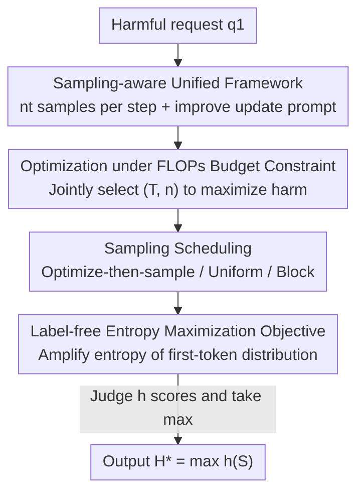

# Sampling-aware Adversarial Attacks against Large Language Models

**Conference**: ICLR 2026  
**OpenReview**: [https://openreview.net/forum?id=vBmRQHW7en](https://openreview.net/forum?id=vBmRQHW7en)  
**Area**: AI Security / LLM Adversarial Attacks  
**Keywords**: Adversarial attacks, Jailbreak, Sampling, Compute allocation, Entropy maximization objective

## TL;DR
This paper points out that existing LLM adversarial attacks only consider whether "single-point greedy generation" is harmful, systematically underestimating model risks. The authors reformulate the attack as a compute allocation problem between "optimizing prompts" and "repeatedly sampling outputs." They demonstrate that by treating sampling as a first-class attack vector, the attack success rate can be increased by up to 37 percentage points and compute overhead can be reduced by up to two orders of magnitude under the same compute budget.

## Background & Motivation
**Background**: Evaluating the adversarial robustness of LLMs is a prerequisite for safe deployment. Mainstream adversarial attack paradigms (GCG, AutoDAN, PAIR, BEAST, etc.) typically optimize an adversarial prompt to force the model to output an affirmative prefix for harmful requests, almost always using **single-point greedy generation** (temperature 0, one sample) to determine attack success.

**Limitations of Prior Work**: LLM generation is essentially a **stochastic process**—sampling the same prompt multiple times may yield rare but extremely harmful responses. However, existing attacks spend the vast majority of compute on optimization and sample only once at the end, directly equating "this prompt failed to jailbreak under greedy generation" with "the model is robust to it." In real-world scenarios with widespread sampling, even a low single-trial harmful probability results in amplified long-tail risks. Consequently, existing protocols **systematically overestimate** model robustness.

**Key Challenge**: Under a fixed compute budget, there is a trade-off between "continuing to optimize the prompt to increase single-trial harmful probability" and "sampling multiple completions for the current prompt to hit the harmful long tail." Fragile models may jailbreak with minimal optimization and more sampling, while robust models require extensive optimization before sampling becomes cost-effective. Existing methods do not explicitly balance these two ends.

**Goal**: To upgrade sampling as a core parameter in attack design and answer two questions: (1) How should optimization and sampling be optimally allocated under a fixed budget? (2) Why is sampling so efficient (what does optimization actually change in the harmful distribution)?

**Key Insight**: The authors observe that "high-risk samples can often be captured with significant probability during early stages of optimization." Rather than obsessing over finding a single "reliable" jailbreak prompt, they draw from the computer vision tradition of characterizing worst-case behavior, aiming to "elicit maximum harm with minimum resources."

**Core Idea**: The adversarial attack is reformulated as a resource allocation problem involving "optimization steps $T$ + sampling count vector $n$ per step." The $(T,n)$ pair is jointly searched under a fixed FLOPs budget, leading to the design of sampling schedules and a label-free attack objective.

## Method

### Overall Architecture
This paper proposes the **Sampling-Aware Attack (SAA)** framework. It treats an attack as $T$ iterations: at each step $t$, $n_t$ completions are sampled using the current prompt $q_t$. A judge model $h(\cdot)\in[0,1]$ scores each completion for harmfulness. Optionally, next prompt $q_{t+1}$ is generated via `improve` using historical prompts $Q$ and samples $S$. The final success is determined by the maximum harm score across all samples $H^\star=\max_t h(S_t)$.

The core novelty is that the sampling vector $n=(n_1,\dots,n_T)$ is an **explicitly adjustable attack parameter**. Existing methods are special cases: GCG sets $n=(0,\dots,0,1)$ (sampling once at the end), while Best-of-N sets $n=(1,\dots,1)$ (sampling once per step without optimization). SAA opens the entire $(T,n)$ space and optimizes it under a fixed compute budget $B$.

### Key Designs

**1. Sampling-Aware Unified Framework (SAA): Promoting sampling to a first-class attack parameter**

Addressing the issue where existing attacks treat sampling as an afterthought, this paper formalizes the attack as an iterative process over $(T,n)$ in Algorithm 1. In each step $t$, $n_t$ samples are drawn from $f_\theta(\cdot\mid q_t)$ and added to $S$, then `improve(Q,S)` generates a new prompt. This abstraction **unifies and generalizes** existing methods. The authors argue that previous algorithms were restricted to $\max(n)=1$, ignoring the highly efficient attack vector of multiple sampling for the same prompt.

**2. Compute Allocation under FLOPs Budget: Enabling fair comparison**

Since success rates naturally increase with more sampling, comparisons must be conducted under a **fixed compute budget**. Efficient attacks are formulated as:

$$\max_{n,T}\ \mathrm{SAA}(q,n,T)\quad \text{s.t.}\quad \sum_{t=1}^{T}\Big(C^{\text{opt}}_t+\sum_{k=1}^{n_t}C^{\text{sample}}_{t,k}\Big)\le B$$

Where $C^{\text{opt}}_t$ is the optimization cost and $C^{\text{sample}}_{t,k}$ is the single completion cost, measured per sample to account for prefix-filling and generation lengths. Using FLOPs instead of wall-clock time ensures hardware independence. This framework reveals that **one optimization step is up to two orders of magnitude more expensive than one sample** (e.g., 92x for GCG, 353x for PAIR), making the shift from optimization to sampling almost always beneficial.

**3. Sampling Scheduling: Defining "When to sample and how much"**

Since searching the full $(T,n)$ space is infeasible, the authors define three schedules based on total sampling budget $N$ and steps $T$: **Optimize-then-sample** (optimization for $T$ steps, then sample $N$ at the end; the experimental default), **Uniform sampling** (split $\lfloor N/T\rfloor$ per step), and **Block sampling** (equal distribution across a tail block of length $b$). All three significantly outperform greedy baselines, suggesting that **sampling itself** is the source of gain, rather than the specific distribution of samples across steps.

**4. Label-free Entropy Maximization Objective: An attack loss tailored for sampling**

Existing objectives often rely on "affirmative prefixes" (e.g., "Sure, here's..."), which are increasingly out-of-distribution and easy to defend. This paper proposes a **label-free**, model-agnostic loss: maximizing the entropy of the **first predicted token** distribution:

$$L_{\text{entropy}}(q)=-H\big(f_\theta(y_1\mid q,\ y_1\in S)\big)$$

Where the distribution is constrained to the valid token set $S$. Unlike old objectives that aim to raise the mean harmfulness, the entropy objective **amplifies the spread of the distribution**, increasing the probability of hitting the harmful long tail. This integrates perfectly with the sampling-aware perspective and works even in black-box scenarios where only first-token logits are available.

## Key Experimental Results

### Main Results

| Attack | Gain | Description |
|--------|------|-------------|
| GCG | ASR +0.37 / Speedup 137.5× | 37 percentage point ASR increase under equal FLOPs; two orders of magnitude compute reduction for iso-ASR. |
| AutoDAN | ASR +0.21 / Speedup 8.9× | Pareto improvement by shifting compute from optimization to sampling. |
| PAIR | ASR +0.16 / Speedup 2.7× | Similar Pareto improvement. |
| Overall | $H$ more than doubled | Average harm score $H$ more than doubled by increasing sample count at fixed budget. |

The compute efficiency (Table 1, ratio of one optimization step vs. one sample) shows that optimization is significantly more expensive (AutoDAN 322x, GCG 92x). To match baseline harmfulness, **100–200 samples** is often the compute-optimal point.

### Ablation Study: Entropy Objective vs. Affirmative Objective (Table 2, GCG)

| Model | Configuration | Affirmative ASR | Entropy Objective ASR |
|------|------|-----------|-----------|
| Llama 3.1 8B | $T{=}5$, @50 | 0.46 | **0.64** |
| Llama 3.1 8B | $T{=}250$, @50 | 0.79 | **0.84** |
| Gemma 3 1B | $T{=}5$, @50 | 0.44 | **0.56** |

The entropy objective is weaker than the affirmative objective in single-sample metrics (ASR$_q$@1) but surpasses it under sampling-aware @50 evaluation and converges much faster.

### Key Findings
- **Optimization primarily "suppresses refusal" rather than "increasing harmfulness"**: The harmful distribution is bimodal/trimodal. Optimization shaves off the refusal peak to make the model "willing to answer," but rarely increases the harm level of already compliant answers.
- **Many optimization attacks do not improve prompt quality over time**: Only GCG consistently improves prompt quality; for PAIR, success is driven more by incremental sampling than by optimization.
- **Sampling changes model robustness rankings**: Gemma 3 1B appears more robust than Llama 3.1 8B under ASR$_q$@1, but becomes more fragile under @50 as it is more likely to produce rare, extreme outliers.
- **High-temperature sampling cannot replace the entropy objective**: Pure sampling @1000 reaches only 0.65 ASR, whereas the entropy objective reaches 0.84 @50 without sacrificing coherence.

## Highlights & Insights
- Abstracting the "sampling vs. optimization" trade-off into a resource allocation problem under fixed FLOPs provides a clean framework to **unify almost all existing attacks**.
- The insight that "optimization only suppresses refusal" suggests that defenses should focus on ensuring the model does not provide high-harm content even in the long tail, rather than just preventing initial jailbreaks.
- The label-free entropy maximization objective offers a transferable, black-box friendly optimization target that bypasses the limitations of rigid affirmative templates.
- The discovery that evaluation protocols change model rankings warns the safety community that greedy single-sample testing is insufficient for reliable robustness guarantees.

## Limitations & Future Work
- Experiments primarily utilized 4 open-source models and 100 HarmBench requests; generalizability to closed-source or larger models requires further verification.
- The mechanism of why optimization only suppresses refusal remains partially unexplained.
- The entropy objective was most effective on the first token; extending it to longer sequences sometimes led to incoherence.
- The framework assumes the attacker can sample multiple times and use a judge, which might be restricted in real-world APIs with strict rate limits.

## Related Work & Insights
- **vs. GCG / AutoDAN (Optimization-only)**: These are special cases of SAA where $n=(0,\dots,0,1)$. Moving compute to sampling yields Pareto gains.
- **vs. Best-of-N (Sampling-only)**: This is a special case where $n=(1,\dots,1)$ with no optimization. SAA utilizes the neglected dimension of multiple samples per optimized prompt.
- **vs. Affirmative Objective series**: Traditional methods raise the mean harmfulness; the entropy objective increases the distribution spread.

## Rating
- Novelty: ⭐⭐⭐⭐⭐ 
- Experimental Thoroughness: ⭐⭐⭐⭐ 
- Writing Quality: ⭐⭐⭐⭐⭐ 
- Value: ⭐⭐⭐⭐⭐ 

<!-- RELATED:START -->

## Related Papers

- [\[ICLR 2026\] VEAttack: Downstream-Agnostic Vision Encoder Attack Against Large Vision Language Models](veattack_downstream-agnostic_vision_encoder_attack_against_large_vision_language.md)
- [\[ACL 2026\] ATAAT: Adaptive Threat-Aware Adversarial Tuning Framework against Backdoor Attacks on Vision-Language-Action Models](../../ACL2026/llm_safety/ataat_adaptive_threat-aware_adversarial_tuning_framework_against_backdoor_attack.md)
- [\[ICLR 2026\] Membership Inference Attacks Against Fine-tuned Diffusion Language Models (SAMA)](membership_inference_attacks_against_fine-tuned_diffusion_language_models.md)
- [\[ICLR 2026\] GeneBreaker: Jailbreak Attacks Against DNA Language Models with Pathogenicity Guidance](genebreaker_jailbreak_attacks_against_dna_language_models_with_pathogenicity_gui.md)
- [\[ICLR 2026\] Efficient Adversarial Attacks on High-dimensional Offline Bandits](efficient_adversarial_attacks_on_high-dimensional_offline_bandits.md)

<!-- RELATED:END -->
