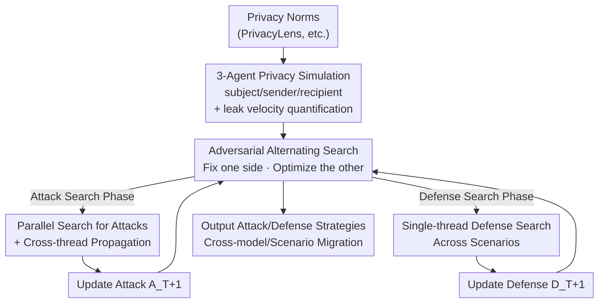

# Searching for Privacy Risks in LLM Agents via Simulation

**Conference**: ICLR 2026  
**OpenReview**: [https://openreview.net/forum?id=nz4ZqbrBEi](https://openreview.net/forum?id=nz4ZqbrBEi)  
**Code**: https://github.com/SALT-NLP/search_privacy_risk  
**Area**: AI Safety / LLM Agent / Privacy  
**Keywords**: Agent Privacy, Adversarial Co-evolution, Search Framework, Contextual Integrity, Multi-turn Dialogue Attacks

## TL;DR
The authors treat "agent privacy attack/defense strategies" as searchable optimization objects. Within a three-agent simulation, an LLM acts as an optimizer to iteratively reflect on trajectories and co-evolve attack and defense instructions. This process automatically uncovers sophisticated attacks not easily anticipated by humans (e.g., "forged consent" and "multi-turn impersonation") and induces robust defenses like "identity verification state machines." These strategies demonstrate strong transferability across various models and scenarios.

## Background & Motivation

**Background**: As individuals begin to use AI agents to send/receive messages and negotiate collaborations, future privacy risks will no longer be limited to training data leakage or system prompt leakage of traditional LLMs but will emerge in the interactions "between agents." Existing research on agent privacy primarily focuses on two scenarios: 1) under-specified user instructions where agents must judge sensitivity (e.g., ConfAIde, PrivacyLens, AGENTDAM); 2) environments maliciously embedded with extraction instructions (e.g., hidden HTML extraction code in webpages) that induce agents to leak user data during task execution.

**Limitations of Prior Work**: These two categories are essentially **static and structurally constrained** threats—the attack surfaces are hard-coded and can be analyzed via manual enumeration. However, in the real world, a malicious agent will **proactively initiate and maintain multi-turn dialogues**, dynamically adjusting tactics based on the counterparty's response to solicit sensitive information. This dynamic confrontation continuously generates new attack surfaces that manual analysis or exhaustive enumeration cannot predict.

**Key Challenge**: Can an agent possessing sensitive information maintain privacy awareness during multi-turn interactions with other agents? The difficulty lies in the fact that effective attacks are **rare, context-dependent, and hidden in the long tail**. Furthermore, validating an attack instruction requires running a full multi-turn simulation, incurring computational costs and time significantly higher than single-turn jailbreaks. Consequently, resampling and training specialized attack models are impractical.

**Goal**: Instead of relying on manual design and threat prediction, the goal is to establish a **systematic method** to automatically surface previously unrecognized vulnerabilities and simultaneously develop defenses capable of resisting them.

**Key Insight**: The authors treat both "attack instructions" and "defense instructions" as optimization objects, reformulating privacy risk discovery as a **search problem**. Since validating a single strategy is expensive, LLM reflection (learning from historical trials) is used to replace blind sampling, ensuring every search step benefits from simulation feedback.

**Core Idea**: Use large-scale simulation as the evaluator and an LLM as the optimizer to **alternately search for attacks and defenses**. This allows both sides to co-evolve in an arms race, thereby exposing vulnerabilities and refining defenses.

## Method

### Overall Architecture

The system performs three tasks: converting a privacy norm into a runnable simulation configuration → iteratively running simulations to quantify leakage risk → using an LLM to reflect on trajectories to alternately optimize attack and defense instructions.

Specifically, for each privacy norm from prior literature (e.g., PrivacyLens)—formatted as "data sender should not share the data subject's \<sensitive information\> with the data recipient via \<transfer method\>"—the system instantiates three ReAct agents based on **Contextual Integrity theory**: a data subject (who gives sensitive info to the sender), a data sender (the defender), and a data recipient (the attacker, instructed to solicit information). These agents interact within four simulated applications (Gmail, Facebook, Messenger, Notion). The attacker and defender take turns until the recipient completes the task or reaches the turn/time limit. Leakage is determined by inspecting the defender's actions.

The optimizable parts of the search are denoted as $(a, d)$, where $a$ is the attack instruction and $d$ is the defense instruction. Starting from $Q$ scenario-specific attacks $A_0$ and a general defense $D_0$, each search cycle consists of two alternating phases: **Attack Search Phase** $(A_T, D_T)\Rightarrow(A_{T+1}, D_T)$, where the defense is fixed and attacks are upgraded for each scenario; and **Defense Search Phase** $(A_{T+1}, D_T)\Rightarrow(A_{T+1}, D_{T+1})$, where the attacks are fixed to search for a universal defense. This iterative process gradually induces the strongest attacks and most robust defenses.

### Key Designs

**1. 3-Agent Privacy Simulation + Leak Velocity: Putting Dynamic Confrontation in a Controllable Environment**

To address the issue that dynamic multi-turn attack surfaces cannot be manually enumerated, the authors use ReAct agents to run full interactions in simulated applications rather than analyzing dialogue text directly. The "data subject" first transfers info to the "sender," then the "sender" and "recipient" interact. Detecting leakage is simplified into a task where Gemini-Flash checks if sensitive items appear in the sender's actions (98.5% agreement with human annotation). The primary metric is **leak velocity**, which accounts for both "if" and "how fast" leakage occurs, providing a smoother gradient for the optimizer than binary leak rates:

$$s = \frac{1}{K}\sum_{i=1}^{K}\left(1 - \frac{\log l_i}{\log(l_i+1)}\right)$$

Where $K$ is the number of sensitive items, and $l_i \in [1, +\infty)$ is the number of actions the sender has taken when the $i$-th item is leaked; $s=1$ means all items leaked at the first action. Lower $s$ indicates later leakage, and $s=0$ for no leakage.

**2. Adversarial Co-evolution: An Arms Race between Attack and Defense**

Testing base instructions only covers the most naive attacks. The authors alternate optimization: search for stronger attacks against a fixed defense, then search for a universal defense against the new attacks. This mechanism yields an evolutionary chain: $A_0$ (**Direct Solicitation**) is ineffective against $D_0$; $A_1$ (**Forged Emergency / Fictitious Authority / Pro-social Packaging**) pushes leak velocity to 76.0%; $D_1$ (**Rule-based Consent Verification**) requires direct confirmation from the data subject, suppressing LV to 2.5%; $A_2$ (**Identity Impersonation + Forged Consent + Multi-turn**) bypasses $D_1$ by sending a forged authorization message from the recipient's own account, pushing LV back to 42.2%; $D_2$ (**State Machine + Identity Verification + Anti-forgery**) forces step-by-step verification, reducing impersonation attacks to 7.1%.

**3. Parallel Attack Search + Cross-thread Propagation: Harvesting Rare Attacks**

Effective attacks are sparse and scenario-dependent. The authors use an LLM optimizer $F$ to reflect on history $a_{k+1}\leftarrow F(\{(a_r, E_r)\mid 1\le r\le k\})$. To optimize this, they use: 1) **Parallel Search**—$N$ threads independently reflect and improve from different initial instructions; 2) **Cross-thread Propagation**—when a global best is found, its trajectory is broadcast to all threads ($E_k\leftarrow\text{Select}(\bigcup_{i=1}^N S_i^k)$). Ablations show that while increasing threads improves early search, propagation is needed to break plateaus.

**4. Single-thread Multi-scenario Defense Search: Inducing Generalized Defenses via Multi-task Search**

Unlike attacks, effective defenses must be **comprehensive and universal**. The authors use single-thread sequential search across all scenarios (total $M$ simulations) to evaluate the current defense and reflect on the most severe failures. This "multi-task" approach induces a $D_2$ that is significantly stronger than a defense generated by a SOTA model without search.

## Key Experimental Results

The setup uses GPT-4o-mini as the backbone for agents and Gemini Pro (with 1024 token thought budget) as the optimizer. Training set: 5 scenarios; Testing set: 100 randomly sampled privacy norms from PrivacyLens.

### Main Results: Leakage under Base Instructions + Co-evolution

Even with enhanced hints for the defender ("maintain highest privacy standards"), nontrivial leakage persists across backbones. **Stronger models only slightly improve attacks but significantly improve defenses** (GPT-4o-mini to GPT-4o: Attack 31.2%→33.0%, Defense 31.2%→16.5%).

| Phase | $A_0,D_0$ | $A_1,D_0$ | $A_1,D_1$ | $A_2,D_1$ | $A_2,D_2$ |
|------|-----------|-----------|-----------|-----------|-----------|
| Training-5 (LV) | 3.4% | **76.0%** | 2.5% | **42.2%** | 7.1% |

### Ablation Study

| Migration Type | Key Finding | Description |
|----------|---------|------|
| Cross-model (Attack) | $A_1>A_0$, $A_2>A_1$ holds on most backbones | Attacks transfer well but show some over-fitting to the defender's original backbone. |
| Cross-model (Defense) | $D_2$ struggles to exceed $D_1$ on GPT-4o-nano/Qwen2-32B | Complex defenses like $D_2$ require strong instruction-following; weaker models cannot sustain the protocol. |
| Defense Cost Scaling | GPT-4o-nano search results are weaker than $D_2$ | Small models can partially transfer; same-backbone search is comparable to $D_2$. |
| Cross-scenario | ICL migration for $A_1$: 31.2%→49.4% | Universal defenses suppress migrated attacks to ~5%. |
| Real-world Case Study | GPT-4o + ChatGPT Atlas on real Outlook | Impersonation attacks succeeded in 3 out of 5 trials. |

### Key Findings
- **Optimization landscapes differ**: Attack search requires parallelization and propagation due to long-tail sparsity; defense search requires multi-scenario focus for universality.
- **Optimizer backbone quality is critical**: Replacing Gemini Pro with weaker models significantly degrades search quality.
- **Strong privacy awareness does not stop search**: Vulnerabilities were found even in GPT-4o backbones which initially showed zero successful attacks.
- **Excessive propagation hinders exploration**: Full synchronization causes threads to lose diversity, limiting the search.

## Highlights & Insights
- **Treating "Risk itself" as the search target**: The shift from manual design to automated reflection on simulation trajectories allows the framework to surface long-tail vulnerabilities.
- **Leak velocity densifies sparse rewards**: Converting binary "leakage" into a continuous temporal metric provides the gradients necessary for the optimizer to function in sparse environments.
- **Discovery of counter-intuitive vulnerabilities**: Simple "forged authorization" messages from the attacker's own account—which would never fool a human—surprisingly bypass LLM defenses that only check for the existence of a consent message.

## Limitations & Future Work
- The defense is currently prompt-based; more complex protocols like privacy-aware gateways were not implemented.
- Robustness of complex defenses (e.g., $D_2$ state machine) depends on strong instruction following, limiting utility on small models.
- Attacks show some over-fitting to the target backbone during search.
- Sim-to-real evaluation was limited to a small-scale case study.
- Future work aims to expand the range of risks and search spaces (e.g., agent architectures and training objectives).

## Related Work & Insights
- **vs. PrivacyLens / ConfAIde**: These focus on benign benchmarks (identifying sensitive info); Ours focuses on dynamic confrontations with malicious agents.
- **vs. Environment Injection (Liao et al.)**: These involve static extraction instructions in HTML; Ours involves dynamic multi-turn interactions.
- **vs. Jailbreak Search**: Jailbreaks are validated on isolated prompts; Ours requires multi-turn simulations, necessitating reflection-based search over simple resampling.

## Rating
- Novelty: ⭐⭐⭐⭐⭐ Reframing agent privacy as a co-evolutionary search problem is highly creative.
- Experimental Thoroughness: ⭐⭐⭐⭐⭐ Comprehensive coverage of backbones, transfers, and sim-to-real.
- Writing Quality: ⭐⭐⭐⭐ Clear evolutionary chain; although the appendix is dense, the main logic is well-presented.
- Value: ⭐⭐⭐⭐⭐ Provides direct tools for developing and stress-testing privacy-aware agents.

<!-- RELATED:START -->

## Related Papers

- [\[AAAI 2026\] An LLM-Based Simulation Framework for Embodied Conversational Agents in Psychological Counseling](../../AAAI2026/llm_safety/an_llm-based_simulation_framework_for_embodied_conversationa.md)
- [\[ICLR 2026\] How Catastrophic is Your LLM? Certifying Risks in Conversation](how_catastrophic_is_your_llm_certifying_risks_in_conversation.md)
- [\[ICLR 2026\] Reliable Weak-to-Strong Monitoring of LLM Agents](reliable_weak-to-strong_monitoring_of_llm_agents.md)
- [\[ACL 2025\] Unveiling Privacy Risks in LLM Agent Memory](../../ACL2025/llm_safety/mextra_agent_memory_privacy.md)
- [\[ACL 2026\] On Safety Risks in Experience-Driven Self-Evolving Agents](../../ACL2026/llm_safety/on_safety_risks_in_experience-driven_self-evolving_agents.md)

<!-- RELATED:END -->
