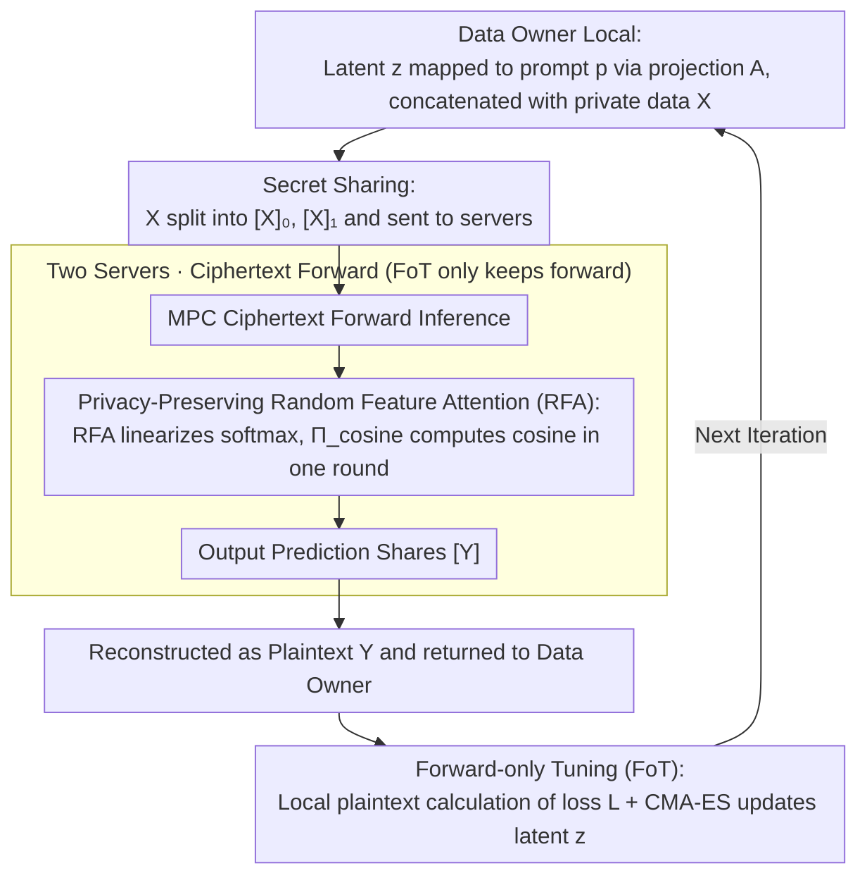

# SecP-Tuning: Efficient Privacy-Preserving Prompt Tuning for Large Language Models via MPC

**Conference**: ICLR 2026  
**arXiv**: [2506.15307](https://arxiv.org/abs/2506.15307)  
**Code**: None  
**Area**: AI Security  
**Keywords**: Privacy-Preserving, Secure Multi-Party Computation, Prompt Tuning, Forward-only Tuning, Random Feature Attention  

## TL;DR

Ours proposes SecP-Tuning, the first privacy-preserving prompt tuning framework based on Secure Multi-Party Computation (MPC). By eliminating backpropagation overhead through Forward-only Tuning (FoT) and reducing communication complexity with Privacy-Preserving Random Feature Attention (RFA) to replace softmax, it achieves approximately 12-16x speedup and 17-20x reduction in communication volume.

## Background & Motivation

1. **LLM adaptation needs in privacy-sensitive domains**: Sectors such as healthcare, finance, and government urgently need to adapt LLMs to specialized tasks, but data is protected by regulations like GDPR/HIPAA, preventing direct access.

2. **MPC provides theoretical privacy guarantees**: Secure Multi-Party Computation allows multiple parties to compute jointly without revealing their respective inputs, protecting both model parameters and training data privacy, which is superior to the statistical guarantees of Differential Privacy (DP).

3. **Severe efficiency bottlenecks in MPC fine-tuning**: A single SFT iteration for RoBERTa_LARGE takes about 10 minutes and 970GB of communication—where backpropagation and the optimizer account for 73% of the time, and softmax attention accounts for 75%.

4. **Backpropagation involves many MPC-unfriendly operations**: Non-linear operations such as Softmax, GELU, and LayerNorm must be decomposed into approximate computations of addition, subtraction, multiplication, and comparison in MPC environments, leading to a surge in communication rounds and data volume.

5. **Existing efficient fine-tuning methods fail to solve fundamental issues**: Although LoRA and gradient-based prompt tuning reduce the number of updated parameters, they still require privacy-preserving computation of backpropagation and softmax, failing to fundamentally reduce MPC communication overhead.

6. **HE schemes struggle to balance efficiency and accuracy**: Homomorphic Encryption (HE) relies on single-party re-computation and requires expensive approximation and re-encryption for non-linear operations. MPC supports complex non-linear operations directly through multi-round communication, making it more suitable for fine-tuning scenarios.

## Method

### Overall Architecture

SecP-Tuning places the "Data Owner" and the "Model Developer" into a two-server MPC environment, allowing the former to complete domain adaptation without exposing private data and the latter without surrendering model parameters. The data flow of one iteration proceeds as follows: the Data Owner locally maps a low-dimensional latent variable $z$ to a prompt embedding $p$ via a random projection $A$, concatenates it with private data $X$, and sends the secret-shared $X$ to the two servers. The two servers perform forward inference in ciphertext (using RFA instead of softmax for attention) and return the prediction shares $[Y]$ to be reconstructed as plaintext $Y$. After receiving $Y$, the Data Owner calculates the loss in plaintext locally and updates $z$ using a gradient-free optimizer for the next iteration. All efficiency gains stem from two targeted designs: first, using Forward-only Tuning (FoT) with a "Server-Client" architecture to move the loss and optimizer entirely out of the ciphertext, bypassing backpropagation; second, replacing softmax with Privacy-Preserving Random Feature Attention (RFA), compressing the ciphertext complexity of attention from $O(n^2d)$ to $O(ndr)$.

### Key Designs

**1. Privacy-Preserving Forward-only Tuning (FoT): Moving BP and Optimizer out of Ciphertext**

MPC is slow because backpropagation requires inverting Softmax, GELU, and LayerNorm, compounded by the division and square root operations in Adam. These non-linear operators must be decomposed into massive amounts of addition, subtraction, multiplication, and comparison approximations in ciphertext—accounting for 73% of an iteration's time. SecP-Tuning simply retains only forward inference: the Data Owner initializes prompt embedding $p$ locally, concatenates it with private data embedding $X$, and provides the secret shares $([X]_0, [X]_1)$ to the servers. The servers run MPC protocols for ciphertext forward passes and output prediction shares $[Y]$ to be reconstructed as plaintext $Y$. The Data Owner then calculates loss $L$ in plaintext locally and updates prompts using the gradient-free optimizer CMA-ES. This is the core of the "Server-Client" architecture—MPC-unfriendly computations like loss values and Gradient-Free Optimizers (GFO) (CMA-ES also includes sorting, outer products, and eigen-decomposition not directly supported by CrypTen) are offloaded to the Data Owner's local plaintext execution, ensuring both speed and precision. Crucially, as parameter updates happen only locally, servers never receive updated prompts, functionally blocking the "model memorization of training data" attack path at the architectural level. To ensure convergence of gradient-free optimization in high dimensions, updates are performed in a low-dimensional latent space $z\in\mathbb{R}^d$ ($d\ll D$) and mapped back to the original prompt space using a fixed random projection $A\in\mathbb{R}^{D\times d}$. The optimization objective is $z^*=\arg\min_{z\in\mathcal{Z}}\mathcal{L}(f(Az;X),Y)$.

**2. Privacy-Preserving Random Feature Attention (RFA): Revitalizing Linear Attention with an MPC-Friendly Cosine Protocol**

After removing backpropagation, softmax attention in the forward pass becomes the new bottleneck. It presents a triple challenge in ciphertext: exponentiation, division, and max operations are all MPC-unfriendly, and the $O(n^2d)$ complexity explodes quadratically with sequence length, consuming 75% of the time. RFA linearizes the kernel function using Random Fourier Features, approximating softmax as $\exp(\mathbf{x}^\top\mathbf{y}/\sigma^2)\approx\phi(\mathbf{x})^\top\phi(\mathbf{y})$, where $\phi(\mathbf{x})=\exp(\|\mathbf{x}\|^2/2\sigma^2)[\varphi(\mathbf{x},\omega_1),\dots,\varphi(\mathbf{x},\omega_M)]^\top$, reducing complexity to linear $O(ndr)$. However, $\phi$ still contains the cosine function, which is another MPC-unfriendly operation. Ours' contribution is the design of the cosine protocol $\Pi_{\text{cosine}}$: in the offline phase, random numbers $t$ and secret shares of $\sin(t)$ and $\cos(t)$ are pre-generated. In the online phase, only one communication round is needed to reconstruct $\delta=(x+t)\bmod\tau$, followed by using the trigonometric identity $\cos(x)=\sin(\delta)\sin(t)+\cos(\delta)\cos(t)$ to restore the result. The entire cosine operation costs only one communication round and $2\ell$-bit data volume. Without this protocol, RFA would be slower than original softmax on short sequences (e.g., $L=64, 128$), making it the critical component for cost-effective linear attention in MPC.

## Key Experimental Results

### Experimental Setup

- **Model**: RoBERTa_LARGE (24 layers, 1024 dimensions).
- **Datasets**: SST-2, MRPC, RTE, Yelp Polarity, AG's News (16-sample few-shot per class).
- **MPC Backend**: CrypTen framework, 3 A100 GPU servers; LAN (3Gbps, 0.8ms) and WAN (100Mbps/80ms, 200Mbps/40ms).
- **Baselines**: Full parameter SFT, Gradient Prompt Tuning, FoT (Plaintext).

### Main Results

| Method | Forward Time (s) | Backward Time (s) | Total Time (s) | Comm. Vol. (GB) |
|---|---|---|---|---|
| SFT | 216.2 | 554.5 | 651.6 | 970.7 |
| Gradient Prompt Tuning | 273.3 | 605.2 | 882.1 | 1116.2 |
| SecP-Tuning (FoT) | 174.0 | 0.0 | 174.1 | 205.4 |
| **SecP-Tuning (FoT+RFA)** | **54.2** | **0.0** | **55.2** | **56.5** |

| Method | SST-2 Acc | Yelp P. Acc | AG's News Acc | MRPC F1 | RTE Acc | Average |
|---|---|---|---|---|---|---|
| SFT | 85.39 | **91.82** | **86.36** | **77.35** | 58.60 | 79.90 |
| Gradient Prompt Tuning | 68.23 | 61.02 | 84.81 | 51.61 | 54.69 | 64.07 |
| FoT+Pre-trained Prompt | **89.56** | 91.50 | 81.51 | 75.51 | **77.62** | **83.14** |
| SecP-Tuning | 88.11 | 85.23 | 81.27 | 75.33 | 52.95 | 76.58 |

### Key Findings

1. **Massive Efficiency Gain**: SecP-Tuning is ~12x faster than SFT and ~16x faster than gradient prompt tuning in LAN environments; communication volume is reduced by 17x and 20x, respectively. Backpropagation and optimizer overhead are completely eliminated (0s, 0GB).
2. **Acceptable Accuracy**: In few-shot settings, SecP-Tuning approaches or even surpasses gradient prompt tuning on tasks like SST-2 and MRPC, verifying the usability of privacy-preserving tuning. It significantly outperforms gradient prompt tuning on simple sentiment classification (SST-2: 88.11 vs 68.23).
3. **Only Support for AAS Deployment**: SecP-Tuning is the only method supporting the "As-A-Service" mode—data owners can perform fine-tuning via API, while model developers never obtain updated parameters, precluding model memorization risks.
4. **Π_cosine is the Key to RFA Efficiency**: RFA without the efficient cosine protocol is slower than original softmax in short-sequence scenarios, underscoring the vital importance of the Π_cosine design.

## Highlights & Insights

- First MPC-based LLM prompt tuning framework, filling the gap in MPC-based privacy-preserving fine-tuning.
- "Server-Client" architecture offloads loss and optimizer computation to the data owner's local plaintext execution, eliminating backpropagation overhead at the architectural level.
- The privacy-preserving cosine protocol $\Pi_{\text{cosine}}$ cleverly utilizes trigonometric identities for single-round communication, serving as the key contribution that makes RFA practically viable.
- Supports black-box/API-style privacy tuning, offering better deployability than all gradient-passing schemes.

## Limitations & Future Work

- Only validated on RoBERTa_LARGE; hasn't been extended to true "Large" models at the GPT/LLaMA scale, leaving its actual scalability in question.
- RFA's approximation of softmax introduces accuracy loss, showing a significant gap compared to SFT on certain tasks (Yelp P. 85.23 vs 91.82, RTE 52.95 vs 58.60).
- The semi-honest threat model is a weak assumption; malicious participant scenarios would require additional mechanisms like Zero-Knowledge Proofs, which incur higher overhead.
- FoT relies on gradient-free optimizers like CMA-ES, which suffer from convergence degradation in high-dimensional parameter spaces, necessitating dimensionality reduction via random projection.

## Related Work & Insights

| Method | Core Difference |
|---|---|
| BlindTuner (Panzade et al., 2025) | HE-based privacy fine-tuning; single-party encrypted computation is expensive and non-linear approximations are imprecise. SecP-Tuning supports non-linear operations directly via MPC. |
| PrivTuner (Li et al., 2024b) | Combines LoRA with FHE; reduces parameters but still requires HE computation for backpropagation. SecP-Tuning eliminates BP entirely via FoT. |
| DP-based PFT (Wang et al., 2024; Charles et al., 2024) | Differential Privacy provides statistical guarantees (ε,δ) via noise; MPC provides cryptographic theoretical guarantees with different protection targets and strengths. |

## Rating

| Dimension | Rating |
|---|---|
| Novelty | ⭐⭐⭐⭐ |
| Effectiveness | ⭐⭐⭐⭐ |
| Reproducibility | ⭐⭐⭐ |
| Utility | ⭐⭐⭐ |

<!-- RELATED:START -->

## Related Papers

- [\[ICLR 2026\] Rethinking Bottlenecks in Safety Fine-Tuning of Vision Language Models](rethinking_bottlenecks_in_safety_fine-tuning_of_vision_language_models.md)
- [\[ICLR 2026\] AdvChain: Adversarial Chain-of-Thought Tuning for Robust Safety Alignment of Large Reasoning Models](advchain_adversarial_chain-of-thought_tuning_for_robust_safety_alignment_of_larg.md)
- [\[ACL 2026\] Privacy Collapse: Benign Fine-Tuning Can Break Contextual Privacy in Language Models](../../ACL2026/llm_safety/privacy_collapse_benign_fine-tuning_can_break_contextual_privacy_in_language_mod.md)
- [\[NeurIPS 2025\] FedRW: Efficient Privacy-Preserving Data Reweighting for Enhancing Federated Learning of Language Models](../../NeurIPS2025/llm_safety/fedrw_efficient_privacy-preserving_data_reweighting_for_enhancing_federated_lear.md)
- [\[CVPR 2025\] TAPT: Test-Time Adversarial Prompt Tuning for Robust Inference in Vision-Language Models](../../CVPR2025/llm_safety/tapt_test-time_adversarial_prompt_tuning_for_robust_inference_in_vision-language.md)

<!-- RELATED:END -->
