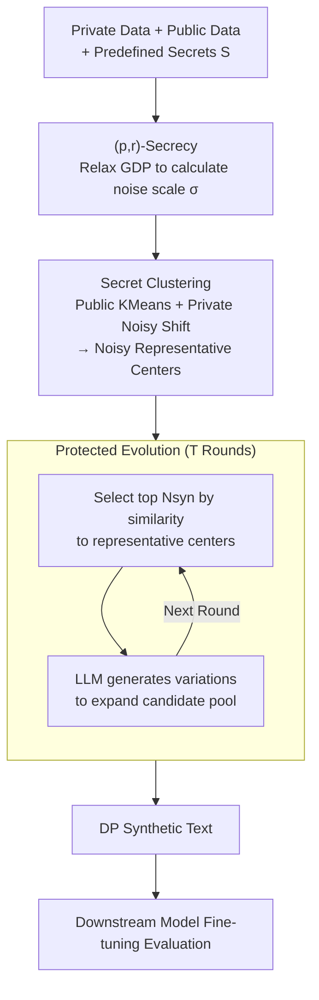

# Secret-Protected Evolution for Differentially Private Synthetic Text Generation

**Conference**: ICLR 2026  
**OpenReview**: [https://openreview.net/forum?id=1vacZJxi56](https://openreview.net/forum?id=1vacZJxi56)  
**Code**: None  
**Area**: LLM Security / Differential Privacy / Synthetic Data Generation  
**Keywords**: Differential Privacy, Synthetic Text, Secret Protection, Private Evolution, GDP Relaxation

## TL;DR
To address the utility loss and computational waste caused by Differential Privacy (DP) synthetic text generation "treating non-sensitive content the same as sensitive content by adding uniform noise," this paper proposes **SecPE (Secret-Protected Evolution)**. It shifts the protection target from "membership" to "predefined secrets," utilizes single-point relaxation of Gaussian DP (GDP) to reduce noise, and employs "secret clustering + representative center voting" to reduce the similarity computation complexity of Private Evolution from $O(MN_{\text{syn}})$ to $O(KN_{\text{syn}})$. SecPE achieves lower FID, higher downstream accuracy, and approximately 10,000× voting speedup across OpenReview, PubMed, and Yelp datasets.

## Background & Motivation

**Background**: Large-scale high-quality real-world text often contains private data and cannot be used directly to train LLMs. Consequently, DP synthetic text generation has become a mainstream solution—protecting private data via DP mechanisms before producing safely shareable synthetic data. There are two primary implementation routes: training a DP generator (DP-Generator) using DP-SGD, or the more recent **Private Evolution (PE)**. PE does not train a model; instead, it iteratively allows a strong base model to generate candidates, uses DP voting to score them based on "similarity to private data," and resamples around winners to approximate the real distribution (Aug-PE is a representative implementation).

**Limitations of Prior Work**: DP-Generators incur high computational costs, require hundreds of high-quality private records, and cannot utilize closed-source SOTA models. While PE can directly call existing strong models, its pair-wise similarity calculation (calculating every private sample against every synthetic sample) and full-scale processing per round make the pipeline extremely inefficient. More importantly, both rely on "classical DP" assumptions—**defaulting to protect every record as equally sensitive**. However, in reality, sensitive information is often sparse (the sensitivity of medical records vs. movie ratings is worlds apart), the same secret may repeat across multiple records, and a single user may contribute several records. Under user-level DP, uniform protection forces the algorithm to inject noise far exceeding what is necessary.

**Key Challenge**: Classical DP protection is a uniform, strong constraint across all curves, users, and records, whereas the target actually needing protection is often a small number of "secrets." Spreading the entire privacy budget over the whole dataset is equivalent to blurring all content with noise just to guard a few secrets—the stronger the privacy constraint, the more utility drops, leading to an overly conservative trade-off.

**Goal**: This is split into two sub-problems: (1) Can protection be provided only at the "point the adversary truly cares about" to reduce noise and regain utility? (2) Can the inefficient point-by-point voting of PE be modified to make the pipeline scalable for large-scale data?

**Key Insight**: The authors borrow from the concept of secret protection—the protection target is not "whether a certain record exists in the dataset (membership privacy)," but "whether a predefined secret can be reconstructed." Once secrets are predefined, non-secret public data can be used freely without protection (for clustering or summarization), reserving the privacy budget solely for secret-related adjustments. From a hypothesis testing/trade-off curve perspective, this is equivalent to only requiring protection at a single point $(p_j, r_j)$ on the curve rather than requiring the entire curve to be above a Gaussian baseline.

**Core Idea**: Replace classical DP with **(p,r)-secret protection** (a single-point relaxation of Gaussian DP) and restructure PE's "point-by-point voting" into "secret clustering + representative center voting"—reducing noise to regain utility while drastically lowering computational complexity.

## Method

### Overall Architecture

SecPE aims to efficiently produce high-fidelity synthetic text while protecting only a small number of predefined secrets. The pipeline consists of two sequential modules: first, **Secret Clustering**—using non-protected public data for KMeans to find representative centers, then using noisy private data for controlled shifts to obtain noisy representatives $(\tilde{e}_k, \tilde{n}_k)$ that summarize global structure without directly exposing sensitivities. Second, **Protected Evolution**—within the iterative PE framework, these noisy representatives are used instead of individual private samples to vote for candidates. Each round selects the top $N_{\text{syn}}$ samples most similar to the representatives, which, together with their LLM variations, form the candidate pool for the next round. After $T$ iterations, synthetic text is output. Both modules are unified at a high level by the **(p,r)-secrecy** definition: it first relaxes GDP and subsequently calculates the required noise scale $\sigma$.

The entire pipeline reduces similarity computation from PE's original $O(MN_{\text{syn}})$ (where $M$ is the number of private samples) to $O(KN_{\text{syn}})$ (where $K$ is the number of cluster anchors, typically $K \ll M$), which is the fundamental source of efficiency improvement.

### Key Designs

**1. (p,r)-secret protection: Compressing "Whole-Curve DP" to "Sufficient Point" Relaxation**

Classical DP requires uniform protection across all adjacent datasets and user records, where the adversary's goal is to determine membership. However, if the concern is strictly preventing the reconstruction of specific secrets, this global constraint is overly conservative. The authors redefine adjacency: two datasets $D \simeq_j D'$ differ only in the presence or absence of secret $s_j$. Protection is defined as an upper bound on the **reconstruction attack success rate**—mechanism $\mathcal{A}$ satisfies $(p,r)$-secret protection if and only if for any reconstruction attack $\mathcal{B}$ and any secret $s_j$:

$$\Pr_{D_j \sim \pi_j,\ \mathcal{A}}\big[\mathcal{B}(\mathcal{A}(D_j)) = s_j\big] \le r_j,$$

where $\pi_j$ encodes the adversary's prior knowledge of $s_j$, and $p_j$ is the prior success probability. Lemma 3.3 connects this to Gaussian DP: any $\mu$-GDP mechanism provides $(p,r)$-protection with $r_j = 1 - \Phi(\Phi^{-1}(1-p_j) - \mu)$. Crucially, the converse is not true—$(p,r)$-protection only constrains success at a **single prior $p_j$**, while $\mu$-GDP requires the entire trade-off curve $T_{(P,Q)}$ to stay above the Gaussian baseline $G_\mu$. Thus, $(p,r)$-protection is a true relaxation of DP: it is less restrictive, but because it only needs to guard one point on the curve, it enables higher utility with less noise while providing interpretable reconstruction protection.

**2. Noise Calibration (SecretNoise): Sensitivity-based Linear Programming**

After determining the $(p,r)$ budget, it must be translated into an actual noise scale $\sigma$ and sampling probability. Borrowing from Ganesh et al. (2025), the authors use linear programming: each private sample $x_i$ containing secret $s_j$ is assigned a weight $w_i$. Under the constraint $\sum_{x_i \in D_{\text{pri},j}} w_i \le \Phi^{-1}(1-p_j) - \Phi^{-1}(1-r_j) \triangleq \eta_j$, the objective is to maximize $\sum w_i$. Sampling probabilities are constructed as $\rho_i = \frac{1}{\max_i w_i}\cdot\frac{w_i}{\sum_{i'} w_{i'}}$. Here, $\eta_j$ (i.e., $\mu$ in Eq. 4) acts as a **capacity constraint**—the less sensitive the secret (larger $\eta_j$), the more samples are allowed. Finally, for each secret, the smallest $\sigma_j$ satisfying the blow-up function bound $B_{(P_j,Q_j)}(p_j) \le r_j$ for the dominating pair $(P_j, Q_j)$ is chosen, with $\sigma = \max_j \sigma_j$. This optimization is the direct source of SecPE's improved utility: it calculates noise at the granularity of secrets rather than applying a one-size-fits-all approach to the entire dataset.

**3. Secret Clustering: Public Skeleton and Private Noisy Shift**

Another source of PE's inefficiency is the voting itself. The authors observed extremely skewed voting distributions (Figure 4), where a few synthetic samples receive most votes while others are near-uniform. This suggests selection happens at the "cluster" level, making point-by-point voting wasteful. Thus, **Secret Clustering** replaces individual voting: first, use **public data only** for KMeans to obtain $K$ centers $\{(e_k, n_k)\}$ (zero privacy cost). Then, perform a controlled shift with private data—clip each private embedding $\hat{e}_{\text{pri},i} = \mathrm{Clip}_R(e_{\text{pri},i})$, sample with probability $\rho_i$, assign to the nearest anchor, and release noisy statistics:

$$\tilde{e}_k = \frac{n_k e_k + \sum_{i \in C_k} \hat{e}_{\text{pri},i}}{n_k + m_k} + \xi_k,\quad \xi_k \sim \tfrac{2R}{n_k}\mathcal{N}(0,\sigma^2 I_d),\qquad \tilde{n}_k = n_k + m_k + \eta_k,\ \eta_k \sim \mathcal{N}(0,\sigma^2).$$

Theorem 1 proves these noisy centers satisfy $(p,r)$-secret protection. Representative centers summarize the global data structure without exposing sensitive samples. Synthetic data is selected based on similarity to these centers, avoiding repeated full dataset processing—this is particularly critical on the 1.9M-record Yelp dataset (which also saves ~25.1 GB of VRAM by avoiding the storage of all embeddings).

**4. Protected Evolution: Iterative Selection-Mutation with Representatives**

Finally, secret clustering is integrated into the PE skeleton. At initialization, the base model generates $N_{\text{syn}} \times L$ random samples. Each round, current candidates are embedded and clipped, and secret clustering provides noisy representatives $\{(\tilde{e}_k, \tilde{n}_k)\}$. For each representative, the nearest candidates are found, and the representative's noisy count $\tilde{n}_k$ is added to those candidates' histograms. The top $N_{\text{syn}}$ survivors, along with their $\mathrm{VARIATION}(\cdot, L)$ LLM variants, form the next candidate pool. This preserves the practicality of PE (iterative refinement with off-the-shelf strong models) but swaps "per-private-sample voting" for "$K$ noisy representatives," dropping complexity to $O(KN_{\text{syn}})$. Theorem 2 proves the $T$-round algorithm maintains $(p,r)$-secret protection.

### Loss & Training
SecPE does not train a generator (the PE paradigm generates via prompting), so there is no explicit loss function. The privacy budget is fixed with a prior $p = 10^{-4}$, and the ratio $r/p = c$ (where $c \in \{2, 10, 50, \infty\}$ and $c=\infty$ is non-private) determines the budget $\mu = \Phi^{-1}(1-p) - \Phi^{-1}(1-r)$. Training occurs during downstream evaluation: fine-tuning RoBERTa-base (for Yelp ratings/categories, OpenReview recommendation/field classification) or BERT (for PubMed next-token prediction).

## Key Experimental Results

Datasets: OpenReview (ICLR 2023 reviews), PubMed (medical abstracts), and Yelp (business reviews). Generators include GPT-2, Qwen-2.5-1.5B, with Llama-3.1-8B and Mistral-7B for ablation. Two types of secret tasks: random words (words at the ~20th percentile frequency) and PII tasks (36 types of PII detected by AI4Privacy/Presidio).

### Main Results

Downstream accuracy on PubMed random word task (BERT-small, higher is better) as privacy tightens ($r/p$ from $\infty \to 2$):

| Method (GPT-2 Gen) | $r/p=2$ | $r/p=10$ | $r/p=50$ | $r/p=\infty$ |
|--------|------|------|------|------|
| Aug-PE | 24.93 | 26.14 | 26.96 | **29.70** |
| SecPE2000 | **29.18** | 29.42 | 29.38 | 29.19 |
| SecPE3000 | 29.54 | **29.75** | 29.12 | 29.52 |

Runtime (per epoch, seconds; A100-80G), focusing on the histogram/selection component:

| Method | OpenReview LLM/Hist | PubMed LLM/Hist | Yelp LLM/Hist |
|------|------|------|------|
| Aug-PE | 1698.7 / 126.9 | 828.5 / 32.2 | 347.1 / **30126.4** |
| SecPE | 1693.1 / **1.5** | 830.8 / **0.5** | 347.6 / **2.3** |

LLM sampling time is identical, but SecPE's histogram/selection part is at least 60× faster, reaching ~10,000× faster on the 1.9M record Yelp dataset. GPU utilization increased from ~3.2% to ~38.6%, and 25.1 GB of VRAM was saved.

### Ablation Study

| Configuration | Key Finding | Description |
|------|---------|------|
| Privacy Tightening ($r/p \downarrow$) | SecPE's advantage increases | As $r/p$ goes from ∞→2, Aug-PE accuracy drops sharply (29.70→24.93); SecPE2000 remains stable (29.19→29.18). |
| Non-private ($r/p=\infty$) | SecPE is slightly lower | Clustering abstracts away fine-grained info, occasionally causing misselection. |
| Cluster Count $K$ | Robust to $K$ | Category accuracy stable at 73~74 for $K \ge 800$ on Yelp. |
| Generator Quality | Stronger LLM → Better Downstream | GPT-4o-mini > GPT-2; Qwen-7B > Qwen-1.5B. |
| PII Task | Moderate improvement | Limited by PII detector accuracy/recall; SecPE's speed advantage not fully reflected using fixed epochs. |

### Key Findings
- **Stricter Privacy, Greater Advantage**: SecPE's true value lies in strong privacy settings (small $r/p$)—it injects much less noise than $\mu$-GDP for the same reconstruction protection, so utility does not collapse as privacy tightens.
- **Efficiency from Representative Voting**: Swapping individual voting for $K$ noisy representatives is the root cause of the 60×~10,000× speedup and VRAM savings.
- **Generator Quality is the Ceiling**: Stronger LLMs consistently yield better downstream accuracy, though "choosing the right model" matters as much as parameter count.

## Highlights & Insights
- **Redefining privacy from "Membership" to "Secrets"**: This shifts the constraint from the whole curve to a single point. If one only needs to bound reconstruction success at a specific prior, the whole-curve GDP requirement is unnecessary, and this relaxation translates directly into reduced noise.
- **Public scaffold + Noisy private shift**: Decoupling the "cluster structure" from "sensitive shifts" is a clever lever to obtain both privacy guarantees and computational savings simultaneously.
- **Empirical justification of design**: Using the voting imbalance observation (Figure 4) to justify replacing individual voting with representative centers makes the motivation grounded and evidence-based.

## Limitations & Future Work
- **Dependence on predefined secrets**: PII performance is bottlenecked by the accuracy and recall of the detectors.
- **Performance in weak privacy scenarios**: Clustering might abstract away detail, leading to slightly worse performance than PE when privacy constraints are negligible.
- **Fixed epoch comparisons**: To align with $\mu$-GDP baselines, experiments used fixed epochs; if compared under the same wall-clock time, SecPE's advantage would likely be even larger.
- **(p,r) safety semantics**: Single-point protection is weaker than full-curve DP; its robustness against adaptive attacks depends heavily on the accuracy of the prior $\pi_j$.

## Related Work & Insights
- **vs Aug-PE / Private Evolution**: SecPE replaces PE's uniform noise and point-by-point voting with $(p,r)$-secret protection and representative centers, effectively redesigning PE for "secret-aware" selection.
- **vs DP-Generator**: SecPE avoids the high compute and data requirements of DP-SGD training by utilizing strong off-the-shelf models through APIs.
- **vs Classical DP / Gaussian DP**: This work leverages the trade-off curve perspective to relax "the whole curve must be above baseline" to "a single point must be above baseline," using blow-up functions to map abstract guarantees to quantifiable reconstruction success rates.

## Rating
- Novelty: ⭐⭐⭐⭐⭐ Highly original in applying secret protection to PE and mathematically deriving the (p,r) relaxation of GDP.
- Experimental Thoroughness: ⭐⭐⭐⭐ Excellent cross-dataset and multi-LLM analysis, though PII improvements were modest.
- Writing Quality: ⭐⭐⭐⭐ Clear structure; effectively uses figures (1 and 4) to support theory, though notation is dense.
- Value: ⭐⭐⭐⭐⭐ Extremely practical for real-world scenarios where sensitive content is sparse, improving both utility and efficiency.

<!-- RELATED:START -->

## Related Papers

- [\[ACL 2026\] Differentially Private Synthetic Text Generation for Retrieval-Augmented Generation (RAG)](../../ACL2026/llm_safety/differentially_private_synthetic_text_generation_for_retrieval-augmented_generat.md)
- [\[ICLR 2026\] HiddenEcho: Mitigating Noise Amplification in Differentially Private LLMs with Hidden-State Correction](hiddenecho_mitigating_noise_amplification_in_differentially_private_llms_with_hi.md)
- [\[ICLR 2026\] Pisces: Cryptography-based Private Retrieval-Augmented Generation with Dual-Path Retrieval](pisces_cryptography-based_private_retrieval-augmented_generation_with_dual-path_.md)
- [\[ICLR 2026\] Hot PATE: Private Aggregation of Distributions for Diverse Tasks](hot_pate_private_aggregation_of_distributions_for_diverse_tasks.md)
- [\[ICML 2025\] POPri: Private Federated Learning using Preference-Optimized Synthetic Data](../../ICML2025/llm_safety/popri_private_federated_learning_using_preference-optimized_synthetic_data.md)

<!-- RELATED:END -->
