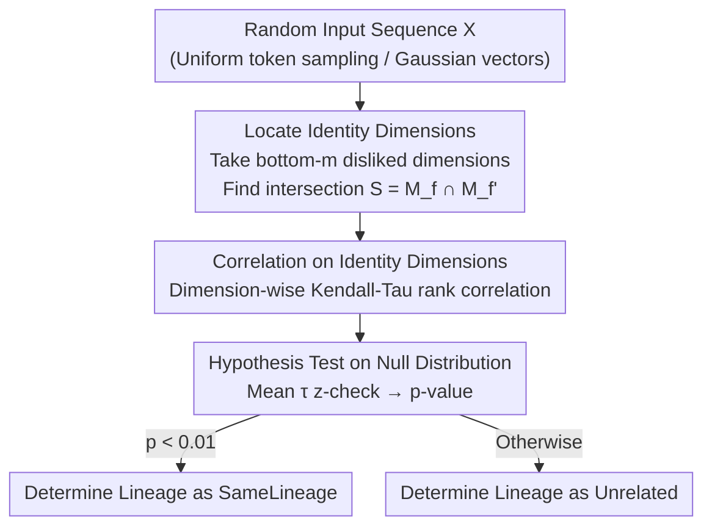

# SeedPrints: Fingerprints Can Even Tell Which Seed Your Large Language Model Was Trained From

**Conference**: ICLR 2026  
**OpenReview**: [https://openreview.net/forum?id=Kan6Z0zzZi](https://openreview.net/forum?id=Kan6Z0zzZi)  
**Code**: https://github.com/YnezT0311/SeedPrints  
**Area**: LLM Security / Model Fingerprinting / Copyright Provenance  
**Keywords**: Model Fingerprinting, Initialization Bias, Lineage Verification, Hypothesis Testing, Large-scale Pre-training

## TL;DR
This paper proposes SeedPrints, which utilizes the "preference bias" left by random initialization seeds in the model's output dimensions—still statistically detectable after training—as an intrinsic LLM fingerprint. It moves fingerprinting from a "post-hoc feature after training" to an "innate trait present at birth." This enables lineage verification using a p-value across the entire lifecycle, from early pre-training to fine-tuning, matching strong baselines on real benchmarks like LeaFBench.

## Background & Motivation
**Background**: Passive fingerprinting is a key method for model provenance and attribution, aiming to establish a verifiable link between a suspect model and its claimed source model to detect misappropriation or unauthorized reuse. Existing passive methods either extract signatures from weights (attention matrix distributions, kernel alignment of representations, parameter vector directions) or from black-box input-output behaviors, typically evaluated **after the model has converged through fine-tuning**.

**Limitations of Prior Work**: The authors performed an illustrative experiment using a sequence of OLMo-2-7B checkpoints from 5B to 3.9T tokens (Figure 1). By comparing intermediate checkpoints with the final model, five mainstream baselines (Intrinsic, REEF, PCS, ICS) saw their similarity drop below the 0.8 detection threshold in the early pre-training stage (within the first trillion tokens), with ICS approaching zero. This suggests these methods fail to recognize lineage "shortly after the model is born." Worse, when the data distribution shifts significantly (e.g., from natural text to code), these methods misidentify true descendants as unrelated models.

**Key Challenge**: The separability of prior methods actually stems from **superficial features left by the training process**—data signatures, optimization dynamics, and hyperparameters—rather than the model's own "birthmark." They are essentially *post hoc identifiers*. Galton's 1892 definition of a fingerprint is an "intrinsic marker that is unique to the individual and remains essentially unchanged throughout life." A true fingerprint should exist from the moment of "birth" at initialization and persist through the entire lifecycle, a criterion existing methods fail to meet.

**Goal**: To identify an intrinsic fingerprint that exists from initialization, is detectable at any subsequent training stage, is not confounded by data distribution / training duration / optimization dynamics, and transforms lineage verification into a statistically rigorous hypothesis test rather than a heuristic similarity threshold.

**Key Insight**: The authors start from a counter-intuitive observation: **untrained, randomly initialized models show strong, seed-dependent preference biases rather than uniform outputs under random inputs**. Certain output dimensions or tokens are systematically "disliked" (frequently taking minimum values). While the overall magnitude of this bias is stable across seeds, the specific "neglected dimensions" are determined by the seed.

**Core Idea**: Treat the pattern of "disliked dimensions" induced by the random initialization seed as a persistent, seed-related identity marker. Although training significantly alters output magnitudes, this relative preference is not entirely lost; it retains a weak but statistically detectable signal. By testing whether the output rankings of two models on these identity dimensions are significantly consistent, lineage can be determined.

## Method

### Overall Architecture
SeedPrints addresses the following problem: Given a base model $f$ and a suspect model $f'$ (**without access to the true initial models**), determine if they descend from the same initialization lineage. The process is a three-step statistical test: first, locate "disliked identity dimensions" from the outputs of both models and take their intersection; second, calculate the correlation of output rankings on these dimensions; finally, perform a one-sided hypothesis test against a "no-lineage" null distribution to output a p-value. Lineage is confirmed if $p < 0.01$.

The method only requires forward passes (feeding random inputs and reading logits or hidden states), requires no training, and involves no watermark insertion, making it suitable for post-hoc auditing of third-party models.

### Key Designs

**1. Identity Dimension Extraction: Separating "Shared Initialization" from "Architecture/Training Coincidences" via Intersection**

Experiments in Section 3 reveal a key fact: models from the same initialization retain a weak but consistent preference over a set of output dimensions (especially those most "disliked" by the uninitialized model). Since the initial model is often unavailable, these dimensions must be recovered from the trained models themselves. For any model $g$, the authors feed $n$ random inputs $X=\{x_i\}$, calculate the average response vector $\bar g = \frac{1}{n}\sum_i g(x_i)$, and select the **smallest $m$ coordinates** as the "disliked dimensions" set $M_g = \arg\min_{|J|=m}\sum_{j\in J}\bar g_j$. The mean vector is used instead of per-sample argmin frequency for robustness against noise.

The **intersection** $S = M_f \cap M_f'$ is then used as the "identity dimensions." This intersection design is core to preventing false positives: if models are truly related, they independently identify similar disliked dimensions, resulting in a non-trivial intersection. It is highly unlikely for models related only by architecture or shared training dynamics to coincidentally overlap significantly in their bottom-$m$ sets. The intersection thus serves as "mutual validation," isolating the bias signal originating from initialization from other confounding factors.

**2. Kendall-Tau Rank Correlation: Measuring Consistency of "Input-level Preferences" Rather than Numerical Similarity**

After locating $S$, the consistency between models must be quantified. Direct numerical comparison is ineffective due to vast differences in output scales across models and dimensions. The authors first apply **row-level softmax normalization** to each sample's output (using a high temperature $T=10$ to avoid collapse into one-hot vectors), which eliminates scale differences while preserving relative rankings. For each $j\in S$, the Kendall-Tau rank correlation $\tau_j = \mathrm{KendallTau}(\{f(x_i)_j\}, \{f'(x_i)_j\})$ is calculated over $n$ random inputs.

This yields a set of statistics $T=\{\tau_j\}_{j\in S}$ characterizing how consistently the two models rank their preferences for different inputs. Observation shows that for related models, the distribution of these correlations is systematically higher than for unrelated models—individual $\tau$ values are small, but the entire distribution is shifted upward and remains stable throughout training. Rank correlation is used because identity information is embedded in the relative order ("which input ranks higher"), making it robust to magnitude changes.

**3. One-Sided Hypothesis Test on Analytical Null Distribution: Rigorous p-value Decision**

Since correlation distributions for related and unrelated models may overlap, a simple threshold on a single statistic is insufficient. Ideally, the null distribution should come from correlations between many independently initialized models, which is computationally expensive. The authors prove (Appendix B) that the null distribution for independent initializations can be well-approximated by a Gaussian, initially proposing a **simulation-based** method using Gaussian matrices $Y^{(1)},Y^{(2)}\sim\mathcal N(0,I)$.

However, simulation introduces extra randomness and cost. Noting that Kendall-Tau has a closed-form null distribution under weak independence, the authors utilize an **analytical test**: under the null hypothesis, each $\tau_j$ has approximately zero mean and a known variance $\sigma^2$. By the Central Limit Theorem (CLT), as the number of identity dimensions $|S|$ increases, the mean $\bar\tau=\frac{1}{|S|}\sum_j\tau_j$ follows $\mathcal N(0, \sigma^2/|S|)$. The one-sided z-score $z=\frac{\bar\tau}{\sigma/\sqrt{|S|}}$ yields $p = 1-\Phi(z)$, where $p<0.01$ rejects the null hypothesis. The high $T=10$ temperature mitigates weak inter-dimensional dependencies introduced by softmax, making the independence assumption hold in practice. This provides a direct statistical criterion without needing to tune similarity thresholds.

**Implementation Details**: Outputs can be either logits or last-layer hidden states. Since logits require more random inputs to stably estimate bias due to large vocabulary sizes, **last-layer hidden states** are used by default to balance efficiency and stability.

### An Example: Can Seeds Be Distinguished at "Birth"?
Comparing four LLaMA-style models differing only in initialization seeds (42, 123, 1000, 2000): all pairs yield $p > 0.01$ (e.g., s42 vs. s2000 is 0.116, s123 vs. s42 is 1.000), showing SeedPrints reliably distinguishes different seeds at birth. When comparing each initial model $s^{init}$ with its descendant $s^{base}$ after training on OpenWebText (≈10B tokens), all related pairs yield $p < 0.01$ (e.g., $3.37\times10^{-26}$), whereas baseline methods fail—proving baseline separability comes from training artifacts, not initialization. Furthermore, training four models with **identical corpora and data sequences** (locked training seed) but different initialization seeds results in $p > 0.01$ for all cross-seed pairs (0.573, 0.724, 0.109, 0.883), confirming that identical data does not cause different initialization fingerprints to converge.

## Key Experimental Results

### Main Results
Models: 12-layer, 12-head LLaMA-style (with RoPE) and Qwen-style models trained from scratch, validated on real large models. Baselines: Intrinsic, REEF, PCS, ICS (0.8 similarity threshold); Gradient added in Section 5.3.

Large-scale Fine-tuning (Table 5, each row vs. LLaMA-2-7B; smaller p-values are better for SeedPrints, baselines report similarity where 0.8 is the threshold):

| Target Model | FT Tokens | SeedPrints p | PCS | ICS |
|--------------|-----------|--------------|-----|-----|
| Llama-2-finance-7B | 5M | $10^{-41955}$ ✓ | 0.998 ✓ | 0.995 ✓ |
| Vicuna-1.5-7B | 370M | $10^{-103043}$ ✓ | 0.999 ✓ | 0.995 ✓ |
| CodeLlama-7B | 500B | $10^{-3552}$ ✓ | 0.686 ✗ | 0.337 ✗ |
| Llemma-7B | 700B | $10^{-5136}$ ✓ | 0.668 ✗ | 0.291 ✗ |

Under large-scale fine-tuning (500B–700B tokens), PCS and ICS drop below the threshold (misidentification), while SeedPrints maintains $p < 0.01$.

LeaFBench (Table 6, 65 models / 7 families / 6 transformations; higher AUC / KS is better):

| Method | Overall AUC | Overall KS |
|--------|-------------|-----------|
| REEF | 0.915 | 0.739 |
| Gradient | 0.801 | 0.508 |
| ICS | 0.994 | 0.943 |
| Intrinsic | 0.994 | 0.989 |
| **SeedPrints** | **0.992** | **0.986** |

SeedPrints matches the strongest baselines (Intrinsic/ICS) for auditing real deployments and significantly outperforms REEF and Gradient.

### Ablation Study
| Configuration | Key Phenomenon | Explanation |
|---------------|----------------|-------------|
| Cross-initialization seeds (Same corpus/order) | p-values all $> 0.01$ (Table 3) | Fingerprints are seed-specific; identical data/curriculum do not cause convergence. |
| Training with data domain shift (Table 4) | Baselines fail on The Stack (code); SeedPrints ✓ | Baselines track domain similarity rather than lineage. |
| Large-scale pre-training trajectory (OLMo-2-7B, Fig 1) | Early baselines fail; SeedPrints remains $p \ll 0.001$ from the first checkpoint. | Early pre-training is the most difficult and critical stage for detection. |

### Key Findings
- **Robustness from Intersection + Hypothesis Testing**: Baselines collapse under significant distribution shifts (text to code) because they track domain similarity. SeedPrints' signal comes from initialization bias, which persists across domains.
- **Pre-training "Strengthens" Lineage Signals**: This can create a false sense of security; detection is hardest in early pre-training, which this paper argues should be the priority.
- **Logits vs. Hidden States**: Hidden states are the default because logits' vocabulary size requires more random inputs for stable bias estimation, increasing overhead.

## Highlights & Insights
- **Shifting "Fingerprints" to the Moment of Birth**: The most profound discovery is that randomly initialized models exhibit seed-dependent non-uniform outputs under random inputs. This redefines fingerprints as "innate birthmarks" rather than training byproducts, aligning with Galton's definition.
- **Intersection as Mutual Validation**: In the absence of the initial model, using the intersection of bottom-$m$ dimensions between two models to suppress coincidences from architecture or training is a clever de-confounding technique applicable to other "anchor-less comparison" scenarios.
- **Upgrading to Analytical Null Distributions**: By leveraging the closed-form null distribution of Kendall-Tau and the CLT, the method provides an analytical z-test that is computationally efficient and provides interpretable p-values without requiring simulations.

## Limitations & Future Work
- **Non-linear Comparison of p-values vs. Similarity**: To calculate AUC against baselines, the authors convert p-values to $s=1-p$. However, since p-values operate on an exponential scale, linear threshold scanning is suboptimal and may understate SeedPrints' performance.
- **Reliance on White-box/Forward Access**: The method requires reading logits or hidden states from random inputs, which may be difficult in pure black-box scenarios with rate-limited API access.
- **Legal Status of Initialization Seeds**: Distinguishing between seeds may not be a primary legal requirement for copyright; the true value lies in robust lineage attribution against data shifts. The legal efficacy of these fingerprints requires further study.
- **Independence Assumption under Softmax**: Analytical testing assumes inter-dimensional independence, mitigated by high $T=10$ temperatures. Whether this holds in extreme configurations requires further validation.

## Related Work & Insights
- **vs. Active Watermarking / Backdoor Fingerprinting (Xu et al. 2024, etc.)**: These require control over the training process to implant markers. SeedPrints is passive, involves zero modifications, and supports post-hoc auditing.
- **vs. Passive Weight/Representation Fingerprinting (Intrinsic, REEF, PCS, ICS)**: These extract signatures from converged models, failing in early pre-training and being misled by domain shifts. SeedPrints extracts "born" initialization signals that persist through the lifecycle and are robust to shifts.
- **vs. Black-box Behavioral Fingerprinting (Pasquini et al. 2024, etc.)**: These rely on specific queries or stylometry and lack robustness against fine-tuning. SeedPrints provides deterministic decisions via p-values without heuristic thresholds.

## Rating
- Novelty: ⭐⭐⭐⭐⭐ Realigns the concept of fingerprints from training artifacts to initialization bias.
- Experimental Thoroughness: ⭐⭐⭐⭐⭐ Robust evidence across scratch training, OLMo trajectories, 700B token fine-tuning, and LeaFBench.
- Writing Quality: ⭐⭐⭐⭐ Clear motivation and derivation, though some statistical details (null distribution approximations) are in the appendix.
- Value: ⭐⭐⭐⭐⭐ Highlights the blind spot of "early-stage detection" and provides practical significance for provenance auditing.

<!-- RELATED:START -->

## Related Papers

- [\[ICLR 2026\] Ghost in the Cloud: Your Geo-Distributed Large Language Models Training is Easily Manipulated](ghost_in_the_cloud_your_geo-distributed_large_language_models_training_is_easily.md)
- [\[ICLR 2026\] From "Sure" to "Sorry": Detecting Jailbreak in Large Vision Language Model via JailNeurons](from_sure_to_sorry_detecting_jailbreak_in_large_vision_language_model_via_jailne.md)
- [\[ICLR 2026\] Unmasking Backdoors: An Explainable Defense via Gradient-Attention Anomaly Scoring for Pre-trained Language Models](unmasking_backdoors_an_explainable_defense_via_gradient-attention_anomaly_scorin.md)
- [\[ICLR 2026\] Every Language Model Has a Forgery-Resistant Signature](every_language_model_has_a_forgery-resistant_signature.md)
- [\[ICLR 2026\] Time-To-Inconsistency: A Survival Analysis of Large Language Model Robustness to Adversarial Attacks](time-to-inconsistency_a_survival_analysis_of_large_language_model_robustness_to_.md)

<!-- RELATED:END -->
