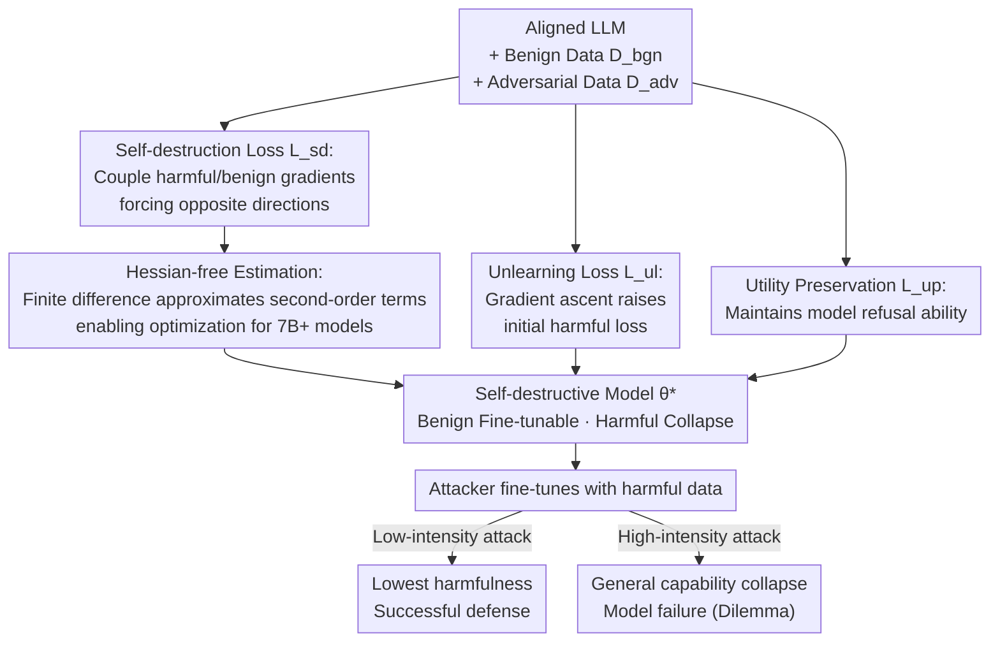

# Self-Destructive Language Model

**Conference**: ICLR 2026  
**arXiv**: [2505.12186](https://arxiv.org/abs/2505.12186)  
**Code**: [https://github.com/ZJUWYH/seam](https://github.com/ZJUWYH/seam)  
**Area**: LLM Safety  
**Keywords**: Harmful Fine-tuning Defense, Self-Destructive Model, Gradient Coupling, Alignment Safety, Hessian-free Optimization

## TL;DR
Ours proposes Seam, which converts LLMs into "self-destructive models" by coupling the optimization trajectories of benign and harmful data (making their gradient directions opposite). This triggers catastrophic performance collapse during harmful fine-tuning, creating an attacker's dilemma: low-intensity attacks are ineffective, while high-intensity attacks lead to model failure.

## Background & Motivation

**Background**: Aligned LLMs are highly vulnerable to harmful fine-tuning attacks—requiring as few as 10 harmful samples and $0.20 in API costs to bypass GPT-3.5 Turbo's safety guardrails. Existing defenses (Vaccine, RepNoise, TAR, etc.) strengthen safety during the alignment phase but can be defeated by stronger attacks (larger learning rates, more harmful data).

**Limitations of Prior Work**: Existing defenses only increase the "cost" of harmful fine-tuning but fail to change the "trainability" of the model on harmful data—harmful gradients still effectively reduce the harmful fine-tuning loss.

**Key Challenge**: Defenders need the model to remain trainable for benign fine-tuning but become untrainable for harmful fine-tuning. Since both use the same optimization mechanism, how can they be distinguished?

**Goal**: Design an intrinsic self-destruction mechanism such that harmful fine-tuning inevitably leads to general performance collapse.

**Key Insight**: Couple the gradient directions of harmful and benign data to be opposite—thus, harmful fine-tuning (gradient descent) automatically becomes equivalent to gradient ascent on benign tasks, leading to performance collapse.

**Core Idea**: Make the gradient direction of harmful data a "trap" for benign performance—the more the model is fine-tuned on harmful data, the more useless it becomes.

## Method

### Overall Architecture
The goal of Seam is to transform an aligned LLM into a "self-destructive model": normal benign fine-tuning remains functional, but if harmful data is used for fine-tuning, the model's general capabilities automatically collapse. To achieve this, it targets the optimization mechanism that attackers rely on—since attacks depend on gradient descent on harmful data, let "descending on harmful data" itself destroy the model. During training, adversarial dataset $\mathcal{D}_{adv}$ (harmful Q&A pairs) and benign dataset $\mathcal{D}_{bgn}$ are both used. A three-part loss pushes the model to a specific parameter point: at this point, harmful and benign gradients are in opposite directions (self-destruction loss $\mathcal{L}_{sd}$), the starting line for harmful fine-tuning is pushed further away (unlearning loss $\mathcal{L}_{ul}$), and the model's inherent refusal capability is maintained (utility preservation $\mathcal{L}_{up}$). The self-destruction loss contains second-order terms and requires Hessian-free estimation to be computationally feasible for large models. Once the self-destructive model is deployed, attackers fall into the same trap regardless of whether they use low-intensity or high-intensity harmful fine-tuning—this is the whole chain of "Training Coupling → Self-destructive Model → Attacker's Dilemma" shown below.

### Key Designs

**1. Self-destruction Loss: Turning every step of harmful descent into a step of benign ascent**

Existing defenses only raise attack costs without changing the fact that harmful data is "trainable"—gradient descent still works on harmful data. The self-destruction loss cuts this path directly by minimizing the cosine similarity between the harmful gradient $g_a$ and the benign gradient $g_b$:

$$\mathcal{L}_{sd}(\theta) = \text{sim}(g_a(\theta), g_b(\theta)).$$

The optimal solution is for the two to be completely opposite. In this case, every step of gradient descent the attacker takes on harmful data is geometrically equivalent to a step of gradient ascent on benign tasks—the more the model is harmfully fine-tuned, the faster its general capabilities drop. This "uses the attacker's tools against themselves."

**2. Unlearning Loss: Pushing back the starting line to force more steps**

Ensuring "every step hurts the model" via self-destruction loss is insufficient if the initial harmful fine-tuning loss is already very low, as the attacker might only need a few steps. The unlearning loss raises the initial harmful loss by performing gradient ascent on harmful data:

$$\mathcal{L}_{ul}(\theta) = -\mathbb{E}\,\ell(f_\theta(x), y),$$

forcing the attacker to take many more steps to reduce the harmful loss—and with each additional step, the self-destruction loss causes the model to collapse further. The two losses are complementary: $\mathcal{L}_{sd}$ ensures "every step hurts," while $\mathcal{L}_{ul}$ ensures "many steps must be taken." To prevent gradient ascent from immediately damaging the model, layer-wise gradient ascent with log transformation is used to prevent catastrophic forgetting.

**3. Hessian-free Gradient Estimation: Making self-destruction loss scalable for 7B+ models**

The self-destruction loss involves gradients of gradients, which leads to a Hessian matrix during differentiation. Computing the Hessian directly on models larger than 7B is impractical. Seam approximates this second-order term using finite differences:

$$\widehat{\nabla_\theta \mathcal{L}_{sd}} = \frac{1}{\epsilon}\left[\frac{g_b(\theta + \epsilon(\bar{g}_a - c\bar{g}_b)) - g_b(\theta)}{\|g_b\|} + \frac{g_a(\theta + \epsilon(\bar{g}_b - c\bar{g}_a)) - g_a(\theta)}{\|g_a\|}\right],$$

replacing Hessian-vector products with two instances of "recomputing gradients after perturbation and taking the difference," with a theoretical error bound of $O(\epsilon)$. This step is the engineering key—without it, the gradient coupling idea would remain a theoretical concept for large models.

### Loss & Training

The total loss is $\mathcal{L}(\theta) = \mathcal{L}_{ul}(\theta) + \alpha \mathcal{L}_{up}(\theta) + \beta \mathcal{L}_{sd}(\theta)$, where $\mathcal{L}_{up}$ is the utility preservation term to maintain refusal capability. Hyperparameters are $\alpha=1, \beta=0.01, \epsilon=0.001$. Training uses AdamW for 500 steps, learning rate 2e-5, and batch size 8.

## Key Experimental Results

### Main Results

Performance of Llama2-7b under different attack intensities (learning rate 2e-5 to 2e-4):

| Method | Low-intensity HS↓ | High-intensity HS↓ | High-intensity ZS↑ |
|------|--------------|--------------|---------------|
| Base (No Defense) | ~40% | ~60% | ~50% (Maintained) |
| Vaccine | ~15% | ~50% | ~50% (Maintained) |
| RepNoise | ~10% | ~45% | ~50% (Maintained) |
| TAR | ~20% | ~45% | ~50% (Maintained) |
| **Seam** | **~5%** | **~5%** | **<30% (Collapse)** |

Seam achieves the lowest harmfulness across all attack intensities, with high-intensity attacks triggering model self-destruction (ZS close to random guessing).

### Ablation Study

| Configuration | Description |
|------|------|
| W/o $\mathcal{L}_{sd}$ | Loses self-destruction effect—high-intensity attack succeeds |
| W/o $\mathcal{L}_{ul}$ | Low-intensity attacks succeed more easily—insufficient distance |
| W/o $\mathcal{L}_{up}$ | Initial utility decreases |
| SFT vs LoRA Attack | Effective under both attack methods |
| SGD vs AdamW Optimizer | Robust to different optimizers |
| $\epsilon$ Sensitivity | Stable within $10^{-3}$ to $10^{-2}$ range |

### Key Findings
- **Attacker's Dilemma**: Low-intensity attack → lowest harmfulness (successful resistance); high-intensity attack → ZS < 30% (model self-destruction), preventing any attacker victory.
- Self-destroyed models are extremely difficult to recover—even when attempting to re-fine-tune with benign data.
- Benign fine-tuning is unaffected: performance on tasks like SST2/AGNEWS/GSM8k remains on par with the base model.
- Cross-model validation: Effective on Llama2-7b, Llama3.1-8b, Llama3.2-3b, and Qwen2.5-3b/7b.

## Highlights & Insights
- **Elegant Symmetry Design**: Every step of gradient descent in harmful fine-tuning = gradient ascent for benign tasks. This "using the opponent's strength against themselves" approach is highly ingenious.
- **Creating a True Dilemma**: Previous defenses only increased attack costs (which attackers could overcome with more resources). Seam creates an inescapable dilemma where no "correct" attack intensity exists.
- **Practical Value of Hessian-free Approximation**: Theoretical error bounds ensure approximation quality while making the method scalable to 7B+ models.
- **Why Benign Fine-tuning Is Not Affected**: The distribution difference between benign and harmful data is large enough that gradient coupling only triggers on harmful data—leaving normal downstream fine-tuning unaffected.

## Limitations & Future Work
- Requires an adversarial dataset $\mathcal{D}_{adv}$ (harmful Q&A pairs) for training; if an attacker uses harmful data types entirely different from those used by the defender, effectiveness may decrease.
- Training requires 4 gradient computations (vs. 1 in standard training), resulting in ~4x computational overhead.
- Self-destruction is irreversible—if a misjudgment causes the model to self-destruct, it cannot be recovered.
- Not yet verified on models at the 70B+ scale.
- Defense assumes attackers use gradient descent optimization—effectiveness against gradient-free methods or evolutionary strategies is unknown.

## Related Work & Insights
- **vs Vaccine/Targeted-Vaccine**: These increase robustness to embedding shifts but still fail at large learning rates. Seam fundamentally alters the optimization dynamics at the gradient direction level.
- **vs RepNoise/RMU**: These reduce harmful embeddings to Gaussian noise, but they can be relearned. Seam couples harmful/benign trajectories, so relearning harmfulness inevitably destroys utility.
- **vs TAR**: TAR uses meta-learning for anti-tamper protection, but meta-learning objectives and harmful fine-tuning objectives are not necessarily opposed. Seam directly engineers gradient opposition.
- **Implications for LLM Deployment**: For providers offering fine-tuning APIs, Seam can serve as a preprocessing step, ensuring that harmful models are not produced even if users submit harmful data.

## Rating
- Novelty: ⭐⭐⭐⭐⭐ The "gradient trap" concept is novel and elegant, creatively turning the attacker's optimization tools into a self-destructive weapon.
- Experimental Thoroughness: ⭐⭐⭐⭐⭐ Covered 5 LLMs, multiple attack configurations, and comprehensive ablations and comparisons.
- Writing Quality: ⭐⭐⭐⭐⭐ Clear motivation, rigorous theoretical derivation, and thorough experimentation.
- Value: ⭐⭐⭐⭐⭐ Substantial practical value for LLM safety, directly applicable to model deployment.

<!-- RELATED:START -->

## Related Papers

- [\[ICLR 2026\] Multi-Feature Quantized Self-Attention for Fair Large Language Models](multi-feature_quantized_self-attention_for_fair_large_language_models.md)
- [\[NeurIPS 2025\] Self-Refining Language Model Anonymizers via Adversarial Distillation](../../NeurIPS2025/llm_safety/self-refining_language_model_anonymizers_via_adversarial_distillation.md)
- [\[ICLR 2026\] Every Language Model Has a Forgery-Resistant Signature](every_language_model_has_a_forgery-resistant_signature.md)
- [\[ICLR 2026\] From "Sure" to "Sorry": Detecting Jailbreak in Large Vision Language Model via JailNeurons](from_sure_to_sorry_detecting_jailbreak_in_large_vision_language_model_via_jailne.md)
- [\[ICLR 2026\] STAR: Strategy-driven Automatic Jailbreak Red-teaming for Large Language Model](star_strategy-driven_automatic_jailbreak_red-teaming_for_large_language_model.md)

<!-- RELATED:END -->
