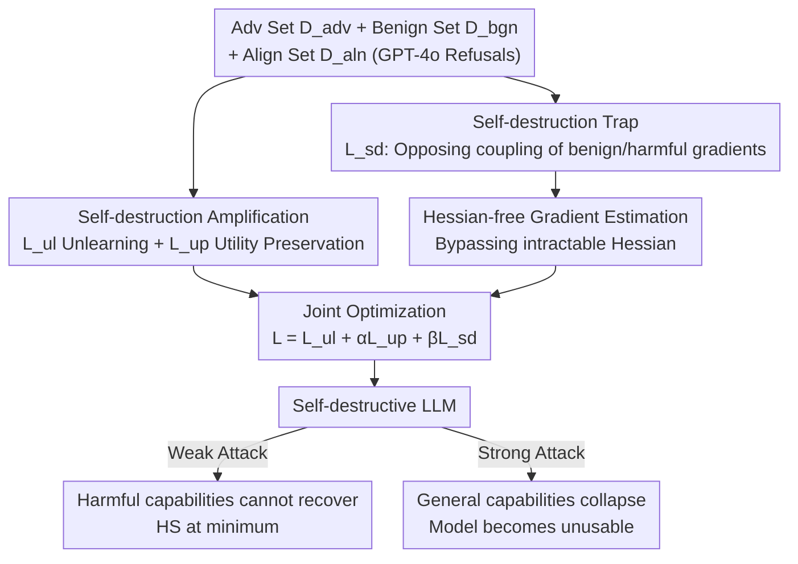

# Self-Destructive Language Models

**Conference**: ICLR 2026  
**OpenReview**: [https://openreview.net/forum?id=ERNpUGr8M5](https://openreview.net/forum?id=ERNpUGr8M5)  
**Code**: https://github.com/ZJUWYH/seam  
**Area**: AI Safety / Alignment / Defense against Harmful Fine-tuning  
**Keywords**: Harmful Fine-tuning Attacks, Self-destructive Models, Gradient Coupling, Alignment Enhancement, Hessian-free Estimation

## TL;DR
This paper proposes SEAM, an alignment-stage defense method that transforms LLMs into "self-destructive models" by forcing the gradient directions of benign and harmful tasks to be opposite. Normal tasks function as usual, but any attempt at harmful fine-tuning causes significant degradation or complete collapse, placing attackers in a dilemma where "weak attacks fail to break through, while strong attacks trigger model self-destruction."

## Background & Motivation

**Background**: To align LLMs with human values (especially harmlessness), extensive work has been done in RLHF, DPO, and safety guardrails. However, recent studies have repeatedly proven that this safety alignment is extremely fragile. Attackers can easily bypass guardrails by supervised fine-tuning (SFT) using very few "harmful question-harmful answer" pairs (even via commercial fine-tuning-as-a-service APIs), such as jailbreaking GPT-3.5 Turbo with fewer than 10 harmful samples for under $0.2.

**Limitations of Prior Work**: Various defenses have been proposed at different stages against harmful fine-tuning. **Alignment-stage** defenses (e.g., Vaccine, Booster, RepNoise, TAR) are particularly valuable because they apply to both open-source and closed-source models with low computational overhead. However, recent research reveals that most of these defenses cannot withstand "stronger attacks"—guards are breached once attackers increase the learning rate or the volume of harmful data.

**Key Challenge**: The authors identify the root cause: existing defenses only **passively increase the cost of harmful fine-tuning** (requiring more steps or higher costs) without addressing the intrinsic "trainability" of the model on harmful data. That is, gradients from harmful data **still effectively guide the reduction of harmful fine-tuning loss**. As long as attackers are willing to exert more effort, the model will eventually be compromised. This is an unwinnable arms race.

**Goal**: Instead of raising attack costs, the objective is to make the model **actively collapse** when subjected to harmful fine-tuning. Specifically, it must satisfy: ① general capabilities (zero-shot + benign fine-tuning) remain unaffected; ② performance drops sharply or collapses completely upon harmful fine-tuning; ③ training is practically feasible for large models.

**Key Insight**: The key observation is that if "harmful task gradients" and "general capability gradients" point in **opposite directions** in the parameter space, then an attacker's descent along the harmful gradient essentially performs gradient ascent on general capabilities, thereby automatically destroying model utility.

**Core Idea**: Use a "self-destruction loss" to **couple** benign and harmful optimization trajectories, making their gradient directions antagonistic. Then, use an "unlearning loss" to amplify this effect, turning the model into a trap that "cannot be touched by harmful data."

## Method

### Overall Architecture

SEAM is a one-time **alignment-stage** defense training. Given a target LLM $f_\theta$, it assumes the defender possesses three types of data: an adversarial dataset $D_{adv}$ (harmful prompts-harmful answers) simulating attackers, a benign dataset $D_{bgn}$ (harmless prompts-harmless answers) representing general capabilities, and an alignment dataset $D_{aln}$ (harmful prompts-refusal answers) generated by an external LLM (e.g., GPT-4o) for $D_{adv}$'s prompts. The goal is to transform $f_\theta$ into a "self-destructive model": general capabilities persist, but harmful fine-tuning triggers collapse.

The process is governed by three collaborative losses: the **self-destruction trap loss** $L_{sd}$ ensures opposing coupling of benign and harmful gradients; the **self-destruction amplification loss** $L_{ul}$ (unlearning) extends the optimization steps required for an attack and ensures faster, more thorough collapse; and the **utility preservation loss** $L_{up}$ prevents the model from degrading during the alignment stage itself. Finally, a **Hessian-free gradient estimation** is used to bypass the computationally heavy Hessian in $L_{sd}$, making the method feasible for models like Llama-2. The total objective is $L(\theta)=L_{ul}(\theta)+\alpha L_{up}(\theta)+\beta L_{sd}(\theta)$.

### Key Designs

**1. Self-destruction Trap: Opposite Coupling of Benign and Harmful Gradients**

This design directly addresses the root cause of model "trainability" on harmful data. The authors simulate the attacker's direction using the adversarial gradient $g_a(\theta)=\mathbb{E}_{(x,y)\sim D_{adv}}\nabla_\theta \ell(f_\theta(x),y)$ and the general optimization direction using the benign gradient $g_b(\theta)=\mathbb{E}_{(x,y)\sim D_{bgn}}\nabla_\theta \ell(f_\theta(x),y)$. The self-destruction loss is defined as their similarity:

$$L_{sd}(\theta)=\mathrm{sim}\big(g_a(\theta),\,g_b(\theta)\big),$$

where $\mathrm{sim}$ is cosine similarity. Minimizing $L_{sd}$ forces the two gradients into **opposite directions**. Consequently, when an attacker performs gradient descent along $g_a$ (harmful objective), they are effectively performing gradient ascent along $g_b$—destroying general performance. Unlike existing defenses that merely "increase cost," this "welds" utility destruction to harmful learning.

**2. Self-destruction Amplification: Unlearning and Utility Preservation**

Relying solely on $L_{sd}$ might not yield obvious degradation if harmful fine-tuning lasts only a few steps. To address this, the authors introduce an unlearning loss, performing gradient ascent on the adversarial set:

$$L_{ul}(\theta)=-\mathbb{E}_{(x,y)\sim D_{adv}}\,\ell(f_\theta(x),y).$$

This **increases the number of optimization steps required for a successful attack**, making subsequent harmful fine-tuning more likely to trigger collapse. Layer-wise gradient ascent is used for efficiency, with a logarithmic transformation to prevent utility collapse during the alignment stage. This is paired with the utility preservation loss $L_{up}(\theta)=\mathbb{E}_{(x,y)\sim D_{aln}}\ell(f_\theta(x),y)$. Notably, $L_{up}$ is calculated on the **alignment set $D_{aln}$ (harmful prompt $\rightarrow$ refusal)** rather than a benign SFT set. This directly leads the model to appropriate refusals and stabilizes hidden representations for harmful prompts.

**3. Hessian-free Gradient Estimation: Making the Method Scalable**

Calculating the gradient of $L_{sd}$ requires the Hessian of the model parameters, which is computationally infeasible for large models. Under the cosine similarity setting, the authors derive a Hessian-free finite difference estimator:

$$\widehat{\nabla}_\theta L_{sd}(\theta)=\frac{1}{\epsilon}\left(\frac{g_b(\theta+\epsilon(\bar g_a-c\bar g_b))-g_b(\theta)}{\|g_b(\theta)\|}+\frac{g_a(\theta+\epsilon(\bar g_b-c\bar g_a))-g_a(\theta)}{\|g_a(\theta)\|}\right),$$

where $\bar g_a=g_a/\|g_a\|$, $\bar g_b=g_b/\|g_b\|$, $c=\bar g_a^\top \bar g_b$, and $\epsilon\ll 1$. The intuition is to recalculate gradients at parameter points perturbed along the opposing gradient direction, approximating the Hessian-vector product via differences. Theorem 1 provides an error bound controlled by $\frac{\epsilon}{2}\big(L^H_a/\|g_a\|+L^H_b/\|g_b\|\big)+O(\epsilon^2)$. $\epsilon=1\text{e-}3$ is chosen as a trade-off between approximation accuracy and numerical stability.

### Loss & Training

The total objective is $L(\theta)=L_{ul}(\theta)+\alpha L_{up}(\theta)+\beta L_{sd}(\theta)$. Default config: AdamW optimizer, learning rate $\eta=2\text{e-}5$, batch size 8, 500 steps; $\alpha=1, \beta=1\text{e-}2, \epsilon=1\text{e-}3$. Each step samples batches from $D_{aln}/D_{adv}/D_{bgn}$ to calculate unlearning, utility preservation, and the Hessian-free estimate for $L_{sd}$. $D_{adv}$ uses 4K harmful samples from BeaverTails, $D_{bgn}$ uses 4K from Alpaca, and $D_{aln}$ uses corresponding GPT-4o refusals.

## Key Experimental Results

Experiments used Llama2-7b, Qwen2.5-3b/7b, Llama3.1-8b, and Llama3.2-3b. Baselines included RMU, TAR, Vaccine, T-Vaccine, RepNoise, and Booster. Metrics: Toxicity Score HS (BeaverTails classifier logit), Zero-shot Score ZS (MMLU/TruthfulQA/ARC/Hellaswag), Fine-tuning Score FS (SST2/AGNEWS/GSM8K/AlpacaEval).

### Main Results

Utility preservation (base vs SEAM, Llama2-7b): SEAM causes almost no damage to normal performance, and benign fine-tuning capabilities even improve slightly.

| Metric | Base | SEAM | Description |
|--------|------|------|------|
| ZS Avg (%) | 51.6 | 50.8 | Zero-shot capability mostly unchanged |
| HS (%) | 5.0 | 5.0 | Alignment (refusal) performance maintained |
| FS·AGNEWS (%) | 94.0 | 94.4 | Benign fine-tuning performance maintained/improved |
| FS·AlpacaEval (%) | 40.4 | 43.7 | Benign fine-tuning capability increased |

Unseen domain transferability (trained on first 7 harmful categories, attacked with remaining, Llama2-7b): As the attack learning rate increases, SEAM suppresses toxicity to 0 while ZS actively collapses.

| Attack LR $\eta$ | Base HS / ZS | SEAM HS / ZS |
|------|------|------|
| 2e-5 | 27.1 / 51.9 | 11.7 / 49.7 |
| 8e-5 | 79.2 / 49.1 | 0.0 / 37.3 |
| 2e-4 | 77.5 / 48.9 | 0.0 / 26.6 |

Under 11 attack configurations (various sample sizes, SFT/PEFT, AdamW/SGD, different LRs), **no attack successfully breached the self-destructive model** (criterion: HS > 10% and ZS > 30%): harmful capabilities do not recover under weak attacks, and ZS collapses under strong attacks.

### Ablation Study

Removing components from the total objective and observing impacts on HS / ZS post-attack:

| Configuration | Phenomenon | Description |
|------|---------|------|
| Full SEAM | Lowest HS, ZS collapse under strong attack | Complete model, self-destruction works |
| w/o $L_{up}$ | ZS near random post-alignment | Lack of utility preservation $\rightarrow$ catastrophic forgetting |
| w/o $L_{ul}$ | Degradation significantly less than SEAM | Unlearning amplifies destruction and extends attack steps |
| w/o $L_{sd}$ | ZS post-attack almost unaffected | Self-destruction loss is the source of the effect |

### Key Findings
- **Distinct roles of losses**: $L_{sd}$ is the "switch" for self-destruction; $L_{ul}$ amplifies it; $L_{up}$ acts as a "safety valve" to prevent degradation during alignment.
- **Attackers’ dead-end**: Weak attacks fail to recover harmful capabilities, while strong attacks render the model unusable. The destroyed model is extremely difficult to repair.
- **$\epsilon$ sensitivity**: Values too high or too low hurt either the self-destruction effect or pre-attack utility due to gradient estimation error; 1e-3 is optimal.
- **Improved over-refusal**: SEAM's Incorrect Refusal Rate (IRR) on XSTest is lower than the base model and decreases further after fine-tuning.
- **Acceptable training overhead**: SEAM training time is comparable to baselines and is a one-time cost during the alignment phase.

## Highlights & Insights
- **Upgrading defense to intrinsic deterrence**: Unlike the "arms race" of previous defenses, SEAM makes harmful fine-tuning equivalent to self-destruction, fundamentally discouraging attackers.
- **Gradient direction coupling is a portable clever idea**: Using cosine similarity to weld trajectories into opposing directions is a "gradient trap" that could be applied to copyright protection, watermarking, or anti-poisoning.
- **Hessian-free estimation with error bounds**: Simplifying a second-order requirement into two first-order evaluations makes the theory practically applicable to large-scale models.
- **Preserving utility via refusal sets**: The counter-intuitive use of "harmful prompt $\rightarrow$ refusal" instead of benign SFT for utility preservation effectively stabilizes representations.

## Limitations & Future Work
- **Reliance on white-box/alignment-stage access**: The method requires intervention during the alignment phase and access to specific data types; it cannot be applied to models already deployed.
- **Adversarial set $D_{adv}$ construction**: Coverage depends on the distribution of harmful categories in $D_{adv}$. While experiments show transferability, more validation is needed for entirely novel harmful patterns.
- **Self-destruction as a double-edged sword**: Collapse into gibberish is the goal, but if a benign scenario is misidentified as a trigger, utility is sacrificed. Precise boundary definition is needed.
- **Strong threat model**: The assumption that attackers are white-box and can fine-tune hyper-parameters is robust, but performance in black-box API scenarios warrants further confirmation.

## Related Work & Insights
- **vs Vaccine / T-Vaccine / Booster**: These mitigate drift or find robust local optima but still only "increase cost." SEAM addresses trainability directly via "triggered collapse."
- **vs RepNoise / RMU**: These compress harmful embeddings into noise; SEAM couples gradient directions to force a utility backlash.
- **vs MLAC (Henderson 2023)**: MLAC introduced self-destruction, but lacked coordinate optimization, remaining fragile against large learning rates. SEAM's "gradient trap" ensures resistance to high-intensity fine-tuning.

## Rating
- Novelty: ⭐⭐⭐⭐⭐ Shifts defense to "intrinsic self-destruction"; gradient coupling + Hessian-free estimation is a solid combination.
- Experimental Thoroughness: ⭐⭐⭐⭐⭐ Comprehensive coverage of models, 11 attack configs, adaptive/unseen domains, and overhead.
- Writing Quality: ⭐⭐⭐⭐ Motivations and mechanisms are clear; contains theoretical error bounds.
- Value: ⭐⭐⭐⭐⭐ Directly addresses a major safety pain point with a method transferable to broader "anti-malicious fine-tuning" scenarios.

<!-- RELATED:START -->

## Related Papers

- [\[ICLR 2026\] Self-Destructive Language Model](self-destructive_language_model.md)
- [\[ICLR 2026\] Multi-Feature Quantized Self-Attention for Fair Large Language Models](multi-feature_quantized_self-attention_for_fair_large_language_models.md)
- [\[ICLR 2026\] Self-Jailbreaking: Language Models Can Reason Themselves Out of Safety Alignment After Benign Reasoning Training](self-jailbreaking_language_models_can_reason_themselves_out_of_safety_alignment_.md)
- [\[ICLR 2026\] Safety Instincts: LLMs Learn to Trust Their Internal Compass for Self-Defense](safety_instincts_llms_learn_to_trust_their_internal_compass_for_self-defense.md)
- [\[ICLR 2026\] Watermarking Diffusion Language Models](watermarking_diffusion_language_models.md)

<!-- RELATED:END -->
