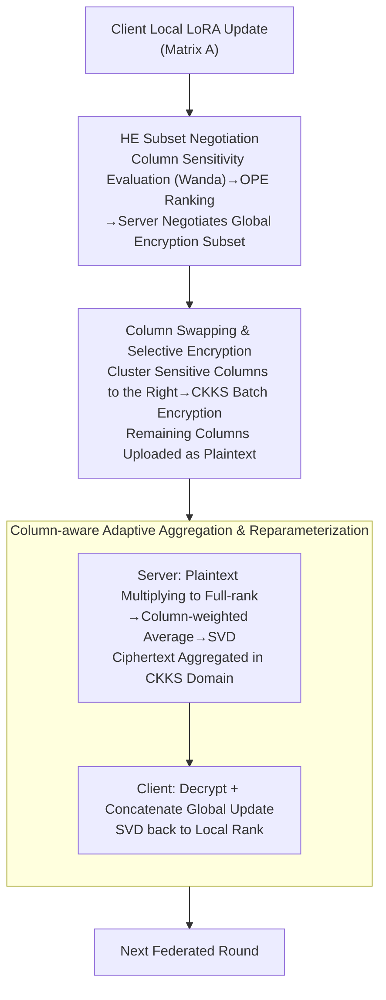

# SHE-LoRA: Selective Homomorphic Encryption for Federated Tuning with Heterogeneous LoRA

**Conference**: ICLR 2026  
**arXiv**: [2505.21051](https://arxiv.org/abs/2505.21051)  
**Code**: [GitHub](https://github.com/liyan2015/SHE-LoRA)  
**Area**: AI Security/Privacy Protection  
**Keywords**: Federated Learning, Homomorphic Encryption, LoRA, Privacy Protection, Heterogeneous Devices

## TL;DR
SHE-LoRA is proposed to combine Selective Homomorphic Encryption (SHE) with LoRA for cross-device federated LLM fine-tuning. It employs column-level encryption subset negotiation based on parameter sensitivity, column-swapping for parameter obfuscation, and column-aware adaptive aggregation. While maintaining model performance comparable to non-private baselines, it reduces communication overhead by 99.71% and encryption time by 99.87%, completely resisting the SOTA gradient inversion attack DAGER.

## Background & Motivation

**Background**: Federated fine-tuning of LLMs requires enhancing domain-specific performance while maintaining data privacy. LoRA is a mainstream choice for Federated PEFT due to its efficiency. However, research indicates that transmitted parameters or gradients can be reconstructed into private data via gradient inversion attacks (DAGER).

**Limitations of Prior Work**: (1) Differential Privacy (DP) noise is amplified by LoRA matrix multiplication, damaging model performance; (2) Multi-Party Computation (MPC) requires complex synchronization protocols, unsuitable for heterogeneous devices; (3) Existing SHE methods face two issues: LoRA matrix multiplication causes expansion of encrypted positions, and merging encryption subsets from heterogeneous clients leads to ciphertext bloat.

**Key Challenge**: In cross-device scenarios, client hardware capabilities, data distributions, and encryption budgets vary. Naive FedAvg aggregating A and B matrices separately is mathematically inequivalent to aggregating the BA product. Furthermore, the union of different encryption positions across heterogeneous devices leads to ciphertext bloat during aggregation.

**Key Insight**: (a) Encrypt only the A matrix (as it acts directly on user data and is more prone to leakage); (b) Evaluate parameter importance by column (column-wise encryption avoids expansion caused by matrix multiplication); (c) The server negotiates a global encryption subset to control ciphertext bloat; (d) Column swapping clusters encrypted and unencrypted parameters to improve efficiency.

**Core Idea**: Achieve strong privacy protection with extremely low overhead in heterogeneous federated LoRA through column-wise parameter sensitivity evaluation, global subset negotiation, column-swapping obfuscation, and column-aware aggregation.

## Method

### Overall Architecture
SHE-LoRA aims to provide strong yet efficient privacy protection for federated LoRA fine-tuning in cross-device scenarios with varying hardware, data distributions, and encryption budgets. Its core premise is that homomorphic encryption is unnecessary for the entire LoRA update; encrypting only a small subset of sensitive parameter columns is sufficient. In one training round: each client evaluates the sensitivity of its A matrix columns and negotiates a global encryption column subset with the server based on rankings; then, sensitive columns are clustered via "column swapping" and encrypted using CKKS batch encryption, while remaining columns are uploaded in plaintext; the server performs column-aware aggregation separately for plaintext and ciphertext portions; finally, clients decrypt, concatenate, and use SVD to compress the global update back to their local rank. Paying the encryption cost only for the most sensitive parameters ensures extremely low overhead while neutralizing gradient inversion attacks.

### Key Designs

**1. HE Subset Negotiation Mechanism: Coordinating heterogeneous clients for a global encrypted column subset**

In cross-device scenarios, clients have different encryption budgets. If each client chooses sensitive columns independently, the server would have to union these positions, leading to ciphertext bloat. SHE-LoRA lets each client use the Wanda method to evaluate column-wise sensitivity—the score $S_j = \sum_k |W_{kj}| \cdot \|x_j\|_2$ combines weight magnitude and input activation norms. Clients send sensitivity rankings encrypted with Order-Preserving Encryption (OPE) to the server. The server, without seeing exact values, identifies a global subset using frequency-based "Common" and sensitivity-based "Sensitivity" lists. This employs **column-wise encryption** (preventing matrix multiplication expansion) and **OPE** (facilitating negotiation without exposing sensitivity values).

**2. Column Swapping for Parameter Obfuscation: Clustering and batch encrypting scattered columns**

Negotiated encrypted columns are often scattered across matrix A, which would increase the number of blocks and encryption overhead. SHE-LoRA performs column swapping to cluster all columns requiring encryption to the right side of the matrix, then applies CKKS batch encryption to this contiguous block. This provides three benefits: batch encryption utilizes CKKS vectorization to reduce time; plaintext columns bypass homomorphic computation; and column swapping disrupts the original parameter order, acting as an obfuscation layer against attackers.

**3. Column-aware Adaptive Aggregation & Reparameterization: Mathematically correct LoRA aggregation across heterogeneous clients**

Directly applying FedAvg to matrices A and B is incorrect because averaging A and B independently does not equal the average of their products ($BA$). SHE-LoRA employs a multiply-then-decompose strategy: the plaintext portion is restored to a full-rank update $\Delta W_i^{plain} = B_i A_i^{plain}$, which is then weighted-averaged and factorized via SVD according to each client's rank. The ciphertext portion undergoes equivalent weighted aggregation in the CKKS domain. Clients decrypt the results and concatenate plaintext and ciphertext into full matrices $B_g = [B_p, B_c]$ and $A_g = [A_p; A_c]$, followed by a final SVD to adjust the global update to the local rank. This ensures no meaningful model updates are lost.

### Loss & Training
- 50 clients, 200 federated rounds, Dirichlet alpha=0.3 for non-IID partitioning.
- 4 device types: rank 8-32, encryption budget 0.125%-1.6%.
- HE Implementation: TenSEAL CKKS with polynomial degree 8192.

## Key Experimental Results

### Main Results: Privacy Attack Defense (DAGER Attack, SST2 Dataset)

| Method | B=4 R-1 | B=8 R-1 | B=16 R-1 |
|------|---------|---------|----------|
| Flex-LoRA (Unprotected) | 95.18 | 61.14 | 10.27 |
| Flex-LoRA-DP | 86.25 | 80.28 | 68.62 |
| MaskCrypt (Equivalent HE cost) | 89.16 | 61.49 | 10.91 |
| **SHE-LoRA** | **0.72** | **0.98** | **0.0** |

### Ablation Study: Efficiency Comparison (OpenLLaMA-3B)

| Metric | Full Encryption Baseline | MaskCrypt | SHE-LoRA |
|------|---------------|----------|---------|
| Encryption Time | ~480s | ~50s | ~0.6s |
| Communication Overhead | Highest | Medium | Lowest (-99.71%) |
| Time Fluctuation | [311s, 653s] | [1.6s, 105s] | Virtually none |

### Key Findings
- **Complete defense with minimal encryption**: Encrypting only 0.125% of parameters causes DAGER to fail completely (R-1=0).
- **Column swapping is critical for security**: It disrupts the structure of perturbed gradient orthogonal complements in LoRA low-rank space, causing DAGER's span check to fail.
- **No model performance loss**: Comparable to non-private SOTA on GLUE/MMLU.
- **Mutual Information validation**: The "Max" strategy (encrypting the most important parameters) results in a much faster decline in mutual information than "Min" or "Random" strategies.
- **MaskCrypt requires 100x overhead** to match the security level of SHE-LoRA.

## Highlights & Insights
- **Column-level encryption** precisely targets the root cause of encryption expansion in LoRA matrix multiplication.
- **Negotiation mechanism** balances the privacy requirements and encryption capabilities of heterogeneous devices, preventing ciphertext bloat.
- **Dual-role of Column Swapping**: Engineering optimization (batch encryption efficiency) and security enhancement (parameter obfuscation).
- **Theoretical security guarantees**: Selective encryption of sensitive parameters maximizes the reconstruction error lower bound according to the Bayesian CRLB.

## Limitations & Future Work
- Assumes a semi-honest adversary; does not handle malicious behavior (poisoning/backdoors).
- Multi-party HE scenarios require multi-key HE extensions.
- OPE exposes order information; could be replaced by stronger ORE or MPC.
- More complex generative tasks need further exploration.

## Related Work & Insights
- **vs. Flex-LoRA**: The highest-performing heterogeneous Federated LoRA but lacks privacy. SHE-LoRA provides strong privacy while maintaining comparable performance.
- **vs. MaskCrypt**: A SOTA SHE federated method that does not account for LoRA expansion or heterogeneous bloat; it requires 100x the overhead of SHE-LoRA to reach the same security level.
- **vs. DP**: DP noise in LoRA is magnified by matrix multiplication, and its defense against DAGER is significantly weaker than SHE.

## Rating
- Novelty: ⭐⭐⭐⭐ (First to combine SHE with heterogeneous LoRA; innovative column-level encryption + negotiation).
- Experimental Thoroughness: ⭐⭐⭐⭐⭐ (Multiple models/tasks, comprehensive evaluation across security, efficiency, and performance).
- Writing Quality: ⭐⭐⭐⭐ (Clear problem definition and rigorous motivation chain).
- Value: ⭐⭐⭐⭐ (Significant for practical deployment of Federated LLM fine-tuning).

<!-- RELATED:START -->

## Related Papers

- [\[ICLR 2026\] Heterogeneous Federated Fine-Tuning with Parallel One-Rank Adaptation](heterogeneous_federated_fine-tuning_with_parallel_one-rank_adaptation.md)
- [\[NeurIPS 2025\] Adaptive LoRA Experts Allocation and Selection for Federated Fine-Tuning](../../NeurIPS2025/llm_safety/adaptive_lora_experts_allocation_and_selection_for_federated_fine-tuning.md)
- [\[AAAI 2026\] FedALT: Federated Fine-Tuning through Adaptive Local Training with Rest-of-World LoRA](../../AAAI2026/llm_safety/fedalt_federated_fine-tuning_through_adaptive_local_training_with_rest-of-world_.md)
- [\[NeurIPS 2025\] FedSVD: Adaptive Orthogonalization for Private Federated Learning with LoRA](../../NeurIPS2025/llm_safety/fedsvd_adaptive_orthogonalization_for_private_federated_learning_with_lora.md)
- [\[ICLR 2026\] JailbreakLoRA: Your Downloaded LoRA from Sharing Platforms might be Unsafe](jailbreaklora_your_downloaded_lora_from_sharing_platforms_might_be_unsafe.md)

<!-- RELATED:END -->
