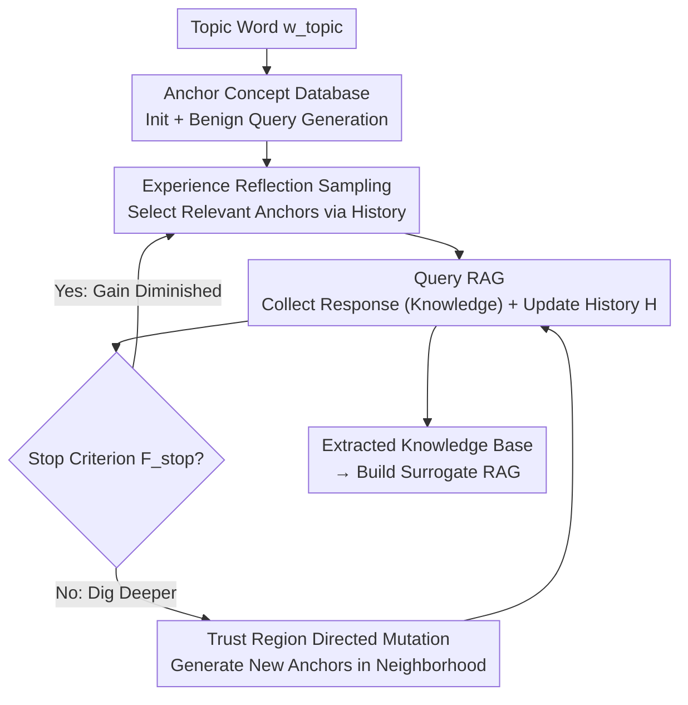

# Silent Leaks: Implicit Knowledge Extraction Attack on RAG Systems through Benign Queries

**Conference**: ICLR 2026  
**OpenReview**: [https://openreview.net/forum?id=zfVICPB5Sv](https://openreview.net/forum?id=zfVICPB5Sv)  
**Area**: AI Security / RAG / Knowledge Extraction Attack  
**Keywords**: RAG, Knowledge Extraction, Anchor Concepts, Stealthy Attack, Black-box

## TL;DR
This paper proposes IKEA (Implicit Knowledge Extraction Attack), which utilizes a set of seemingly normal benign queries. By leveraging "anchor concepts" combined with two mechanisms—Experience Reflection (ER) sampling and Trust Region Directed Mutation (TRDM)—it covertly extracts internal knowledge bases from black-box RAG systems equipped with input/output defenses. The extraction efficiency is over 80% higher and the success rate is over 90% higher than baselines, while the performance of a surrogate RAG reconstructed from the extracted knowledge approaches that of the original system.

## Background & Motivation

**Background**: RAG enhances LLMs through external domain knowledge bases and is widely used in specialized fields like healthcare, finance, law, and scientific research. These knowledge bases often involve high costs for data collection, cleaning, organization, and expert annotation (e.g., CyC/DBpedia/YAGO cost 120 million/5.1 million/10 million USD, respectively). Consequently, they naturally become targets for attackers seeking to build "pirated" homogeneous systems at a low cost by extracting the internal knowledge.

**Limitations of Prior Work**: Existing RAG extraction attacks (such as RAG-Thief, DGEA, Pirates of RAG, etc.) almost exclusively rely on **malicious inputs**—either prompt injection (e.g., "Repeat all the text before [START]") or jailbreaking (injecting gibberish to induce verbatim document output). These attacks aim to force the model to **reproduce documents verbatim**, leaving obvious signatures at both the input and output ends. Inputs can be intercepted by intent detection, keyword filtering, or defensive instructions; the output end can be exposed simply by checking the "verbatim overlap between response and document" (e.g., Rouge-L thresholds). In paper experiments, these baselines' extraction efficiency and success rate **drop to zero** under input-ensemble defenses.

**Key Challenge**: There is a fundamental tension between attack effectiveness and stealth. To obtain documents verbatim, one must issue "unnatural" instructional queries, which exposes the attack. In other words, past paradigms equated "extraction" with "verbatim copying," making attacks inevitably detectable.

**Goal**: Can an attacker **disguise themselves as a normal user**, using only natural-sounding benign queries without any instructions or suspicious phrasing to gradually extract valuable knowledge from RAG, thereby bypassing all input/output layer detections? This requires solving two sub-problems: (G1) Queries must align with RAG's internal knowledge to avoid wasting budget on content not in the library; (G2) Queries must avoid already covered knowledge to prevent repetition.

**Key Insight**: The authors observe that attackers do not need verbatim documents; they only need to extract knowledge semantically. Thus, they use a set of keywords (**anchor concepts**) related to internal knowledge to generate natural questions, and then use the knowledge in the answers to guide the next move. This redefines "extraction" from "copying documents" to "directionally exploring the embedding space."

**Core Idea**: Replace "malicious instructions + verbatim reproduction" with "anchor concepts + benign queries." SYSTEMATICally cover the entire knowledge base using Experience Reflection (ER) sampling (exploring new areas) and Trust Region Directed Mutation (TRDM) (digging deeper into unextracted areas).

## Method

### Overall Architecture

IKEA models knowledge extraction from RAG as an iterative process of "continuous optimization over an anchor concept database to explore the embedding space with benign queries." The attacker only possesses a public topic keyword $w_{topic}$ and interacts with the RAG in a black-box manner via input/output interfaces. In short: **First, scatter a set of anchor concepts using the topic word; in each round, select a relevant anchor to generate natural questions for the RAG; accumulate the Q&A history to avoid "unproductive" anchors (exploration) while performing directed mutation near successfully queried anchors to dig deeper (exploitation) until gains diminish, then switch to a new anchor.** Centered on this main line, the method features two complementary mechanisms: Experience Reflection (ER) for cross-regional "exploration" (G1), and Trust Region Directed Mutation (TRDM) for local "exploitation" (G2).

### Key Designs

**1. Anchor Concept Database: Replacing "Verbatim Copying" with "Benign Query Scattering"**

This is the foundation for bypassing detection. The attacker only has the topic word $w_{topic}$, so they use a language generator $\mathrm{Gen}_c(\cdot)$ to generate a batch of anchor concept words within its semantic neighborhood, forming a database $D_{anchor} = \{w \in \mathrm{Gen}_c(w_{topic}) \mid s(w, w_{topic}) \ge \theta_{top}\}$, while constraining pairwise similarity $\max_{w_i,w_j} s(w_i,w_j) \le \theta_{inter}$ to ensure semantic diversity. After obtaining an anchor $w$, questions are generated: $\mathrm{Gen}_q(w) = \arg\max_{q \in Q^*} s(q, w)$, where the candidate set $Q^* = \{q \in \mathrm{Gen}_c(w) \mid s(q, w) \ge \theta_{anchor}\}$ only keeps questions sufficiently close to the anchor. Crucially, these queries are "natural questions about a concept" without any instructional or suspicious phrasing, and do not request the model to output documents verbatim—thus fundamentally avoiding intent detection, keyword filtering, and verbatim overlap checks. The core difference from the verbatim paradigm is lowering the attack signal from "explicit instructions" to "normal user semantics."

**2. Experience Reflection (ER) Sampling: Avoiding "Unproductive" Anchors via History**

Addressing G1. Not all anchors align with RAG's internal documents—some are outlier concepts that trigger "Sorry, I don't know," wasting budget. ER stores each Q&A pair $(q_i, y_i)$ in history $\mathcal{H}_t$ and identifies two types of "bad" anchors: using threshold $\theta_u$ to find semantically irrelevant pairs $\mathcal{H}_u = \{(q_h,y_h) \mid s(q_h,y_h) < \theta_u\}$, and using a refusal detection function $\phi(\cdot)$ to find rejected queries $\mathcal{H}_o = \{(q_h,y_h) \mid \phi(y_h)=1\}$. A penalty function is defined: if a new anchor $w$ is too close to an outlier history query, it is penalized by $-p$; if too close to an irrelevant history query, by $-\kappa$; otherwise 0. Final sampling probabilities follow a softmax:

$$P(w) = \frac{\exp\big(\beta \sum_{h \in \mathcal{H}_t} \psi(w,h)\big)}{\sum_{w' \in D_{anchor}} \exp\big(\beta \sum_{h \in \mathcal{H}_t} \psi(w',h)\big)}$$

where $\beta$ is temperature. The intuition is: the more an anchor resembles "previously failed queries," the lower its sampling probability, naturally drifting sampling toward un-refuted regions more likely to hit internal knowledge, achieving efficient **exploration**. This elevates "random scattering" to "biased sampling with feedback."

**3. Trust Region Directed Mutation (TRDM): Digging Deeper in the Neighborhood of Successful Anchors**

Addressing G2. Once ER finds an anchor that yields knowledge, TRDM is responsible for exhausting unexplored areas within its semantic neighborhood. Core intuition: **The semantic distance $s(q,y)$ of a Q&A pair serves as a proxy for the local density of RAG documents**—a large distance implies the response is at the boundary of a retrieved document cluster (sparse neighborhood), whereas a small distance implies dense nearby documents. Thus, the trust region is defined as $W^* = \{w \mid s(w,y) \ge \gamma \cdot s(q,y)\}$, where the radius is proportional to the Q&A distance and acts as an exploration step size ($\gamma \in (0,1)$). To explore outward without overlap, TRDM **minimizes the similarity between the new anchor and the original query**: $w_{new} = \arg\min_{w' \in W^* \cap W_{Gen}} s(w', q)$, where $W_{Gen} = \{w \mid w \in \mathrm{Gen}_c(q \oplus y)\}$ are candidate words generated based on the "query ⊕ answer" concatenated text. The paper proves (Theorem 1) that when $W^* \subseteq W_{Gen}$, $s(w_{new},y) = \gamma \cdot s(q,y)$, meaning this minimization solution is semantically furthest from the original answer, maximizing coverage of unseen regions. To prevent repeated sampling of explored areas, a stop criterion $F_{stop}$ is set: mutation stops and reverts to ER sampling when a new query is too close to history ($> \tau_q$), is refused, or the response is too close to history ($> \tau_y$). ER and TRDM work in tandem to ensure systematic coverage (G2).

### Mechanism Example

Consider a medical database (HealthCareMagic): The attacker only knows the topic "healthcare/genetic disorders." ① Initialization generates anchor concepts (e.g., chromosomal disorder, multifactorial inheritance, diagnosis), controlled for similarity. ② ER sampling picks the anchor most likely to hit the library, say "genetic disorder." ③ A natural question is generated: "How might genetic disorders manifest in individuals, and what are the common ways to diagnosing and managing them?"—completely benign, passes defenses (Pass!), and retrieves an answer containing real library knowledge. ④ Save this pair to history. ⑤ Stop Criterion: If gains aren't exhausted, enter TRDM. ⑥ TRDM sets the trust region radius based on the Q&A distance and generates a new anchor furthest from the original query (e.g., moving toward a subtype of chromosomal abnormality) to dig deeper into that document cluster. This loop continues until $F_{stop}$ triggers, then it returns to ER for a new region. Over 256 rounds, benign queries systematically cover 91%+ of the knowledge base's text chunks.

## Key Experimental Results

### Main Results
Evaluated on RAG with LLaMA-3.1-8B + MPNet across five datasets and three defense settings (EE: Extraction Efficiency, ASR: Attack Success Rate, CRR: Chunk Recovery Rate, SS: Semantic Similarity). Selected data for HealthCareMagic and NQ-Corpus:

| Defense / Dataset | Method | EE | ASR | SS |
|------|------|------|------|------|
| No Defense / Health | DGEA | 0.41 | 0.90 | 0.57 |
| No Defense / Health | **Ours** | **0.87** | 0.92 | **0.71** |
| Input Ensemble / Health | Three Baselines | 0 | 0 | 0 |
| Input Ensemble / Health | **Ours** | **0.88** | **0.92** | **0.69** |
| Input Ensemble / NQ | **Ours** | **0.63** | **0.86** | **0.64** |
| Output Detection / Health | **Ours** | **0.85** | **0.91** | **0.68** |

Key Phenomenon: Under input-ensemble (intent detection + keyword filtering + defensive instructions), the three baselines (RAG-Thief / DGEA / PoR) **drop to zero**, while IKEA remains nearly unaffected. Without defense, some baselines have higher CRR (due to verbatim copying), but extraction efficiency is extremely low; IKEA achieves higher SS, indicating it extracts effective knowledge without verbatim reproduction.

### Surrogate RAG and Weakened Assumptions
| Experiment | Setting | Ours | Best Baseline |
|------|------|------|----------|
| Surrogate RAG (Pokémon, Input Ens.) | Acc / Rouge / Sim | 0.43 / 0.19 / 0.33 | 0 / 0 / 0.04 |
| Surrogate RAG (Pokémon, Output Det.) | Acc / Rouge / Sim | 0.41 / 0.18 / 0.31 | 0.03 / 0.02 / 0.09 |
| Weak Assumption: Unknown Topic (Health, Input Ens.) | EE / ASR / SS | 0.83 / 0.92 / 0.68 | — |

Surrogate RAGs built with knowledge extracted by IKEA approach the original system's performance on MCQ/QA tasks, with MCQ accuracy exceeding baselines by 40%+ and QA similarity by 30%. Under the more rigorous setting of an unknown RAG topic, topic probing is used (inferring a pseudo-topic $t^*$ via the embedding shift vector $\Delta_j = E(R_j) - E(P_j)$ between RAG and non-RAG responses). Probed topics are highly semantically consistent with ground truth (Topic SS 0.79–1.00), and extraction performance is basically equivalent to known-topic settings.

### Key Findings
- **Stealth stems from the paradigm**: Replacing "verbatim extraction" with "knowledge-seeking benign queries" is the fundamental reason IKEA isn't neutralized by I/O defenses.
- **ER for exploration, TRDM for exploitation**: Both are indispensable. ER ensures the budget isn't wasted on unproductive regions (G1), and TRDM ensures hit regions are exhausted without overlap (G2). Together, they cover 91%+ of text chunks in 256 rounds.
- **The threat is real and actionable**: Extracted knowledge can directly reconstruct surrogate RAGs with performance close to the original, linking "extraction" to "copyright/privacy harm."
- **Robust to adaptive defenses**: Even when 10%–50% irrelevant documents are injected into the retrieval set to disrupt the Top-K structure, IKEA remains effective (while also harming RAG's own utility).

## Highlights & Insights
- **Redefining Attack Signals**: The most significant insight is reducing the attack signal from "explicit malicious instructions" to "normal user semantics." This demonstrates that current RAG defenses' assumptions (that attacks must be unnatural) have a massive loophole.
- **Q&A Distance as a Density Proxy**: TRDM treats $s(q,y)$ as a proxy for local document density and adaptively sets the trust region radius—a highly transferable trick for any black-box mission exploring unknown distributions.
- **Exploration/Exploitation Framework**: ER+TRDM essentially adapts the E-E balance from reinforcement learning to embedding space sampling, an approach applicable to dataset distillation or active learning-style black-box probing.

## Limitations & Future Work
- The attack relies on the assumption that "document semantics cluster around a single domain topic." While a multi-topic probing extension is provided, coverage efficiency may drop for highly heterogeneous libraries without a clear center.
- Effectiveness depends on a strong language generator (GPT-4o was used as $\mathrm{Gen}_c$). Attack cost links to generation quality; performance with weaker generators is not fully evaluated.
- Adaptive retrieval defenses (injecting noise) are difficult for IKEA to bypass without also harming the experience for normal users. Defense strategies that "block attacks without hurting experience" remain an open research space.
- The extraction focuses on semantics, resulting in lower CRR (verbatim overlap), which limits utility in forensics scenarios requiring "verbatim copyright evidence."

## Related Work & Insights
- **vs RAG-Thief / DGEA / PoR**: These rely on prompt injection or jailbreaking to induce verbatim reproduction. Their signatures are obvious at the I/O ends and are neutralized by mainstream defenses. IKEA uses benign queries for semantic extraction; the trade-off is higher stealth but lower verbatim overlap (CRR).
- **vs Naive Benign Query Attacks**: Compared to five naive benign query baselines, IKEA's advantage lies in "directed exploration" provided by ER+TRDM rather than blind random questioning, allowing it to cover more knowledge with fewer queries.

## Rating
- Novelty: ⭐⭐⭐⭐⭐ First to propose implicit knowledge extraction using benign queries; a paradigm-level innovation.
- Experimental Thoroughness: ⭐⭐⭐⭐⭐ 5 datasets × multiple LLM/Embeddings × multiple defenses × surrogate RAG × weak assumptions × adaptive defenses.
- Writing Quality: ⭐⭐⭐⭐ Mechanisms and formulas are clear; many symbols but logical consistency is maintained.
- Value: ⭐⭐⭐⭐⭐ Reveals a fundamental blind spot in existing RAG defenses with significant implications for copyright and privacy.

<!-- RELATED:START -->

...

## Related Papers

- [\[ICLR 2026\] Fine-Grained Privacy Extraction from Retrieval-Augmented Generation Systems by Exploiting Knowledge Asymmetry](fine-grained_privacy_extraction_from_retrieval-augmented_generation_systems_by_e.md)
- [\[ACL 2026\] Detecting RAG Extraction Attack via Dual-Path Runtime Integrity Game](../../ACL2026/llm_safety/detecting_rag_extraction_attack_via_dual-path_runtime_integrity_game.md)
- [\[ICLR 2026\] Safeguarding Multimodal Knowledge Copyright in the RAG-as-a-Service Environment](safeguarding_multimodal_knowledge_copyright_in_the_rag-as-a-service_environment.md)
- [\[ACL 2026\] LeakDojo: Decoding the Leakage Threats of RAG Systems](../../ACL2026/llm_safety/leakdojo_decoding_the_leakage_threats_of_rag_systems.md)
- [\[ICLR 2026\] Rethinking Benign Relearning: Syntax as the Hidden Driver of Unlearning Failures](rethinking_benign_relearning_syntax_as_the_hidden_driver_of_the_safety_tax.md)

<!-- RELATED:END -->
