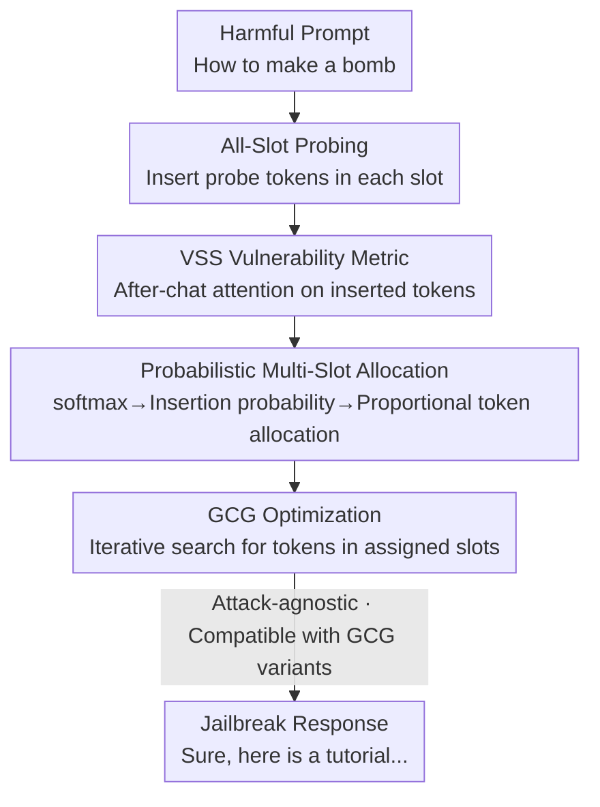

# SlotGCG: Exploiting the Positional Vulnerability in LLMs for Jailbreak Attacks

**Conference**: ICLR 2026  
**OpenReview**: [https://openreview.net/forum?id=Fn2rSOnpNf](https://openreview.net/forum?id=Fn2rSOnpNf)  
**Code**: https://github.com/youai058/SlotGCG  
**Area**: AI Security / Adversarial Attacks / Jailbreak  
**Keywords**: Jailbreak attacks, GCG, Adversarial tokens, Attention, Positional vulnerability

## TL;DR
This paper discovers that "where to insert adversarial tokens" is as critical as "what tokens to insert" in LLM jailbreak attacks. It proposes a Vulnerable Slot Score (VSS) defined by attention to locate the most exploitable insertion positions. Based on this, it constructs SlotGCG—a plug-and-play position search mechanism requiring only 200ms of preprocessing. By dispersing adversarial tokens across multiple high-VSS slots, it increases the attack success rate of various GCG-based methods by an average of approximately 14%, achieves faster convergence, and improves defense resistance by 42%.

## Background & Motivation
**Background**: Optimization-based jailbreak attacks, represented by GCG (Greedy Coordinate Gradient), append a sequence of optimizable adversarial tokens as a **suffix** to a harmful prompt. They use gradient guidance to search for tokens that force the model to output harmful responses like "Sure, here is...". The effectiveness of the suffix position is partly due to the disproportionate influence of trailing tokens on the output and the amplification of suffix perturbations by the attention mechanism.

**Limitations of Prior Work**: Almost all existing methods **default to the suffix as the optimal attack position**, never systematically exploring what happens when adversarial tokens are inserted into other positions (start, middle, or between words) of the prompt. This assumption limits the exploration space of attacks and makes the attack patterns too singular, allowing them to be easily erased by suffix-targeted defenses (e.g., Erase-and-Check).

**Key Challenge**: Is the attack effectiveness determined by "what tokens are inserted" or by "where they are inserted"? If the position itself is the source of vulnerability, then purely optimizing suffix tokens is doing the right thing in the wrong place.

**Goal**: (1) Verify whether the suffix is truly the most vulnerable insertion position; (2) Find a low-cost metric to identify vulnerable positions without exhaustive search; (3) Develop this metric into an attack-agnostic, plug-and-play position search module.

**Key Insight**: The authors formalize the prompt as a set of **slots**—a sequence of length $L$ has $L+1$ insertion positions. Through "exhaustive slot scanning" experiments, they found that each prompt has its own unique optimal slot, and this optimal slot is **never the suffix**. They further discovered that vulnerable slots are strongly correlated with the model's attention distribution, and this vulnerability is **intrinsic to the prompt itself prior to optimization**, remaining stable regardless of token updates.

**Core Idea**: Define the Vulnerable Slot Score (VSS) using the "attention of the after-chat template on inserted tokens." Perform a single forward pass to probe the VSS of all slots, distribute adversarial tokens across multiple highly vulnerable positions via VSS-based probabilities, and finally execute standard GCG optimization—effectively "selecting the right positions before optimizing the tokens."

## Method

### Overall Architecture
The input to SlotGCG is a harmful prompt, and the output is an adversarial prompt capable of jailbreaking. It does not replace the underlying GCG optimization but inserts a one-time "position search" preprocessing step **before** optimization: first, insert a probe token into each slot and compute the VSS for every slot via a single forward pass; next, transform the VSS into an insertion probability distribution using softmax and allocate the adversarial token budget to multiple high-vulnerability slots; finally, hand these tokens over to any GCG-based method for iterative optimization. The entire pipeline adds only about 200ms of preprocessing time.

### Key Designs

**1. VSS: Quantifying Slot Vulnerability with Attention**

The limitation is that the optimal insertion position varies for every prompt, and running GCG optimization for every single slot to find the best position is computationally prohibitive. The authors observed an exploitable correlation: after optimization, higher attention received by adversarial tokens leads to lower adversarial loss (Fig 4a shows an inverse correlation), meaning high-attention slots are more vulnerable. VSS is defined as the sum of attention weights from the after-chat template tokens to the adversarial tokens inserted in that slot. For a slot $s$ (containing an adversarial sequence $a^k$ of length $k$):

$$\text{VSS}_s = \sum_{\ell \in L_{UH}} \sum_{h} \sum_{c \in C} \sum_{a \in a^k} A^{(\ell,h)}_{c,a} / k$$

Where $A^{(\ell,h)}_{c,a}$ is the attention weight of token $c$ to token $a$ in the $h$-th head of the $\ell$-th layer. $L_{UH}=\{\lceil L/2\rceil,\dots,L\}$ represents the upper half of the network layers (responsible for high-level semantics where jailbreak mechanisms are most evident), and $C$ represents the after-chat template tokens. The effectiveness of VSS lies in the finding that vulnerability is **intrinsic** to the prompt: the $\text{VSS}_{init}$ before optimization and $\text{VSS}_{final}$ after convergence show a positive correlation of 0.4–0.9 for most prompts. Thus, initial VSS can predict final vulnerability without actual optimization.

**2. Probabilistic Multi-Slot Allocation: Distributing Budgets Across Vulnerability**

Knowing the most vulnerable slot is insufficient—single-point insertion is just a "shifted suffix attack." The core mechanism converts all slot VSS values into an insertion probability distribution via a tempered softmax:

$$\pi_{s_i} = \frac{\exp(\text{VSS}_{s_i}/T)}{\sum_{u\in S}\exp(\text{VSS}_u/T)}$$

The temperature $T$ controls the distribution sharpness. Given a budget of $m$ tokens, each slot first receives an integer portion $t_{s_i}=\lfloor r_{s_i}\rfloor$ where $r_{s_i}=m\cdot\pi_{s_i}$. The remaining $m-\sum t_{s_i}$ tokens are distributed to slots with the largest decimal remainders $f_{s_i}$. This "largest remainder method" naturally disperses adversarial tokens across multiple high-VSS slots rather than piling them in one place. Exploratory experiments (Fig 5) confirm that multi-slot random insertion achieves faster loss decay and lower convergence than standard GCG.

**3. Attack-Agnostic Plug-and-Play Position Search**

SlotGCG purposefully handles only "position selection + token allocation," leaving the "token optimization" to existing methods. Since the process is completed before GCG optimization and relies only on a single forward pass for attention, it can be applied directly to GCG, AttnGCG, I-GCG, GCG-Hij, GBDA, etc., adding only ~200ms of overhead. This decoupling provides a robustness dividend: adversarial tokens are scattered across multiple slots, resulting in a more uniform VSS distribution (standard deviation dropped from 4.807 to 3.874). When defenses like Erase-and-Check or SmoothLLM erase or perturb a segment of tokens, the remaining adversarial tokens in other positions still function, making the method much more robust than suffix-heavy benchmarks.

### Loss & Training
The attack objective follows GCG: minimize the negative log-likelihood of the target harmful response given the adversarial sequence $x^S$: $\mathcal{L}=-\log p(x^T\mid x^O_{1:L}\oplus x^S)$. Unlike GCG, insertion is performed in a "right-to-left" order so that slot indices remain stable relative to the original sequence during the process. The token budget $m$, temperature $T$, and upper layer range $L_{UH}$ are the primary hyperparameters. The optimization steps remain consistent with the specific GCG variant used.

## Key Experimental Results

The dataset consists of 50 harmful behaviors from AdvBench. Threat models include Llama-2-7B/13B, Llama-3.1-8B, Mistral-7B, Vicuna-7B, and Qwen-2.5. ASR (Attack Success Rate) was evaluated via a three-step process: template filtering, GPT-4 adjudication, and manual review.

### Main Results

Applying SlotGCG to five GCG-based attacks (Average ASR across models):

| Attack Method | Base Avg ASR | + SlotGCG | Gain |
|---------------|--------------|-----------|------|
| GCG           | 66.7%        | 80.0%     | +13.3% |
| AttnGCG       | 61.7%        | 86.3%     | +24.6% |
| I-GCG         | 73.0%        | 85.7%     | +12.7% |
| GCG-Hij       | 78.0%        | 84.3%     | +6.3%  |
| GBDA          | 20.3%        | 40.0%     | +19.7% |

The improvement is particularly significant for the robust Llama series: On Llama-2-13B, AttnGCG jumped from 20% to 82% (+62%), and I-GCG reached 94%.

### Defense Robustness and Convergence Efficiency

| Dimension | Baseline | + SlotGCG | Note |
|-----------|----------|-----------|------|
| Avg ASR under Defense (GCG) | 18.9% | 46.2% | +27.3% against Erase-and-Check/SmoothLLM |
| Erase-and-Check (suffix)    | 0.0%  | 52.0% | Suffix defense is nearly useless against dispersed insertion |
| Iteration Steps (Llama-2-7B, GCG) | 138.11 | 40.50 | ~3.4x faster convergence (up to 10x in some cases) |
| VSS Std Dev (StdAvg, ×$10^{-3}$)  | 4.807 | 3.874 | More uniform attention distribution |

### Key Findings
- **Position is more fundamental than tokens**: Exhaustive scanning showed that for all 50 prompts, **none of the optimal slots were the suffix**, and the optimal position varied by prompt—the suffix is not a universal optimum.
- **Vulnerability is intrinsic**: The strong correlation (0.4–0.9) between $\text{VSS}_{init}$ and $\text{VSS}_{final}$ indicates that vulnerable slots are determined by the prompt itself and can be predicted with one forward pass before optimization.
- **Dispersion equals robustness**: SlotGCG's ASR against Erase-and-Check (suffix) jumped from 0% to 52% because erasing the suffix cannot remove adversarial tokens scattered in other slots.
- **Counter-intuitive anomaly**: ASR can occasionally be higher after applying defenses—without defenses, GPT-4 might misjudge "slightly harmful" outputs as successes and stop optimization early; defenses filter these out, forcing the optimization to continue and eventually generate explicitly harmful content.

## Highlights & Insights
- **Position as a first-class citizen**: The long-ignored "where to insert" is formalized into $L+1$ slots and a computable VSS metric, revealing the blind spots of suffix-only attacks.
- **Attention as a cheap proxy**: Instead of expensive per-slot optimization, VSS uses a single forward pass of after-chat template to adversarial token attention to predict vulnerability, reducing position search to a single inference step.
- **Transferable decoupled logic**: Decoupling position search from token optimization allows it to serve as a "preprocessing plugin" for any optimization-based attack. This "select position then optimize content" paradigm is transferable to prompt injection and other adversarial tasks.
- **Inherent defense resistance**: Thinning out perturbations across multiple points renders any "fixed-point erasure/perturbation" defense ineffective, a benefit achieved at almost zero cost.

## Limitations & Future Work
- **White-box assumption**: VSS requires reading internal attention weights, making it a white-box attack not directly applicable to closed-source API models.
- **Limited evaluation scale**: Evaluation was conducted on 50 AdvBench prompts; although GPT-4 and manual review were used, broader prompt coverage and consistency in adjudication could be improved.
- **Empirical hyperparameters**: The choice of upper layers $L_{UH}$ and temperature $T$ is based on empirical observation and lacks systematic ablation across diverse architectures (e.g., MoE, long-context).
- **Double-edged sword**: While it serves as a red-teaming tool to expose suffix-only defense blind spots, it also warns defenders to expand detection from the suffix to full-prompt scanning.

## Related Work & Insights
- **vs. GCG**: GCG fixes adversarial tokens at the suffix; SlotGCG adds position search beforehand to disperse tokens into high-VSS slots—essentially, "GCG was using the wrong positions."
- **vs. AttnGCG**: AttnGCG also uses attention but to guide the direction of token optimization; SlotGCG uses attention (VSS) to **select insertion positions**. These are orthogonal; combining them raised AttnGCG's average ASR from 61.7% to 86.3%, the largest gain among all baselines.
- **vs. Suffix Defenses (Erase-and-Check / SmoothLLM)**: These defenses assume adversarial tokens are concentrated at the suffix; SlotGCG's dispersion bypasses this premise, suggesting defenses must shift toward position-agnostic detection across the entire prompt.

## Rating
- Novelty: ⭐⭐⭐⭐⭐ First to systematically formalize "insertion position" with an attention-driven VSS, exposing the fundamental flaw of suffix-only approaches.
- Experimental Thoroughness: ⭐⭐⭐⭐ Covers 6 models and 5 attacks plus multiple defenses, though limited to 50 prompts under white-box settings.
- Writing Quality: ⭐⭐⭐⭐⭐ Extremely clear logic, deriving the method through three key findings.
- Value: ⭐⭐⭐⭐⭐ Plug-and-play with 200ms overhead; universal for GCG-style attacks and highly instructive for both red-teaming and defense design.

<!-- RELATED:START -->

## Related Papers

- [\[ICLR 2026\] TAO-Attack: Toward Advanced Optimization-based Jailbreak Attacks for Large Language Models](tao-attack_toward_advanced_optimization-based_jailbreak_attacks_for_large_langua.md)
- [\[ICLR 2026\] ImpossibleBench: Measuring LLMs' Propensity of Exploiting Test Cases](impossiblebench_measuring_llms_propensity_of_exploiting_test_cases.md)
- [\[ICLR 2026\] SafeDialBench: A Fine-grained Safety Evaluation Benchmark for LLMs in Multi-turn Dialogues and Diverse Jailbreak Attacks](safedialbench_a_fine-grained_safety_evaluation_benchmark_for_large_language_mode.md)
- [\[ICLR 2026\] MSCR: Exploring the Vulnerability of LLMs' Mathematical Reasoning Abilities Using Multi-Source Candidate Replacement](mscr_exploring_the_vulnerability_of_llms_mathematical_reasoning_abilities_using_.md)
- [\[ICLR 2026\] GeneBreaker: Jailbreak Attacks Against DNA Language Models with Pathogenicity Guidance](genebreaker_jailbreak_attacks_against_dna_language_models_with_pathogenicity_gui.md)

<!-- RELATED:END -->
