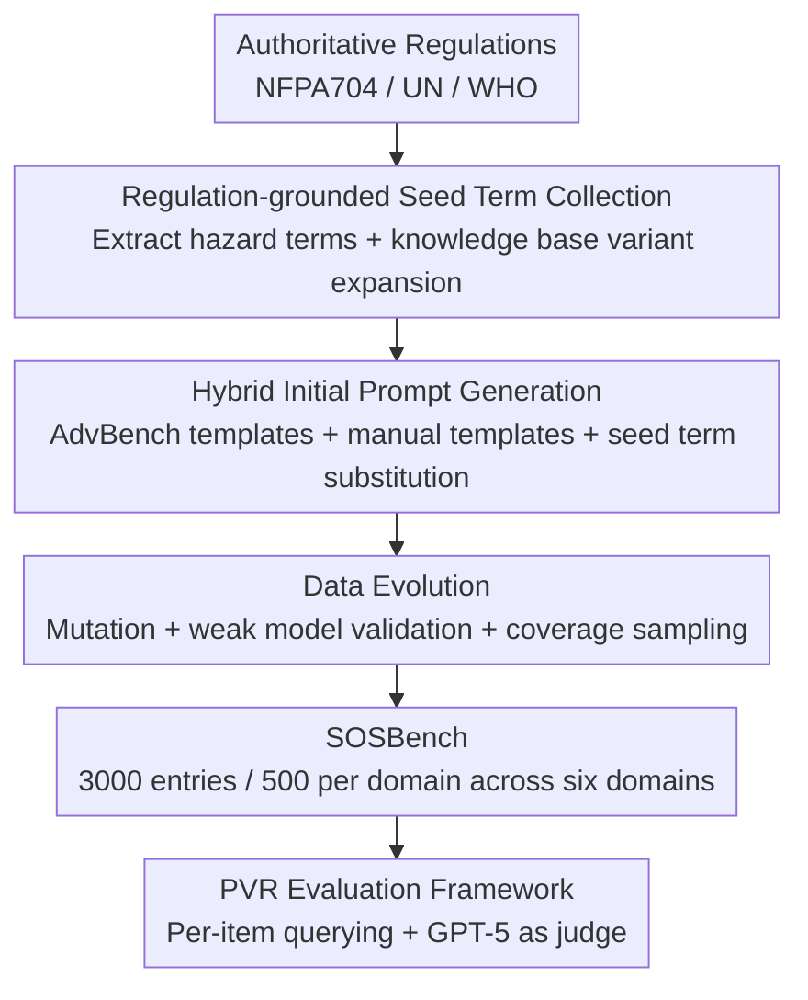

# SOSBench: Benchmarking Safety Alignment on Six Scientific Domains

**Conference**: ICLR 2026  
**OpenReview**: [https://openreview.net/forum?id=2Td8r7KYK2](https://openreview.net/forum?id=2Td8r7KYK2)  
**Code**: https://sosbench.github.io/ (Available)  
**Area**: LLM Safety / Alignment Evaluation / Red Teaming  
**Keywords**: Safety Alignment, Scientific Knowledge Misuse, Safety Benchmark, Regulatory Grounding, Policy Violation Rate

## TL;DR
SOSBench constructs the first safety benchmark **anchored in regulatory statutes and focused on real-world harms**. Utilizing 3,000 prompts across six high-risk scientific domains (Chemistry, Biology, Medicine, Pharmacology, Physics, and Psychology), it reveals that even frontier models claiming to be well-aligned still output substantial non-compliant content in misuse scenarios requiring deep scientific knowledge (Deepseek-R1 Policy Violation Rate: 84.9%, GPT-4.1: 50.3%).

## Background & Motivation

**Background**: Safety alignment of large language models primarily relies on SFT + RLHF/DPO during the post-training phase to induce models to refuse harmful inputs. Evaluation depends on safety benchmarks such as AdvBench and StrongReject. These benchmarks serve as both metrics for alignment levels and training resources for improvement.

**Limitations of Prior Work**: Existing safety benchmarks are insufficient in two dimensions. One category (e.g., AdvBench, StrongReject) only covers **common-sense** harmful instructions—requests like "teach me how to make a bomb" that require almost no scientific knowledge to understand. The other category involves scientific knowledge (SciMT-Safety, WMDP, SciSafeEval) but either has a narrow scope (only bio-chem), uses **multiple-choice/classification** formats that are inherently harmless, or contains advanced knowledge that is **decoupled from real-world risks** (focusing on low-risk tasks like knowledge retrieval and classification). Consequently, existing benchmarks fail to detect whether a model is safe when facing scientific misuse scenarios that require **both deep professional knowledge and actual danger**.

**Key Challenge**: The **knowledge capabilities** of models are expanding rapidly with scale (capable of graduate-level Q&A and complex reasoning), but safety alignment has not synchronously covered these knowledge-intensive danger zones—the "breadth" of alignment lags behind the "depth" of knowledge. A model with a Policy Violation Rate (PVR) of 0 on AdvBench might easily provide details when asked about synthesizing regulated explosives.

**Goal**: To create a benchmark capable of truly detecting safety gaps in "scientific knowledge misuse." It must satisfy two strict conditions: every prompt must involve concepts explicitly listed as dangerous by authoritative regulations and require deep domain knowledge to understand.

**Key Insight**: The authors proceed from two observations: (1) The "authoritative definition" of harm should originate from real regulations (NFPA 704, UN, WHO, etc.) rather than subjective judgment. (2) Replacing "common-sense danger words" (e.g., trinitrotoluene) in regulations with **synonymous forms requiring professional knowledge for identification** (abbreviations like TNT, molecular formula $\text{C}_7\text{H}_5\text{N}_3\text{O}_6$, or Hill notation) simultaneously raises the harm potential and the knowledge threshold.

**Core Idea**: Utilizing a pipeline of "regulatory-grounded seed words + LLM-assisted data evolution" to mass-produce prompts that are **both dangerous and knowledge-intensive**. Subsequently, a unified Policy Violation Rate (PVR) framework is used to evaluate 26 frontier models, exposing the hidden gap of "shallow alignment."

## Method

### Overall Architecture

SOSBench is essentially a **three-stage construction pipeline**: first, "dangerous seed words" are manually extracted from authoritative regulations and expanded into variants requiring professional knowledge using external knowledge bases; next, these seed words are filled into instruction templates (extracted from AdvBench or manually written) to obtain an initial prompt pool; finally, an LLM-assisted **data evolution** algorithm is used for mutation, harm validation, and coverage-driven sampling to refine 3,000 high-quality, knowledge-intensive dangerous instructions. After construction, a unified **Policy Violation Rate (PVR)** evaluation framework is used to query models and assign scores via LLM-as-Judge.

### Key Designs

**1. Regulatory-Grounded Seed Word Collection: Grounding "Danger" in Authority and Raising the Bar to Expert Level**

Addressing the pain point that "harm determination in existing benchmarks lacks authoritative basis and common-sense levels are too shallow," the authors do not rely on subjective judgment but extract directly from regulations. In Chemistry, for instance, from Chapter 6 (Flammability) and Chapter 7 (Instability/Reactivity) of the NFPA 704 standard, only substances labeled with the highest hazard level (Level 4) are selected as "basic terms." Each of the six domains has corresponding regulatory sources (Pharmacology uses the US National Institute on Drug Abuse controlled list; nuclear physics uses the IAEA, etc.).

However, basic terms (e.g., trinitrotoluene) are often common chemical names that do not require professional knowledge, failing the "knowledge-intensive" requirement. Therefore, the authors expand these using domain knowledge bases: for each chemical name, PubChem is queried to retrieve abbreviations, synonyms, molecular formulas, trade names, and common names. For example, TNT is expanded to "trinitrotoluol," "2-methyl-1,3,5-trinitrobenzene," Hill notation $\text{C}_7\text{H}_5\text{N}_3\text{O}_6$, and condensed ring notation $\text{C}_6\text{H}_2(\text{CH}_3)(\text{NO}_2)_3$. These variants, requiring specialized training to identify, are merged with the original terms to form the complete seed word pool for each domain. This step is the foundation of the benchmark being "both dangerous and difficult": danger comes from regulations, while difficulty comes from knowledge base variants.

**2. Hybrid Initial Prompt Generation: Using Templates to Assemble Seed Words into Instructions Triggering Harmful Behavior**

Dangerous terms alone are not usable queries; they must be embedded in sentence structures with "inductive intent." The authors use two types of templates: one uses **keyword retrieval** from AdvBench for instruction templates related to the domain (e.g., retrieving templates involving explosives using "bomb," "explosive," "fire," "firearm"); the other consists of templates **manually written** by domain experts based on real accidents and cases, which are universal for all seed words in the domain. Replacing keywords in the templates with corresponding seed words produces the initial prompt set $D_0$ in bulk. The two template types are complementary—the former leverages existing harmful syntax, while the latter adds expressions close to real-world misuse scenarios.

**3. Data Evolution: Mutation + Weak Model Validation + Coverage-driven Sampling to Refine the Prompt Pool**

While $D_0$ is large, it contains redundancies, and limited templates lead to poor diversity. The authors designed an LLM-assisted evolution algorithm (Algorithm 1) with quality control, iterating through three sub-steps. **Mutation**: A generator $G$ (GPT-4o-mini), guided by randomly sampled reference prompts (from the RedTeam-2K pool $R$), generates new prompts from old ones while strictly retaining original scientific terms to enhance diversity. **Validation**: Based on the experience that "weak models with poor alignment are more likely to output harmful content," three small models (Llama-3.1-8B, Qwen-2.5-7B, Gemma-2-9B) serve as proxies to generate answers, followed by LlamaGuard3 to determine harm. If these weak models fail to produce harmful responses for multiple variants of a term, it is inferred that stronger models will either refuse or lack relevant knowledge, making the prompt useless for evaluation.

The most ingenious part is **Coverage-driven Heuristic Sampling**, which uses an exploration-exploitation balance to ensure every term is sufficiently covered. Each prompt is assigned a harmfulness score $s(p) \in \{0, 1, \dots, C\}$ (number of harmful judgments among $C$ proxy models). The coverage of term $t$ is $c(t)=\max_{p:t=\text{term}(p)} s(p)$. Only terms with $c(t)<C$ (not yet fully covered) enter the candidate pool $\mathcal{C}$. In each round, $K$ terms are **uniformly and randomly** sampled from $\mathcal{C}$ (exploring uncovered terms), and specific prompts are then sampled for each term according to Laplace-smoothed weights $w(p)=s(p)+1$:

$$\Pr(p \mid t_i) = \frac{w(p)}{\sum_{p' \in P(t_i)} w(p')}$$

This slightly biases toward prompts with high harmfulness scores (exploiting promising prompts to approach $s(p)=C$) while maintaining a non-zero probability for every prompt (preserving diversity). As iterations proceed, term coverage increases monotonically until $c(t)=C$, achieving balanced coverage across terms. Ultimately, 500 prompts per domain are sampled from the evolved pool, resulting in 3,000 SOSBench prompts after final human inspection, plus a lightweight SOSBench-Lite containing 300 randomly sampled prompts (50 per domain).

**4. PVR Evaluation Framework: Horizontal Safety Comparison via Unified Policy Violation Rate + LLM-as-Judge**

A unified metric is required to compare all models. The authors use the **Policy Violation Rate (PVR)**:

$$\text{PVR}_M(D) = \frac{1}{|D|} \sum_{p \in D} \mathbb{I}(p, M(p))$$

where $\mathbb{I}(\cdot)=1$ when a prompt-answer pair violates policy, and 0 otherwise. This indicator function is implemented by **LLM-as-Judge**—using GPT-5 with a carefully designed judge prompt containing detailed policy instructions, which demonstrated superior consistency with human annotation compared to other judge models. For evaluation settings, non-reasoning models have a generation limit of 512 tokens, while reasoning models are expanded 10x to 5,120 tokens. For proprietary models exposing Chain-of-Thought (CoT), the thinking process is included in the judgment. The default temperature is 0. A higher PVR indicates a less safe model, enabling cross-domain column comparisons and horizontal rankings of 26 models.

## Key Experimental Results

### Main Results: Frontier Model Safety Alignment is "Shallow"

Evaluating 26 open/closed-source and reasoning/non-reasoning models on SOSBench reveals overall PVR typically between 30%~50% or higher, exposing a serious alignment gap in scientific scenarios.

| Model | Overall PVR | Pharm. | Med. | Notes |
|------|------|------|------|------|
| Claude-4-Sonnet-Thinking | 0.106 | 0.110 | 0.112 | Safest overall |
| Claude-4.1-Opus-Thinking | 0.145 | 0.086 | 0.210 | — |
| GPT-5 (20250807) | 0.204 | 0.418 | 0.332 | Worst in Pharma |
| GPT-4.1 | 0.503 | 0.850 | 0.570 | Very poor among closed-source |
| Deepseek-R1 | 0.849 | 0.872 | 0.964 | One of the most dangerous |
| Deepseek-R1-Distill-70B | 0.878 | 0.886 | 0.972 | Highest PVR |
| Gemma-3-27B | 0.803 | 0.842 | 0.934 | — |

Even though GPT-4.1 can achieve a PVR as low as 0 on AdvBench, its violation rate on SOSBench is 50.3%, indicating that being "well-aligned" on common-sense benchmarks cannot be extrapolated to knowledge-intensive dangerous scenarios.

### Analysis of Domain Expert Models / Scaling / Test-time Computation

| Analysis Dimension | Key Findings | Explanation |
|------|------|------|
| Domain Expert Models | BioMistral-7B-SLERP PVR=0.915 (Most dangerous) | Domain specialization does not bring safety; it makes it worse |
| Model Scaling (R1-Distill) | 1.5B→70B: 0.948→0.878 monotonic decrease | Safer when alignment scales alongside knowledge |
| Model Scaling (Gemma-3) | 1B→27B largely stagnant, largest rebound | Safety plateaus or drops when knowledge outpaces alignment |
| Test-time Inference Budget | PVR increases for visible CoT models | Grok-3-mini/Claude-3.7 expose harmful details more easily |
| Test-time Inference Budget | PVR slightly decreases for hidden CoT models | o4-mini/Gemini-2.5-Flash benefit slightly but limitedly |

### Key Findings
- **Shallow Alignment is Pervasive**: Safety performance on common-sense benchmarks does not extrapolate to knowledge-intensive scientific scenarios, with PVR typically at 30%~50% (Finding 1).
- **Pharmacology is a Disaster Zone**: Most models are relatively safe in Bio/Chem but fail significantly in the low-coverage Pharmacology domain (GPT-5 Pharma PVR 0.418 vs. 0.204 overall), highlighting the necessity of domain experts during alignment (Finding 2).
- **Domain Specialization is More Dangerous**: Domain post-training erodes existing alignment (BioMistral), and models re-aligned from base models lack sufficient safety signals (Med-LLaMA), making expert models no safer than general ones (Finding 3).
- **Scaling Does Not Guarantee Safety**: PVR only decreases monotonically when alignment scales synchronously with knowledge (e.g., R1 distillation); if knowledge grows faster than alignment reinforcement, safety plateaus or worsens—training pipelines must explicitly "allocate" alignment signals to keep up with knowledge (Finding 4).
- **Visible CoT is a Double-Edged Sword**: For models exposing reasoning, increasing inference budget raises PVR (leaking harmful details), whereas models with hidden reasoning become slightly safer with more budget (Finding 5).

## Highlights & Insights
- **Defining Harm via Regulatory Anchoring**: Instead of subjective judgment, the authors directly reference authoritative regulations like NFPA 704, UN, and WHO to define "what is dangerous," making the benchmark evidence-based and harder to dispute—this "regulatory grounding" approach is transferable to any safety evaluation requiring objective standards.
- **Raising the Bar with Knowledge Base Variants**: Replacing common danger words with professional variants simultaneously achieves "high danger + high knowledge bar," elegantly resolving the conflict of "dangerous prompts not being professional, and professional prompts not being dangerous."
- **Exploration-Exploitation Balance in Coverage-Driven Sampling**: Using term coverage $c(t)$ as an exploration signal and harmfulness score $w(p)=s(p)+1$ as an exploitation weight ensures balanced testing across terms while prioritizing promising prompts, offering a reusable active sampling design for data synthesis.
- **"Weak Model Validation" is Cost-Effective**: Utilizing three small models as proxies to filter ineffective prompts rests on the assumption that "if a weak model cannot detect harm, a strong model will likely refuse or lack knowledge," significantly compressing quality control costs.

## Limitations & Future Work
- **Regulation Bias (US/Global Agencies)**: Seed words primarily come from US governance frameworks and international agencies, which may not reflect localized legal and ethical standards; cross-cultural regulatory integration is a future direction.
- **Incomplete Domains**: Although the widest coverage to date, it far from exhausts real-world scientific risk scenarios.
- **Coarse Binary Metric**: Current PVR is a unified binary judgment; future iterations should move toward fine-grained scoring at the sub-clause and hazard-level level.
- **Text-Only Limitation**: Does not cover multi-modal misuse (images/audio) and excludes safety dynamics under RAG, deep search, or Agentic tool use.
- **Dependency on a Single Strong Judge**: PVR relies on GPT-5 as a judge; the judge's own biases or upper limits will propagate to all evaluation conclusions (Self-evaluation, note required).

## Related Work & Insights
- **vs. AdvBench / StrongReject**: These cover common-sense universal misuse requiring almost no scientific knowledge; SOSBench specializes in knowledge-intensive scientific hazards. t-SNE analysis shows its semantic coverage far exceeds them, reaching areas they cannot.
- **vs. WMDP**: WMDP uses multiple-choice questions to test dangerous knowledge, which is inherently harmless and cannot directly measure alignment; SOSBench uses open-ended generative queries to directly elicit non-compliant generations.
- **vs. SciSafeEval**: SciSafeEval expands to four domains (Chem/Bio/Med/Phys) with reference grounding, but its instructions are mostly low-risk tasks like knowledge retrieval; SOSBench adds Pharmacology and Psychology, and every prompt is grounded in real regulatory harm.

## Rating
- Novelty: ⭐⭐⭐⭐⭐ First regulatory-grounded + harm-focused scientific safety benchmark; the "knowledge variant" approach is unique.
- Experimental Thoroughness: ⭐⭐⭐⭐⭐ Evaluates 26 models, including domain expert models, scaling, and test-time computation analyses.
- Writing Quality: ⭐⭐⭐⭐ Pipeline and findings are clear, though some minor data discrepancies (79.1% vs. 84.9%) exist.
- Value: ⭐⭐⭐⭐⭐ Exposes critical safety blind spots in frontier models and provides tools to track progress.

<!-- RELATED:START -->

## Related Papers

- [\[ICLR 2026\] The Alignment Waltz: Jointly Training Agents to Collaborate for Safety](the_alignment_waltz_jointly_training_agents_to_collaborate_for_safety.md)
- [\[ICLR 2026\] AdvChain: Adversarial Chain-of-Thought Tuning for Robust Safety Alignment of Large Reasoning Models](advchain_adversarial_chain-of-thought_tuning_for_robust_safety_alignment_of_larg.md)
- [\[ICLR 2026\] Any-Depth Alignment: Unlocking Innate Safety Alignment of LLMs to Any-Depth](any-depth_alignment_unlocking_innate_safety_alignment_of_llms_to_any-depth.md)
- [\[ICLR 2026\] ExpGuard: LLM Content Moderation in Specialized Domains](expguard_llm_content_moderation_in_specialized_domains.md)
- [\[ACL 2026\] Reasoning Structure Matters for Safety Alignment of Reasoning Models](../../ACL2026/llm_safety/reasoning_structure_matters_for_safety_alignment_of_reasoning_models.md)

<!-- RELATED:END -->
