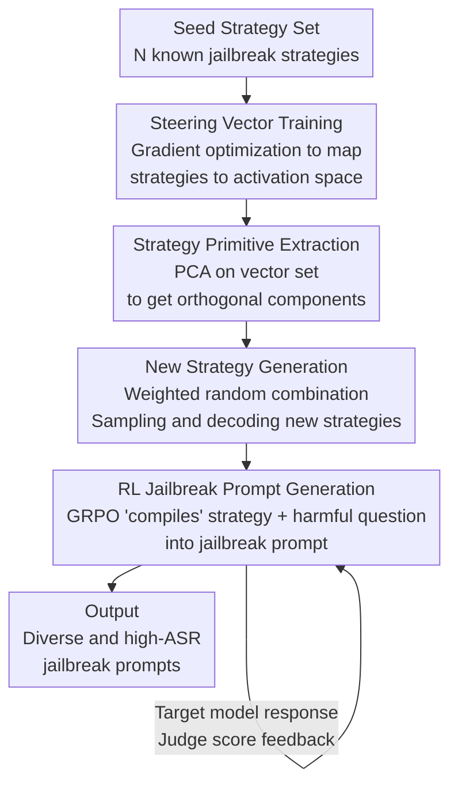

# STAR: Strategy-driven Automatic Jailbreak Red-teaming for Large Language Model

**Conference**: ICLR 2026  
**OpenReview**: [https://openreview.net/forum?id=c2BygWVqag](https://openreview.net/forum?id=c2BygWVqag)  
**Code**: None  
**Area**: Alignment RLHF / LLM Safety  
**Keywords**: Jailbreak Attack, Automated Red-teaming, Activation Space, Strategy Diversity, GRPO

## TL;DR
STAR shifts the exploration of jailbreak "strategies" from text space to the model's activation space. By representing known strategies as steering vectors, extracting orthogonal "strategy primitives" via PCA, and sampling new, semantically distinct strategies through random linear combinations, it then utilizes GRPO to train an open-source LLM as a "compiler" to translate abstract strategies into high-success jailbreak prompts. This approach significantly outperforms SOTAs like AutoDAN-Turbo in both attack success rate and strategy diversity.

## Background & Motivation
**Background**: Automated jailbreak red-teaming is a critical method for detecting LLM security vulnerabilities before deployment. Current mainstream approaches adopt "LLM-attacking-LLM": PAIR uses an attacker LLM to iteratively rewrite prompts, while AutoDAN-Turbo employs a lifelong learning agent to summarize jailbreak strategies in text space. These methods already achieve high Attack Success Rates (ASR).

**Limitations of Prior Work**: Strategies generated by these methods are semantically highly concentrated, repeatedly converging to a few well-known patterns (e.g., role-play, implying negative consequences). The authors define this phenomenon as "strategy collapse"—once a high-reward strategy is discovered, the method over-exploits it, failing to explore new space.

**Key Challenge**: The root cause is the intrinsic tension between the exploration of diverse strategies and the exploitation of known effective ones. Since these methods operate in **text space**, "rewriting a sentence" naturally produces semantically similar variants, making it difficult to jump out of the semantic neighborhood of known strategies, thus leaving a fatal "diversity gap." Strategies missed by red-teaming become blind spots for defense systems after deployment.

**Goal**: To systematically generate a large number of **semantically distinct** and novel jailbreak strategies while maintaining high ASR, effectively expanding red-teaming coverage.

**Key Insight**: The authors observe that the "semantic structure" of strategies should not be sought in discrete text space but rather in the model's continuous **latent activation space**. Activation engineering has demonstrated that "concepts" (e.g., toxicity) can be represented and manipulated using direction vectors in activation space. Consequently, "jailbreak strategies" can also be represented by such vectors, allowing linear algebraic operations (PCA, sampling) to synthesize new strategies.

**Core Idea**: Each known strategy is encoded into a steering vector. PCA is applied to extract orthogonal principal components from these vectors as "strategy primitives," which are then randomly combined with weights to sample new directions in activation space, allowing the model to "speak" a completely new strategy. The strategy generation and prompt generation modules are decoupled to optimize diversity and effectiveness separately.

## Method

### Overall Architecture
STAR is a **black-box** framework (querying the target model and observing responses only) that decouples the jailbreak task into two modules: the **strategy generation module**, responsible for producing diverse candidate strategies, and the **prompt generation module**, responsible for rewriting a specific strategy and a harmful question into a high-ASR jailbreak prompt. This decoupling allows "exploring diverse strategies" and "exploiting effective rewriting" to be optimized independently without mutual interference.

The strategy generation module involves three steps: training steering vectors for each seed strategy (pinning strategy semantics into activation space), performing PCA on these vectors to extract orthogonal strategy primitives, and finally sampling and decoding new strategies through random linear combinations of these primitives. The prompt generation module treats the "harmful question + strategy" as the state and uses GRPO to train a policy network (an open-source LLM) to generate jailbreak prompts, with a closed-loop reward signal provided by "target model response $\rightarrow$ judge model scoring."

### Key Designs

**1. Strategy Steering Vector Training: Mapping "Strategies" to Activation Space without Fixed Phrasing**

Traditional steering vector construction relies on "contrastive methods"—subtracting negative activations from positive ones. However, jailbreak strategies lack clear positive/negative contrastive data. The authors utilize **gradient-optimized random vectors**: an LLM first generates $N$ different seed strategies $Z_{seed}$; for each strategy $z_k$, $M$ semantically equivalent but differently phrased rewrites $T_k=\{t_{k,1},\dots,t_{k,M}\}$ are created. A vector $v_k\in\mathbb{R}^d$ is randomly initialized, and model weights are frozen. Only $v_k$ is updated to maximize the average log probability of generating all rewritten texts under a general instruction $I$ (e.g., "Generate a jailbreak strategy:"), with the vector added to a specific layer's activation:

$$L = -\frac{1}{M}\sum_{i=1}^{M}\frac{1}{|t_{k,i}|}\sum_{j=1}^{|t_{k,i}|}\log P\big(t_{k,i}[j] \mid \langle I, t_{k,i}[1:j-1]\rangle;\, v_k\big)$$

Using $M$ rewrites instead of a single sentence ensures the vector captures the **general concept** of the strategy rather than overfitting to a specific expression. Training one vector for each of the $N$ seeds yields a vector set $V=\{v_1,\dots,v_N\}$, where each vector serves as a coordinate in high-dimensional activation space. This step forms the foundation for subsequent linear algebra operations.

**2. Strategy Primitive Extraction + New Strategy Generation: Linear Algebra in Activation Space to Synthesize Novel Strategies**

With the vector set $V$, PCA is applied to decompose it into a set of orthogonal principal components $\{c_1,\dots,c_k\}$. Each $c_i$ represents a fundamental axis of variation in the seed strategies, termed a "strategy primitive" (with eigenvalue $\lambda_i$ representing the variance explained by that direction). PCA serves three roles: **dimensionality reduction and denoising** ($k\ll N$ components represent the entire strategy space), **decoupling and orthogonalization** (removing correlation between seeds to provide an independent basis of strategy elements), and **generativity** (the orthogonal basis spans a latent strategy space for sampling).

To generate a new strategy, the vector set mean $\mu_V$ is calculated to re-center the distribution, followed by a weighted random linear combination of primitives:

$$v_{new} = \mu_V + \sum_{i=1}^{k} w_i \cdot c_i, \qquad w_i \sim \mathcal{N}(0, \lambda_i)$$

The variance of weights $w_i$ is set to the corresponding eigenvalue $\lambda_i$, ensuring synthesized vectors follow the same statistical distribution as the original set. Adding $v_{new}$ to the forward activation of instruction $I$ allows the model to decode a completely new strategy $z_{new}$. This is the fundamental difference between STAR and AutoDAN-Turbo: while the latter summarizes strategies in text space, STAR's interpolation in continuous activation space can synthesize strategies non-existent in the seed set (e.g., "Syntactic Decomposition").

**3. RL Jailbreak Prompt Generation: Using GRPO to "Compile" Abstract Strategies into High-ASR Prompts**

Abstract strategies alone are insufficient; they must be translated into specific prompts that penetrate the target model. This complex generation task requires nuanced reasoning. Since simple LLM prompting (as in AutoDAN-Turbo) lacks an explicit optimization loop, it is modeled as an RL problem: the policy network $\pi_\theta$ is an open-source LLM, the state $s_t=\text{Template}(q,z)$ concatenates the harmful request $q$ and strategy $z$, the action $a_t$ is the generation of a candidate jailbreak prompt $p_{q,z}$, and the reward $r$ comes from feeding $p_{q,z}$ to the target LLM to get a response $e$, followed by scoring from a judge LLM (using rules such as refusal, meeting harmful intent, etc., where 0=deviant intent, 1=refusal, 2=partial answer, 3=full answer).

Optimization is performed via **GRPO**: multiple outputs $G$ are sampled for the same input, relative rewards within the group estimate the advantage for each output, and the objective function is maximized. Compared to per-sample baseline estimation, GRPO eliminates the value network, saves compute, and stabilizes training. Post-training, this module acts as a high-fidelity "compiler" that remains faithful to the strategy semantics while maximizing ASR. Ablation shows ASR increases from 0.41 (few-shot) to 0.77 (Llama-2-7B), proving that "strategy $\rightarrow$ prompt" requires reward-driven iterative optimization.

## Key Experimental Results

### Main Results
The DAN dataset (250 distinct malicious questions, 150 for training / 100 for testing) and StrongREJECT (313 questions) are used. During training, Qwen3-4B serves as the strategy generator, prompt generator, and judge; the target model is Llama-2-7B. Evaluation covers 7 open/closed-source models. Baselines include GPTFuzz, PAIR, RLbreaker, and AutoDAN-Turbo.

ASR on the DAN dataset (key columns):

| Method | Llama-2-7B* | Llama-2-13B | Gemma-1.1-7B | GPT-4-Turbo | Gemini-2.5-Pro |
|--------|------|------|------|------|------|
| GPTFuzz | 0.38 | 0.31 | 0.55 | 0.82 | 0.86 |
| PAIR | 0.25 | 0.21 | 0.40 | 0.31 | 0.42 |
| RLbreaker | 0.36 | 0.32 | 0.44 | 0.71 | 0.73 |
| AutoDAN-Turbo | 0.45 | 0.40 | 0.45 | 0.70 | 0.65 |
| **STAR** | **0.77** | **0.77** | **0.62** | **0.83** | **0.89** |

(* indicates target model used during training.) STAR's ASR of 0.77 on Llama-2-7B significantly outperforms AutoDAN-Turbo's 0.45. On StrongREJECT, STAR achieves a score of 0.93 for Llama-2-7B and approaches 0.9 for GPT-4-Turbo, suggesting it bypasses core safety logic rather than superficial vulnerabilities.

In terms of strategy diversity (500 generated strategies), STAR leads in all 8 metrics, most notably in pairwise distance (0.5126 vs 0.3151) and ANC (0.3960 vs 0.1680), indicating more dispersed and broader semantic coverage.

### Ablation Study

| Configuration | Key Metric | Note |
|------|---------|------|
| STAR Strategy Gen | Pairwise 0.4971 / ANC 0.6700 | Full module, highest diversity |
| Seed Strategy Sampling | Pairwise 0.3457 / ANC 0.3900 | Limited by the initial seed pool |
| LLM Prompting | Pairwise 0.1599 / ANC 0.3800 | Severe semantic redundancy |
| STAR (with RL) | ASR 0.77 (Llama-2-7B) | GRPO optimized prompt generation |
| Zero-Shot (without RL) | ASR 0.30 | Low performance without RL |
| Few-Shot (without RL) | ASR 0.41 | In-context learning remains insufficient |

### Key Findings
- **Activation space sampling synthesizes "novelty"**: STAR does more than reuse seed strategies—it significantly exceeds Seed Strategy Sampling in pairwise distance (0.4971 vs 0.3457) and identifies new strategies like "Syntactic Decomposition," proving PCA + interpolation jumps out of text-space semantic neighborhoods.
- **RL in the prompt module is the decisive factor for ASR**: Replacing RL with few-shot prompting drops ASR from 0.77 to 0.41 on Llama-2-7B (a 36% gap), indicating "abstract strategy $\rightarrow$ prompt" is a complex task requiring reward-driven optimization.
- **Prompt module as a standalone tool**: Strategies from external LLMs or human design fed into STAR's prompt module maintain high ASR (e.g., Gemini strategies attacking GPT-3.5-Turbo reach 0.95), showing the module is strategy-agnostic and plug-and-play.

## Highlights & Insights
- **Shifting strategy exploration to activation space** is the key breakthrough: text-space rewriting naturally produces synonyms, while continuous activation space allows PCA and interpolation to synthesize novel strategies—using linear algebra to solve "strategy collapse."
- **Gradient-optimized random vectors** bypass the requirement for contrastive positive/negative pairs, providing a transferable trick for abstract concepts without clear counterparts. 
- **Decoupling exploration and exploitation**: Strategy generation targets diversity, while prompt generation targets effectiveness. This prevents high-reward strategies from suppressing exploration, a paradigm transferable to other diversity-critical tasks.
- **"Compiler" positioning** for the prompt module allows it to be a reusable asset, modularizing the red-teaming system.

## Limitations & Future Work
- The framework is positioned as an attack/red-teaming tool; its dual-use nature is significant, and how to use these new strategies for alignment defense is not extensively explored.
- The use of the same Qwen3-4B for prompt generation and judging may introduce scoring bias. Furthermore, reliance on a single judge (Gemini-2.5-Pro) for "success" raises concerns regarding judge robustness.
- Activation methods require access to model layers to train steering vectors. While the attack is black-box for the target, strategy generation depends on a carrier model with accessible activations.

## Related Work & Insights
- **vs AutoDAN-Turbo**: Both are strategy-driven, but AutoDAN-Turbo summarizes in **text space**, leading to collapse; STAR uses **activation space** PCA, leading to superior diversity (0.5126 vs 0.3151) and ASR.
- **vs PAIR / Tree of Attacks**: These use iterative text-space rewriting, resulting in concentrated strategies; STAR decouples exploration from generation.
- **vs GCG**: GCG uses gradient search for adversarial suffixes, requiring white-box access and producing gibberish; STAR is black-box and produces coherent natural language.

## Rating
- Novelty: ⭐⭐⭐⭐⭐ Shifting strategy exploration to activation space via PCA is a true paradigm shift.
- Experimental Thoroughness: ⭐⭐⭐⭐ Extensive testing across 7 targets and multiple benchmarks, though judge/generator overlapping is a slight drawback.
- Writing Quality: ⭐⭐⭐⭐ Clear motivation on strategy collapse and well-defined decoupling.
- Value: ⭐⭐⭐⭐ Demonstrates vulnerability of alignment to "unseen" strategies; the prompt module is practically useful for red-teaming.

<!-- RELATED:START -->

## Related Papers

- [\[ICLR 2026\] RedCodeAgent: Automatic Red-teaming Agent against Diverse Code Agents](redcodeagent_automatic_red-teaming_agent_against_diverse_code_agents.md)
- [\[ICLR 2026\] Auto-RT: Automatic Jailbreak Strategy Exploration for Red-Teaming Large Language Models](auto-rt_automatic_jailbreak_strategy_exploration_for_red-teaming_large_language_.md)
- [\[ACL 2026\] STAR-Teaming: A Strategy-Response Multiplex Network Approach to Automated LLM Red Teaming](../../ACL2026/llm_safety/star-teaming_a_strategy-response_multiplex_network_approach_to_automated_llm_red.md)
- [\[ICLR 2026\] Automatic Dialectic Jailbreak: A Framework for Generating Effective Jailbreak Strategies](automatic_dialectic_jailbreak_a_framework_for_generating_effective_jailbreak_str.md)
- [\[ICLR 2026\] From "Sure" to "Sorry": Detecting Jailbreak in Large Vision Language Model via JailNeurons](from_sure_to_sorry_detecting_jailbreak_in_large_vision_language_model_via_jailne.md)

<!-- RELATED:END -->
