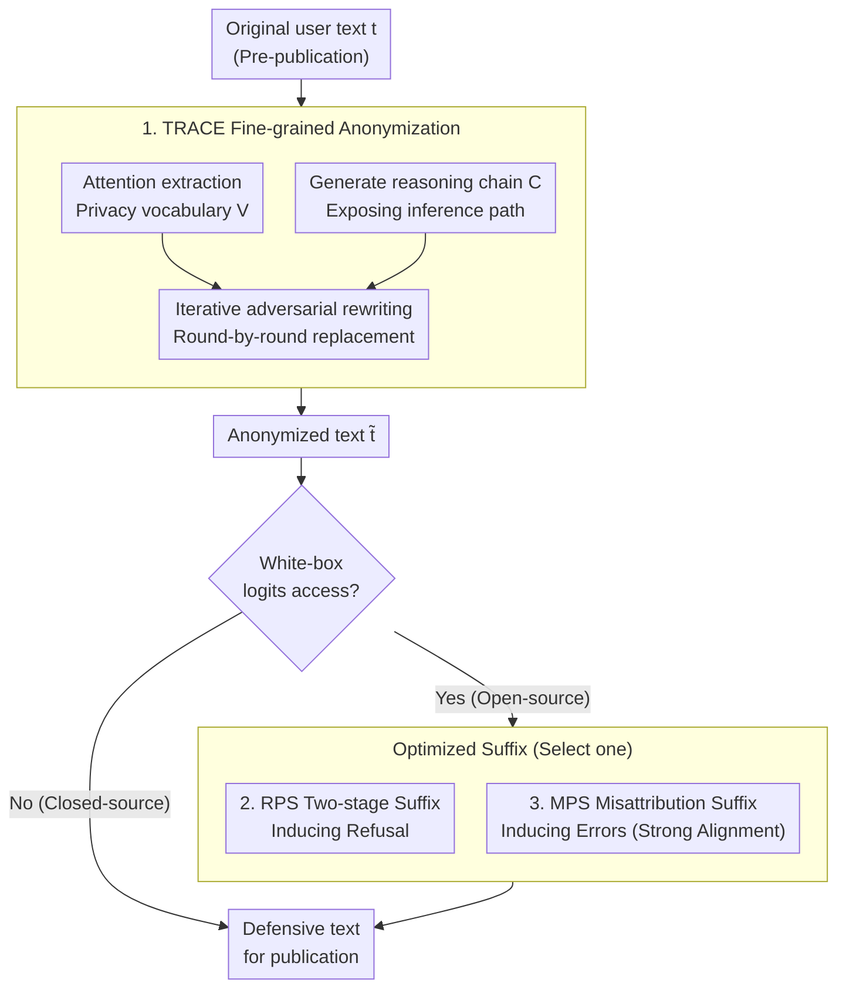

# Stop Tracking Me! Proactive Defense Against Attribute Inference Attack in LLMs

**Conference**: ICLR 2026  
**arXiv**: [2602.11528](https://arxiv.org/abs/2602.11528)  
**Code**: [https://github.com/Jasper-Yan/TRACE-RPS](https://github.com/Jasper-Yan/TRACE-RPS)  
**Area**: LLM Security  
**Keywords**: Attribute Inference Attack, Privacy Protection, LLM Security, Attention Anonymization, Optimization Defense

## TL;DR
TRACE-RPS proposes a unified defense framework against LLM attribute inference attacks: TRACE utilizes attention mechanisms and reasoning chains to pinpoint privacy-leaking text elements for fine-grained anonymization, while RPS employs lightweight suffix optimization to induce model refusal, reducing attribute inference accuracy from approximately 50% to below 5%.

## Background & Motivation

**Background**: LLMs can infer private attributes (age, location, gender, etc.) from harmless text shared by users online, enabling large-scale automated privacy violations. These attacks do not trigger safety filters because the prompts themselves are entirely benign.

**Limitations of Prior Work**:
   - Existing anonymization methods are too coarse-grained (text-level rather than word-level), failing to precisely locate specific text elements that leak privacy.
   - Fundamental limitation of anonymization: Even if sensitive clues are modified to hide information, the reasoning capability of models can still infer attributes from the modified text.
   - For attributes with limited categories (e.g., gender or income level), anonymized text still provides resolvable data points.

**Key Challenge**: Attribute inference in LLMs stems from **reasoning capabilities** rather than memorization. It is impossible to simply weaken reasoning capabilities (as this would break general utility), and anonymization alone can often be bypassed by reasoning.

**Key Insight**: A two-step defense—(1) precise anonymization to reduce leaked information + (2) optimized suffixes to induce model refusal, fundamentally blocking inference.

**Core Idea**: Anonymization reduces information volume + refusal optimization blocks inference behavior = a double-layered defense.

## Method

### Overall Architecture
The attacker feeds user-shared online text to an LLM to infer private attributes (age, location, gender, etc.), where the text itself is benign and does not trigger safety filters. TRACE-RPS is a **user-side, pre-publication** defense: first, TRACE identifies and replaces specific words that leak privacy to minimize inferable information, resulting in anonymized text. If the user has white-box access to model logits (open-source models), an additional optimization suffix is appended—RPS is used by default to induce "refusal" for attribute questions. For strong alignment models like Qwen that resist refusal, MPS is used to induce "incorrect" attribute answers. The former reduces information while the latter blocks the inference process; even if one layer is bypassed, the other remains. For closed-source models (e.g., GPT-4o) where logits are inaccessible, only TRACE is applied.

### Key Designs

**1. TRACE: Locating "Implicit" Leaking Words via Attention and Reasoning Chains for Word-level Anonymization**

A traditional problem with anonymization is its coarse granularity—rule-based methods (e.g., Azure PII) only match explicit PII and black out entire segments or sentences, which misses implicit clues (e.g., dialect usage hinting at geographic location) and destroys readability. TRACE lets the inference model itself identify "which words leak privacy," driven by two fine-grained signals in an **iterative adversarial** rewriting loop. The first signal is attention extraction: a pre-trained causal language model simulates an attack; its attention vector $\mathbf{a}=(a_1,\dots,a_{|t|})$ from the last token of the final layer during attribute inference is read. Token-level attention belonging to the same word is summed to obtain word-level importance $\alpha(w)=\sum_{z=i}^{j} a_z$, and the Top-K elements form the privacy vocabulary $V=\operatorname{TopK}(\{(w,\alpha(w))\})$. The second signal is reasoning chain generation: the model is prompted to provide a step-by-step explanation alongside its prediction, exposing the path $C$ from specific words to attributes. The anonymization model $M_{\text{anon}}$ receives both $V$ and $C$, modifies only these key segments to generate anonymized text $\tilde t$, and feeds it back to the attack model for re-evaluation. This iterates until the attribute can no longer be inferred. This approach locates clues the model **actually relies on**, making it far more precise than rule-matching while preserving semantics by modifying only a few leaking words.

**2. RPS: Reversing Jailbreaking Suffix Optimization to Induce Model Refusal**

Anonymization only reduces information and cannot stop a model from "brute-forcing" an inference—as long as resolvable data points remain (especially for categorical attributes like gender or income), reasoning capabilities may bypass the defense. RPS (Refusal-oriented Perturbation Search) addresses this gap at the behavioral level: it appends an optimized suffix $s$ to the text, causing the inference model to output "I" followed by a refusal word for attribute questions, forming a "I cannot answer" response. The scoring function treats these two steps separately:

$$J(s)=\log p(y_1=\text{"I"}\mid P(\tilde t))+\beta\cdot\log p\big(y_2\in\mathcal{R}\mid P(\tilde t),\,y_1=\text{"I"}\big)$$

Where $\mathcal{R}$ is a set of refusal tokens. The optimization uses a **two-stage random search** without gradient computation: Stage 1 ("first token anchoring") focuses on $J_1=\log p(y_1=\text{"I"})$, replacing $n$ tokens at random positions in the best suffix until the first token stabilizes as "I"; Stage 2 ("refusal token shaping") uses the same random replacement to optimize the second token into $\mathcal{R}$ based on the full $J(s)$. Since each candidate only requires decoding 1–2 tokens, it is significantly cheaper than methods like AutoDAN. This technical route shares origins with jailbreaking attacks like GCG, but while those bypass refusal, RPS **induces** it—a clever inverse application. The trade-off is the requirement for white-box logit access, making RPS applicable only to open-source models. Optimized suffixes can also be transferred to new texts or used as strong initializations for rapid convergence.

**3. MPS: Inducing Errors in "Stubborn" Strong Alignment Models**

RPS relies on the model's "willingness to be dissuaded." However, highly instruction-following models like Qwen or GPT-4o often ignore refusal prompts and persist in providing attribute predictions, rendering RPS ineffective. MPS (Misattribution Perturbation Search) serves as an alternative strategy: instead of seeking refusal, it optimizes a suffix to steer the model's prediction away from the ground truth $y_u^{(a)}$ **toward a specific incorrect value** $\bar y_u^{(a)}$ (e.g., flipping "Female" to "Male"). The objective is $s^*=\arg\max_s \log p(y=\bar y_u^{(a)}\mid P(\tilde t))$. Replacing the true inference with a deliberately biased answer achieves privacy protection without altering the original text's semantics.

### Loss & Training
- RPS Scoring: $J(s)=\log p(y_1=\text{"I"})+\beta\log p(y_2\in\mathcal{R})$. The original text $t$ is fixed while searching for the suffix $s$ via two-stage random search (First token anchoring → Refusal token shaping) with log-probability thresholds $\tau_1, \tau_2$ and early stopping iteration limits.
- MPS Objective: $\max_s \log p(y=\bar y_u^{(a)})$, steering attributes toward designated incorrect values.
- Both methods decode only 1–2 tokens without gradients but require white-box logit access; closed-source models rely solely on TRACE.

## Key Experimental Results

### Main Results (Inference Accuracy ↓)

| Method | Llama3 | Qwen2.5 | DeepSeek-R1 | GPT-4o |
|------|--------|---------|------------|--------|
| No Defense | ~50% | ~50% | ~50% | ~50% |
| Azure PII | ~40% | ~40% | ~40% | ~40% |
| Staab et al. (Anonymization) | ~25% | ~25% | ~25% | ~25% |
| TRACE | ~15% | ~15% | ~15% | ~20% |
| **TRACE-RPS** | **<5%** | **<5%** | **<5%** | N/A (Closed) |

### Ablation Study

| Configuration | Inference Accuracy ↓ |
|------|----------|
| TRACE Only | ~15% |
| RPS Only | ~10% |
| **TRACE + RPS** | **<5%** |

### Key Findings
- **Inference accuracy dropped from 50% to <5%**: TRACE-RPS almost entirely blocks attribute inference on open-source models.
- **Cross-model transferability**: Suffixes optimized on one model are effective when transferred to others.
- **Robustness to prompt variations**: Defense remains effective even if the attacker changes the inference prompt format.
- **Reasonable utility-privacy trade-off**: Text modified by TRACE maintains semantic integrity and readability.
- **Effective defense for DeepSeek-R1**: Even models with extremely strong reasoning capabilities are effectively defended.

## Highlights & Insights
- The **"Anonymization + Refusal Induction" dual-insurance design** is highly practical—anonymization reduces the information exposure surface, while refusal optimization blocks inference behavior. Both lines of defense are independently effective and stronger in combination.
- **Inverting jailbreaking optimization for privacy defense** is a clever reverse application—techniques like GCG are used for attack, while RPS uses the same route for defense.
- **Attention-guided privacy vocabulary extraction** is far superior to rule-based methods—it identifies implicit privacy leakage paths that are difficult for humans to foresee.

## Limitations & Future Work
- RPS requires white-box logit access—closed-source models (GPT-4o) can only utilize TRACE.
- Optimized suffixes might be detected as anomalous text (though the paper claims minimal impact).
- Only text-based attribute inference was evaluated—multimodal inference (image + text) remains unconsidered.
- MPS (Misattribution) strategies may introduce new ethical concerns in certain scenarios.
- Computational cost of suffix optimization (though lightweight, it requires multiple forward passes).

## Related Work & Insights
- **vs. Azure PII Detection**: Rule-based matching for explicit PII only, unable to detect implicit leaks; TRACE uses attention and reasoning chains for implicit localization.
- **vs. Staab et al. (2025) Anonymization**: Coarse-grained text-level anonymization; TRACE operates precisely at the word level.
- **vs. GCG/Jailbreaking**: Shares optimization techniques, but RPS is used to induce refusal rather than bypass it.

## Rating
- Novelty: ⭐⭐⭐⭐ The unified framework of anonymization + refusal optimization is creative, and the inverse jailbreaking application is clever.
- Experimental Thoroughness: ⭐⭐⭐⭐⭐ Comprehensive evaluation across 7 LLMs, cross-model transfer, prompt robustness, and utility-privacy trade-offs.
- Writing Quality: ⭐⭐⭐⭐ Clear problem formulation and accurate description of the attack-defense relationship.
- Value: ⭐⭐⭐⭐⭐ Attribute inference is a realistic privacy threat; TRACE-RPS provides a deployable defense solution.

<!-- RELATED:START -->

## Related Papers

- [\[ACL 2025\] Defense Against Prompt Injection Attack by Leveraging Attack Techniques](../../ACL2025/llm_safety/defense_prompt_injection.md)
- [\[ICLR 2026\] Membership Inference Attacks Against Fine-tuned Diffusion Language Models (SAMA)](membership_inference_attacks_against_fine-tuned_diffusion_language_models.md)
- [\[ICLR 2026\] VEAttack: Downstream-Agnostic Vision Encoder Attack Against Large Vision Language Models](veattack_downstream-agnostic_vision_encoder_attack_against_large_vision_language.md)
- [\[ACL 2026\] DualGuard: Dual-stream Large Language Model Watermarking Defense against Paraphrase and Spoofing Attack](../../ACL2026/llm_safety/dualguard_dual-stream_large_language_model_watermarking_defense_against_paraphra.md)
- [\[AAAI 2026\] Multi-Faceted Attack: Exposing Cross-Model Vulnerabilities in Defense-Equipped Vision-Language Models](../../AAAI2026/llm_safety/multi-faceted_attack_exposing_cross-model_vulnerabilities_in_defense-equipped_vi.md)

<!-- RELATED:END -->
