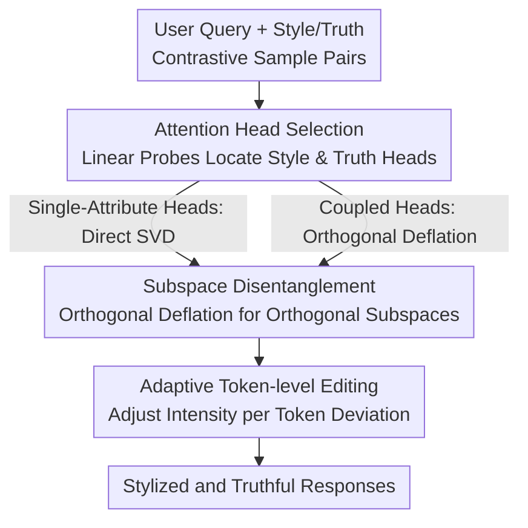

# StyliTruth: Unlocking Stylized yet Truthful LLM Generation via Disentangled Steering

**Conference**: ICLR 2026  
**OpenReview**: [https://openreview.net/forum?id=GECUTH82ze](https://openreview.net/forum?id=GECUTH82ze)  
**Code**: https://github.com/Starrylay/StyliTruth  
**Area**: LLM Safety / Representation Editing / Controllable Generation  
**Keywords**: Activation Editing, Style Transfer, Truthfulness, Subspace Disentanglement, Inference-time Intervention

## TL;DR
This paper discovers that representation editing to inject style into LLMs inadvertently undermines their truthfulness (termed "stylization-induced truthfulness collapse"). The root cause is the entanglement of style and truth directions within certain attention heads. StyliTruth employs orthogonal deflation to decouple these into mutually orthogonal subspaces and applies adaptive token-level editing within each, maintaining style while preserving answer correctness.

## Background & Motivation

**Background**: To achieve controllable generation where LLMs output in a specific style (e.g., Shakespearean or Red Chamber style), the prevailing lightweight approach is "representation editing" (or activation steering). This method is training-free and plug-and-play, adding a style steering vector to hidden activations during inference: $\tilde{x} = \text{MLP}(\text{MHA}_e(x))$, where the edited attention head activation is $\text{Attn}_h(x) + \lambda\delta^{(h,l)}$.

**Limitations of Prior Work**: The authors observe a neglected side effect—after applying a distinct style, the model's responses often shift from "correct" to "nonsense." For instance, when edited to a Shakespearean style and asked "Which birds can count like humans," the model might rhyme its way into an incorrect claim that parrots and magpies are experts in mathematics, rather than correctly stating that birds lack such numerical reasoning. The authors name this phenomenon **stylization-induced truthfulness collapse**.

**Key Challenge**: Stronger stylization leads to a more severe collapse in truthfulness—there is an inherent trade-off between style fidelity and factual correctness. Existing methods "naively" inject style signals without realizing they pollute the model's core truthfulness representations.

**Key Insight**: Analyzing activation differences yields two key observations: ① Style and truth directions are approximately orthogonal across many attention heads (cosine similarity near 0); ② **A small subset of attention heads are simultaneously sensitive to style and critical to truthfulness**. In these "relevant heads," style and truth directions are strongly entangled (Welch's t-test $t=2.71$, $p=0.01$, Cohen's $d=0.64$, a medium-to-large effect size), whereas entanglement is weak in other heads. These entangled heads cause style editing to perturb the truth direction.

**Core Idea**: Instead of forcefully injecting style into the original activation space (which affects truthfulness), the style-related and truth-related subspaces should be **explicitly decoupled into mutually orthogonal** components, allowing independent and non-interfering editing in each subspace.

## Method

### Overall Architecture

StyliTruth is a training-free inference-time editing framework. The pipeline consists of four stages: first, constructing contrastive sample pairs for "style" and "truth" (positive vs. negative examples with the same semantics but different attributes); next, scanning all attention heads with linear probes to select those that best distinguish style and truth; then, performing subspace disentanglement—applying SVD to heads belonging to a single attribute and using orthogonal deflation for "style-truth coupled heads" to project the truth subspace onto the orthogonal complement of the style subspace; finally, constructing steering vectors with adaptive token-level intensity based on the deviation of each token from the target style/truth.

### Key Designs

**1. Attention Head Selection: Locating "Style Heads" and "Truth Heads" using Linear Probes**

Editing all model activations is the source of pollution, so the first step identifies specifically relevant heads. The authors construct two types of contrastive pairs: style pairs $D_s = \{Q_i, R^-_{s,i}, R^+_{s,i}\}$ (same question and semantics, $R^+$ is target style, $R^-$ is neutral style) and truth pairs $D_t = \{Q_i, R^-_{t,i}, R^+_{t,i}\}$ (same style and length, differing only in truthfulness). A linear probe $p(a^{(h,l)}) = \text{Sigmoid}(\langle\theta, a^{(h,l)}\rangle)$ is trained for each head using the final token activation. Heads are ranked by validation accuracy to select the top-$H$ style heads $H_s$ and truth heads $H_t$. The intersection $H_s \cap H_t$ represents the "Relevant Heads" where entanglement occurs. Accuracy heatmaps reveal that style sensitivity is distributed across layers (early layers for associations, late layers for decoding), while truth sensitivity is concentrated in middle layers, indicating that attribute encoding is localized at the head level.

**2. Subspace Disentanglement: Mandatory Orthogonality via Orthogonal Deflation**

To prevent style editing from affecting truthfulness, the authors handle two cases. For **single-attribute heads** ($h \in H_s\setminus H_t$ or $h \in H_t\setminus H_s$), as high-dimensional activations are naturally near-orthogonal, SVD is performed on the activation difference matrix $\Delta A^{(h,l)}_s = [\delta a^{(h,l)}_{s,1}, \dots]^\top$. The right singular vectors $v^{(h,l)}_{s,i}$ corresponding to the top-$K$ singular values are used as orthogonal bases.

For **style-truth coupled heads** ($h \in H_s\cap H_t$), attributes are entangled. The authors propose orthogonal deflation: they take the style subspace bases $V^{(h,l)}_{s,K}$ and construct an orthogonal complement projection operator:

$$P^\perp_s = I_d - V^{(h,l)}_{s,K}\big(V^{(h,l)}_{s,K}\big)^\top,$$

The truth activation differences are projected: $\widetilde{\Delta A}^{(h,l)}_t = \Delta A^{(h,l)}_t P^\perp_s$. Re-performing SVD on the result yields truth bases $\tilde{v}^{(h,l)}_{t,i}$ that satisfy $\tilde{V}^{(h,l)\top}_{t,K} V^{(h,l)}_{s,K} = 0$. Consequently, editing style in these heads does not project onto the truth direction. Theoretical analysis shows the information loss is minimal: relative error $\delta = \|\Delta A_t - \widetilde{\Delta A}_t\|_F^2 / \|\Delta A_t\|_F^2 \approx K/d \ll 1$ (since $K \ll d$).

**3. Adaptive Token-level Editing: Dynamic Strength Adjustment**

Using a fixed editing strength for all tokens is suboptimal, as some tokens are already stylized while others are distant. The authors decompose the editing strength into three factors: $\lambda^{(h,l)}_{s,i} = g^{(h,l)}_{s,i}\,\kappa^{(h,l)}_{s,i}\,\gamma_s$. The **global strength** $g^{(h,l)}_{s,i} = \sigma^{(h,l)}_{s,i}/\sqrt{d}$ is determined by singular values; the **adaptive scaling factor** $\kappa^{(h,l)}_{s,i}$ projects the difference between the mean positive activation $\bar{a}^{(h,l)+}$ and the current activation onto the style basis:

$$\kappa^{(h,l)}_{s,i} = \frac{\big(\bar{a}^{(h,l)+} - a^{(h,l)}\big) v^{(h,l)\top}_{s,i}}{\|v^{(h,l)}_{s,i}\|^2},$$

This quantifies how much the current token deviates from the target style; the hyperparameter $\gamma_s$ caps the overall magnitude. An identical formula is used for the truth subspace.

### Loss & Training
StyliTruth does not update model parameters. The only "training" involves linear probes for head selection. Subspace bases are obtained via closed-form SVD, and editing strength is calculated in real-time. Key hyperparameters include the number of selected heads $H$, subspace dimension $K$, and strength caps $\gamma_s, \gamma_t$.

## Key Experimental Results

Experiments use two styles (Shakespeare / Red Chamber) and two truthfulness benchmarks (TruthfulQA and its translation) with a Qwen-1.5-14B-Chat backbone. Metrics include SI (Style Intensity), SP (Semantic Preservation), FS (Fluency), and OA (Overall = SI×SP×FS). Truthfulness is measured by Truth and Info, combined into TI (Truth ∩ Info). The final metric is **S-TI (Harmonic mean of OA and TI)**.

### Main Results

| Dataset/Style | Method | OA (↑) | TI (↑) | S-TI (↑) |
|------|------|------|------|------|
| DRC→TruthfulQA(ZH) | ITI | 0.0772 | 0.0972 | 0.0861 |
| DRC→TruthfulQA(ZH) | CAA | 0.1000 | 0.2917 | 0.1489 |
| DRC→TruthfulQA(ZH) | DRESS | 0.1047 | 0.3056 | 0.1560 |
| DRC→TruthfulQA(ZH) | Vector prompt | 0.1528 | 0.2222 | 0.1811 |
| DRC→TruthfulQA(ZH) | **StyliTruth** | **0.1550** | **0.5000** | **0.2366** |
| Shakespeare→TruthfulQA | ITI | 0.1880 | 0.1944 | 0.1912 |
| Shakespeare→TruthfulQA | DRESS | 0.2037 | 0.3333 | 0.2529 |
| Shakespeare→TruthfulQA | **StyliTruth** | **0.2191** | **0.3889** | **0.2803** |

On the DRC (Red Chamber) style, StyliTruth improves S-TI by 30.65% over the strongest baseline. Most baselines suffer a severe drop in TI (e.g., ITI at 0.0972) when pushing style, whereas StyliTruth maintains TI at 0.5000, proving it manages both objectives.

### Ablation Study

| Configuration | OA | TI | S-TI | Description |
|------|------|------|------|------|
| w/o ATE | 0.1079 | 0.2017 | 0.1575 | Removed adaptive token-level editing |
| w/o SD | 0.1095 | 0.3194 | 0.1632 | Removed subspace disentanglement |
| StyliTruth | 0.1550 | 0.5000 | 0.2366 | Full model |

### Key Findings
- **Subspace Disentanglement (SD) contributes most**: Removing it causes a sharp drop in S-TI (0.2366 → 0.1632), confirming that blocking interference between steering vectors is critical.
- **Adaptive Token-level Editing (ATE) is essential**: Without it, performance drops to 0.1575, as fixed strength causes indiscriminate perturbation.
- **Decoupling removes style from truth**: In coupled heads, style/neutral distributions are distinguishable (interference); after decoupling, they overlap significantly (the style direction is now orthogonal to the truth subspace).
- **Edit strength has a "sweet spot"**: Truth strength must compensate for collapse without damaging inherent generation capabilities.

## Highlights & Insights
- **Turning a vague side effect into a measurable, localized, and solvable problem**: By defining "stylization-induced truthfulness collapse" and using t-tests to identify "coupled heads," the authors provide a complete logical chain from observation to mechanism to solution.
- **Orthogonal deflation is a reusable trick**: This approach can be migrated to any activation steering scenario involving two correlated attributes to prevent mutual interference.
- **Token-level adaptive strength** aligns with the intuition of "intervention only when needed," which is crucial for preserving the model's baseline truthfulness.

## Limitations & Future Work
- There is a theoretical information loss in orthogonal deflation (though proven minimal); its impact at very high style intensities or more complex attributes requires further verification.
- Experiments are primarily on Qwen-1.5-14B-Chat; generalization across model scales and more varied styles/languages needs expansion.
- The method relies on "linear representation hypotheses"; if activations are highly non-linearly entangled, SVD decoupling might fail.
- Extending orthogonal deflation to more than two attributes (e.g., style + truth + sentiment) remains an open direction.

## Related Work & Insights
- **vs DRESS**: DRESS also does subspace disentanglement for style, but it does not study the interference with truthfulness or construct a truth subspace. Ours explicitly decouples the two to mitigate collapse.
- **vs ITI / CAA**: Classic representation editing methods inject steering vectors globally without distinguishing heads or decoupling attributes, leading to the observed truthfulness collapse (low TI in experiments).
- **vs Truth Forest / MAT-Steer**: While they use multiple vectors, they ignore the cross-interference between style and truth and the token-level importance of attributes.

## Rating
- Novelty: ⭐⭐⭐⭐⭐ First to formalize "stylization-induced truthfulness collapse" with a clean disentanglement solution.
- Experimental Thoroughness: ⭐⭐⭐⭐ Solid visualization and ablation, though backbone coverage is slightly narrow.
- Writing Quality: ⭐⭐⭐⭐⭐ Clear logical flow from mechanism analysis to verification.
- Value: ⭐⭐⭐⭐ Provides a general disentanglement paradigm for "attribute conflicts" in controllable generation.

<!-- RELATED:START -->

## Related Papers

- [\[ICLR 2026\] Jailbreaking the Matrix: Nullspace Steering for Controlled Model Subversion](jailbreaking_the_matrix_nullspace_steering_for_controlled_model_subversion.md)
- [\[AAAI 2026\] Designing Truthful Mechanisms for Asymptotic Fair Division](../../AAAI2026/llm_safety/designing_truthful_mechanisms_for_asymptotic_fair_division.md)
- [\[ICLR 2026\] CodeGenGuard: A Watermark for Code Generation Models](codegenguard_a_watermark_for_code_generation_models.md)
- [\[ICLR 2026\] RepIt: Steering Language Models with Concept-Specific Refusal Vectors](repit_steering_language_models_with_concept-specific_refusal_vectors.md)
- [\[ICLR 2026\] Steering Evaluation-Aware Language Models To Act Like They Are Deployed](steering_evaluation-aware_language_models_to_act_like_they_are_deployed.md)

<!-- RELATED:END -->
