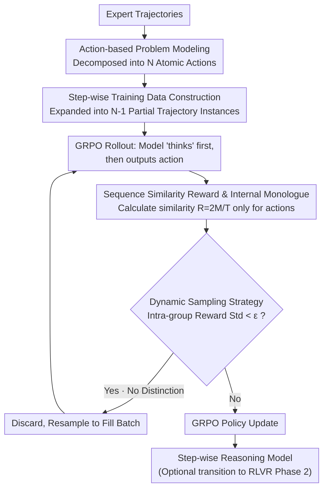

# Supervised Reinforcement Learning: From Expert Trajectories to Step-wise Reasoning

**Conference**: ICLR 2026  
**arXiv**: [2510.25992](https://arxiv.org/abs/2510.25992)  
**Code**: None  
**Area**: Code Intelligence  
**Keywords**: Reinforcement Learning, Supervised Learning, Step-wise Reasoning, Sequence Similarity Reward, Hard Problem Learning

## TL;DR

Ours proposes Supervised Reinforcement Learning (SRL), which reformulates problem solving as a step-wise action generation process. By utilizing dense reward signals based on sequence similarity, small models are enabled to learn difficult reasoning problems from expert trajectories that neither SFT nor RLVR could originally solve.

## Background & Motivation

Large Language Models (LLMs) face a fundamental dilemma in multi-step reasoning tasks:

**Limitations of RLVR**: Reinforcement Learning from Verifiable Rewards (e.g., GRPO) relies on the model's ability to sample correct solutions within limited rollouts. For small models (e.g., 7B), the pass@k on difficult problems is near zero, leading to extremely sparse reward signals from which the model cannot learn meaningful policies. Methods like DAPO mitigate this by filtering all-wrong or all-right samples, but they essentially abandon these hard problems.

**Limitations of SFT**: Supervised Fine-Tuning uses token-level imitation learning to force the model to replicate expert trajectories verbatim. For long and complex reasoning chains, this rigid imitation often leads to overfitting and shallow reasoning behaviors. Experiments show that direct SFT on the s1K dataset even leads to performance degradation (see Figure 1).

**Key Challenge**: Hard problems have limited data and complex reasoning chains, which SFT fails to learn; simultaneously, models cannot sample correct solutions, causing RLVR to fail. This is particularly prominent when training small open-source models.

The authors define such problems as $\mathcal{D}_{\text{hard}}$—the set of problems where the model success rate approaches zero within $k$ samples. The Goal of SRL is to provide effective learning signals in this difficult region.

## Method

### Overall Architecture

SRL reformulates "solving a hard problem" as a sequential decision-making process: it no longer requires the model to generate a complete solution in one go, nor does it force token-by-token replication of expert trajectories. Instead, the model generates one "action" (i.e., one reasoning step) at a time, using the sequence similarity between this action and the corresponding expert action as a dense reward. During training, each expert solution is decomposed into a sequence of step-wise actions and expanded into multiple training instances that "continue reasoning from an intermediate state." Finally, RL is performed under the GRPO framework using sequence similarity rewards. This ensures that even if the model fails to sample a complete correct solution, local similarities at each step provide a continuous stream of gradients.

### Key Designs

**1. Action-based Problem Modeling: Discretizing continuous reasoning into comparable atomic operations.** RLVR fails on hard problems because it relies on a single sparse signal—the final answer. To provide feedback during the process, reasoning must be "sliced." SRL decomposes the expert trajectory $\mathbf{y}$ into a sequence of action tuples $\mathbf{y} = \{\mathbf{y}_{\text{step}}^n\}_{n=1}^N$, where each $\mathbf{y}_{\text{step}}^n$ represents a logical action—an algebraic operation in mathematical reasoning or a terminal command in software engineering. This slicing is domain-agnostic and reduces the hard task of "learning the whole chain" into easier tasks of "learning each step," allowing the model to receive meaningful local feedback.

**2. Step-wise Training Data Construction: Expanding one expert solution into multiple training instances.** Hard problems are scarce, and direct SFT suffers from severe data insufficiency. SRL constructs $N-1$ partial trajectories from a complete $N$-step solution: when predicting step $k$, the input is the problem plus the first $k-1$ expert actions $\mathbf{x}_{\text{step}}^k = [\mathbf{x}, \mathbf{y}_{\text{step}}^1, \ldots, \mathbf{y}_{\text{step}}^{k-1}]$, and the goal is to predict the next action $\mathbf{y}_{\text{step}}^k$. This expansion increases the training sample size by nearly $N$ times and explicitly teaches the model "how to proceed from any intermediate state," covering various scenarios along the reasoning chain.

**3. Sequence Similarity Reward and Internal Monologue: Scoring at the action level while allowing freedom of thought.** The Core Problem is how to provide dense feedback without stifling the model's own reasoning style. SRL allows the model first to generate internal reasoning $\mathbf{y}'_{\text{think}}$ wrapped in `<think>` tags, then output the action $\mathbf{y}'^k_{\text{step}}$. The reward **only** compares the sequence similarity between the action part and the expert action, leaving the internal monologue completely unconstrained:

$$R(\mathbf{y}'^k_{\text{step}}, \mathbf{y}^k_{\text{step}}) = \frac{2M}{T}$$

Where $T$ is the total number of elements in both sequences and $M$ is the total number of elements in all non-overlapping matching blocks, implemented using Python's `difflib.SequenceMatcher`. If the format is invalid, a score of $-1$ is assigned. Because the comparison happens at the action level rather than the token level, the model can use any logic to reach the same step. Furthermore, since similarity is a continuous $r\in[0,1]$ rather than binary, distinguishable pros and cons exist even if all rollouts are not perfectly correct, thereby ensuring non-zero gradients.

**4. Dynamic Sampling Strategy: Spending computation on samples where there is still something to learn.** The advantage function of GRPO is defined by intra-group reward differences. If the rewards for a batch of rollouts are nearly identical, the advantage approaches zero, and the sample is wasted. SRL adopts and generalizes the filtering concept from DAPO (which only handles binary rewards) to continuous rewards: it filters out samples where the standard deviation of rollout rewards is below a threshold $\epsilon$. Sampling and filtering continue until the batch is full, avoiding wasted computation on samples that are either "already mastered" or "completely indistinguishable."

### Loss & Training

The overall optimization follows the GRPO objective combined with the sequence similarity rewards. Key hyperparameters include: batch size 512 (GRPO baseline uses 128 due to high filtering rates), learning rate 5e-7, 8 rollouts per problem, KL divergence coefficient 0 (no KL constraint), a maximum of 30 epochs, and selecting the best checkpoint based on the validation set. Training can be executed as a standalone SRL process or as a two-stage curriculum: SRL → RLVR—first establishing basic reasoning skills via fine-grained expert guidance, then allowing free exploration with final-answer rewards.

## Key Experimental Results

### Main Results

**Mathematical Reasoning** (Base Model: Qwen2.5-7B-Instruct, Training Data: s1K-1.1, 1000 hard problems)

| Method | AMC23 Avg@32 | AIME24 Avg@32 | AIME25 Avg@32 | Minerva Math | Average |
| :--- | :--- | :--- | :--- | :--- | :--- |
| Base Model | 49.3 | 10.5 | 7.5 | 34.9 | 24.6 |
| SFT (R1 reasoning) | 26.8 | 3.9 | 5.4 | 20.2 | 16.6 |
| RLVR (GRPO) | 52.0 | 11.1 | 7.4 | 33.8 | 24.5 |
| **SRL** | **51.5** | **13.2** | **7.1** | **36.4** | **27.6** |
| **SRL → RLVR** | **52.1** | **13.3** | **8.6** | **36.4** | **28.3** |

Key Findings: SFT performance drops significantly on hard data (-8 points); RLVR remains largely flat; SRL brings a significant Gain (+3.0%); SRL → RLVR achieves the strongest performance (+3.7%).

**Software Engineering** (Base Model: Qwen2.5-Coder-7B-Instruct, 5000 expert trajectories)

| Method | Oracle File Edit | End-to-End |
| :--- | :--- | :--- |
| Base Model | 5.8 | 3.2 |
| SWE-Gym-7B (SFT) | 8.4 | 4.2 |
| **SRL** | **14.8** | **8.6** |

SRL shows a 74% relative improvement over SWE-Gym-7B in the Oracle setting, with end-to-end performance doubling.

### Ablation Study

| Configuration | Avg Performance | Description |
| :--- | :--- | :--- |
| SRL w/o Dynamic Sampling | 24.7 | Filtering low-variance samples provides +2.9% |
| SRL w/ Dynamic Sampling | 27.6 | Confirms the importance of the filtering strategy |
| Outcome Reward (RLVR) | 24.5 | Sparse rewards have limited effect |
| Global Sequence Similarity (Single-step) | 25.9 | Some improvement but inferior to multi-step |
| Multi-step Sequence Similarity (SRL) | 27.6 | Fine-grained guidance is optimal |

### Key Findings

1.  **No significant increase in reasoning length**: The distribution of reasoning length for SRL-trained models is nearly identical to the base model, suggesting performance gains come from reasoning quality rather than more tokens.
2.  **Emergent interleaved reasoning patterns**: The SRL → RLVR model exhibits unique reasoning behaviors—(1) early planning, (2) dynamic adjustments during the process, and (3) reflective verification. These patterns are absent in traditional models.
3.  **Cross-domain generalization**: SRL is effective not only in mathematical reasoning but also in software engineering agent tasks, proving the framework's versatility.

## Highlights & Insights

1.  **Fills an important gap**: It finds an elegant intermediate solution between SFT overfitting and RLVR sparse rewards. Through step-wise decomposition and sequence similarity rewards, it preserves expert guidance while granting the model reasoning freedom.
2.  **Exquisite reward function design**: Calculating similarity only on actions and not constraining the internal thinking process allows the model to develop its own reasoning style. Using `difflib.SequenceMatcher` makes reward calculation both fast and stable.
3.  **Curriculum learning strategy**: The combination of SRL → RLVR treats SRL as a superior initialization method, establishing basic reasoning through fine-grained expert guidance before further optimization via free exploration.
4.  **High practicality**: It requires no training of an external reward model or complex process reward annotation, constructing training signals solely from existing SFT data.

## Limitations & Future Work

1.  **Dependency on structured expert trajectories**: SRL requires solution trajectories to have clear step boundaries (e.g., DeepSeek R1's numbered step format), which is not met by all data.
2.  **Student model requires basic instruction following**: If the base model cannot generate correctly formatted output at all, initial rollouts will fail to provide useful learning signals.
3.  **Sequence similarity reward may lack granularity**: String-matching-based similarity might fail to distinguish semantically equivalent but linguistically different mathematical steps.
4.  **No exploration of scale**: Experiments were only conducted on 7B models; the marginal utility of SRL on larger models remains unclear.
5.  **Extensibility to Process Reward Models (PRM)**: Integration with PRM could provide more semantic step-level rewards compared to sequence similarity.

## Related Work & Insights

*   **DeepSeek-R1** and **GRPO** are representative works of RLVR; SRL is built upon the optimization framework of GRPO.
*   Works like **s1K** and **LIMO** prove that a small amount of high-quality data can effectively distill reasoning capabilities; SRL goes further using the same data.
*   **SWE-Gym** and **SWE-Smith** provide SFT data for the software engineering domain; SRL significantly outperforms SFT baselines on the same data.
*   Insight: Balance "what to imitate" and "what to explore freely" by combining RL and imitation learning concepts.

## Rating

*   Novelty: ⭐⭐⭐⭐⭐ — An ingenious fusion of SFT and RLVR that fills a critical gap.
*   Experimental Thoroughness: ⭐⭐⭐⭐ — Verified across math and SWE domains with thorough ablations, though limited to 7B models.
*   Writing Quality: ⭐⭐⭐⭐⭐ — Clear motivation, precise methodology, and intuitive illustrations.
*   Value: ⭐⭐⭐⭐⭐ — Provides a practical new paradigm for training small models to handle hard problems.

<!-- RELATED:START -->

## Related Papers

- [\[NeurIPS 2025\] Contextual Integrity in LLMs via Reasoning and Reinforcement Learning](../../NeurIPS2025/llm_safety/contextual_integrity_in_llms_via_reasoning_and_reinforcement_learning.md)
- [\[ICLR 2026\] wd1: Weighted Policy Optimization for Reasoning in Diffusion Language Models](wd1_weighted_policy_optimization_for_reasoning_in_diffusion_language_models.md)
- [\[ICLR 2026\] PURGE: Reinforcement Unlearning via Group Relative Policy Optimization](reinforcement_unlearning_via_group_relative_policy_optimization.md)
- [\[ACL 2026\] Privacy-R1: Privacy-Aware Multi-LLM Agent Collaboration via Reinforcement Learning](../../ACL2026/llm_safety/privacy-r1_privacy-aware_multi-llm_agent_collaboration_via_reinforcement_learnin.md)
- [\[NeurIPS 2025\] Reverse Engineering Human Preferences with Reinforcement Learning](../../NeurIPS2025/llm_safety/reverse_engineering_human_preferences_with_reinforcement_learning.md)

<!-- RELATED:END -->
