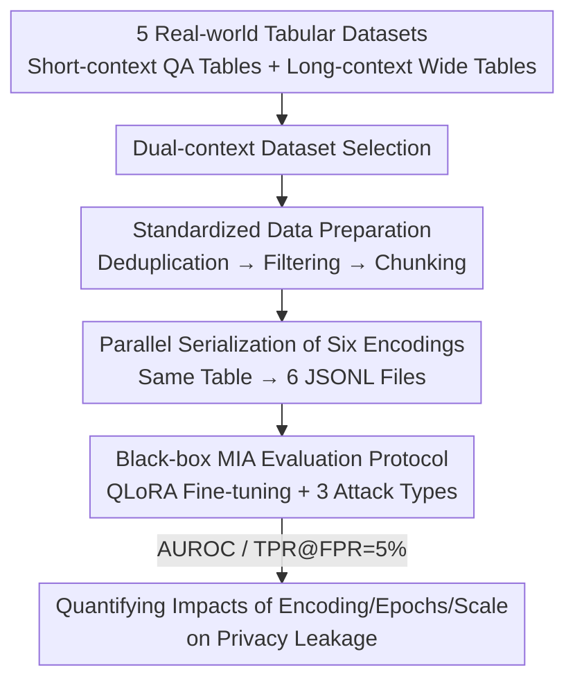

# Tab-MIA: A Benchmark Dataset for Membership Inference Attacks on Tabular Data in LLMs

**Conference**: ICLR 2026  
**OpenReview**: [https://openreview.net/forum?id=ioYdy7aghG](https://openreview.net/forum?id=ioYdy7aghG)  
**Area**: AI Security / LLM Privacy  
**Keywords**: Membership Inference Attack, Tabular Data, Memorization, Encoding Format, Privacy Leakage

## TL;DR
This paper proposes Tab-MIA, the first benchmark for Membership Inference Attacks (MIA) on Large Language Models (LLMs) fine-tuned on tabular data. By unifying 5 real-world tabular datasets and serializing them into 6 encoding formats, the study systematically evaluates how encoding formats, fine-tuning epochs, and model scales affect privacy leakage—finding that with only 3 epochs of fine-tuning, the maximum AUROC approaches 97.7%, and "flat-row" encodings like Line-Separated and Key-Value are the most vulnerable.

## Background & Motivation

**Background**: LLMs are increasingly being trained on tabular data (financial statements, electronic health records, census tables) for tasks such as table question answering, Text2SQL, and table generation. To feed 2D tables into Transformers, tables must first be "serialized" into text—common encodings include JSON, HTML, Markdown, Key-Value pairs, etc. Prior research has shown that encoding formats significantly impact task accuracy.

**Limitations of Prior Work**: Membership Inference Attacks (MIA) (judging whether a specific sample was in the training set) have been widely studied for LLMs, but almost all focus on **free text**—analyzing confidence scores at the sentence or paragraph level. The characteristics of tabular data are entirely different: short content, heterogeneous data types, skewed value distributions, and explicit column-level semantics. This leads to two critical gaps: ① A lack of an MIA benchmark for structured tables (existing BookMIA / WikiMIA / MIMIR only cover text; while MIDST involves tables, it targets diffusion model synthetic data rather than LLM fine-tuning memorization); ② A lack of systematic study on how "encoding format," a variable unique to tables, alters memorization and leakage risks.

**Key Challenge**: Tables are precisely where personally identifiable information (PII) and sensitive financial/medical fields are often stored. The structured "one row per entity" format makes it easier for models to memorize entire records verbatim. However, the way a table is serialized into text (encoding format) not only affects downstream performance but also changes token boundaries and redundancy, thereby implicitly amplifying or suppressing memorization—a privacy dimension that has been entirely overlooked.

**Goal**: To construct a controlled and realistic tabular MIA benchmark to answer four questions: How do encoding formats affect memorization and vulnerability? What is the impact of fine-tuning epochs? Is the attack still effective when the training encoding and attack encoding are inconsistent (cross-format generalization)? Have public pre-trained models already memorized public tables?

**Core Idea**: To apply "multi-encoding per table"—packaging 5 datasets × 6 encodings into a unified benchmark. By fine-tuning 4 open-source LLMs using QLoRA and then running 3 types of black-box MIA, this work quantifies the relationship between "Encoding Format ↔ Memorization ↔ Privacy Leakage" in a reproducible evaluation framework for the first time.

## Method

### Overall Architecture

Tab-MIA is essentially a pipeline for "**benchmark construction + attack evaluation**" rather than a new attack algorithm. On the construction side: 5 tabular datasets are selected from public sources (distinguishing between short-context and long-context), processed through standardized deduplication, filtering, and chunking, and then each table (or chunk) is simultaneously serialized into 6 encoding formats, all saved as JSONL. On the evaluation side: 4 open-source LLMs are fine-tuned under a specific encoding using QLoRA. Half of the tables are treated as members and the other half as non-members. Three black-box MIAs are applied, using AUROC and TPR@FPR=5% as metrics to quantify leakage. The design goal of the entire pipeline is to keep "everything controlled except for the studied variables (encoding/epochs/model)," thereby clearly attributing the sources of privacy risk.

### Key Designs

**1. Dual-context Dataset Selection: Covering Two Structural Forms of Tables**

Tabular data exists in two very different forms. To avoid biased conclusions, the benchmark deliberately selects a batch of each. **Short-context tables** come from table QA datasets—WikiTableQuestions (WTQ), WikiSQL, and TabFact. These were originally "question + supporting table" pairs; this work discards the question text and keeps only the unique tables to focus on memorization of the table itself. These tables originate from Wikipedia, have $\geq 5$ columns, are small in scale, and represent "short but complete" tables after serialization. **Long-context tables** come from wide tables commonly used in fairness/regression/privacy research—Adult (census income) and California Housing. These contain tens of thousands of rows and 10-15 feature columns; due to LLM context window limits, they must be chunked. After filtering, table sizes range from 1,030 to 17,900 entries, allowing the benchmark to test both whether "small and unique tables are memorized entirely" and "local memorization after chunking large tables." Experiments confirmed that leakage for short-context tables (WTQ) is significantly higher than for long-context tables (Adult).

**2. Parallel Serialization of Six Encodings: Treating "Encoding Format" as a Controlled Variable**

This is the core research variable of the paper. The same $3\times2$ table is simultaneously serialized into 6 texts with different structural abstractions: JSON, HTML, Markdown, Key-Value Pair (`Name: Alice | Age: 30`), Key-is-Value (`Name is Alice. Age is 30.`), and Line-Separated (CSV-style `Alice,30`). The key lies in **parallel encoding of the same content**—so when comparing, the only change is "how structure is presented to the tokenizer," while content, dataset, and hyperparameters remain fixed. Thus, any AUROC difference can be cleanly attributed to the encoding format. The underlying mechanism hypothesis is: flat-row encodings like Line-Separated / Key-Value produce long, continuous "content token streams" that align closely with tokenizer boundaries and concentrate learning pressure on individual cell values, leading to the strongest memorization. In contrast, HTML / JSON introduce "structural redundancy" through numerous tags and punctuation, dispersing the model's attention to non-content tokens, which dilutes memorization and typically results in an AUROC lower by about 10 points. This design directly transforms the "serialization strategy" from a performance tuning parameter into a quantifiable privacy knob.

**3. Standardized Data Preparation: Eliminating Spurious Memorization Signals via Deduplication, Filtering, and Chunking**

Without control, memorization signals can be artificially contaminated, so the preparation phase includes three hard constraints. **Deduplication**: Each table appears only once in the benchmark to prevent "repeated exposure of the same table" from artificially amplifying memorization (repeated samples are naturally easier to remember, which would overestimate attack success). **Length Filtering**: For short-context tables, any table exceeding 10,000 characters after Line-Separated serialization is removed to prevent oversized tables from dominating training dynamics or triggering truncation artifacts. **Chunking**: Long-context tables are divided into chunks of 20 rows each to fit context windows and maintain consistency between samples. These steps ensure that the "memorization difficulty" of each sample in the benchmark is comparable, and the AUROC reflects the actual memorization tendency of the encoding/model rather than side effects of data scale or repetition.

**4. Black-box MIA Evaluation Protocol: Unified Attack Sets + Dual Metrics + Member Splitting**

The evaluation side is also standardized into a fixed protocol. Fine-tuning uses QLoRA (4-bit quantized parameter-efficient fine-tuning) for a default of 3 epochs. In each training run, **half of the tables in the dataset are treated as members (included in training) and the other half as non-members (not included)**, forming the positive and negative samples for the attack. Three black-box, reference-free methods are used: LOSS/PPL (classified by negative log-likelihood thresholds), Min-K% (averaging the lowest $k\%$ token probabilities), and Min-K%++ (aggregating log probabilities after normalization to correct for length and calibration bias). Two complementary metrics are used: AUROC (overall separability across decision thresholds) and TPR@FPR=5% (true positive rate at a low false positive rate under strict privacy constraints). The unified protocol allows horizontal comparison of all results across 6 encodings, 4 models, and 1-3 epochs. Min-K%++ proved to be the strongest attack in almost all settings.

## Key Experimental Results

### Main Results

Four open-source models (LLaMA-3.1 8B, LLaMA-3.2 3B, Gemma-3 4B, Mistral 7B) were fine-tuned with QLoRA for 3 epochs. The table below shows the AUROC for different encoding formats (primarily Min-K%++, some taking the highest value across methods):

| Dataset | Most Vulnerable Encoding | Highest AUROC | Model |
|--------|------------|-----------|------|
| WTQ (Short Context) | Line-Separated | **97.7%** | Mistral 7B |
| California Housing (Long Context) | Key-Value Pair | **92.6%** | Mistral 7B |
| WikiSQL | Line-Separated | 88.9% (AUROC) / 40.2% (TPR@FPR=5%) | LLaMA-3.1 8B |

Comparison of encoding formats (California Housing, excerpt from Mistral 7B using Min-K%++): Key-Value Pair 92.6% > Line-Separated 86.8% > Markdown 80.0% > Key-is-Value 74.9% > JSON 54.5% ≈ HTML 50.6%. Flat-row encodings are about 30-40 points higher than HTML/JSON, confirming the "structural redundancy dilutes memorization" hypothesis.

### Ablation Study

Impact of fine-tuning epochs on vulnerability (Min-K%++ 20%, Line-Separated encoding, AUROC):

| Model | Dataset | 1 epoch | 2 epoch | 3 epoch |
|------|--------|---------|---------|---------|
| Mistral 7B | WTQ | 69.7 | 88.4 | **97.7** |
| LLaMA-3.1 8B | WTQ | 61.6 | 80.8 | **93.6** |
| LLaMA-3.1 8B | California | 59.0 | 72.8 | 87.8 |
| Gemma-3 4B | Adult | — | — | 67.7 |

Cross-format generalization (Gemma-3 4B / WTQ, Training Encoding ≠ Attack Encoding): AUROC is highest on the diagonal (where Training = Attack format), reaching 85.2% for Markdown→Markdown. If changed to Key-Value or Line-Separated attacks, it drops to 68.9% / 69.4%. The most "effective" detection encoding on the attack side is HTML (mean 76.0), while the most "memorable" on the training side is Line-Separated (mean 74.6).

### Key Findings
- **Encoding format is the largest privacy knob**: Flat Line-Separated / Key-Value Pair encodings yield the strongest memorization and are easiest to breach; HTML / JSON are the safest due to syntactic noise (10 to 30+ points lower)—providing a directly actionable recommendation for defenders: prioritize JSON/HTML serialization during training.
- **Epochs correlate strongly with leakage**: Across all models and datasets, AUROC increases monotonically with epochs. This is particularly sharp for short-context tables (WTQ exceeds 97% in just 3 epochs), while moderate for long-context tables (Adult reaches a peak of 71.5%).
- **Model scale affects leakage**: LLaMA-3.1 8B / Mistral 7B consistently show AUROC values 10-14 points higher than LLaMA-3.2 3B / Gemma-3 4B—the increased memory capacity that provides advantages in tabular reasoning also brings privacy trade-offs.
- **Pre-trained models already exhibit leakage**: Even without fine-tuning, public models show moderate memorization of WTQ (Wikipedia tables). LLaMA-3.1 8B with Key-Value Pair reaches 72.0%, suggesting these tables likely entered the pre-training corpus.

## Highlights & Insights
- **Controlled experimental design of "multi-encoding per table"**: By parallelly encoding the same table content into 6 formats, the work isolates the structural serialization as the sole variable. This allows the impact of encoding on memorization to be cleanly quantified for the first time—a methodology transferable to any study on how input representations affect model behavior.
- **Moving "serialization strategy" from performance to privacy**: While encoding choice was previously driven by task accuracy, this paper reveals the flip side—the structural redundancy that aids task understanding also dilutes memorization and reduces leakage, presenting a new "Accuracy vs. Privacy" trade-off axis.
- **Finding that cross-format attacks are partially effective is practical**: Even if the attacker does not know the exact training encoding, memorization signals often persist across formats (retaining ~69% AUROC), indicating that "keeping the encoding format secret" is not an effective defense in real-world deployments.

## Limitations & Future Work
- **Only reference-free black-box attacks were tested**: LOSS / Min-K% / Min-K%++ are all single-model confidence-based attacks. Stronger reference-based attacks (e.g., LiRA training shadow models) were not evaluated, meaning real-world risks might be underestimated.
- **Fine-tuning constraints**: Fine-tuning is limited to QLoRA 3 epochs and 4 models under 8B. Memorization behavior under larger models, full-parameter fine-tuning, or more epochs was not covered. Non-member samples in pre-training experiments were synthesized using GPT-4o mini; synthesis quality may affect absolute AUROC values.
- **Lack of active defenses**: The benchmark is positioned as a foundation for systematic evaluation. The effectiveness of specific defenses like Differential Privacy training, deduplication, or format selection remains for future work.
- **Data scope**: Data is sourced from Wikipedia and public census tables. Whether memorization and leakage patterns remain consistent in real-world PII (medical records, financial data) scenarios needs further validation.

## Related Work & Insights
- **vs. WikiMIA / BookMIA / MIMIR**: These are text-domain MIA benchmarks analyzing confidence at the sentence/paragraph level. Tab-MIA specializes in structured tables, where leakage occurs at the "token-level probability bound to column semantics," filling a gap in the tabular attack surface.
- **vs. MIDST**: MIDST evaluates membership inference for synthetic tabular data generated by diffusion models via denoising trajectories. This work targets memorization leakage in LLMs after fine-tuning on serialized tables; these are complementary rather than overlapping attack surfaces.
- **vs. TabLLM / SheetEncoder and other tabular serialization works**: These works optimize encoding for task accuracy and scalability while ignoring privacy. This paper reuses the "multi-encoding" approach but directs it toward the measurement of memorization and leakage.

## Rating
- Novelty: ⭐⭐⭐⭐ First LLM tabular MIA benchmark + First systematic quantification of "Encoding ↔ Memorization."
- Experimental Thoroughness: ⭐⭐⭐⭐ Comprehensive coverage of 4 models × 5 datasets × 6 encodings × 3 attacks × 1-3 epochs, but lacks reference-based strong attacks and defense validation.
- Writing Quality: ⭐⭐⭐⭐ Research questions structure the results well; the encoding mechanism is explained clearly.
- Value: ⭐⭐⭐⭐ Provides a reproducible evaluation foundation for privacy risks in training LLMs on tables, along with actionable encoding recommendations.

<!-- RELATED:START -->

## Related Papers

- [\[ICLR 2026\] Membership Inference Attacks Against Fine-tuned Diffusion Language Models (SAMA)](membership_inference_attacks_against_fine-tuned_diffusion_language_models.md)
- [\[ACL 2026\] Fast-MIA: Efficient and Scalable Membership Inference for LLMs](../../ACL2026/llm_safety/fast-mia_efficient_and_scalable_membership_inference_for_llms.md)
- [\[ICLR 2026\] Information-Theoretic Membership Inference for Granular Quantification of Memorization](information-theoretic_membership_inference_for_granular_quantification_of_memori.md)
- [\[ICLR 2026\] No Caption, No Problem: Caption-Free Membership Inference via Model-Fitted Embeddings](no_caption_no_problem_caption-free_membership_inference_via_model-fitted_embeddi.md)
- [\[ACL 2026\] Membership Inference Attacks on In-Context Learning Recommendation](../../ACL2026/llm_safety/membership_inference_attacks_on_llm-based_recommender_systems.md)

<!-- RELATED:END -->
