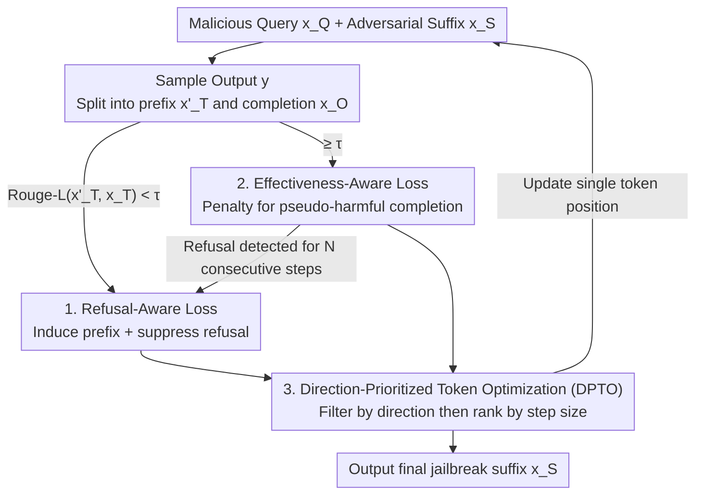

# TAO-Attack: Toward Advanced Optimization-based Jailbreak Attacks for Large Language Models

**Conference**: ICLR 2026  
**OpenReview**: [https://openreview.net/forum?id=XfbBiBG46D](https://openreview.net/forum?id=XfbBiBG46D)  
**Area**: Alignment and Security / LLM Jailbreak Attacks  
**Keywords**: Jailbreak Attacks, Optimization-based Attacks, GCG, Two-stage Loss, Direction-Prioritized

## TL;DR
Addressing three chronic issues in optimization-based jailbreak attacks (represented by GCG)—vulnerability to refusal responses, generation of "pseudo-harmful" content, and inefficient token updates—TAO-Attack employs a **two-stage loss function** (suppressing refusal first, then penalizing pseudo-harmfulness) combined with **Direction-Prioritized Token Optimization (DPTO)**. It achieves a 100% Attack Success Rate (ASR) on three aligned LLMs and significantly outperforms I-GCG with fewer iterations under stricter fixed-initialization settings.

## Background & Motivation
**Background**: Currently, "jailbreaking" LLMs—bypassing safety alignment to elicit harmful responses—involves three main approaches: manually crafted prompts (not scalable), automated prompt generation using an attack LLM (limited by the attacker model's capability), and **optimization-based attacks** (automatically optimizing an adversarial suffix using the target model's gradients/logits). Optimization-based methods are the primary research focus due to their high success rate and lack of human intervention. GCG is the most representative: it appends a suffix $x_S$ to a malicious query and optimizes suffix tokens by minimizing the negative log-likelihood of a "target harmful prefix" $x_T$ (e.g., "Sure, here is a script...").

**Limitations of Prior Work**: The authors decompose the problems of optimization-based methods into three categories. First, **refusal residue**: Even if GCG/MAC elicits the target prefix, the model often appends a disclaimer (e.g., "However, I must inform you that I cannot assist..."), resulting in a practical jailbreak failure. Second, **pseudo-harmful output**: I-GCG uses "self-harm-suggestive" templates (e.g., forcing the model to say "My output is harmful") to reduce refusal. However, forcing the model to admit harm contradicts its safety alignment goals, which can lower success rates; furthermore, even with a harmful prefix, the model might produce a "token" harmful response—such as naming a dangerous function but implementing it harmlessly—failing LLM-based toxicity evaluations. Third, **inefficient token updates**: GCG/MAC/I-GCG rank candidate tokens based solely on the **dot product** of the gradient and the token embedding difference. The dot product conflates "directional alignment" with "step size," potentially selecting tokens with large steps but misaligned directions, leading to unstable optimization.

**Key Challenge**: At the loss objective level, "inducing harmful prefixes" and "avoiding refusal/pseudo-harm" are conflicting goals that a single fixed template cannot resolve. At the candidate selection level, dot-product ranking cannot decouple "alignment" from "step size."

**Goal**: Design an optimization-based jailbreak framework that ensures genuine harmfulness and faster convergence.

**Core Idea**: Replace fixed template objectives with a **progressive two-stage loss** (Phase 1: suppress refusal; Phase 2: penalize pseudo-harmful continuations) and replace dot-product ranking with **DPTO**, which filters by direction first and then ranks by step size.

## Method

### Overall Architecture
TAO-Attack follows the general GCG paradigm—optimizing an adversarial suffix $x_S$ after a malicious query $x_Q$ to induce the target harmful prefix $x_T$—but renovates the "loss optimization" and "token selection" components. In each iteration, an output $y$ is sampled using the current suffix and split into a prefix $x'_T$ and a continuation $x_O$. Rouge-L measures the alignment between $x'_T$ and $x_T$: if not yet aligned ($\text{Rouge-L} < \tau$), the **Stage One: Refusal-Aware Loss** is used to push the model toward the harmful prefix while suppressing refusal. Once aligned ($\ge \tau$), it switches to **Stage Two: Effectiveness-Aware Loss** to penalize the current "pseudo-harmful" continuation, forcing the model toward a genuinely harmful path. If refusal is detected for $N$ consecutive steps in Stage Two, it reverts to Stage One. Token candidate selection is handled throughout by **DPTO**: it first uses cosine similarity to filter the top-$k$ tokens aligned with the negative gradient direction, then samples based on gradient projection step size.

### Key Designs

**1. Refusal-Aware Loss: Actively suppressing refusal continuations while inducing harmful prefixes**

Stage One addresses the "refusal residue" of GCG. Beyond maximizing the probability of the target prefix $x_T$, it explicitly penalizes potential refusal responses as negative samples. A set of refusal responses $R = \{r_1, \dots, r_K\}$ is collected by querying the model with malicious queries and random suffixes, then optimized **sequentially** (rather than simultaneously):

$$L_1^{(j)}(x_Q \oplus x_S) = -\log p(x_T \mid x_Q \oplus x_S) + \alpha \cdot \log p(r_j \mid x_Q \oplus x_S \oplus x_T)$$

where $\alpha > 0$ balances "increasing harmful prefix probability" and "suppressing refusal $r_j$." It optimizes starting from $r_1$ until convergence before moving to $r_2$, effectively handling multiple refusal signals without excessive overhead. Unlike I-GCG’s template engineering that forces the model to admit harm, this directly manipulates the refusal distribution. Ablations show that removing harmful guidance templates and adding Stage One alone can reach 100% ASR, proving that suppressing refusal is more effective than changing templates.

**2. Effectiveness-Aware Loss: Identifying and penalizing "harmful-looking but harmless" pseudo-harmful continuations**

Stage Two targets "pseudo-harmfulness." The challenge is that the attacker does not know the genuinely harmful answer in advance, making it impossible to directly maximize a "ground-truth" continuation. The authors' logic is inverse: if the correct answer is unknown, punish the observed, clearly incorrect continuation. The output is split into $x'_T \oplus x_O$ (where $x'_T$ matches the length of $x_T$). When $\text{Rouge-L}(x'_T, x_T) \ge \tau$ confirms the prefix is induced, the following is applied:

$$L_2(x_Q \oplus x_S) = -\log p(x_T \mid x_Q \oplus x_S) + \beta \cdot \log p(x_O \mid x_Q \oplus x_S \oplus x'_T)$$

where $\beta > 0$ controls the penalty on the continuation $x_O$. While reinforcing the harmful prefix, it suppresses the probability of the current benign/pseudo-harmful continuation, "driving" the optimization away from this trajectory toward potentially genuine harmful paths. Dynamic switching between the two stages ensures reliable prefix generation and genuinely harmful final output.

**3. Direction-Prioritized Token Optimization (DPTO): Decoupling and ranking "directional alignment" and "step size"**

This component addresses the flaws in dot-product ranking. The authors re-examine GCG using first-order Taylor expansion: ranking by $-g_{vi}$ is equivalent to finding a token that aligns the embedding displacement $(e_v - e_i)$ with the negative gradient direction—essentially steepest descent in discrete space. However, the dot product $-\nabla_{e_i}L^\top(e_v - e_i)$ is influenced by both direction and magnitude. A candidate with a large step but poor direction might outscore a well-aligned candidate with a smaller step, causing "large but skewed" updates. DPTO decouples these into two steps: **Step 1: Direction-Prioritized**, calculating the cosine similarity between the displacement and negative gradient $C_{i,v} = \frac{-g_i^\top \Delta e_{i,v}}{\|g_i\|\,\|\Delta e_{i,v}\|}$, retaining the top-$k$ highest similarities to ensure descent; **Step 2: Gradient Projection Step Size**, calculating the projection length along the negative gradient $S_{i,v} = -g_i^\top \Delta e_{i,v}$ among the aligned candidates. These are converted to probabilities via temperature softmax $P_{i,v} = \frac{\exp(S_{i,v}/\gamma)}{\sum_{v'}\exp(S_{i,v'}/\gamma)}$ for sampling, favoring large steps while preserving diversity. Ablations show DPTO improves ASR from 55% to 65% compared to GCG(Softmax) with fewer iterations and lower variance.

### Loss & Training
The overall optimization dynamically alternates between $L_1$ and $L_2$ (see Algorithm 1). Every step samples and splits the output: if the Rouge-L threshold is not met, $L_1$ is used (rotating refusal signals upon convergence on $r_j$); once met, $L_2$ is used. It reverts to $L_1$ if refusal is detected for $N$ consecutive steps in Stage Two. Only one token position is updated per step. Key hyperparameters: suffix length 20, batch size 256, top-k=256, $K=3$, $\tau=1.0$, $N=3$, $\alpha=\beta=0.2$, $\gamma=0.5$. It adopts the easy-to-hard initialization from I-GCG.

## Key Experimental Results

### Main Results
ASR was evaluated on AdvBench (subset from I-GCG) across three aligned models using a three-stage process: template matching, GPT-4 Turbo auto-judging, and manual verification.

| Dataset | Model | I-GCG | TAO-Attack |
|---------|-------|-------|------------|
| AdvBench | Vicuna-7B-v1.5 | 100% | 100% |
| AdvBench | Llama-2-7B-Chat | 100% | 100% |
| AdvBench | Mistral-7B-Instruct-0.2 | 100% | 100% |

Under standard settings, both I-GCG and TAO-Attack saturate at 100%. To differentiate, the authors designed a stricter **fixed initialization** evaluation (all queries start with "! ! ...", optimized independently for up to 1000 steps), removing the transfer initialization privilege to compare pure optimization efficiency:

| Model | Method | ASR | Avg. Iterations |
|-------|--------|-----|-----------------|
| Llama-2-7B-Chat | I-GCG | 68% | 604 |
| Llama-2-7B-Chat | TAO-Attack | **92%** | **305** |
| Mistral-7B-Instruct-0.2 | I-GCG | 80% | 406 |
| Mistral-7B-Instruct-0.2 | TAO-Attack | **100%** | **86** |
| Qwen2.5-7B-Instruct | I-GCG | 100% | 66 |
| Qwen2.5-7B-Instruct | TAO-Attack | 100% | **21** |

On Llama-2, ASR rose from 68% to 92% with halved iterations; on Mistral, it reached 100% in 86 steps (vs. 406 for I-GCG), proving the advantage stems from the optimization itself. Regarding transferability (optimizing on Vicuna-7B-1.5 and testing on closed models), TAO-Attack boosted ASR on GPT-3.5 Turbo from 30% to **82%**.

### Ablation Study
Fixed initialization, Llama-2-7B-Chat, 1000 steps/query:

| Configuration | ASR | Iterations | Description |
|---------------|-----|------------|-------------|
| GCG + Harmful Guidance Template | 55% | 702 | I-GCG style baseline |
| GCG(Softmax) + Harmful Guidance | 55% | 687 | Gains not from softmax sampling |
| DPTO + Harmful Guidance | 65% | 620 | Decoupling improves ASR/efficiency |
| Stage One + DPTO | 100% | 261 | Replacing templates with refusal loss |
| Stage One + Stage Two + DPTO (Full) | 100% | 243 | Stage Two further reduces iterations |

### Key Findings
- **Refusal-Aware Loss (Stage One) is the crux of success**: Replacing "harmful guidance templates" with Stage One refusal suppression jumped ASR from 65% to 100%, indicating that suppressing refusal is far more effective than forcing the model to admit harm.
- **DPTO governs efficiency**: Adding DPTO alone improves ASR (55%→65%) and reduces iterations; the loss curve drops faster with lower variance.
- **Effectiveness-Aware Loss (Stage Two) governs speed**: It reduces iterations from 261 to 243 while maintaining 100% ASR, acting to accelerate genuine convergence.
- **Rouge-L outperforms semantic embeddings for switching**: Compared to Qwen3-Embedding-0.6B, Rouge-L thresholds consistently yield higher ASR and fewer iterations.

## Highlights & Insights
- **"Punish wrong answers when correct ones are unknown" inverse supervision**: Stage Two bypasses the impossibility of obtaining ground-truth harmful continuations by penalizing observed pseudo-harmful outputs, effectively steering the optimization away from bad trajectories.
- **Taylor expansion analysis of GCG**: The authors prove dot-product ranking is equivalent to discrete steepest descent and highlight the coupling of direction and step size. DPTO's decoupling is thus theoretically grounded.
- **Transferable Trick**: The "filter top-k by cosine direction, sample by projection step" decoupling can be applied to any GCG-style discrete gradient search for adversarial optimization.

## Limitations & Future Work
- **Weak transfer to closed-source models**: Aside from GPT-3.5 Turbo, ASR on GPT-4 Turbo / Gemini 1.5 remain in the single digits, showing white-box universal suffixes struggle against highly aligned closed models.
- **Dependency on target model gradients/logits**: As an optimization-based attack, it is inherently white-box, relying on transferability for black-box API models.
- **Evaluation scale**: The study uses an AdvBench subset and small ablation query sets (20 queries), which may have limited coverage.
- **Dual-use nature**: While intended to reveal vulnerabilities for robust defense, these techniques could be misused. Future work could explore using the "pseudo-harmful detection" from the two-stage loss for defensive filtering.

## Related Work & Insights
- **vs. GCG / MAC**: These use fixed template objectives + dot-product ranking, leading to refusal residue and unstable updates. TAO-Attack replaces the fixed objective with a two-stage loss and dot-product with DPTO.
- **vs. I-GCG**: I-GCG uses "self-harm-suggestive" templates. TAO-Attack avoids template engineering and directly optimizes based on refusal distributions and pseudo-harmful output, significantly outperforming I-GCG on Llama-2 (92% vs 68% ASR).
- **vs. LLM-based attacks (PAIR / TAP / AdvPrompter)**: Those depend on the capability of the attacker LLM. TAO-Attack uses direct gradient optimization, typically yielding higher and more stable success rates on aligned models.

## Rating
- Novelty: ⭐⭐⭐⭐ The two-stage loss (especially the inverse supervision) and the decoupling in DPTO are substantive improvements over GCG.
- Experimental Thoroughness: ⭐⭐⭐⭐ Comprehensive evaluation including fixed initialization and transfer, though the dataset scale is relatively small.
- Writing Quality: ⭐⭐⭐⭐ Clear logic connecting pain points to designs; excellent theoretical motivation via Taylor expansion.
- Value: ⭐⭐⭐⭐ High relevance for red teaming and alignment research, revealing critical refusal and pseudo-harm failure modes.

<!-- RELATED:START -->

## Related Papers

- [\[ICLR 2026\] GeneBreaker: Jailbreak Attacks Against DNA Language Models with Pathogenicity Guidance](genebreaker_jailbreak_attacks_against_dna_language_models_with_pathogenicity_gui.md)
- [\[ICLR 2026\] STAR: Strategy-driven Automatic Jailbreak Red-teaming for Large Language Model](star_strategy-driven_automatic_jailbreak_red-teaming_for_large_language_model.md)
- [\[ICLR 2026\] Sampling-aware Adversarial Attacks against Large Language Models](sampling-aware_adversarial_attacks_against_large_language_models.md)
- [\[ICLR 2026\] VEAttack: Downstream-Agnostic Vision Encoder Attack Against Large Vision Language Models](veattack_downstream-agnostic_vision_encoder_attack_against_large_vision_language.md)
- [\[ACL 2026\] Jailbreaking Large Language Models with Morality Attacks](../../ACL2026/llm_safety/jailbreaking_large_language_models_with_morality_attacks.md)

<!-- RELATED:END -->
