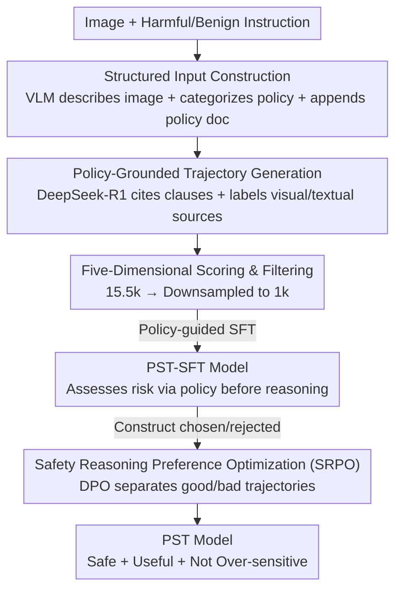

# Teach to Reason Safely: Policy-Guided Safety Tuning for MLRMs

**Conference**: ICLR 2026  
**OpenReview**: [https://openreview.net/forum?id=cgy4i74Dq7](https://openreview.net/forum?id=cgy4i74Dq7)  
**Area**: Multimodal Safety Alignment / LLM Safety  
**Keywords**: Multimodal Large Reasoning Models, Safety Alignment, Policy Guidance, Preference Optimization, Visual Attention Drift

## TL;DR
This paper identifies a counter-intuitive trade-off where "stronger reasoning capability leads to poorer safety," attributed to two mechanisms: visual attention drift and unsafe reasoning patterns. It proposes a two-stage alignment framework, PST (Policy-guided SFT + Safety Reasoning Preference Optimization), which embeds explicit safety policies into the reasoning chain. PST reduces the harmful rate to single digits across multiple multimodal safety benchmarks while maintaining general reasoning performance.

## Background & Motivation

**Background**: Multimodal Large Reasoning Models (MLRMs, such as R1-Onevision, LLaVA-CoT) achieve strong performance on joint vision-text tasks through multi-step Chain-of-Thought (CoT). "System 2 thinking" has become a standard approach for capability enhancement.

**Limitations of Prior Work**: Based on a large-scale safety evaluation, the authors discovered a counter-intuitive phenomenon: **models subjected to reasoning fine-tuning become less safe**. Figures 1 and 2 show that across different architectures and benchmarks, variants with explicit CoT systematically exhibit higher Harmful Rates (HR) than their base models; R1-Onevision reaches an HR of 78.61% on BeaverTails-V, and LLaMA-CoT reaches 83.87%. This suggests that gains in reasoning capability come at the cost of safety degradation.

**Key Challenge**: Why does "knowing how to reason" make a model "more dangerous"? The authors decompose this degradation into two mechanisms. The first is **visual attention drift** (VAD): reasoning fine-tuning makes models rely more on linguistic priors and look at images less (Figure 3 shows reasoning models assign significantly lower attention weights to visual tokens in deeper layers), leading them to take "textual shortcuts" and ignore critical risk cues in images. The second is **unsafe reasoning patterns**, further divided into: **flawed reasoning initiation** (FRI, where models rationalize harmful instructions as "hypothetical scenarios" or fall into task-driven cognitive tunnels to complete sub-tasks) and **CoT safety attenuation** (CSA, where safety constraints are gradually eroded as the reasoning chain unfolds, allowing small deviations to accumulate into safety violations).

**Goal**: Current safety datasets mostly consist of "refusal templates," teaching models **what to refuse** rather than **how to reason safely**. While SFT on such data can lower HR, it leads to over-sensitivity: models refuse benign or complex technical queries (e.g., misinterpreting "how to kill the code" as a dangerous instruction), causing significant degradation in general reasoning.

**Core Idea**: Shift from "teaching what to refuse" to "teaching how to reason safely" by embedding explicit, structured safety policies directly into the reasoning process and maintaining policy compliance throughout the reasoning chain via preference optimization.

## Method

### Overall Architecture

PST (Policy-guided Safety Tuning) is a **two-stage alignment framework** specifically designed to address the three failure modes: VAD, FRI, and CSA. It constructs a structured input by concatenating the image, instruction, policy category, and policy document. A strong reasoning model is used to generate policy-grounded reasoning trajectories that cite specific safety clauses and label whether each judgment stems from vision or text. After filtering 1k high-quality samples for SFT (addressing FRI + VAD), DPO-based preference optimization is performed using chosen/rejected pairs (addressing CSA) to ensure policy compliance without excessive conservatism.

### Key Designs

**1. Normalized Safety Policy Framework: From "Intuitive Refusal" to "Clause-based Risk Assessment"**

Traditional safety alignment relies on **implicitly** inferred safety standards from large-scale annotated data, leading to inconsistent reasoning and poor generalization. This paper systematically reviews safety policies from major models (Llama, Gemini, Claude, OpenAI) and organizes them into a normalized framework with $N=20$ categories. Each category is formalized as a structured policy document $P_k=(G_k, D_k, R_k)$: $G_k$ is the core principle, $D_k$ enumerates prohibited behaviors and boundary cases, and $R_k$ provides actionable rules. This sets hard boundaries for "legitimate use," preventing models from bypassing rules by reinterpreting harmful instructions. Crucially, it requires models to perform risk assessment and policy checks **before** task execution—a direct antidote to FRI.

**2. Multimodal Structured Input + Policy-Grounded Trajectories: Forcing Vision and Clause Citation**

To ensure reasoning is "grounded" in visual evidence and specific clauses, for an image-instruction pair from BeaverTails-V, a strong VLM (GPT-4o) first generates a detailed description $d = \text{VLM}_{describe}(v)$. This is combined with the instruction $i$ and categorized into a policy $c_k$ to form the structured input $x = (i, d, c_k, P_k)$. A reasoning model (DeepSeek-R1) then generates a policy-grounded trajectory $(z, a) \sim M_{gen}(x)$ under a **strong constraint**: the reasoning must explicitly cite relevant policy clauses and label whether judgments come from visual cues, textual context, or their interaction. This requirement to clarify the modal source of each judgment forces the model to re-examine the image, mitigating VAD at a mechanistic level.

**3. Safety Reasoning Preference Optimization (SRPO): Suppressing "Safety Attenuation" Without Conservatism**

SFT provides the initial safety awareness, but SFT-only models are often overly conservative. SRPO employs preference learning using three priority principles: **Safety First** (violating $P_k$ results in rejection), **Utility Maximization** (safe responses prioritize informativeness), and **Reasoning Quality** (favoring coherent, policy-guided trajectories). Chosen samples $y_w$ are drawn from high-quality candidates; rejected samples $y_l$ are generated via: (1) **Contrastive failure mining**, taking the worst candidate among several VLMs, and (2) **Post-hoc adversarial reasoning generation**, where DeepSeek-R1 is tasked to back-propagate a "logically consistent but safety-attenuated" reasoning path for a bad conclusion. The final dataset $D_{SRPO} = \{(x, y_w, y_l)\}_{i=1}^M$ is optimized using the DPO loss:

$$L_{SRPO}(\pi_\theta, \pi_{ref}) = -\mathbb{E}_{(x,y_w,y_l)\sim D_{SRPO}}\Big[\log \sigma\big(\beta \log \tfrac{\pi_\theta(y_w \mid x)}{\pi_{ref}(y_w \mid x)} - \beta \log \tfrac{\pi_\theta(y_l \mid x)}{\pi_{ref}(y_l \mid x)}\big)\Big]$$

By separating "safe and useful" trajectories from "seemingly reasonable but safety-attenuated" ones, the model learns to maintain policy compliance throughout long reasoning chains.

### Loss & Training

The training is sequential: first, $L_{SFT}$ is applied to 1k policy-grounded samples to establish an interpretable safety reasoning base, followed by $L_{SRPO}$. The base models are R1-Onevision and LLaVA-CoT. Notably, SFT uses only 1k samples, as ablations show diminishing returns beyond this volume.

## Key Experimental Results

### Main Results

Safety alignment evaluation (HR↓ denotes harmful rate, RR↓ denotes refusal rate for benign queries), using R1-Onevision as the base:

| Method | BeaverTails-V (HR↓) | MM-SafetyBench (HR↓) | SPA-VL (HR↓) | SIUO (HR↓) | MMSafetyAware (RR↓) |
|------|------|------|------|------|------|
| R1-Onevision (Unaligned) | 78.61 | 30.89 | 52.83 | 83.83 | 78.97 |
| + Think-in-Safety | 14.77 | 19.70 | 3.02 | 22.75 | 88.55 |
| + MSR-Align | 11.71 | 3.99 | 6.79 | 8.38 | 86.45 |
| + PST-SFT | 10.70 | 5.48 | 3.40 | 10.18 | 81.30 |
| **+ PST (Full)** | **9.00** | **2.68** | **3.02** | 12.57 | **69.39** |

PST reduces the HR of R1-Onevision on BeaverTails-V from 78.61% to 9.00%, while also reducing the RR to 69.39% (significantly lower than Think-in-Safety's 88.55%), demonstrating that its safety does not come from "refusing everything."

In the safety-utility trade-off measured by Win Rate (WR↑, judged by GPT-4o), PST outperforms baselines on both Helpfulness (Help) and Harmlessness (Harm). For example, R1-Onevision+PST achieves 77.07/83.19 Help/Harm on BeaverTails-V, consistently exceeding MSR-Align and Think-in-Safety.

General capability benchmarks show that PST maintains or even improves performance: R1-Onevision+PST reaches 80.87% on VQAv2 and 55.20% on GQA, both higher than the unaligned base. In contrast, baselines typically drop by 5–10 points.

### Ablation Study

| Configuration | Key Finding | Description |
|------|---------|------|
| SFT Sample Size 1k→4k | Safety remains nearly constant | 1k high-quality samples are sufficient; marginal gains from more data |
| Failure Mode Counts (VAD/FRI/CSA) | All three modes dropped significantly | Direct validation of mechanistic effectiveness |

Failure counts (Table 5, R1-Onevision on BeaverTails-V): VAD dropped from 57 to 19, FRI from 331 to 27, and CSA from 88 to 30. This confirms that PST precisely targets the diagnosed failure mechanisms.

### Key Findings
- **Capability $\neq$ Safety**: Reasoning fine-tuning systematically amplifies potential safety vulnerabilities. This is the most central observation, quantified via three mechanisms.
- **Quality > Quantity**: 1k carefully selected, policy-grounded samples are sufficient; adding more data provides little benefit for safety.
- **Mechanism-level Validation**: Table 5 uses specific failure counts to prove that each design component addresses its intended failure mode.

## Highlights & Insights
- **Diagnosis-driven Design**: The authors first decompose "why reasoning becomes unsafe" into three countable mechanisms and map each PST component to one—making the "attribution then prescription" paradigm more credible than simple data scaling.
- **"How to Reason Safely" vs. "What to Refuse"**: Upgrading targets from refusal templates to policy-grounded reasoning is a valuable perspective transferable to text-only LLMs and agent tool-calling.
- **Post-hoc Adversarial Reasoning for Negative Samples**: Back-calculating a logically consistent but safety-attenuated reasoning chain for a bad conclusion is a clever trick to create high-quality negative samples for CSA.
- **Mandatory Modality Labeling**: Forcing the model to state "this judgment comes from the image" or "from text" is a low-cost, practical way to drag visual attention back and counter VAD.

## Limitations & Future Work
- **Dependence on Strong External Models**: The pipeline heavily relies on GPT-4o and DeepSeek-R1 for descriptions, trajectories, and scoring, raising concerns about reproduction costs and biases.
- **Policy Framework Coverage**: The 20 categories were manually compiled from existing vendors; coverage of emerging risks or cultural differences is not explored.
- **Reliability of Metrics**: Evaluations rely on HR/WR judged by LLMs; the robustness of PST under stronger adversarial jailbreaking attacks lacks dedicated stress testing.
- **Limited Base Models**: Only R1-Onevision and LLaVA-CoT were used; stability across larger or diverse architectures remains to be seen.

## Related Work & Insights
- **vs. MSR-Align**: While both use policy-driven data, MSR-Align learns shallow heuristics (e.g., refusing whenever "kill" is seen), leading to over-sensitivity. PST maintains utility via policy-grounding and preference optimization.
- **vs. Think-in-Safety**: Think-in-Safety uses step-by-step self-checking but shows severe over-sensitivity and capability degradation in these experiments; PST's SRPO stage specifically suppresses over-conservatism.

## Rating
- Novelty: ⭐⭐⭐⭐⭐ Attributes the "reasoning vs. safety" trade-off to three named mechanisms and provides targeted solutions; first policy-guided multimodal safety reasoning preference dataset.
- Experimental Thoroughness: ⭐⭐⭐⭐ Extensive coverage across safety and general benchmarks; however, limited to two base models and lacks adversarial pressure testing.
- Writing Quality: ⭐⭐⭐⭐⭐ Very clear narrative; design components correspond 1:1 with diagnosed mechanisms.
- Value: ⭐⭐⭐⭐⭐ The paradigm shift from "teaching refusal" to "teaching safe reasoning" is highly instructive for multimodal safety alignment.

<!-- RELATED:START -->

## Related Papers

- [\[ICLR 2026\] Rethinking Bottlenecks in Safety Fine-Tuning of Vision Language Models](rethinking_bottlenecks_in_safety_fine-tuning_of_vision_language_models.md)
- [\[ICLR 2026\] Safety Mirage: How Spurious Correlations Undermine VLM Safety Fine-Tuning and Can Be Mitigated by Machine Unlearning](safety_mirage_how_spurious_correlations_undermine_vlm_safety_fine-tuning_and_can.md)
- [\[ICLR 2026\] All Code, No Thought: Language Models Struggle to Reason in Ciphered Language](all_code_no_thought_language_models_struggle_to_reason_in_ciphered_language.md)
- [\[ICLR 2026\] PURGE: Reinforcement Unlearning via Group Relative Policy Optimization](reinforcement_unlearning_via_group_relative_policy_optimization.md)
- [\[ICLR 2026\] SecP-Tuning: Efficient Privacy-Preserving Prompt Tuning for Large Language Models via MPC](secp-tuning_efficient_privacy-preserving_prompt_tuning_for_large_language_mode.md)

<!-- RELATED:END -->
