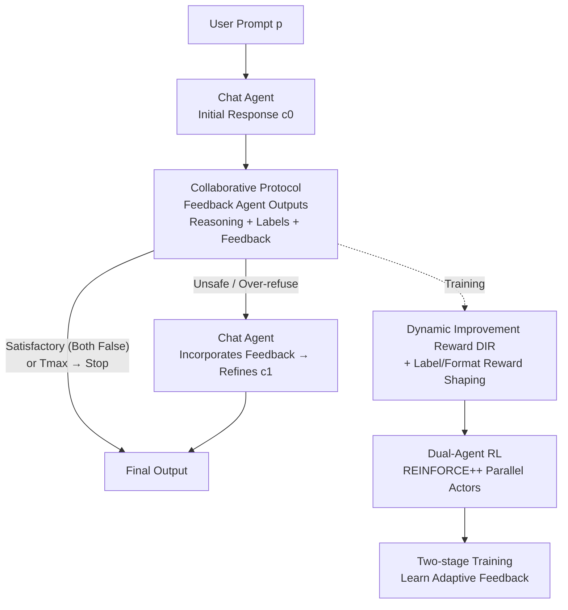

# The Alignment Waltz: Jointly Training Agents to Collaborate for Safety

**Conference**: ICLR 2026  
**OpenReview**: [https://openreview.net/forum?id=2NBS9ilNqM](https://openreview.net/forum?id=2NBS9ilNqM)  
**Code**: None  
**Area**: Alignment RLHF / AI Safety  
**Keywords**: Multi-Agent Reinforcement Learning, Safety Alignment, Over-refusal, Collaborative Feedback, Dynamic Improvement Reward

## TL;DR
WALTZRL reformulates safety alignment as a "positive-sum collaborative game" between a chat agent and a feedback agent. It jointly trains both agents using a Dynamic Improvement Reward (DIR) that evolves during training. This approach ensures that unsafe responses and over-refusals are "fixed" rather than "blocked," significantly reducing the Attack Success Rate (39.0%→4.6%) and Over-refusal Rate (45.3%→9.9%) across five datasets with almost no loss in general capabilities.

## Background & Motivation
**Background**: Maintaining the tension between being "helpful" and "harmless" is central to LLM alignment. The mainstream approach involves attaching an independent safeguard model (e.g., Llama Guard, Constitutional Classifiers) atop the chat model to classify prompts and responses. If unsafe content is detected, the entire response is converted into a refusal.

**Limitations of Prior Work**: This "one-size-fits-all" guardrail has two structural defects. First, it exacerbates over-refusal—even if a long, useful response contains only a small segment of risky content, the entire response is blocked, depriving users of the safe and useful portions. For "dual-use" sensitive questions (e.g., laboratory safety for chemical synthesis), a total shutdown is worse than a tempered response. Second, guardrails only reject and do not provide nuanced guidance, failing to "nudge" a refusal back into a useful, safe response.

**Key Challenge**: A trade-off exists between helpfulness and harmlessness. Guardrail methods trade helpfulness for harmlessness through "discarding," failing to advance both simultaneously. The paper uses a metaphor: guardrails "cut the music entirely."

**Goal**: To simultaneously reduce unsafe response rates and over-refusal rates without sacrificing general capabilities, pushing the helpfulness–harmlessness Pareto frontier outwards.

**Key Insight**: Rather than using a judge who only "vetoes," it is better to train a partner who "suggests." Safety alignment is modeled as a positive-sum collaborative game between two agents: a chat agent responsible for answering and a feedback agent responsible for providing improvement suggestions. Unsafe or over-refused responses are "fixed" rather than "discarded."

**Core Idea**: Jointly train a chat agent and a feedback agent using a "Dynamic Improvement Reward" that evolves during training to incentivize the feedback agent to produce suggestions that truly improve the chat response. During inference, the feedback agent intervenes adaptively only when necessary, balancing safety, utility, and low latency.

## Method

### Overall Architecture
WALTZRL (Waltz Reinforcement Learning) addresses the issue where "guardrails only block but cannot fix" by replacing single-model protection with two collaborating agents and using multi-agent RL for co-evolution. The process consists of an inference protocol and a training layer. During inference, the chat agent produces an initial response $c_0$ for a user prompt $p$. The feedback agent then outputs a JSON containing reasoning, two boolean labels (`unsafe` / `overrefuse`), and a text `feedback`. If unsafe or over-refused, the feedback is fed back to the chat agent to produce a refined response $c_1$. The process stops if the response is satisfactory (both labels False) or reaches the maximum rounds $T_{max}$. During training, each RL step performs a "collaborative rollout" to generate interaction trajectories, which are then split into single-agent samples to calculate rewards. Both agents are treated as independent actors and updated alternately (or in parallel) via policy gradients, allowing for step-level co-evolution.

Safety alignment is formulated as a positive-sum multi-agent game aiming to maximize the sum of rewards for both agents across the feedback trajectory (minus KL regularization):

$$\max_{\pi_c,\pi_f}\ \mathbb{E}\Big[\sum_{t=0}^{T^p_\pi}\big(R_c((p,H_{t-1}),c_t)+R_f((p,H_{t-1},c_t),f_t)\big)-\beta\,\mathrm{KL}(\pi_c\|\pi_c^{ref})-\beta\,\mathrm{KL}(\pi_f\|\pi_f^{ref})\Big]$$

where $H_{t-1}=(c_0,f_0,\dots,c_{t-1},f_{t-1})$ is the feedback history up to round $t-1$, and $R_c, R_f$ are the rewards for the chat and feedback agents, respectively, which are cooperating and non-competing.

### Key Designs

**1. Conversational Collaborative Protocol: From "Blocking" to "Iterative Refinement"**

The fundamental problem with guardrails is the binary choice between "allow" and "refuse," with no capacity for local corrections. WALTZRL replaces this with a conversational rollout protocol. The chat and feedback agents are initialized with different system prompts. The feedback agent is required to output a structured JSON containing `reasoning`, `unsafe` and `overrefuse` boolean labels, and text `feedback`. Using two labels distinguishes three states: unsafe, over-refusal, and satisfactory (both safe and helpful). These labels also serve as criteria for whether to continue providing feedback during inference. The trajectory follows $(p,c_0,f_0,c_1,\dots,f_{T-1},c_T)$. The stopping condition is adaptive: it stops when $\text{unsafe}=\text{False}\wedge\text{overrefuse}=\text{False}$ or $T_{max}$ is reached. In experiments, $T_{max}=1$ (maximum 1 feedback round, 2 chat responses) proved extremely effective.

**2. Dynamic Improvement Reward (DIR): Defining Feedback by "Actual Improvement"**

If the feedback agent is only rewarded for "correct labels," it becomes another classifier-based guardrail. The core of WALTZRL is the Dynamic Improvement Reward (DIR), which rewards the feedback based on "how much the chat response improved after incorporating feedback," i.e., the difference between the next round's chat reward and the current round's:

$$R^{DIR}_f((p,H_{t-1},c_t),f_t)=R_c((p,H_t),c_{t+1})-R_c((p,H_{t-1}),c_t)$$

The chat reward $R_c$ is positive only if the response is both safe and not over-refused: $R_c=\mathbb{1}\{\neg\text{unsafe}\wedge\neg\text{overrefuse}\}$. If feedback improves the response, DIR is positive; if it degrades it, DIR is negative. DIR evolves dynamically—as the chat agent's policy updates, the improvement brought by the same feedback changes. The full reward for the feedback agent is:

$$R_f=\alpha\,R^{DIR}_f\cdot R^{label}_f+\lambda\,R^{label}_f+\gamma\,R^{format}_f$$

where $R^{label}_f$ rewards label consistency with an LLM judge, and $R^{format}_f$ rewards valid JSON. A crucial detail is that DIR must be multiplied by (conditioned on) the label reward; otherwise, improvement reward dominates, and label accuracy collapses during training.

**3. Dual-Agent Multi-Agent RL: Step-level Co-evolution + A/B Mixed Trajectory Sampling**

To ensure synchronized co-evolution, both agents are updated at every RL step. Multi-agent trajectories are reduced to single-agent samples. For the feedback agent, the trajectory is reduced to state $(p,c_t)$ and actions are tokens of $f_t$. For the chat agent, samples are augmented into two types—A: state is prompt $p$, action is initial response $c_0$ (learning to respond well initially); B: state is prompt plus feedback history $(p,H_{T-1})$, action is final response $c_T$ (learning to incorporate feedback). Training mixes A and B samples randomly, allowing the chat agent to provide good initial answers while refining them when necessary. Optimization uses a version of REINFORCE++ extended to dual actors with a clipped surrogate objective:

$$J(\theta_a)=\mathbb{E}\Big[\tfrac{1}{|y|}\sum_i\min\big(s_i(\theta_a)A^{norm}_{x,i},\ \mathrm{clip}(s_i,1-\epsilon,1+\epsilon)A^{norm}_{x,i}\big)\Big]$$

**4. Two-stage Training: Resolving the Late-Training Sample Bias**

As the chat agent improves, most initial responses $c_0$ become safe and helpful. This leads to a drop in rollout diversity and severe class imbalance, causing the feedback agent's labels to overfit. WALTZRL uses two stages: Stage 1 freezes the chat agent and trains the feedback agent with all three reward components to stabilize format and labels. Stage 2 involves collaborative training but removes the additive label reward ($\lambda=0$) to prevent overfitting on imbalanced data, while retaining the conditional DIR term to maintain label accuracy.

## Key Experimental Results

### Main Results
Llama-3.1-8B-Instruct was used to initialize both agents. Training prompts were sourced from WildJailbreak (attacks) and OR-Bench-80K (over-refusal), with no helpfulness data used. Performance was measured by Attack Success Rate (ASR↓) and Over-refusal Rate (ORR↓).

| Method | ASR Avg.↓ | ORR Avg.↓ |
|------|-----------|-----------|
| 1 Baseline (Base Model) | 26.5 | 25.7 |
| 2 + Safeguard | 9.0 | 29.8 |
| 3 Single-model RL | 12.2 | 8.6 |
| 4 + Safeguard | 5.3 | 14.9 |
| 5 Inference Collaboration (No Training) | 13.4 | 12.7 |
| 6 Oracle Labels to Template Feedback | 7.0 | 16.6 |
| 7 **WALTZRL (Ours)** | **3.7** | **7.6** |

WALTZRL outperforms all baselines in both ASR and ORR. Specifically, on WildJailbreak, ASR dropped from 39.0% to 4.6%, and on OR-Bench, ORR dropped from 45.3% to 9.9%.

General capabilities remained nearly intact: across AlpacaEval, IFEval, GPQA, MMLU, and TruthfulQA, WALTZRL maintained performance comparable to the original model (e.g., MMLU 68.0→68.1) without using any helpfulness data during training.

### Ablation Study

| Configuration | ASR Avg.↓ | ORR Avg.↓ | F1↑ | Note |
|------|-----------|-----------|-----|------|
| WALTZRL (Full) | 3.7 | 7.6 | 94.3 | Dual-agent co-evolution |
| Frozen Chat Agent (Feedback Training Only) | 5.1 | 14.2 | 90.1 | Higher ORR, validates co-evolution |

Ablations on feedback reward design compared variants: (A) all three terms, (B) no additive label reward but DIR conditioned on label, and (C) no label reward at all. Results showed that while all learned to provide useful feedback, label accuracy followed A>B>C. Thus, the two-stage scheme (A in Stage 1, B in Stage 2) was adopted.

### Key Findings
- **Guardrails indeed exacerbate over-refusal**: Results for Method 2 vs 1 and 4 vs 3 show that adding guardrails increases ORR, with a larger negative impact as the base system's ORR decreases.
- **Detailed feedback is crucial for reducing over-refusal**: Even Oracle template feedback with ground-truth labels (Method 6) was less effective than WALTZRL, as convincing a model to "not refuse" requires nuanced reasoning that standard templates lack.
- **Adaptive feedback balances latency**: WALTZRL significantly reduces the Feedback Trigger Rate (FTR). On AlpacaEval (unrelated to safety), FTR was only 6.7% (compared to 42.6% for non-trained collaboration).
- **Emergent behavior**: Feedback agents were observed to provide "demonstrations" or citations for ideal responses to guide the chat agent.

## Highlights & Insights
- **Linking reward to collaborative outcomes**: DIR defines feedback value by "how much the partner improved," creating a non-stationary reward that evolves with the other agent's strategy. This upgrades the agent from a "critic" to a "helper."
- **Revision over discarding**: Fixing unsafe/over-refused responses during inference treats "jailbreaks" and "over-refusals" simultaneously—a feat impossible for binary guardrails.
- **Dual defense lines**: Deploying two agents requires an attacker to bypass both, increasing robustness. Adaptive triggering ensures low latency for safe queries.
- **General capability retention**: By delegating safety to a dedicated feedback agent, the chat agent suffers less "alignment tax" or safety pollution, suggesting that a "dedicated safety co-pilot" is a viable path for safety without sacrificing utility.

## Limitations & Future Work
- Experiments were limited to $T_{max}=1$; the benefits and costs of multiple feedback rounds were not fully explored.
- Validated only on the Llama-3.1-8B-Instruct family; scalability to larger or heterogeneous agents (different backbones) is unknown.
- Dependence on an LLM judge for DIR means judge bias/errors can propagate.
- Potential for the feedback agent to learn "shortcuts" (e.g., writing the entire answer itself), which might degrade the chat agent's independent capabilities over time.
- ORR (~7.6%) and ASR (e.g., 6.2% on FORTRESS) are still non-zero, indicating room for improvement towards "zero-zero" targets.

## Related Work & Insights
- **vs. Independent Guardrails**: Guardrails are binary (allow/refuse) and worsen over-refusal. WALTZRL uses iterative revision to reduce both ASR and ORR with similar latency.
- **vs. Single-model Safety RL**: WALTZRL's dual-agent co-evolution outperforms single-model RL (ASR 12.2% vs 3.7%).
- **vs. Multi-agent Training with Single-agent Deployment**: Some works train with multiple agents but deploy only one. WALTZRL uses both during inference, providing stronger robustness against jailbreaks.
- **vs. Oracle Template Feedback**: The superiority over Method 6 confirms that "content-rich feedback" is an irreplaceable variable in reducing over-refusal.

## Rating
- Novelty: ⭐⭐⭐⭐⭐ Reformulating safety alignment as a positive-sum collaborative game with dynamic rewards is highly original.
- Experimental Thoroughness: ⭐⭐⭐⭐ Extensive evaluation across five datasets and multiple dimensions, though limited in model scale and $T_{max}$.
- Writing Quality: ⭐⭐⭐⭐⭐ The "Waltz" metaphor is consistently applied, and the motivation-formula-experiment connection is clear.
- Value: ⭐⭐⭐⭐⭐ Provides a practical, deployable paradigm for safety alignment that addresses both jailbreaks and over-refusal without sacrificing utility.

<!-- RELATED:START -->

## Related Papers

- [\[ICLR 2026\] Self-Jailbreaking: Language Models Can Reason Themselves Out of Safety Alignment After Benign Reasoning Training](self-jailbreaking_language_models_can_reason_themselves_out_of_safety_alignment_.md)
- [\[ICLR 2026\] SOSBench: Benchmarking Safety Alignment on Six Scientific Domains](sosbench_benchmarking_safety_alignment_on_six_scientific_domains.md)
- [\[ICLR 2026\] AdvChain: Adversarial Chain-of-Thought Tuning for Robust Safety Alignment of Large Reasoning Models](advchain_adversarial_chain-of-thought_tuning_for_robust_safety_alignment_of_larg.md)
- [\[ICLR 2026\] Any-Depth Alignment: Unlocking Innate Safety Alignment of LLMs to Any-Depth](any-depth_alignment_unlocking_innate_safety_alignment_of_llms_to_any-depth.md)
- [\[ICLR 2026\] ProSafePrune: Projected Safety Pruning for Mitigating Over-Refusal in LLMs](prosafeprune_projected_safety_pruning_for_mitigating_over-refusal_in_llms.md)

<!-- RELATED:END -->
