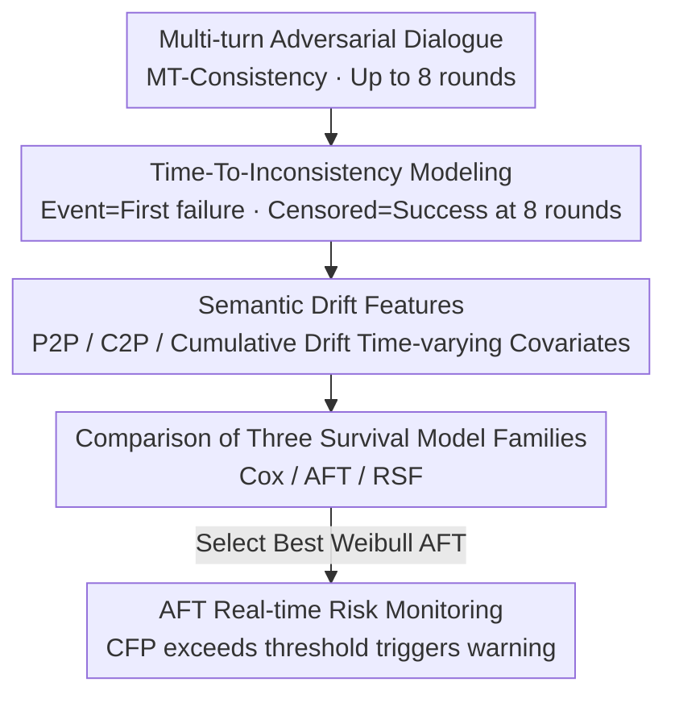

# Time-To-Inconsistency: A Survival Analysis of Large Language Model Robustness to Adversarial Attacks

**Conference**: ICLR 2026  
**OpenReview**: [https://openreview.net/forum?id=88C7vSdn0t](https://openreview.net/forum?id=88C7vSdn0t)  
**Area**: AI Safety / LLM Robustness  
**Keywords**: Multi-turn dialogue robustness, Survival analysis, Semantic drift, Consistency evaluation, Risk monitoring

## TL;DR
Ours models "at which round an LLM starts to provide incorrect answers in multi-turn adversarial dialogues" as a **time-to-event** survival analysis problem. Using Cox, AFT, and Random Survival Forest models on 36,951 turns across 9 LLMs, the study finds that "abrupt semantic drift" sharply increases failure risk while "cumulative drift is actually protective." Furthermore, a lightweight AFT model is transformed into a real-time risk monitor capable of providing early warnings for failures several rounds in advance.

## Background & Motivation
**Background**: The dominant paradigm for evaluating LLM robustness involves static benchmarks and single-turn scoring, or reporting an aggregated average score (such as consistency accuracy) for multi-turn dialogues. These metrics answer whether the model is correct at a specific fixed round.

**Limitations of Prior Work**: The single-turn or static aggregate perspective erases the **temporal dynamics of failure**. It cannot distinguish between two fundamentally different types of models: one that collapses immediately under slight pressure and another that remains stable for many rounds before gradually degrading. Their aggregate scores might be identical, but their deployment risks differ drastically. Phenomena such as "sycophancy drift"—where a model abandons a correct answer under minimal user disagreement—demonstrate that the **trajectory of a dialogue is as important as its final outcome**.

**Key Challenge**: Security and reliability truly care about "when errors appear and what dialogue history triggers them," whereas existing evaluations only answer "whether an error occurs." Tools are needed to decouple "whether it fails" from "when it fails," handle "right-censored" samples that remain correct until the final round, and provide round-by-round hazard functions.

**Goal**: (i) Predict failure risk turn-by-turn in adversarial dialogues; (ii) Characterize how signals like semantic drift, domain, difficulty, and model identity shape the survival dynamics of multi-turn interactions.

**Key Insight**: The authors find that survival analysis is naturally suited for this setting—it is designed for "time-to-event" data, cleanly separates occurrence from timing, handles censored samples without artificial labeling, and supports time-varying covariates, thereby linking evolving dialogue signals directly to changes in risk.

**Core Idea**: Ours formalizes "Time-To-Inconsistency" as a discrete-time survival problem where the event is defined as the first incorrect response under strict consistency criteria, time is the discrete turn count (up to 8 rounds, beyond which is right-censored), and survival models are driven by lightweight semantic drift features for both analysis and early warning.

## Method

### Overall Architecture
The input to the entire pipeline is a multi-turn trajectory from the MT-Consistency benchmark (consisting of an initial question followed by up to 8 adversarial follow-up rounds, retaining only dialogues that were initially correct). The output consists of turn-by-turn survival/hazard curves and an early warning monitoring signal. The pipeline consists of four steps: first, each prompt and the full context up to the current round are encoded into sentence vectors to calculate three types of "semantic drift" as time-varying covariates; then, these covariates are fed into Cox, AFT, and RSF models to fit the event time $T_i$; finally, the best-performing AFT model is selected, and its survival function is converted into a conditional failure probability within a rolling window to serve as a real-time risk monitor.

### Key Designs

**1. Time-To-Inconsistency: Turning Multi-turn Robustness into a Survival Analysis Problem**

Addressing the pain point that static aggregate scores erase temporal dynamics, the authors shift the question from "is the model correct" to "at which round is it led astray." For each dialogue $i$, the event time $T_i \in \{1,\dots,H\}$ ($H=8$) is defined as the turn where the model's answer first becomes inconsistent with the initial correct answer. The event indicator is $\delta_i=1$ if a failure occurs within 8 rounds, and $\delta_i=0$ if it remains correct (right-censored). Since time is discrete, the core metric is the discrete-time hazard $h_i(t)=\Pr(T_i=t \mid T_i\ge t, X_{i,\le t})$, representing the instantaneous risk of failing at round $t$ given survival up to then. This is linked to the survival function via $S_i(t)=\prod_{u=1}^{t}\big(1-h_i(u)\big)$. This framework naturally supports censoring and time-varying covariates, decoupling "whether it fails" from "when it fails."

**2. Semantic Drift Features: Characterizing Adversarial Pressure via Vector Shifts**

To predict risk, signals are needed. The authors intentionally use very simple semantic drift features to prove that even lightweight signals are sufficient. A sentence-transformer $f(\cdot)$ encodes each user prompt as $e_{i,t}=f(u_{i,t})$ and the full context seen by the model up to the current round as $c_{i,t}$. From these, three drifts are derived: **prompt-to-prompt drift** $D_{p2p}(i,t)=1-\cos(e_{i,t-1},e_{i,t})$ measures abrupt changes between adjacent user inputs; **context-to-prompt drift** $D_{c2p}(i,t)=1-\cos(c_{i,t-1},e_{i,t})$ measures the mismatch between new input and existing context; and **cumulative drift** $D_{cum}(i,t)=\sum_{s=2}^{t}D_{p2p}(i,s)$ is the total "distance" traveled up to round $t$. These are combined with discrete covariates like prompt length, domain (7 clusters), difficulty (4 levels), and model identity (9 LLMs) into a time-varying vector $X_{i,t}$.

**3. Comparison of Three Survival Model Families: Matching Hypotheses to the Failure Process**

Three families of models are fitted in parallel to determine which assumption about risk evolution fits the data best. **Cox Proportional Hazards (PH)** assumes covariates have a multiplicative effect on hazard $h_i(t\mid X_{i,t})=h_0(t)\exp(\beta^\top X_{i,t})$. **Accelerated Failure Time (AFT)** assumes covariates multiplicatively act on the **time scale** $\log T_i=\mu_i+\sigma\varepsilon_i$, where the acceleration factor $\exp(\Delta\mu)$ quantifies how much a covariate stretches or shrinks "characteristic time" (e.g., median failure round). Ours tests Weibull, log-normal, and log-logistic distributions. **Random Survival Forest (RSF)** serves as a non-parametric baseline using survival tree ensembles. A key finding is that the Schoenfeld residual test shows P2P drift **clearly violates the PH assumption**, explaining why AFT—which acts on the time scale and can represent accelerated risk—outperforms Cox in calibration and late-round predictions.

**4. AFT Real-time Risk Monitoring: Converting Survival Functions into Actionable Signals**

Accurate prediction is not enough; practical monitoring requires actionable lead time without frequent false positives. Instead of predicting a static failure time, the authors calculate the **Conditional Failure Probability (CFP)** within a rolling window $\tau$: given that the dialogue is currently consistent ($T>t$) at round $t$, the probability of failure within the next $\tau=2$ rounds is $\mathrm{Risk}_i(t,\tau)=1-\frac{\hat S_i(t+\tau)}{\hat S_i(t)}$. This value updates dynamically with cumulative risk. Once it exceeds a threshold $\lambda$ optimized for F1 during training, an early warning is triggered. This approach leverages the "accelerating risk" shape captured by AFT—where risk surges just before failure—allowing the monitor to warn several rounds before an actual error while remaining conservative for safe dialogues.

### Loss & Training
Cox utilizes partial likelihood estimation $\beta$ with dialogue-level cluster-robust standard errors and light $\ell_2$ regularization for interaction blocks. AFT parameters are estimated via maximum log-likelihood for right-censored data. RSF randomly samples covariates at each split to maximize the survival impurity drop based on the log-rank statistic. Data is split 80/20 at the dialogue level (stratified by model and topic), with 5-fold cross-validation on the 80% training pool to tune hyperparameters and select model variants (prioritizing CV Integrated Brier Score over C-index).

## Key Experimental Results

### Main Results
Dataset: MT-Consistency, 700 questions, 39 subjects, 4 difficulty levels, 9 SOTA models (Claude 3.5 Sonnet, DeepSeek R1, GPT-4o, etc.), totaling 36,951 turns after filtering for initially correct answers. Evaluation metrics include Harrell C-index (discrimination, higher is better) and Integrated Brier Score / IBS (calibration and overall accuracy, lower is better).

| Model | Paradigm | # Covariates | C-index | IBS |
|------|------|---------|---------|-----|
| Cox Baseline | Semi-parametric | 21 | 0.861 | 0.344 |
| Cox Advanced | Semi-parametric | 53 | 0.868 | 0.343 |
| Weibull AFT | Parametric | 12 | **0.874** | 0.180 |
| Log-Logistic AFT | Parametric | 12 | **0.874** | 0.187 |
| Weibull AFT + Int. | Parametric | 53 | 0.869 | **0.175** |
| Random Survival Forest | Non-parametric | 53 | 0.845 | 0.190 |

AFT leads in both discrimination (C-index 0.874) and calibration (IBS ≈ 0.18, representing a **Gain of >48%** reduction in error compared to Cox). RSF actually had the lowest C-index (0.845). Weibull AFT with interaction terms further reduced IBS to 0.175 at a slight cost to C-index.

### Ablation Study
Round-by-round Brier scores (lower is better) expose the fundamental difference between Cox and AFT:

| Model | R4 | R6 | R8 | IBS |
|------|----|----|----|----|
| Cox Baseline | 0.366 | 0.432 | 0.446 | 0.344 |
| Weibull AFT | 0.267 | 0.195 | 0.027 | 0.180 |
| Weibull AFT + Int. | 0.260 | 0.190 | 0.027 | 0.175 |
| Random Survival Forest | 0.262 | 0.205 | 0.084 | 0.190 |

Cox's Brier score rises monotonically and remains high in later rounds (indicating overconfidence as adversarial pressure accumulates). AFT's Brier score stabilizes then drops significantly at R7–R8, indicating it captures the nature of **accelerated** failure risk.

### Key Findings
- **Feature Importance Hierarchy: P2P > C2P > Cumulative Drift (Protective)**. Both Cox (HR) and AFT (AF) show consistent directions: P2P drift is catastrophic (e.g., GPT-4o Cox HR≈4.7, AFT AF≈0.15, meaning expected dialogue length shrinks drastically). Cumulative drift is truly protective (AFT gives 1.4×–2.6× time dilation), suggesting dialogues that survive early rounds "adapt" to a drifted context.
- **Effective Risk Stratification**: High-risk dialogues (top quartile of cumulative drift) have a median survival of 4.2 rounds, while low-risk dialogues exceed 7.8 rounds. Log-rank tests across all paradigms show $p<0.001$.
- **Effective Real-world Monitoring**: The AFT monitor successfully provided early warnings for 76% of failed dialogues before the error occurred, with a median lead time of 2 rounds (mean 2.3). Meanwhile, only 19% of safe (censored) dialogues were falsely triggered. In contrast, the drift-threshold baseline warned only 62% of failures with a 32% false positive rate and later warnings (mean 3.3 rounds vs 3.9 rounds).

## Highlights & Insights
- **"The speed of semantic change is more critical than the total distance traveled"**—this is the most counter-intuitive insight: abrupt changes (P2P) are catastrophic, while cumulative drift is protective. This challenges the common assumption that any deviation from the initial topic is harmful and suggests dialogue integrity depends on drift velocity rather than total displacement.
- **Matching Model Hypotheses to the Failure Process**: By identifying the PH violation for P2P drift via Schoenfeld tests, the paper explains why AFT, which acts on the time scale, outperforms Cox in later rounds—a elegant methodological loop from diagnosis to model selection to performance.
- **From Static Summaries to Evolving Risk Signals**: Using the conditional failure probability $\mathrm{Risk}_i(t,\tau)$ to convert survival functions into actionable rolling alerts allows this methodology to be directly transferred to any sequential monitoring scenario (e.g., agent tasks, long-range dialogue guardrails).

## Limitations & Future Work
- **Experimental Scope**: Experiments were limited to MT-Consistency, one adversarial prompt protocol, and at most 8 rounds. Longer, mixed-initiative dialogues or other attack vectors (e.g., tool calls, CoT manipulation) were not covered.
- **Crude Event Definition**: "First error" is used as a binary event, without distinguishing between different failure types like sycophancy, hallucination, or instruction following failure. Semantic drift is also defined only via a single embedding model.
- **Retrospective Monitoring**: AFT risk scores were evaluated offline and not coupled with real-time interventions or user outcomes (no online A/B testing).
- Future directions include extending to more domains/attack families, incorporating richer covariates (confidence, response-level features), and integrating the survival monitor into real human-in-the-loop systems for online validation.

## Related Work & Insights
- **vs PWC / CARG (Li et al. 2025a)**: They use position-weighted consistency metrics to penalize early inconsistency and improve consistency through confidence-aware generation; ours statistically characterizes the *process* of risk increasing turn-by-turn. The former is mitigation, the latter is modeling and early warning.
- **vs FlipFlop (Laban et al. 2023)**: They empirically observed frequent flips under trivial counter-arguments; ours uses survival models to quantify this "sycophancy drift" into predictable risk curves.
- **vs Existing Dialogue Survival Analysis (De Kock & Vlachos 2021; Maystre & Russo 2022)**: Prior work modeled user-level/session-level outcomes (termination, dropout); ours is the first to apply survival analysis to the **internal consistency** of LLM responses under adversarial pressure.

## Rating
- Novelty: ⭐⭐⭐⭐⭐ First to formalize multi-turn robustness as a time-to-event problem; "drift speed > total distance" is a truly counter-intuitive discovery.
- Experimental Thoroughness: ⭐⭐⭐⭐ 9 models, 36,951 rounds, multi-family model comparison, and round-by-round calibration; however, limited to a single benchmark.
- Writing Quality: ⭐⭐⭐⭐⭐ The methodological loop from diagnosis to model selection is clear, with a natural bridge between formulas and insights.
- Value: ⭐⭐⭐⭐⭐ Transforms robustness evaluation from static summaries into deployable real-time risk signals, immediately useful for dialogue AI guardrails.

<!-- RELATED:START -->

## Related Papers

- [\[ICLR 2026\] Sampling-aware Adversarial Attacks against Large Language Models](sampling-aware_adversarial_attacks_against_large_language_models.md)
- [\[ICLR 2026\] AdPO: Enhancing the Adversarial Robustness of Large Vision-Language Models with Preference Optimization](adpo_enhancing_the_adversarial_robustness_of_large_vision-language_models_with_p.md)
- [\[ICLR 2026\] Transferable and Stealthy Adversarial Attacks on Large Vision-Language Models](transferable_and_stealthy_adversarial_attacks_on_large_vision-language_models.md)
- [\[ICLR 2026\] Understanding Sensitivity of Differential Attention through the Lens of Adversarial Robustness](understanding_sensitivity_of_differential_attention_through_the_lens_of_adversar.md)
- [\[NeurIPS 2025\] On the Robustness of Verbal Confidence of LLMs in Adversarial Attacks](../../NeurIPS2025/llm_safety/on_the_robustness_of_verbal_confidence_of_llms_in_adversarial_attacks.md)

<!-- RELATED:END -->
