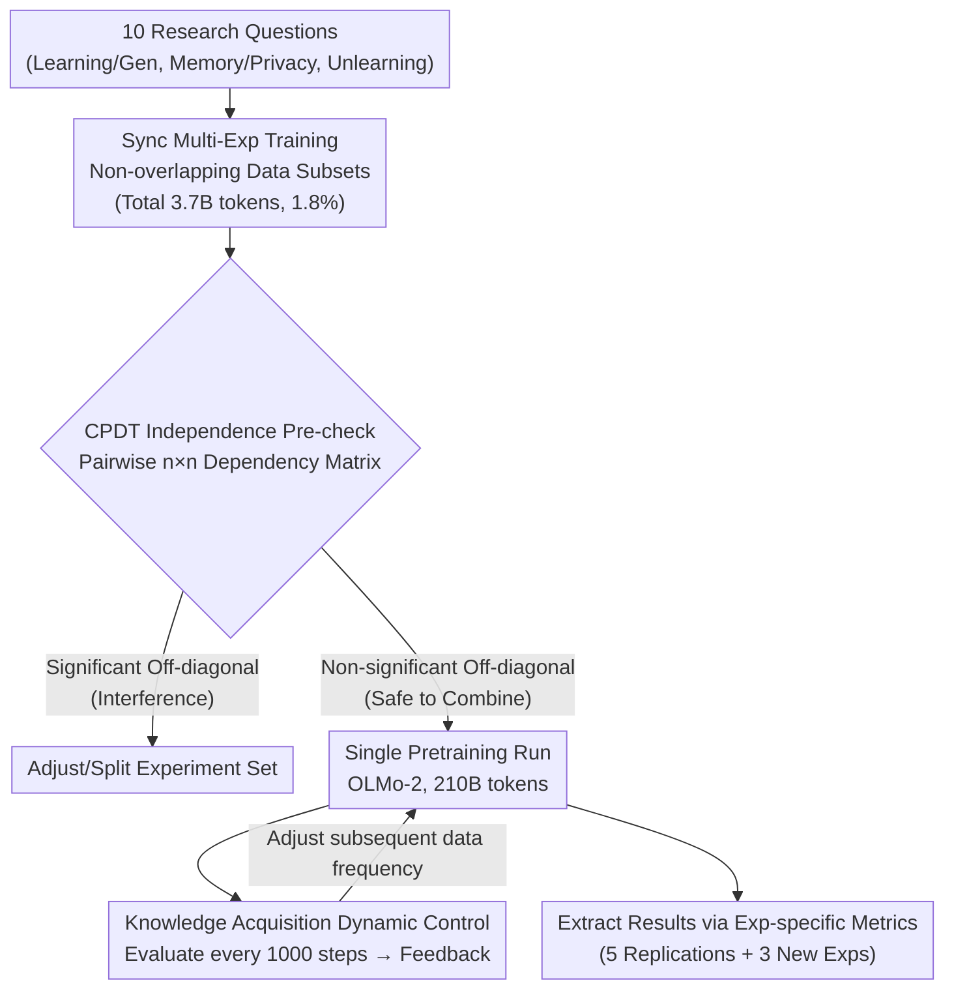

# Train Once, Answer All: Many Pretraining Experiments for the Cost of One

**Conference**: ICLR 2026  
**arXiv**: [2509.23383](https://arxiv.org/abs/2509.23383)  
**Code**: [Python Package](https://arxiv.org/abs/2509.23383) (OLMo-2 experimental package provided)  
**Area**: AI Safety  
**Keywords**: Pretraining Experiments, LLM, Experiment Independence, Continual Pretraining, Data Contamination

## TL;DR

This paper proposes a methodological framework to conduct multiple independent experiments simultaneously within a single LLM pretraining run. By training a 2.7B parameter model (210B tokens) with 10 concurrent experiments, the authors successfully replicated findings from five previous works and conducted three new experiments. They also introduced Continual Pretraining Dependence Testing (CPDT) to verify the independence between these experiments.

## Background & Motivation

**Controlled pretraining experiments are the gold standard for studying LLM behavior**: Systematically isolating the effects of specific interventions (data changes, architectural modifications, objective modifications) by training models from scratch is superior to other methods in terms of conceptual simplicity and scientific rigor.

**Computational cost is the primary bottleneck for pretraining experiments**: Current standard practice involves a dedicated training run for each experiment. For investigating specific aspects of model behavior, the expected insights from a single project often do not justify the cost of training a model from scratch.

**The multi-tasking nature of pretraining provides a theoretical foundation**: Models learn many tasks simultaneously during pretraining. Theoretically, independent interventions can be performed on different tasks concurrently. This reflects practical model development, where practitioners often combine multiple interventions during a single scratch-training run.

**Key Challenge: Do interactions exist between experiments?**: If one experiment influences the outcome of another, the validity of joint training is compromised. A method is needed to detect and quantify such dependencies.

## Method

### Overall Architecture

The pain point addressed is that while controlled pretraining is the gold standard for LLM research, the "one training, one question" cost is unaffordable for most researchers. The core idea is to shift from "one training, one experiment" to "one training, multiple experiments." First, interventions for 10 research questions are embedded into small, non-overlapping segments of training data (totaling 3.7B tokens, or 1.8% of the data). Before the expensive full training begins, a cheap proxy (CPDT) is used to verify pairwise independence. Once independence is confirmed, a single full pretraining run (OLMo-2, 210B tokens) is conducted. Knowledge acquisition experiments utilize a feedback loop to dynamically adjust data frequency during training. After training, results for each experiment are extracted using dedicated metrics. This approach relies on the fact that pretraining is naturally a multi-task process, allowing perturbations to different tasks to run in parallel without contamination.

### Key Designs

**1. Synchronous Multi-experiment Training: Splitting one run into 10 parallel experiments**

This addresses the "single training is too expensive" pain point. Each experiment is assigned a non-overlapping subset of the training data for intervention, paired with independent evaluation metrics. Consequently, 10 interventions share the same forward and backward passes while maintaining separate performance accounts. The 10 experiments are categorized into: Learning & Generalization (Knowledge Acquisition (KA) 26M tokens, Math Reasoning (MR) 180M), Memory & Privacy (Benchmark Contamination (BC) 106M, Memory Patterns (MemP) 246M, Verbatim Memorization (MemV) 1.1B, Gaussian Watermarking (GW) 210M), and Forgetting & Unlearning (Pretraining Poisoning (PP) 235M, Forgetting Curve (FC) 19M, MUSE-News 152M, IID Replacement 1.5B). Their coexistence is possible because they target different data subsets and metrics; the multi-task nature of pretraining ensures perturbations in one task do not overwrite answers in another.

**2. Continual Pretraining Dependence Testing (CPDT): Verifying independence at low cost**

The validity of the framework hinges on experiment independence. The authors provide a formal definition: experiments $E_1, \dots, E_n$ are independent if and only if for all $i$ and any $T \subseteq [n] \setminus \{i\}$, $Y_i^{\{i\}} \stackrel{d}{=} Y_i^{\{i\} \cup T}$ holds—meaning the distribution of results for experiment $i$ remains unchanged when data from other experiments is added. Since full pretraining to verify this is too expensive, CPDT uses a proxy: it takes an intermediate checkpoint and performs short-term continual pretraining (replacing ~1% of data) for each experiment. It measures the shift in experiment $i$'s metrics caused by training on experiment $j$'s data, denoted as $Y_i^{\{j\}}-Y_i^{\emptyset}$, to fill an $n \times n$ dependency matrix (extended to $(n+1) \times n$ with a joint training row). If off-diagonal entries are non-significant, the experiments can be safely combined. This step is completed before the full run at a fraction of the cost.

**3. Dynamic Control of Knowledge Acquisition: Precise "injection" via feedback loops**

This specific experiment demonstrates the precision of intervention possible in a single run. It addresses: how many times must a model see a fact before it is memorized? Since fixed frequencies are difficult to target, a control loop is implemented: the current probability of the knowledge probe is evaluated every 1000 steps, compared against a target (e.g., 0.08), and the frequency of that knowledge in subsequent data is adjusted accordingly. This applies negative feedback from control theory to the pretraining data stream, transforming "targeted knowledge injection" from trial-and-error into a controllable process.

### Loss & Training

The architecture follows OLMo-2-1B, running for 100,000 steps / 210B tokens. The learning rate aligns with the original OLMo-2-1B for the first 90,000 steps and decays linearly to 0 in the final 10,000 steps. Experimental data is distributed uniformly throughout the training process, replacing original pretraining tokens in-situ to maintain a constant token count. This procedure was executed for four scales: 179M, 546M, 1.5B, and 2.7B parameters to observe how intervention effects scale.

## Key Experimental Results

### Main Results

New experimental results (OLMo-2-1B-Exp):

| Experiment | Key Metric | Result |
|-----------|------------|--------|
| Knowledge Acquisition | Final Probe Value / Zero-shot Acc | 0.05 (Target 0.08) / 25% |
| Math Reasoning | OOD Difficulty Generalization | Generated 11-step optimal solution |
| Gaussian Watermarking | TPR@1%FPR | Consistently above random; late-stage watermarks easier to detect |
| BC (4x Repeat) | Overfitting Degree | ~1 percentage point |
| BC (144x Repeat) | Overfitting Degree | ~19 percentage points |

Model Scaling Effects:

| Model | Params | Benchmark Contamination Effect | Poisoning Success Rate | Math Reasoning |
|-------|--------|--------------------------------|------------------------|----------------|
| OLMo-2-179M-Exp | 179M | Low | Still effective | Not emergent |
| OLMo-2-546M-Exp | 546M | Medium | Effective | Emerging |
| OLMo-2-1B-Exp | 1.5B | High | Effective | Apparent |
| OLMo-2-2.7B-Exp | 2.7B | Highest | Effective | Strongest |

### Ablation Study

CPDT Independence Testing Results:

| Type | Comparison | Conclusion |
|------|------------|------------|
| Between LM Benchmarks | ARC-Easy → ARC-Challenge | +6.2pp, Significant dependence |
| Between Experiments (Off-diag) | All experiment pairs | Non-significant, No dependence |
| Joint vs. Individual | Diagonal vs. Bottom Row | Consistent effects, valid independence |

Impact on Training Dynamics:

| Metric | OLMo-2-1B | OLMo-2-1B-Exp |
|--------|-----------|---------------|
| 10K Holdout Benchmark Acc | 55.51% | 55.15% |
| Train/Val Loss | Nearly identical | Nearly identical |

### Key Findings

1. **Successful replication of 5 prior works**: Results for benchmark contamination, memory patterns, verbatim memorization, poisoning, and forgetting curves matched independent training runs.
2. **Minimal impact on global training dynamics**: Training loss, validation loss, and output layer weight norms overlapped almost perfectly with the base model.
3. **Scaling effects**: The magnitude of intervention effects (contamination, knowledge acquisition, poisoning success) increased with model size.
4. **Emergent math reasoning**: Reasoning capabilities appeared only at $\ge 546M$ parameters, consistent with previous independent studies.
5. **Recency bias in watermarking**: Data seen later in training is more easily detected, revealing temporal characteristics of LLM learning.

## Highlights & Insights

1. **Major Methodological Contribution**: Shifting the paradigm from "one training, one experiment" to "one training, multiple experiments" can reduce the cost of LLM experimental research by an order of magnitude.
2. **CPDT is an elegant verification tool**: Utilizing continual pretraining to detect dependency before the full run provides statistical guarantees at a much lower cost.
3. **Dynamic Control for Knowledge Acquisition**: Introducing control theory into pretraining allows for "on-demand" knowledge injection, making the process precise rather than stochastic.
4. **Implications for the Community**: Current open-source training practices (e.g., OLMo) have low "research density." Training runs can and should accommodate multiple research experiments.

## Limitations & Future Work

1. **Limited Scale of Intervention**: Each experiment modified at most 1.8% of the data. Independence might not hold for larger modifications (e.g., total synthetic data training).
2. **Focused on Data Interventions**: Except for watermarking, all experiments involve data modification. Interventions like architectural changes or hyperparameter shifts cannot be parrallelized this way.
3. **Approximation in CPDT**: CPDT is an approximation of full pretraining; false negatives remain a possibility.
4. **Model Scale Ceiling**: Verification reached 2.7B; validity for 70B+ models is not yet confirmed.
5. **High-order Interactions**: CPDT primarily detects pairwise dependencies; interactions among three or more experiments might be overlooked.

## Related Work & Insights

- **Bordt et al. (2025)**: Original work on benchmark contamination; this paper replicated findings on forgetting.
- **Panda et al. (2025)**: Original work on memory patterns/privacy; replicated the vulnerability of rare token canaries.
- **Zhang et al. (2025b)**: Original work on poisoning; replicated backdoor effectiveness in smaller models.
- **AdEMAMix (Pagliardini et al., 2025)**: Reference for forgetting curves; verified rapid forgetting of individual batches.
- **Insight**: This methodology can be extended to vision and multi-modal pretraining, potentially becoming a standard tool for AI research.

## Rating

- **Novelty**: ⭐⭐⭐⭐⭐ — A groundbreaking shift in methodology; the "train once, answer all" concept and CPDT are highly original.
- **Experimental Thoroughness**: ⭐⭐⭐⭐⭐ — 10 experiments across 4 model scales, 5 replications, and 3 new experiments make for an exceptionally robust design.
- **Writing Quality**: ⭐⭐⭐⭐ — Clear structure with rigorous mathematical definitions, though some experimental details are relegated to the appendix.
- **Value**: ⭐⭐⭐⭐⭐ — Likely to change the paradigm of LLM pretraining research, providing substantial aid to researchers with limited resources.

<!-- RELATED:START -->

## Related Papers

- [\[CVPR 2025\] Towards All-in-One Medical Image Re-Identification](../../CVPR2025/llm_safety/towards_all-in-one_medical_image_re-identification.md)
- [\[ICLR 2026\] Attention Smoothing Is All You Need For Unlearning](attention_smoothing_is_all_you_need_for_unlearning.md)
- [\[ICLR 2026\] When Priors Backfire: On the Vulnerability of Unlearnable Examples to Pretraining](when_priors_backfire_on_the_vulnerability_of_unlearnable_examples_to_pretraining.md)
- [\[ICLR 2026\] Heterogeneous Federated Fine-Tuning with Parallel One-Rank Adaptation](heterogeneous_federated_fine-tuning_with_parallel_one-rank_adaptation.md)
- [\[ICLR 2026\] All Code, No Thought: Language Models Struggle to Reason in Ciphered Language](all_code_no_thought_language_models_struggle_to_reason_in_ciphered_language.md)

<!-- RELATED:END -->
