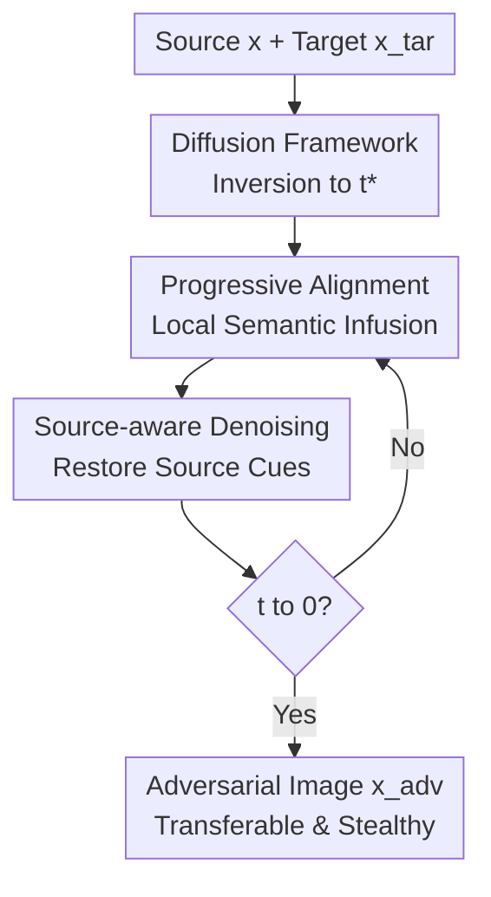

# Transferable and Stealthy Adversarial Attacks on Large Vision-Language Models

**Conference**: ICLR2026  
**OpenReview**: [https://openreview.net/forum?id=liQueBuFXi](https://openreview.net/forum?id=liQueBuFXi)  
**Code**: To be released  
**Area**: Multimodal Large Model Security / LVLM Adversarial Attacks  
**Keywords**: Large Vision-Language Model Security, Black-box Transfer Attack, Stealthy Adversarial Examples, Diffusion Models, Progressive Semantic Infusion

## TL;DR

This paper proposes Progressive Semantic Infusion (PSI), which utilizes a diffusion model to gradually inject the natural semantics of a target image into a source image. This significantly improves the transfer attack success rate against black-box Large Vision-Language Models (LVLMs) such as GPT-5, Grok-4, and Gemini while maintaining visual stealthiness.

## Background & Motivation

**Background**: For black-box attacks against Large Vision-Language Models (LVLM/VLM), a common practice is to first find a white-box surrogate model, such as the CLIP or BLIP series, and then optimize a source image so that its visual features in the surrogate model approximate those of a target image. Attackers desire the victim model to output text describing the target image when shown the modified source image. However, since the parameters, gradients, and training data of commercial LVLMs are invisible, attacks must rely on "aligning on the surrogate model and transferring to the black-box model."

**Limitations of Prior Work**: Fixed feature alignment does not equate to transferability. Methods like AttackVLM and CoA can push an adversarial image toward target features in a surrogate model, but this optimization occurs in pixel space, easily pushing samples away from the natural image distribution. Once a sample becomes an unnatural solution—favored by the surrogate but ignored by the real LVLM—transferability drops. Another class of methods like AnyAttack, M-Attack, and FOA, while injecting target semantics more strongly and often succeeding in attacks, frequently leave visible textures, contours, overlays, or artifacts, exposing the attack at the input or output layer.

**Key Challenge**: Transfer attacks require strong target semantics, while stealthy attacks require the source image to look like the original. This trade-off cannot be resolved simply by an $\ell_\infty$ budget. The key premise of this paper is that both black-box LVLMs and surrogate models are trained on large-scale natural image-text data. If an adversarial sample is close to the target semantics yet remains near the natural image distribution, it is more likely to yield consistent semantic responses across different models.

**Goal**: The authors decompose the objective into three sub-problems: first, how to explicitly utilize the natural image distribution in attack optimization rather than just pursuing surrogate feature similarity; second, how to avoid overfitting to a single fixed target by injecting attack signals progressively during the generation process; and third, how to ensure the final image retains the visual cues of the source image to avoid detection by humans or LVLMs.

**Key Insight**: Diffusion models themselves are generative priors trained on the natural image distribution. The reverse denoising process can be viewed as pulling a sample toward the natural image manifold. Consequently, the authors discard traditional pixel-level iterative perturbations and instead perform generation, alignment, and source information integration simultaneously within the DDPM denoising trajectory.

**Core Idea**: Replace single fixed feature alignment with "diffusion prior constrained naturalness + progressive local semantic alignment for transferability + source-aware DDPM inversion for stealthiness" to generate adversarial images that are transferable across models and visually inconspicuous.

## Method

### Overall Architecture

The input to PSI consists of a source image $x$ and a target image $x_{tar}$, and the output is an adversarial image $x_{adv}$, which appears similar to the source image to human eyes but induces the black-box LVLM to generate a description close to the target image. The process starts by inverting the source image to an intermediate timestep $t^*$ of the diffusion model, followed by denoising from $t^*$ to 0. At each timestep, surrogate feature alignment is performed using the current local target region, and visual consistency is maintained via a noise term carrying source image cues.

The authors first represent the traditional fixed target as $L_{fixed}=\cos(f_{tar}, f_{adv})$ and point out that this only manages surrogate alignment regardless of whether the sample is natural. PSI approximates the optimization of a joint objective $L_{joint}=p_F(f_{tar}\mid x_{adv})\cdot p_D(x_{adv})$, where the first term represents target semantic alignment on the surrogate model and the second term represents credibility on the natural image distribution. Diffusion denoising handles naturalness, progressive alignment handles attack semantics, and source-aware noise handles stealthiness.

In the threat model, the attacker cannot query or modify the victim LVLM, nor change the prompt, system instruction, or other text inputs. The attacker only creates a malicious image that will be consumed by the LVLM. The goal is not to force a fixed label but to make the LVLM's natural language description of $x_{adv}$ semantically close to the description of $x_{tar}$.

### Key Designs

**1. Diffusion Optimization Framework: Embedding Naturalness into the Attack Process**

Traditional transfer attacks often optimize $\cos(F(x_{adv}), F(x_{tar}))$ directly in pixel space, mistaking high similarity on the surrogate for transferability on black-box LVLMs. PSI's first step is to include naturalness in the objective: if $F$ and the black-box model $M$ are derived from similar natural image-text distributions, a more natural $x_{adv}$ is more likely to yield consistent semantics across both. This is formulated as $L_{joint}=p_F(f_{tar}\mid x_{adv})\cdot p_D(x_{adv})$. Although $p_D(x_{adv})$ is not directly differentiable, it is approximated by the denoising prior of the diffusion model.

A single reverse step in DDPM is $x_{t-1}=\mu(x_t,t)+\sigma_t\epsilon_t$, where $\mu(x_t,t)$ can be approximated as $x_t+\sigma_t^2\nabla_{x_t}\log p_D(x_t)$. This pushes samples toward high-density regions of the natural image distribution. PSI performs diffusion inversion on the source image to obtain the intermediate latent $x_{t^*}$ and denoises through $t^*, t^*-1, \dots, 1$. Perturbations are injected at each denoising step: $x_{t-1}=\mathrm{Denoise}_t(x_t)+\mathrm{Perturbation}(t)$, allowing the attack signal to be constrained by the "naturalizing" diffusion prior during injection.

**2. Progressive Alignment Objective: Avoiding Overfitting to Unnatural Solutions**

The problem with a single fixed objective is that optimization pursues the same global target feature, easily learning local preferences of the surrogate model that might not be recognized by black-box LVLMs. PSI replaces global alignment with a sequence of local alignment targets $\{L_{align}(t)\}_{t=1}^{t^*}$ varying with timesteps. Each step involves a small update: $\mathrm{Perturbation}(t)=\gamma\cdot\mathrm{Clip}_\infty(\nabla_{\mu(x_t,t)}L_{align}(t),\delta)$, where $\gamma$ controls the guidance strength and $\delta$ limits the perturbation magnitude per step.

Crucially, the target and source regions co-evolve. For the target image, PSI uses SAM to find the salient object region $o_t$ and interpolates the reference region $r_t$ from the compact semantic subject to the full target image: $r_t=\mathrm{Interpolation}(o_t,x_{tar},1-t/t^*)$. Early stages inject clear subject semantics, while later stages introduce complex context. For the current adversarial latent, PSI randomly samples $N$ candidate local regions of the same scale and selects the one most similar to $r_t$ in surrogate feature space: $a_t=\arg\max_{a\in A_t}\cos(F(a),F(r_t))$. This co-evolving selection is more stable than pure random cropping because it maintains a semantic correspondence between source and target regions at every step.

This design treats "target semantic infusion" as a curriculum: first aligning simple, dominant, local target concepts, then gradually adding background and details. Since local regions change over time, this also adds spatial diversity regularization. Ablations show that removing progressive alignment causes GPT-5 ASR to drop from 78.6% to 22.8%, highlighting it as a core source of transferability.

**3. Source-aware Denoising: Integrating Stealthiness into the Generation Trajectory**

If ordinary DDIM inversion or deterministic sampling were used, source image information would be encoded primarily in the starting point $x_{t^*}$. Once perturbations are injected at each step, the final image might drift away from the source, becoming visually obvious. PSI embeds source image cues into the noise term of every timestep rather than relying solely on the initial latent.

Specifically, the authors construct forward noisy states $\hat{x}_t=\sqrt{\bar{\alpha}_t}x+\sqrt{1-\bar{\alpha}_t}n_t$ using the source image, then derive the corresponding noise for each step: $\hat{\epsilon}_t=(\hat{x}_{t-1}-\mu(\hat{x}_t,t))/\sigma_t$. These $\hat{\epsilon}_t$ are no longer independent Gaussian noise but carry the texture, layout, and low-level visual cues of the source image. During generation, PSI uses $\mathrm{Denoise}_t(x_t)=\mu(x_t,t)+\sigma_t\hat{\epsilon}_t$, ensuring each step is pulled toward the source image.

This explains why PSI's stealthiness does not rely purely on small perturbation budgets. Without source-aware denoising, GPT-5 ASR is slightly higher (81.0%), but the Stealthy ASR (S-ASR) drops from 62.8% to 57.0% and LPIPS worsens from 0.192 to 0.241. While omitting this component allows more aggressive attacks, it breaks visual consistency; PSI sacrifices a small amount of attack strength for higher output-layer stealthiness.

### Loss & Training

PSI uses the CLIP series as surrogate models, including ViT-B/16, ViT-B/32, and ViT-g-14 laion2B-s12B-b42K, defaulting to the mean similarity across surrogates. The core alignment loss is the cosine similarity between local regions: $L_{align}(t)=\cos(F(a_t),F(r_t))$. Gradients only affect the selected local adversarial region, while others are zeroed, with strength controlled via $\gamma\cdot\mathrm{Clip}_\infty(\cdot,\delta)$.

For implementation, the authors utilize stable-diffusion-2-1 as the generative model and SAM to detect salient object regions. Defaults are $t^* = 20\%$ of total diffusion steps, $N=4$ candidate regions, random scale factor $s\in[0.4,0.9]$, guidance strength $\gamma=20$, and clipping threshold $\delta=0.0025$. The appendix provides an intuitive proof that distributing small perturbations across multiple timesteps results in a smaller second-order naturalness loss compared to a single-step injection.

## Key Experimental Results

### Main Results

Attacks are evaluated on image captioning tasks with the prompt "Describe this image in 30 words." Victim models include MiniGPT-4, the robust FARE4, and commercial models like GPT-5, Gemini-2.5 Flash, Grok-4, and Claude-3.5 Sonnet. Transferability is measured by ASR: a GPT-4o judge determines if the semantic similarity between the adversarial output and the target output is $\ge 0.3$. Stealthy ASR (S-ASR) further requires that the output contains no mention of artifacts, overlays, or adversarial perturbations.

| Method | MiniGPT-4 ASR / S-ASR | FARE4 ASR / S-ASR | GPT-5 ASR / S-ASR | Gemini-2.5 ASR / S-ASR | Grok-4 ASR / S-ASR | Claude-3.5 ASR / S-ASR | BRISQUE↓ | LPIPS↓ |
|------|-----------------------|-------------------|-------------------|-------------------------|---------------------|--------------------------|----------|--------|
| AttackVLM | 8.9 / 8.2 | 0.3 / 0.2 | 3.0 / 2.7 | 2.7 / 2.1 | 2.6 / 2.0 | 0.4 / 0.1 | 53.93 | 0.262 |
| CoA | 13.5 / 13.2 | 0.7 / 0.6 | 9.6 / 7.6 | 9.3 / 8.0 | 6.3 / 5.7 | 1.2 / 0.5 | 55.64 | 0.258 |
| AdvDiffVLM | 29.1 / 28.5 | 14.2 / 13.9 | 13.1 / 8.9 | 14.9 / 12.5 | 13.0 / 11.6 | 4.5 / 3.3 | 22.59 | 0.214 |
| AnyAttack | 33.2 / 28.6 | 11.6 / 9.2 | 24.5 / 11.2 | 31.5 / 20.8 | 26.6 / 19.4 | 7.0 / 3.9 | 68.32 | 0.478 |
| M-Attack | 82.4 / 77.1 | 53.2 / 49.5 | 73.8 / 54.5 | 71.4 / 64.3 | 77.9 / 70.0 | 12.4 / 9.8 | 47.68 | 0.209 |
| FOA | 84.7 / 77.5 | 54.4 / 51.0 | 75.8 / 56.5 | 73.5 / 63.4 | 80.0 / 72.7 | 14.6 / 10.4 | 50.37 | 0.217 |
| **PSI** | **85.1 / 82.3** | **64.3 / 63.5** | **78.6 / 62.8** | **75.8 / 71.5** | **81.4 / 75.0** | **21.8 / 15.2** | **22.14** | **0.192** |

PSI achieves the highest ASR and S-ASR across all victim models. Notably, against GPT-5, whereas FOA hits 75.8/56.5 (ASR/S-ASR), PSI improves this to 78.6/62.8. Against the robust FARE4, PSI reaches an S-ASR of 63.5, significantly higher than FOA's 51.0.

| Defense | Method | GPT-5 ASR | GPT-5 S-ASR | Interpretation of Changes |
|------|------|-----------|-------------|----------|
| Gaussian smoothing | FOA | 58.7 | 48.2 | Significant drop from original 75.8 / 56.5 |
| Gaussian smoothing | PSI | 61.1 | 56.6 | ASR drops, but S-ASR only slightly decreases from 62.8 |
| JPEG compression | FOA | 61.9 | 48.9 | Pixel perturbations destroyed by compression |
| JPEG compression | PSI | 64.9 | 56.7 | Semantic injection more resilient than pixel noise |
| DiffPure | FOA | 19.7 | 14.7 | Diffusion purification effectively negates traditional perturbations |
| DiffPure | PSI | 34.2 | 29.6 | Still drops, but retains more attack capability |

### Ablation Study

| Configuration | GPT-5 ASR | GPT-5 S-ASR | BRISQUE↓ | Description |
|------|-----------|-------------|----------|------|
| PSI (Full) | 78.6 | 62.8 | 22.14 | All three components enabled |
| w/o diffusion (16/255) | 75.5 | 57.0 | 51.49 | Image quality degrades significantly without diffusion prior |
| w/o diffusion (12/255) | 65.5 | 47.4 | 42.45 | Quality improves by reducing budget, but sacrifices ASR |
| w/o progressive alignment | 22.8 | 15.0 | 22.28 | Naturalness is maintained, but semantic injection fails |
| w/o co-evolving selection | 71.3 | 52.5 | 25.60 | Random local alignment is less stable than semantic correspondence |
| w/o source-aware denoising | 81.0 | 57.0 | 23.60 | ASR slightly higher, but stealthiness and LPIPS worsen |

### Key Findings

- **Progressive alignment is the largest contributor to transferability.** Removing it causes GPT-5 ASR to plummet, proving that fixed global feature alignment leads to solutions that do not transfer.
- **The diffusion prior primarily improves naturalness and output-layer stealthiness.** PSI's BRISQUE (22.14) is near that of AdvDiffVLM (22.59) and significantly better than AnyAttack (68.32).
- **Target image complexity affects success.** Targeted attacks are easier when the target has a simple, clear subject. PSI's curriculum from salient subject to full image addresses this.
- **Commercial models are more likely to identify attack traces.** GPT-5 and Grok-4 have high ASR but lower S-ASR compared to open-source models; Claude-3.5 shows the strongest robustness.

## Highlights & Insights

- **Unifying Transferability and Naturalness**: Instead of just using diffusion for "beautification," the authors propose the joint objective $p_F(f_{tar}\mid x_{adv})\cdot p_D(x_{adv})$ and use the denoising process to approximate the naturalness term, providing better theoretical grounding.
- **S-ASR as a Better Metric**: LVLMs often explicitly point out "noisy/overlayed" images. Combining attack success with the lack of such warnings provides a more realistic evaluation of attack impact.
- **Curriculum Learning for Black-box Attacks**: Starting from salient subjects and expanding to context is a transferable design principle potentially applicable to video or 3D VLM attacks.

## Limitations & Future Work

- **Fine-grained Textures**: PSI focuses on core semantics; complex spatial relationships and fine textures remain unstable.
- **Source Constraints**: Stealthiness drops when the source image is very clean or has large empty spaces, as "donut-like" perturbations become more visible.
- **LLM-as-a-Judge**: Evaluation remains dependent on models like GPT-4o, which may have inherent biases or stylistic preferences.
- **Defense Research**: Future work should use PSI as a benchmark for multimodal robust training and investigating scenario-level semantic consistency detection.

## Related Work & Insights

- **vs AttackVLM / CoA**: These rely on fixed surrogate alignment, which overfits and has weak transferability. PSI uses progressive alignment to avoid this.
- **vs M-Attack / FOA**: These use random cropping for transferability. PSI incorporates this into a diffusion trajectory with co-evolving selection, improving S-ASR against models like GPT-5.
- **vs AdvDiffVLM**: Both use diffusion for imperceptibility, but AdvDiffVLM lacks transferability. PSI's progressive alignment and source-aware denoising make the diffusion process integral to the attack optimization rather than a post-processing step.

## Rating

- **Novelty**: ⭐⭐⭐⭐⭐ High. The progression from joint objectives to local alignment in diffusion trajectories is well-conceived.
- **Experimental Thoroughness**: ⭐⭐⭐⭐⭐ Comprehensive. Covers open, robust, and commercial models with various ablation and defense tests.
- **Writing Quality**: ⭐⭐⭐⭐ Clear. Formulas and diagrams effectively support the method, though it relies on LLM judging.
- **Value**: ⭐⭐⭐⭐⭐ High. Directly addresses the overlooked issue of "successful but exposed" attacks in LVLMs.

<!-- RELATED:START -->

## Related Papers

- [\[ICLR 2026\] AdPO: Enhancing the Adversarial Robustness of Large Vision-Language Models with Preference Optimization](adpo_enhancing_the_adversarial_robustness_of_large_vision-language_models_with_p.md)
- [\[ICLR 2026\] Sampling-aware Adversarial Attacks against Large Language Models](sampling-aware_adversarial_attacks_against_large_language_models.md)
- [\[ICML 2025\] X-Transfer Attacks: Towards Super Transferable Adversarial Attacks on CLIP](../../ICML2025/llm_safety/x-transfer_attacks_towards_super_transferable_adversarial_attacks_on_clip.md)
- [\[ICLR 2026\] VEAttack: Downstream-Agnostic Vision Encoder Attack Against Large Vision Language Models](veattack_downstream-agnostic_vision_encoder_attack_against_large_vision_language.md)
- [\[ICLR 2026\] Time-To-Inconsistency: A Survival Analysis of Large Language Model Robustness to Adversarial Attacks](time-to-inconsistency_a_survival_analysis_of_large_language_model_robustness_to_.md)

<!-- RELATED:END -->
