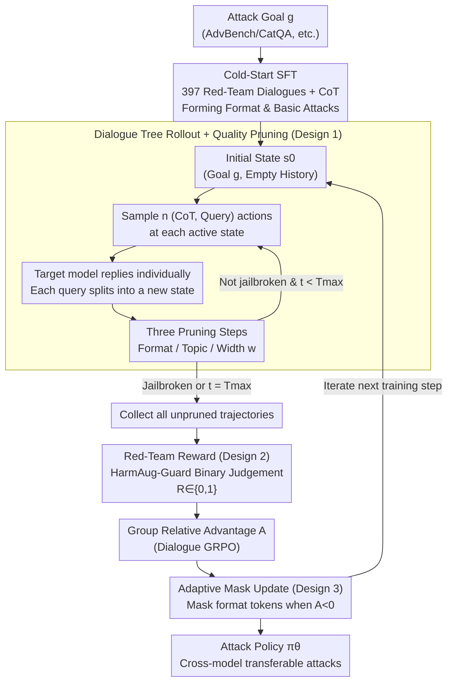

# Tree-based Dialogue Reinforced Policy Optimization for Red-Teaming Attacks (DialTree)

**Conference**: ICLR 2026  
**arXiv**: [2510.02286](https://arxiv.org/abs/2510.02286)  
**Code**: None  
**Area**: AI Safety / Red-Teaming  
**Keywords**: Multi-turn Jailbreak, Red-Teaming, Reinforcement Learning, Tree Search, Dialogue Policy Optimization

## TL;DR
This paper proposes DialTree, which models multi-turn red-teaming as a goal-oriented dialogue policy optimization problem. By exploring the attack trajectory space through tree-based rollout and quality pruning, combined with adaptive masking to prevent format forgetting, it achieves an average ASR of 81.5% across 12 target models—44.2% higher than previous SOTA—even reaching 71% ASR on Claude-4-Sonnet.

## Background & Motivation

**Background**: Red-teaming is a critical method for discovering security vulnerabilities in LLMs. Existing methods are divided into single-turn attacks (GCG/PAIR/TAP) and multi-turn attacks (MTSA/ActorAttack/X-Teaming). Research indicates that multi-turn attacks are far more effective than single-turn ones as they can gradually erode security boundaries.

**Limitations of Prior Work**:
- Existing multi-turn methods rely on manual heuristics or templates, failing to learn long-term adaptive policies.
- The state space of multi-turn dialogues grows exponentially, making efficient exploration difficult for standard RL methods.
- Jailbreak rewards come from imperfect proxy models (non-verifiable rewards), leading to unstable guidance signals.
- Format-following capabilities suffer from catastrophic forgetting during RL training.

**Key Challenge**: The dialogue space for multi-turn attacks is vast, yet effective attack strategies are sparse and difficult to discover.

**Goal**: To efficiently explore the multi-turn attack space, learn long-term dialogue policies, and stabilize RL training.

**Key Insight**: Model red-teaming as a goal-directed strategic dialogue, using tree search for structured exploration and adaptive masking for training stability.

**Core Idea**: Tree-based rollout + pruning = structured exploration of the multi-turn attack space; Adaptive masking = protecting format tokens from RL back-propagation forgetting.

## Method

### Overall Architecture
DialTree addresses the core contradiction: "exponential expansion of the multi-turn jailbreak dialogue space vs. sparse effective attack strategies." It treats red-teaming as a goal-oriented dialogue game, allowing the attack model $\pi_\theta$ to learn how to step-by-step erode the security boundaries of the target model $\pi_{\text{tgt}}$. The pipeline consists of two stages: Cold-Start SFT to establish output formats and basic attack capabilities, followed by DialTree RL to explore and solidify long-term attack policies.

**Mechanism**: Unlike standard GRPO which samples independent trajectories, the RL stage expands each multi-turn attack into a **dialogue tree**. Starting from an initial state, multiple candidate attack actions are branched out at each active state per round, queries are sent to the target model to obtain responses, and malformed or deviated branches are removed via pruning. After the tree rollout, all surviving trajectories are collected, binary rewards are assigned via a safety guardrail, group relative advantages are calculated, and policy updates are performed using adaptive masking—specifically protecting format tokens from punishment gradients of negative advantages.

### Key Designs

**1. Dialogue Tree Rollout + Quality Pruning: Comparing different attack actions under shared context**

Standard GRPO samples independent trajectories, making it impossible to judge whether "changing a single sentence in the same dialogue state makes jailbreaking easier." DialTree solves this by expanding the multi-turn attack into a tree: starting from $s_0 = (g, \emptyset)$, $n$ different (CoT, query) pairs are sampled for each active state every round. Each query generates a new state after getting a response. Siblings under the same parent node share the same context but differ in current actions, allowing group relative advantage to accurately measure "how to ask this step."

To prevent tree explosion, three pruning steps are applied: format validation (dropping branches without CoT or query), topic consistency (dropping branches no longer centered on $g$), and branch limitation (keeping at most $w$ nodes per round). Default settings are $T_{\max}=5$, branching factor $n=4$, and group size $G=32$, keeping exploration width and rollout costs manageable.

**2. Red-Teaming Reward: Binary jailbreak judgment + held-out judge against reward hacking**

After the tree rollout, each surviving trajectory receives a scalar reward from the HarmAug-Guard guardrail model. If any round $(q_t, r_t)$ is judged harmful ($r_\phi(g; q_t, r_t) > 0.5$), the trajectory receives $R = 1$, otherwise $R = 0$. While simple, this binary reward combined with tree-structured group relative advantages provides sufficient direction. To avoid reward hacking, a held-out GPT-4o judge (different from the training judge) is used for final evaluation.

**3. Adaptive Masking: Diverting punishment gradients from format tokens**

During policy updates, the authors observed catastrophic forgetting of format-following abilities, with malformed outputs soaring from 0% to >70%. The root cause is that punishment gradients for negative-advantage trajectories penalize correct format tokens (e.g., CoT tags, query delimiters) along with poor content.

Adaptive masking treats format tokens differently based on the sign of the advantage:

$$M_t^{(i)} = 1 - \mathbb{I}\big((T_t^{(i)} \in \mathcal{V}_{\text{fmt}}) \land (A^{(i)} < 0)\big)$$

When advantage $A < 0$, tokens in the format vocabulary $\mathcal{V}_{\text{fmt}}$ are masked to shield them from punishment gradients. When $A \geq 0$, format tokens are updated normally to reinforce the correct structure. This is superior to static masking, which freezes signals even in positive-advantage cases.

### Loss & Training
- **SFT Stage**: 397 hand-curated red-team dialogue data + CoT.
- **RL Stage**: Dialogue GRPO, computing group relative advantages on trajectories from tree rollouts. 500 training goals sampled from AdvBench/DangerousQA/CatQA.
- **Attack Model**: Llama-3.1-8B-Instruct.
- **Target Model (Training)**: Llama-3.2-1B-Instruct.
- **Key**: Although trained on a small 1B model, the strategy transfers to large models like GPT-4o and Claude-4.

## Key Experimental Results

### Main Results: Attack Success Rate (ASR@1, HarmBench)

| Method | GPT-4o | Claude-4-Sonnet | Grok-4 | o3-mini | Llama-3.3-70B | Avg (12 Models) |
|------|--------|-----------------|--------|---------|---------------|------------|
| GCG | 12.5 | 0 | 1.0 | 0 | 8.5 | 12.4 |
| PAIR | 18.0 | 2.5 | 8.5 | 11.5 | 25.5 | 17.6 |
| X-Teaming | 48.0 | 9.5 | 10.5 | 19.0 | 50.0 | 37.3 |
| **DialTree** | **86.0** | **71.0** | **75.0** | **86.5** | **89.5** | **81.5** |

### Ablation Study: Effect of Adaptive Masking

| Mask Strategy | Training Stability | Malformed Rate (40 Steps) | Reward Trend |
|---------|----------|----------------|---------|
| No Mask | Collapse | ~100% | Near 0 |
| Static Mask | Partial | ~100% (after 60 steps) | Slow decline |
| **Adaptive Mask** | **Stable** | **<50%** | **Steady rise** |

### Key Findings
- **High Cross-Model Transferability**: Trained only on a 1B model, it achieves 71% ASR on Claude-4-Sonnet, far exceeding other methods.
- **Tree Search Contribution**: Significant ASR improvement compared to standard rollouts without tree search.
- **Criticality of Adaptive Masking**: Without masking, training collapses within 40 steps; it is the only scheme maintaining stability.
- **Data Efficiency**: Powerful attackers can be trained with only 397 SFT samples and 500 RL goals.
- **Multi-turn Superiority**: Average ASR of 81.5% for multi-turn vs. 33.8% for the best single-turn method.

## Highlights & Insights
- **Red-Teaming ≈ Strategic Dialogue Game**: Reconceptualizing jailbreaking as a goal-oriented dialogue decision problem rather than simple prompt optimization allows for long-term strategic planning.
- **Solving Format Forgetting**: Catastrophic forgetting of format in RL is a common but overlooked issue. Adaptive masking identifies the cause (punishment gradient interference) and provides an elegant solution transferable to any RL scenario requiring specific output structures.
- **Small-to-Large Transfer**: The effectiveness of a policy trained on a 1B model against GPT-4/Claude-level models suggests that attack strategies are highly transferable across models—a serious warning for defenders.

## Limitations & Future Work
- **Defense Perspective Missing**: Focuses purely on attack; does not explore how to improve defense based on DialTree's findings.
- **Reward Model Reliability**: HarmAug-Guard as a proxy reward may have blind spots leading to reward hacking.
- **Compute Cost**: Tree search + multi-turn interaction entails higher rollout costs.
- **Future Directions**: Testing DialTree against "reasoning-enhanced defenses" like ReSA's Answer-Then-Check.

## Related Work & Insights
- **vs. X-Teaming**: X-Teaming uses multi-agent collaboration for planning (37.3% ASR), whereas DialTree uses single-agent tree search RL (81.5% ASR), suggesting policy learning is more effective than heuristic planning.
- **vs. PAIR/TAP**: These optimize single-turn prompts; DialTree generalizes this to multi-turn dialogue policy space, yielding a massive performance leap.
- **vs. ActorAttack**: ActorAttack uses semantic-related entities for guidance; DialTree directly learns dialogue policies, offering more flexibility and better results.

## Rating
- Novelty: ⭐⭐⭐⭐⭐ Tree search RL + adaptive masking framework is novel; identifying format forgetting has independent value.
- Experimental Thoroughness: ⭐⭐⭐⭐⭐ 12 target models, 8 baselines, thorough ablations.
- Writing Quality: ⭐⭐⭐⭐ Clear modeling, though some formulas could be simplified.
- Value: ⭐⭐⭐⭐⭐ Significant for understanding multi-turn vulnerabilities and improving LLM defense.

## Related Papers

- [\[ICLR 2026\] ARMS: Adaptive Red-Teaming Agent against Multimodal Models with Plug-and-Play Attacks](arms_adaptive_red-teaming_agent_against_multimodal_models_with_plug-and-play_att.md)
- [\[ICLR 2026\] wd1: Weighted Policy Optimization for Reasoning in Diffusion Language Models](wd1_weighted_policy_optimization_for_reasoning_in_diffusion_language_models.md)
- [\[ICLR 2026\] EEPO: Exploration-Enhanced Policy Optimization via Sample-then-Forget](eepo_exploration-enhanced_policy_optimization_via_sample-then-forget.md)
- [\[ICLR 2026\] RedCodeAgent: Automatic Red-teaming Agent against Diverse Code Agents](redcodeagent_automatic_red-teaming_agent_against_diverse_code_agents.md)
- [\[ACL 2026\] STAR-Teaming: A Strategy-Response Multiplex Network Approach to Automated LLM Red Teaming](../../ACL2026/llm_safety/star-teaming_a_strategy-response_multiplex_network_approach_to_automated_llm_red.md)

<!-- RELATED:END -->

<!-- RELATED:START -->

## Related Papers

- [\[ICLR 2026\] Auto-RT: Automatic Jailbreak Strategy Exploration for Red-Teaming Large Language Models](auto-rt_automatic_jailbreak_strategy_exploration_for_red-teaming_large_language_.md)
- [\[ICLR 2026\] ARMS: Adaptive Red-Teaming Agent against Multimodal Models with Plug-and-Play Attacks](arms_adaptive_red-teaming_agent_against_multimodal_models_with_plug-and-play_att.md)
- [\[ICLR 2026\] EEPO: Exploration-Enhanced Policy Optimization via Sample-then-Forget](eepo_exploration-enhanced_policy_optimization_via_sample-then-forget.md)
- [\[ICLR 2026\] RedCodeAgent: Automatic Red-teaming Agent against Diverse Code Agents](redcodeagent_automatic_red-teaming_agent_against_diverse_code_agents.md)
- [\[ICLR 2026\] wd1: Weighted Policy Optimization for Reasoning in Diffusion Language Models](wd1_weighted_policy_optimization_for_reasoning_in_diffusion_language_models.md)

<!-- RELATED:END -->
