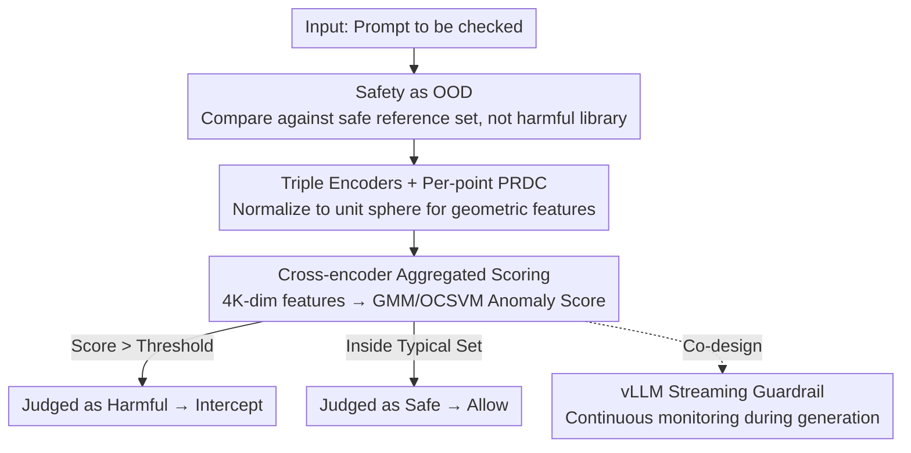

# Trust The Typical: LLM Safety Guardrails as Out-of-Distribution Detection

**Conference**: ICLR 2026  
**OpenReview**: [https://openreview.net/forum?id=vfbeleLBWv](https://openreview.net/forum?id=vfbeleLBWv)  
**Area**: LLM Safety / Alignment  
**Keywords**: LLM Safety Guardrails, OOD Detection, Typical Set, PRDC Geometric Features, One-Class Modeling

## TL;DR
This paper proposes T3 (Trust The Typical), which flips LLM safety guardrails from "enumerating harmful patterns" to "characterizing safe distributions." By modeling the "typical set" in the semantic space using only safe English text, any significant deviation is identified as a potential threat. It requires no training on harmful samples yet achieves SOTA across 18 benchmarks, reducing false positive rates by up to 40x and enabling zero-shot transfer to 14+ languages and multiple specialized domains.

## Background & Motivation

**Background**: Current mainstream LLM safety approaches are "reactive," involving the training of specialized classifiers (such as LlamaGuard, WildGuard, or PolyGuard) to identify known categories of harmful content and adversarial prompts, or utilizing alignment techniques like RLHF or Constitutional AI to steer model behavior toward safety. The common prerequisite of these methods is the exhaustive enumeration of "what is harmful" before defensive measures can be applied.

**Limitations of Prior Work**: This paradigm is essentially a "cat-and-mouse game" that naturally disadvantages the defender. Attackers only need to find a new prompt structure (multi-turn jailbreaks, roleplay, encoding obfuscation, etc.) that falls outside the classifier's training distribution to bypass the defense. Defenders must constantly expand their harmful pattern libraries to keep up. Consequently, the speed of new attacks consistently outpaces the adaptation speed of defense systems. Worse, specialized safety models often hit an "accuracy ceiling": even with decent AUROC, the false positive rate is extremely high—for instance, DuoGuard misclassifies 75.2% of safe prompts as harmful in OffensEval. This over-refusal makes the models nearly unusable in production environments.

**Key Challenge**: Reactive defenses can only block "known" attack patterns and fail to predict or resist "unknown" novel attacks. However, the authors observe that all adversarial prompts share a common statistical feature: they must deviate from the statistical regularities of natural language to trigger learned vulnerabilities in the model. Existing defenses do not systematically exploit this point.

**Key Insight**: The authors start from the information-theoretic concept of the "typical set" (Cover & Thomas). The observation is that while interactions between legitimate users and LLMs appear diverse, they occupy a relatively narrow region in the model's semantic representation space. Conversely, adversarial prompts, due to their design requirements, often fall outside this region as "atypical points." Combined with the isotropic geometric properties of modern LLM embeddings—where vectors spread out uniformly in high-dimensional space rather than clustering in a narrow cone—simple distance metrics become sufficient to distinguish typical from atypical.

**Core Idea**: Instead of training models to identify "harm," the authors propose the reverse—characterizing only the distribution of "safe, compliant usage"—and reframe safety guardrails as an **Out-of-Distribution (OOD) detection problem**. This approach offers two fundamental advantages: first, it requires only specification of "safe usage," eliminating the need for a constantly updated harmful sample library; second, it makes no assumptions about the form of adversarial inputs, thereby naturally defending against unseen novel attacks.

## Method

### Overall Architecture

The general idea of T3 is: given a reference corpus $X=\{x_i\}_{i=1}^{m}\sim D_{\text{safe}}^m$ containing only safe prompts, determine for each test prompt $y_j$ whether it originates from the safe distribution $D_{\text{safe}}$ (allow) or an unknown harmful distribution $D_{\text{harmful}}$ (intercept). The pipeline is a clear serial process: the input text passes through multiple sentence vector encoders and is normalized, then per-point geometric features (PRDC) are calculated relative to the safe reference set. Features from the multiple encoders are concatenated into a single vector and fed into a density estimator **fitted only on safe data** to calculate an anomaly score. If the score exceeds a threshold, it is intercept as harmful.

The essence of this design is that "safety" is defined as a geometric property rather than a semantic checklist. Harmful content—whether malicious code, HR violations, or jailbreak prompts—leaves a consistent geometric signature of "deviation from the typical set" in the representation space, allowing a single model to be universal across domains and languages.

### Key Designs

**1. Reframing Safety as "Typicality-based" OOD Detection: Modeling Safe Distributions instead of Enumerating Harm**

This step addresses the fundamental asymmetry of reactive defense—where the defender is always chasing the attacker to update harmful libraries. T3 changes the question: instead of asking "Does this prompt look like a known harmful pattern?", it asks "Does this prompt fall within the typical set of safe usage?". Formally, under the null hypothesis $H_0: D_{\text{test}}=D_{\text{safe}}$, the features of safe prompts should follow a characterizable statistical pattern, and any significant deviation is treated as a potential threat. This is effective because it shifts the source of adversarial robustness from "how many attacks I have seen" to "how well I know safety." Since it makes no assumptions about harmful inputs, it can defend against "unknown-unknowns"—something methods like synthetic data or Outlier Exposure cannot achieve (as they still require an "OOD oracle" to predict threats). The tradeoff is the reliance on a truly clean safe reference set (see Limitations).

**2. Triple Encoders + Per-point PRDC Geometric Features: Quantifying "Deviation from Typical" into Testable Statistics**

The principle of "modeling the typical set" is insufficient without a specific metric to robustly distinguish typical from atypical in high-dimensional space. This work adapts the Forte framework from vision to text: for each text $x$, three sentence encoders are used: $E_1$ (Qwen3-Embedding-0.6B), $E_2$ (BGE-M3), and $E_3$ (E5-Large-v2). Each is normalized to a unit hypersphere $\phi_k(x)=E_k(x)/\lVert E_k(x)\rVert_2$, ensuring cosine similarity is used and eliminating scale differences between encoders. For each encoder and query point $y_j$, four per-point geometric features (per-point PRDC) are calculated relative to the reference set: Precision determines if $y_j$ falls within the reference manifold $S_k(X)=\bigcup_i NB_k(\phi_k(x_i);X)$, while Recall, Density, and Coverage characterize the number and density of safe samples in the neighbors of $y_j$. The paper proves the expectations of these quantities under $H_0$ (Theorem 3.1, e.g., $E[\text{Recall}]=k/n$, $E[\text{Density}]=1/m$, $\lim_{m\to\infty}E[\text{Precision}]=1$). It further proves that PRDC is a consistent test for three types of distribution mismatch—partial support mismatch, density shift, and local perturbation—distinguishing the null hypothesis from the alternative (e.g., $\lim_{m\to\infty}E[\text{Precision}]=1-\alpha<1$ for partial support mismatch). This per-point, asymmetric (extensible and reusable) two-sample testing approach distinguishes it from classical pooled-graph global tests.

**3. Cross-encoder Aggregation + One-class Density Estimation Scoring: From Geometric Features to an Anomaly Score**

While theory guarantees PRDC can capture distribution differences, it does not directly provide a threshold. T3 concatenates PRDC from all encoders into a multi-view representation $T(y_j)=[\text{PRDC}_1^{(j)},\dots,\text{PRDC}_K^{(j)}]\in\mathbb{R}^{4K}$, allowing semantic anomalies that might be subtle in a single embedding space to be exposed through cross-verification. Then, two complementary density estimators are fitted **only on safe (ID) data**: a Gaussian Mixture Model (GMM) with components selected via BIC, and a One-class Support Vector Machine (OCSVM) with an RBF kernel and $\nu$ tuned via validation. The anomaly score for a test point is the negative log-likelihood under the fitted model, normalized via sigmoid to $[0,1]$. Crucially, no harmful labels or test data participate in the scoring chain's training, and thresholds are not tuned per benchmark, ensuring fairness against "unseen attacks."

**4. vLLM Co-designed Streaming Guardrail: Making Continuous Safety Monitoring Feasible in Production**

Latency overhead is a major barrier to the deployment of safety guardrails. T3 is integrated directly into the vLLM inference framework. Unlike post-processing solutions that wait for the full output, T3 continuously performs safety assessments during the token generation process, terminating generation immediately if harm is detected. The implementation leverages vLLM's multi-process architecture—intercepting and accessing output in the main process (which is idle most of the time), allowing safety calculations to overlap with worker process inference on the same GPU. With batching for safety evaluation (evaluation every 20 tokens, batch size 32), it introduces <6% overhead under a 5000 prompt load (and only 1.5% for 500 prompts). This is the first known framework to keep online continuous safety monitoring overhead below 10%.

## Key Experimental Results

Experiments were conducted on 18 benchmarks. The ID corpus consists of Alpaca, Dolly, and OpenAssistant safe instruction datasets (approx. 40K samples), **containing no harmful samples**. Core metrics are AUROC (higher is better) and FPR@95 (False Positive Rate at 95% True Positive Rate, lower is better).

### Main Results: Toxicity / Hate Speech Detection (6 Benchmarks)

| Benchmark | Metric | T3+OCSVM | Best specialized baseline | Note |
|------|------|----------|----------------------|------|
| OffensEval | FPR@95 | **2.0%** | 75.2% (DuoGuard) | ~37× reduction in FPs |
| Davidson | FPR@95 | **3.5%** | 61.7% (DuoGuard) | AUROC 0.991 |
| OffensEval | AUROC | **0.994** | 0.827 (DuoGuard) | — |
| CivilComments | AUROC / FPR@95 | 0.968 / 17.2% | 0.879 / 67.4% (DuoGuard) | — |

Traditional OOD methods (CIDER, RMD, VIM, ReAct, etc.) almost entirely fail on semantic safety tasks, with FPR@95 generally >90%, making them unusable. Specialized safety models have decent AUROC but hit an "accuracy ceiling" with extremely high false positives. T3 achieves orders of magnitude improvement in both detection and precision simultaneously, with AUROC ≥0.96 on 5 out of 6 benchmarks.

### Zero-shot Adversarial / Jailbreak Defense

Trained only on safe data, T3 provides "attack-agnostic" defense for six adversarial benchmarks, including AdvBench, HarmBench, JailbreakBench, and MaliciousInstruct. For example, FPR@95 dropped to 15.8% on AdvBench, a 4.2× improvement over PolyGuard. In contrast, specialized models exhibit "attack-specific" vulnerability, where the strongest baseline, PolyGuard, still misclassifies >64% of safe prompts on each benchmark.

### Cross-domain / Cross-lingual Transfer

| Setting | T3 Performance | Baseline Comparison |
|------|---------|---------------|
| PolyGuard Code | AUROC 99.6%, FPR@95 0.9% | Specialized models perform poorly even in-domain |
| PolyGuard HR | AUROC 99.7%, FPR@95 0.6% | FPR@95 Gain of 40–100× |
| 14+ Languages (RTP-LX/XSafety) | T3+OCSVM AUROC variance <0.6% | DuoGuard/PolyGuard variance up to 28% |

A single English-trained model transfers zero-shot to specialized domains like code, HR, cybersecurity, and education, as well as 14+ languages (including different script systems like Japanese and Arabic), with almost no performance degradation.

### Over-refusal / Sample Efficiency / Deployment Overhead

- **OR-Bench (Over-refusal)**: T3-GMM achieved 22.2% FPR@95, and T3-OCSVM achieved a peak 0.934 AUROC, reducing over-refusal by approximately 75% compared to traditional methods.
- **Cold Start**: With only 500 safe samples, T3-OCSVM reaches a high AUROC, and converges around 1000 samples, showing no cold-start issues.
- **vLLM Streaming**: <6% overhead on H200 for 5000 prompts (1.5% for 500 prompts); post-processing runtime is stable at 60–155 ms, significantly better than MDJudge/LlamaGuard which often takes >1s or fails under large batches.

### Key Findings
- **LLM-Augmented variants (Augment) often hurt performance**: Using GPT-OSS-20B to add structured safety analysis before embedding pushes "borderline safe" prompts toward the harmful distribution and decreases OR-Bench performance. There are minor gains in non-English scenarios, but the high overhead makes it not worthwhile.
- **Mahalanobis distance significantly outperforms Euclidean distance** (ROC AUC 0.944 vs 0.733): This is because it considers the covariance structure of safe data, which geometrically fits the "hollow hypersphere" ring-like distribution of the typical set.
- **Success depends entirely on the "purity" of the ID training set** (see Limitations).

## Highlights & Insights
- **The paradigm shift is the biggest highlight**: "Trusting the typical" rather than "enumerating harm" erases the disadvantage of the defender in the adversarial arms race—no matter how an attacker creates new variations, they will be exposed as long as they deviate from natural language statistics. This perspective is transferable to any "known normal, unknown abnormal" detection task.
- **Domain/Language-agnostic geometric signatures**: Harmful content leaves a consistent "deviation from typical" geometric signature in modern multimodal embedding spaces, allowing one English model to manage 14 languages. This insight is significant for reducing the engineering costs of multilingual safety governance (eliminating needs for multilingual data collection, retraining, and per-language calibration).
- **Theoretical + Engineering Synergy**: The work provides consistency proofs for PRDC under various distribution mismatches and integrates it into vLLM with <6% overhead, successfully achieving both "theoretical guarantees" and "production readiness."

## Limitations & Future Work
- **Heavy reliance on ID training set purity**: The authors honestly show results on Anthropic hh-rlhf, where "safe" responses themselves contain profanity (cosine similarity of chosen/rejected >0.95). In this case, T3 and all baselines degrade to random performance (AUROC ≈ 0.5). This indicates the OOD route fails when safe and harmful manifolds overlap.
- **Hybrid architecture needed for ambiguous boundaries**: For borderline cases requiring contextual intent analysis, pure geometric typicality screening is insufficient; the authors suggest combining T3's efficient outlier screening with reasoning-based methods.
- **Augment variants are currently not cost-effective**: LLM augmentation likely requires "language-aware output normalization" to be effective; current implementations have low value-for-money.
- **Fixed triple-encoder inference cost**: While per-point overhead is low, it still requires calculating three sets of embeddings + PRDC compared to a single distance metric.

## Related Work & Insights
- **vs Specialized Safety Classifiers (LlamaGuard / WildGuard / PolyGuard / DuoGuard)**: They perform reactive pattern matching, require harmful samples, and hit an accuracy ceiling (high FPs, cross-domain/lingual collapse). T3 models only the safe distribution, requires zero harmful samples, has FPs lower by 1-2 orders of magnitude, and achieves zero-shot cross-domain/lingual transfer.
- **vs Two-Model Likelihood Ratio OOD**: Those methods are computationally expensive and assume the base model covers all anomalies; T3 avoids the two-model cost with one-class density estimation.
- **vs Representation-based OOD (Distance Metrics / PEFT Activations)**: They suffer from the "finetuning paradox," where task-finetuning destroys geometric structures needed for detection. T3 works directly on the isotropic geometry of pretrained embeddings.
- **vs Synthetic Data / Outlier Exposure**: These are still reactive, requiring an "OOD oracle" to predict threats, failing to block unknown-unknowns. T3 makes no assumptions about harmful forms and can theoretically prevent unknown attacks.

## Rating
- Novelty: ⭐⭐⭐⭐⭐ Reframing safety guardrails entirely as "typical-set" OOD detection is a paradigm-level shift with theoretical support.
- Experimental Thoroughness: ⭐⭐⭐⭐⭐ 18 benchmarks + 14 languages + multiple domains + vLLM deployment, plus honest failure cases (hh-rlhf).
- Writing Quality: ⭐⭐⭐⭐ Clear logic and strong motivation; formulas and theorems are dense, requiring appendix reference in parts.
- Value: ⭐⭐⭐⭐⭐ 40× FP reduction, zero-shot cross-lingual/domain capability, <6% online overhead; extremely high engineering value.

<!-- RELATED:START -->

## Related Papers

- [\[NeurIPS 2025\] TRUST -- Transformer-Driven U-Net for Sparse Target Recovery](../../NeurIPS2025/llm_safety/trust_--_transformer-driven_u-net_for_sparse_target_recovery.md)
- [\[ACL 2026\] Decomposed Trust: Privacy, Adversarial Robustness, Ethics, and Fairness in Low-Rank LLMs](../../ACL2026/llm_safety/decomposed_trust_privacy_adversarial_robustness_ethics_and_fairness_in_low-rank_.md)
- [\[ICLR 2026\] LLM Unlearning with LLM Beliefs](llm_unlearning_with_llm_beliefs.md)
- [\[ICLR 2026\] RedSage: A Cybersecurity Generalist LLM](redsage_a_cybersecurity_generalist_llm.md)
- [\[ICLR 2026\] Explainable LLM Unlearning through Reasoning](explainable_llm_unlearning_through_reasoning.md)

<!-- RELATED:END -->
